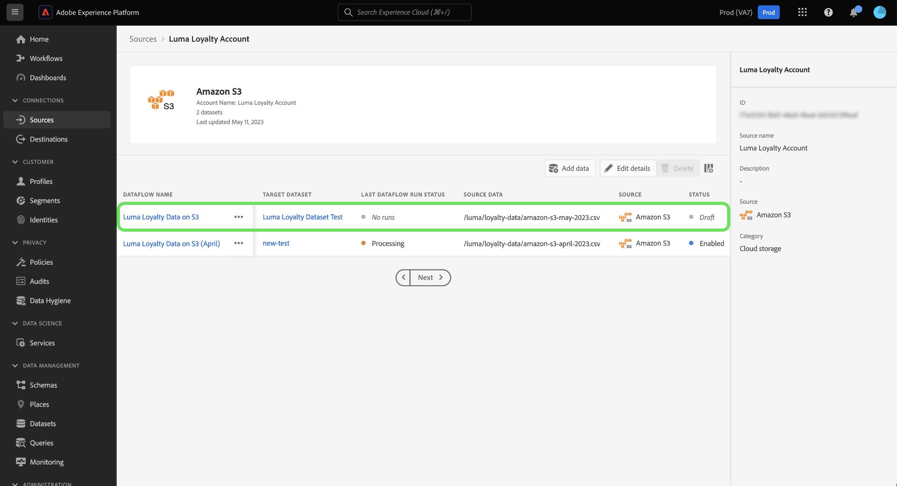
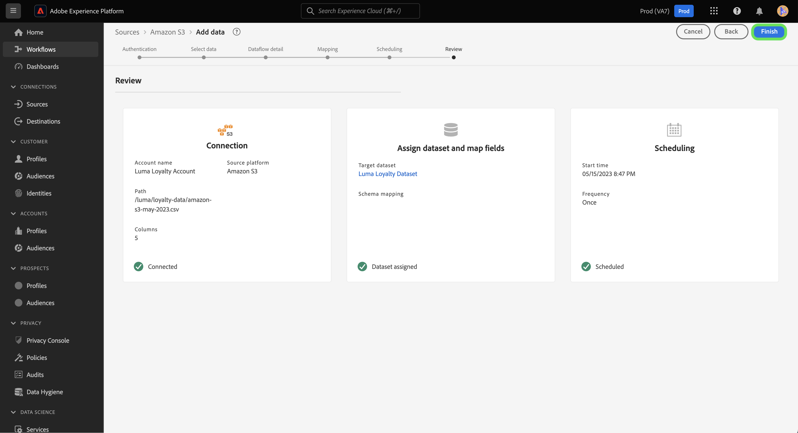

# UI でのドラフトデータフロー

データフローをドラフトステータスに設定して、未完了のデータ取り込みワークフローの進行状況を保存します。 再開して、後で下書きのデータフローを完了することができます。

このドキュメントでは、Adobe Experience Platform UI でソースワークスペースを使用する際にデータフローを保存する手順を説明します。

## はじめに

このドキュメントでは、Adobe Experience Platformの次のコンポーネントに関する十分な知識が必要です。

* [ソース](../../home.md)：Experience Platform を使用すると、データを様々なソースから取得しながら、Platform サービスを使用して受信データの構造化、ラベル付け、拡張を行うことができます。

## データフローをドラフトとして保存

Platform に取り込むデータを選択した後、いつでもデータフロー作成の進行を一時停止できます。

例えば、データフローの詳細手順で進捗を保存する場合は、 **[!UICONTROL ドラフトとして保存]**.

ドラフトを保存すると、アカウントのページに移動し、ドラフトを含む既存のデータフローのリストが表示されます。

>[!TIP]
>
>下書きのデータフローは有効にならず、ステータスはに設定されます `draft`.

下書きを続行するには、省略記号 (`...`) をクリックし、「 」を選択します。 **[!UICONTROL データフローを更新]**.

>[!NOTE]
>
>下書きにスケジュール情報が含まれる場合は、ドロップダウンウィンドウにも次のオプションが表示されます。 **[!UICONTROL スケジュールを編集]**.

### ソースカタログから下書きにアクセス

また、データフローカタログからドラフトデータフローにアクセスすることもできます。 選択 **[!UICONTROL データフロー]** をクリックして、データフローカタログにアクセスします。 ここから、組織内の既存のデータフローのリストからドラフトを見つけ、省略記号 (`...`) をクリックし、「 」を選択します。 **[!UICONTROL データフローを更新]**.

## ドラフトデータフローの公開

次の場所に戻ります。 [!UICONTROL データを追加] ソースワークフローの手順。データの形式を再確認し、データフローで続行できます。

データの書式、区切り文字、圧縮のタイプを確認したら、 **[!UICONTROL 次へ]** をクリックして続行します。

次に、データフローの詳細を確認します。 データフローの詳細インターフェイスを使用して、データフローの名前、説明、部分取り込み、エラー診断設定、アラート設定に関する設定を更新します。

設定が完了したら、「 」を選択します。 **[!UICONTROL 次へ]** をクリックして続行します。

「[!UICONTROL マッピング]」手順が表示されます。この手順の間に、データフローのマッピング設定を再設定できます。 マッピングに使用されるデータ準備関数の包括的なガイドについては、 [data prep UI ガイド](../../../data-prep/ui/mapping.md).

マッピングの再設定が完了したら、「 」を選択します。 **[!UICONTROL 次へ]** をクリックして続行します。

以下を使用します。 [!UICONTROL スケジュール] データフローの取り込みスケジュールを確立する手順です。 取り込み頻度を `once`, `minute`, `hour`, `day`または `week`. 終了したら、「 」を選択します。 **[!UICONTROL 次へ]** をクリックして続行します。

最後に、データフローの詳細を確認し、「 」を選択します。 **[!UICONTROL 完了]** 下書きを公開するには、以下を実行します。

ドラフトを保存して公開すると、データフローは有効になり、ドラフトとしてリセットできなくなります。

## 次の手順

このチュートリアルでは、進行状況を保存し、データフローをドラフトとして設定する方法を学びました。 ソースについて詳しくは、 [ソースの概要](../../home.md).
