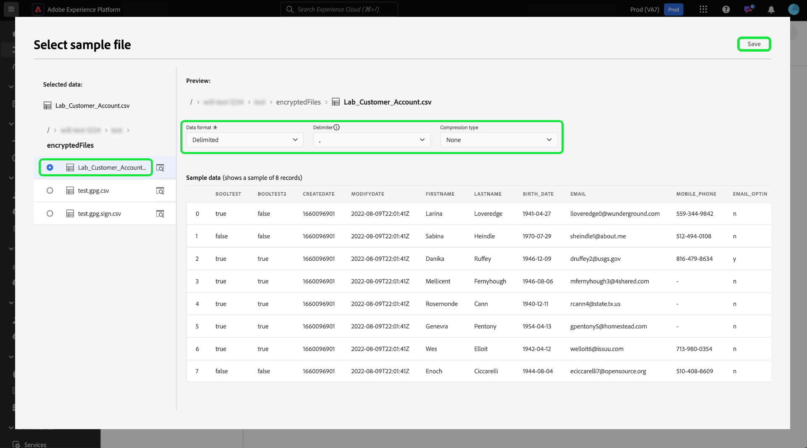

# ソース UI での暗号化されたデータの取り込み

>[!AVAILABILITY]
>
>ソース UI での暗号化されたデータ取り込みのサポートはベータ版です。 機能とドキュメントは変更される場合があります。

クラウドストレージバッチソースを使用して、暗号化されたデータファイルとフォルダーをAdobe Experience Platformに取り込むことができます。 暗号化されたデータの取り込みでは、非対称暗号化メカニズムを利用して、バッチデータを Experience Platform に安全に転送できます。 サポートされている非対称暗号化メカニズムは PGP と GPG です。

このガイドでは、UI を使用してクラウドストレージバッチソースで暗号化されたデータを取り込む方法について説明します。

## 基本を学ぶ

このチュートリアルを進める前に、次のドキュメントを参照して、Experience Platformの機能と概念をより深く理解してください。

* [ ソース ](../../home.md):Experience Platformのソースを使用して、Adobe アプリケーションまたはサードパーティのデータソースからデータを取り込みます。
* [ データフロー ](../../../dataflows/home.md)：データフローは、Experience Platform間でデータを移動するデータジョブを表します。 ソースワークスペースを使用すると、特定のソースからExperience Platformにデータを取り込むデータフローを作成できます。
* [ サンドボックス ](../../../sandboxes/home.md):Experience Platformのサンドボックスを使用して、Experience Platform インスタンス間に仮想パーティションを作成し、開発用または実稼動用の環境を作成します。

### 概要の概要

* Experience Platform UI のソースワークスペースを使用して、暗号化キーペアを作成します。
   * オプションで、独自の署名検証キーペアを作成して、暗号化されたデータに追加のセキュリティレイヤーを提供することもできます。
* 暗号化キーペアの公開鍵を使用して、データを暗号化します。
* 暗号化されたデータをクラウドストレージに配置します。 この手順では、また、ソースデータをエクスペリエンスデータモデル（XDM）スキーマにマッピングするための参照として使用できる、クラウドストレージにデータのサンプルファイルがあることを確認する必要があります。
* クラウドストレージバッチソースを使用して、Experience Platform UI のソースワークスペースでデータ取得プロセスを開始します。
* ソース接続の作成プロセス中に、データの暗号化に使用した公開鍵に対応するキー ID を指定します。
   * 署名検証キーペアのメカニズムも使用した場合は、暗号化されたデータに対応する署名検証キー ID を指定する必要があります。
* データフロー作成手順に進みます。

## 暗号化キーペアを作成 {#create-an-encryption-key-pair}

>[!CONTEXTUALHELP]
>id="platform_sources_encrypted_encryptionKeyId"
>title="暗号化キー ID"
>abstract="ソースデータの暗号化に使用した暗号化キーに対応する暗号化キー ID を指定します。"

>[!BEGINSHADEBOX]

**暗号化キーペアとは**

暗号化キーペアは、公開鍵と秘密鍵で構成される非対称暗号化メカニズムです。 公開鍵を使用してデータを暗号化し、秘密鍵を使用してそのデータを復号化します。

Experience Platform UI を使用して暗号化キーペアを作成できます。 生成されると、公開鍵と対応する鍵 ID を受け取ります。 公開鍵を使用してデータを暗号化し、暗号化されたデータを取り込む準備が整ったら、キー ID を使用して ID を確認します。 秘密鍵は自動的にExperience Platformに送られ、安全なコンテナに保存されます。この秘密鍵は、データの復号化の準備が整った場合にのみ使用されます。

>[!ENDSHADEBOX]

Experience Platform UI でソースワークスペースに移動し、上部のヘッダーから [!UICONTROL  キーペア ] を選択します。

組織内の既存の暗号化キーペアのリストを表示するページが表示されます。 このページでは、特定のキーのタイトル、ID、タイプ、暗号化アルゴリズム、有効期限およびステータスに関する情報が提供されます。 新しいキーペアを作成するには、「**[!UICONTROL キーを作成]**」を選択します。

次に、作成するキーの種類を選択します。 暗号化キーを作成するには、「**[!UICONTROL 暗号化キー]**」、「**[!UICONTROL 続行]**」の順に選択します。

暗号化キーのタイトルとパスフレーズを指定します。 パスフレーズは、暗号化キーを保護する追加のレイヤーです。 作成時に、Experience Platform は、公開鍵とは別のセキュアなコンテナにパスフレーズを保存します。 空白以外の文字列をパスフレーズとして指定する必要があります。 完了したら、「**[!UICONTROL 作成]**」をクリックします。

成功すると、新しいウィンドウが表示され、タイトル、公開鍵、キー ID を含む新しい暗号化キーが表示されます。 公開鍵の値を使用してデータを暗号化します。 後の手順で、データフローの作成プロセス中に暗号化されたデータを取り込む際に、キー ID を使用して ID を証明します。

既存の暗号化キーに関する情報を表示するには、キーのタイトルの横にある省略記号（`...`）を選択します。 **[!UICONTROL 鍵の詳細]** を選択して、公開鍵と鍵 ID を表示します。 または、暗号化キーを削除する場合は、「**[!UICONTROL 削除]**」を選択します。

### 署名検証キーを作成 {#create-a-sign-verification-key}

>[!CONTEXTUALHELP]
>id="platform_sources_encrypted_signVerificationKeyId"
>title="署名検証キー ID"
>abstract="署名済みの暗号化されたソースデータに対応する署名検証キー ID を指定します。"

>[!BEGINSHADEBOX]

**署名検証キーとは**

署名検証キーは、秘密鍵と公開鍵を含む別の暗号化メカニズムです。 この場合、署名検証キーペアを作成し、秘密鍵を使用して署名し、データに暗号化の追加レイヤーを提供できます。 次に、対応する公開鍵をExperience Platformに共有します。 取り込み時に、Experience Platformは公開鍵を使用して、秘密鍵に関連付けられた署名を検証します。

>[!ENDSHADEBOX]

署名検証キーを作成するには、キータイプ選択ウィンドウから **[!UICONTROL 署名検証キー]** を選択し、「**[!UICONTROL 続行]**」を選択します。

次に、タイトルと、[!DNL Base64] エンコードされた PGP キーを公開鍵として指定し、「**[!UICONTROL 作成]**」を選択します。

成功すると、新しいウィンドウが表示され、タイトルとキー ID を含む新しい署名検証キーが表示されます。

## 暗号化されたデータの取り込み {#ingest-encrypted-data}

>[!CONTEXTUALHELP]
>id="platform_sources_encrypted_isFileEncrypted"
>title="ファイルは暗号化されていますか？"
>abstract="既に暗号化されているファイルを取り込む場合は、この切替スイッチを選択します。"

>[!CONTEXTUALHELP]
>id="platform_sources_encrypted_sampleFile"
>title="サンプルファイルの選択"
>abstract="マッピングを作成するには、暗号化されたデータを取り込む際にサンプルファイルを取り込む必要があります。"

次のクラウドストレージバッチソースを使用して、暗号化されたデータを取り込むことができます。

* [[!DNL Amazon S3]](../ui/create/cloud-storage/s3.md)
* [[!DNL Azure Blob]](../ui/create/cloud-storage/blob.md)
* [[!DNL Azure Data Lake Storage Gen2]](../ui/create/cloud-storage/adls-gen2.md)
* [[!DNL Azure File Storage]](../ui/create/cloud-storage/azure-file-storage.md)
* [[!DNL Data Landing Zone]](../ui/create/cloud-storage/data-landing-zone.md)
* [[!DNL FTP]](../ui/create/cloud-storage/ftp.md)
* [[!DNL Google Cloud Storage]](../ui/create/cloud-storage/google-cloud-storage.md)
* [[!DNL HDFS]](../ui/create/cloud-storage/hdfs.md)
* [[!DNL Oracle Object Storage]](../ui/create/cloud-storage/oracle-object-storage.md)
* [[!DNL SFTP]](../ui/create/cloud-storage/sftp.md)

選択したクラウドストレージソースで認証します。 ワークフローのデータ選択手順で、取り込む暗号化されたファイルまたはフォルダーを選択し、「**[!UICONTROL ファイルは暗号化されているか]**」トグルを有効にします。

次に、ソースデータからサンプルファイルを選択します。 データは暗号化されるので、Experience Platformでソースデータにマッピングできる XDM スキーマを作成するには、サンプルファイルが必要になります。

サンプルファイルを選択したら、対応するデータ形式、区切り文字、圧縮タイプなど、データの設定を設定します。 プレビューインターフェイスが完全にレンダリングされるまでしばらく待ってから、「**[!UICONTROL 保存]**」を選択します。

ここから、ドロップダウンメニューを使用して、データの暗号化に使用した公開鍵に対応する公開鍵 ID のタイトルを選択します。

署名検証キーペアも使用して暗号化の追加レイヤーを提供する場合は、「署名検証キー」トグルを有効にし、同様に、ドロップダウンを使用して、データの暗号化に使用したキーに対応する署名検証キー ID を選択します。

終了したら「**[!UICONTROL 次へ]**」を選択します。

ソースワークフローの残りの手順を完了して、データフローの作成を完了します。

* [データフローとデータセットの詳細の指定](../ui/dataflow/batch/cloud-storage.md#provide-dataflow-details)
* [ソースデータを XDM スキーマにマッピングする](../ui/dataflow/batch/cloud-storage.md#map-data-fields-to-an-xdm-schema)
* [データフローの取り込みスケジュールの設定](../ui/dataflow/batch/cloud-storage.md#schedule-ingestion-runs)
* [データフローのレビュー](../ui/dataflow/batch/cloud-storage.md#review-your-dataflow)

正常に作成されたら、引き続き [ データフローを更新 ](../ui/update-dataflows.md) できます。

## 次の手順

このドキュメントを読むことで、クラウドストレージバッチソースからExperience Platformに暗号化されたデータを取り込むことができるようになりました。 API を使用して暗号化されたデータを取り込む方法について詳しくは、[API を使用した暗号化されたデータの取り込み ](../api/encrypt-data.md) に関するガイドを参照し  [!DNL Flow Service]  ください。 Experience Platformのソースに関する一般的な情報については、[ ソースの概要 ](../../home.md) を参照してください。
