# ソース UIへの暗号化データの取り込み

クラウドストレージのバッチソースを使用して、暗号化されたデータファイルとフォルダーをAdobe Experience Platformに取り込むことができます。 暗号化されたデータの取り込みでは、非対称暗号化メカニズムを利用して、バッチデータを Experience Platform に安全に転送できます。 サポートされている非対称暗号化メカニズムはPGPとGPGです。

このガイドでは、UIを使用してクラウドストレージのバッチソースで暗号化データを取り込む方法について説明します。

## 基本を学ぶ

このチュートリアルを続ける前に、次のExperience Platformの機能と概念について理解を深めるために、次のドキュメントを参照してください。

* [ ソース ](../../home.md): Experience Platformのソースを使用して、Adobe アプリケーションまたはサードパーティのデータソースからデータを取り込みます。
* [ データフロー](../../../dataflows/home.md): データフローは、Experience Platform間でデータを移動するデータジョブを表します。 ソースワークスペースを使用して、特定のソースからExperience Platformにデータを取り込むデータフローを作成できます。
* [ サンドボックス ](../../../sandboxes/home.md): Experience Platformのサンドボックスを使用して、Experience Platform インスタンス間のバーチャルパーティションを作成し、開発用または実稼動用の環境を作成します。

### 概要

* Experience Platform UIのソースワークスペースを使用して、暗号化キーペアを作成します。
   * オプションで、独自の署名検証鍵ペアを作成して、暗号化されたデータに追加のセキュリティレイヤーを提供することもできます。
* 暗号化キーペアの公開鍵を使用して、データを暗号化します。
* 暗号化されたデータをクラウドストレージに配置します。 この手順では、ソースデータをExperience Data Model （XDM）スキーマにマッピングするための参照として使用できる、クラウドストレージ内のデータのサンプルファイルがあることも確認する必要があります。
* クラウドストレージのバッチソースを使用し、Experience Platform UIのソースワークスペースでデータ取り込みプロセスを開始します。
* ソース接続の作成プロセス中に、データの暗号化に使用した公開鍵に対応するキーIDを指定します。
   * 署名検証キーペアのメカニズムも使用した場合は、暗号化されたデータに対応する署名検証キーIDも指定する必要があります。
* データフローの作成手順に進みます。

## 暗号化キーペアを作成 {#create-an-encryption-key-pair}

>[!CONTEXTUALHELP]
>id="platform_sources_encrypted_encryptionkeyid"
>title="暗号化キー ID"
>abstract="ソースデータの暗号化に使用した暗号化キーに対応する暗号化キー ID を指定します。"

>[!BEGINSHADEBOX]

**暗号化キーペアとは何ですか？**

暗号化キーペアは、公開鍵と秘密鍵で構成される非対称暗号化メカニズムです。 公開鍵はデータを暗号化するために使用され、秘密鍵は次にそのデータを復号化するために使用されます。

Experience Platform UIを使用して、暗号化キーペアを作成できます。 生成されると、公開鍵と対応するキーIDを受け取ります。 公開鍵を使用してデータを暗号化し、暗号化されたデータの取り込み中にキーIDを使用してIDを確認します。 秘密鍵は自動的にExperience Platformに渡され、そこで安全な保管システムに保管され、データが復号化の準備が整った後にのみ使用されます。

>[!ENDSHADEBOX]

Experience Platform UIで、ソースワークスペースに移動し、上部ヘッダーから「[!UICONTROL Key Pairs]」を選択します。

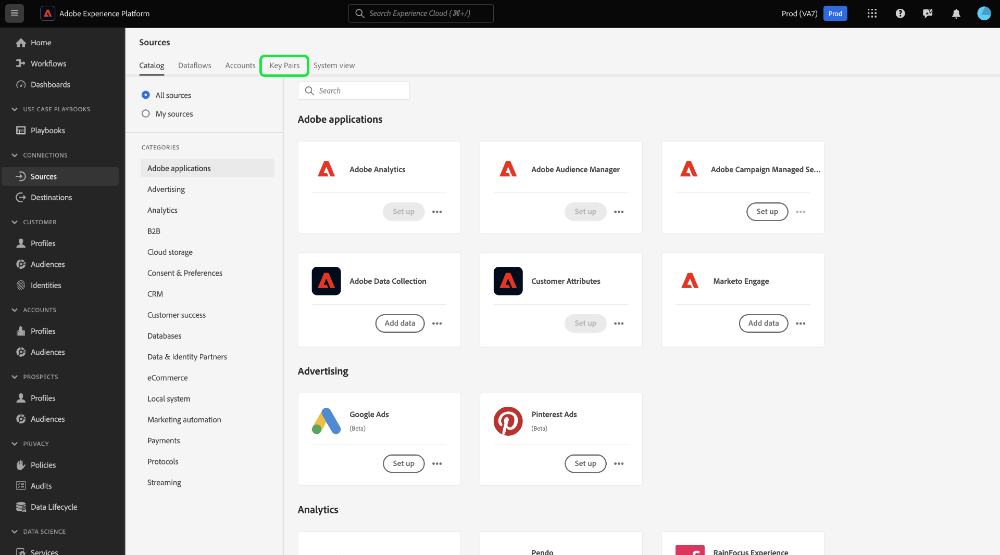

組織内の既存の暗号化キーのペアのリストを表示するページに移動します。 このページでは、特定のキーのタイトル、ID、タイプ、暗号化アルゴリズム、有効期限、ステータスに関する情報を提供します。 新しいキーペアを作成するには、**[!UICONTROL Create Key]**&#x200B;を選択します。

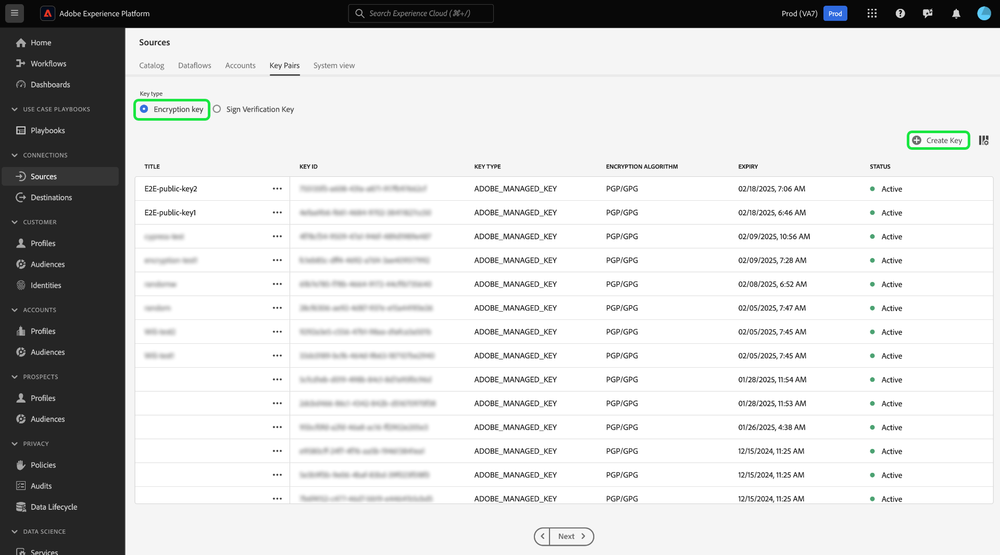

次に、作成するキータイプを選択します。 暗号化キーを作成するには、**[!UICONTROL Encryption Key]**&#x200B;を選択し、**[!UICONTROL Continue]**&#x200B;を選択します。

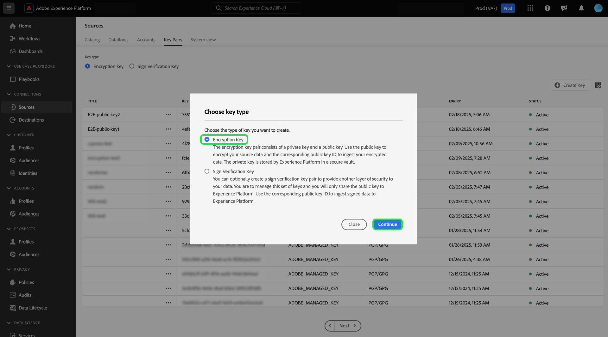

暗号化キーのタイトルとパスフレーズを入力します。 パスフレーズは、暗号化キーの追加レイヤーです。 作成時に、Experience Platform は、公開鍵とは別のセキュアなコンテナにパスフレーズを保存します。 空でない文字列をパスフレーズとして指定する必要があります。 終了したら「**[!UICONTROL Create]**」を選択します。

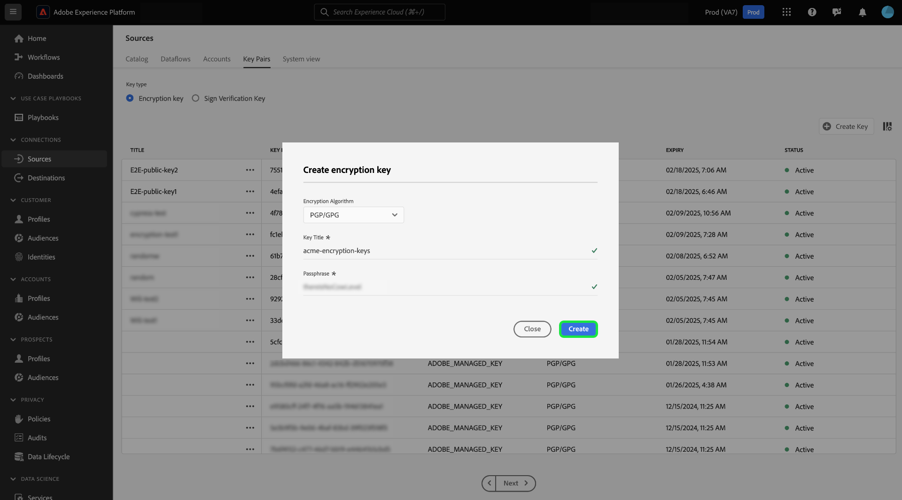

成功すると、新しいウィンドウが表示され、タイトル、公開鍵、キーIDなど、新しい暗号化キーが表示されます。 公開鍵の値を使用してデータを暗号化します。 後の手順でキーIDを使用して、データフローの作成プロセス中に暗号化されたデータを取り込む際にIDを証明します。

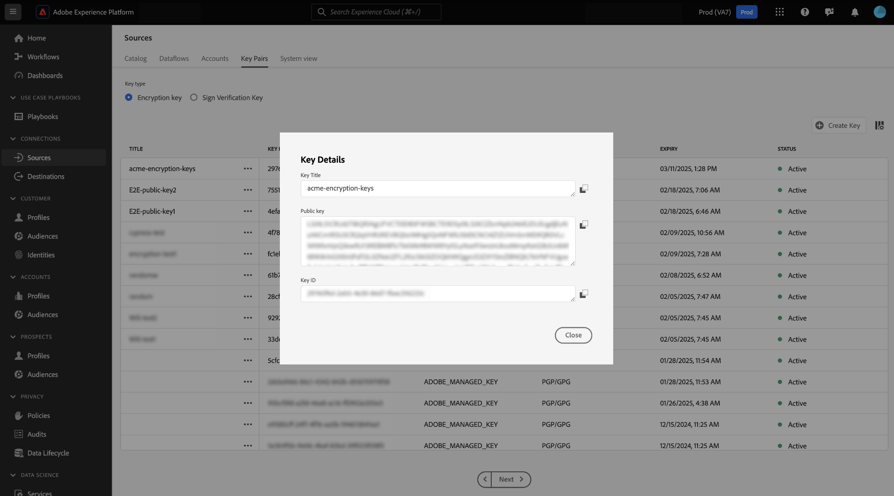

既存の暗号化キーに関する情報を表示するには、キータイトルの横にある省略記号（`...`）を選択します。 公開鍵とキーIDを表示するには、**[!UICONTROL Key details]**&#x200B;を選択します。 または、暗号化キーを削除する場合は、**[!UICONTROL Delete]**&#x200B;を選択します。

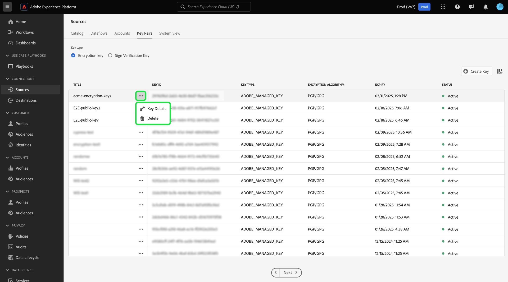

### 署名検証キーを作成 {#create-a-sign-verification-key}

>[!CONTEXTUALHELP]
>id="platform_sources_encrypted_signVerificationKeyId"
>title="署名検証キー ID"
>abstract="署名済みの暗号化されたソースデータに対応する署名検証キー ID を指定します。"

>[!BEGINSHADEBOX]

**署名確認キーとは何ですか？**

署名検証キーは、秘密鍵と公開鍵を含む別の暗号化メカニズムです。 この場合、署名検証鍵のペアを作成し、秘密鍵を使用して署名し、データに追加の暗号化レイヤーを提供できます。 その後、対応する公開鍵をExperience Platformと共有します。 取り込み中、Experience Platformは公開鍵を使用して、秘密鍵に関連付けられた署名を検証します。

>[!ENDSHADEBOX]

署名確認キーを作成するには、キーの種類の選択ウィンドウから&#x200B;**[!UICONTROL Sign Verification Key]**&#x200B;を選択し、**[!UICONTROL Continue]**&#x200B;を選択します。

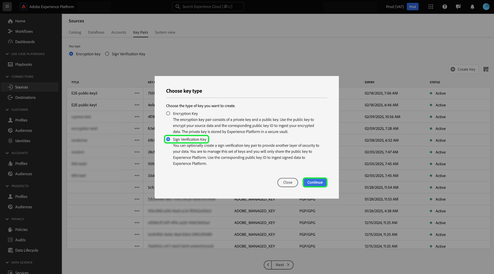

次に、タイトルと[!DNL Base64]でエンコードされたPGP キーを公開鍵として指定し、**[!UICONTROL Create]**&#x200B;を選択します。

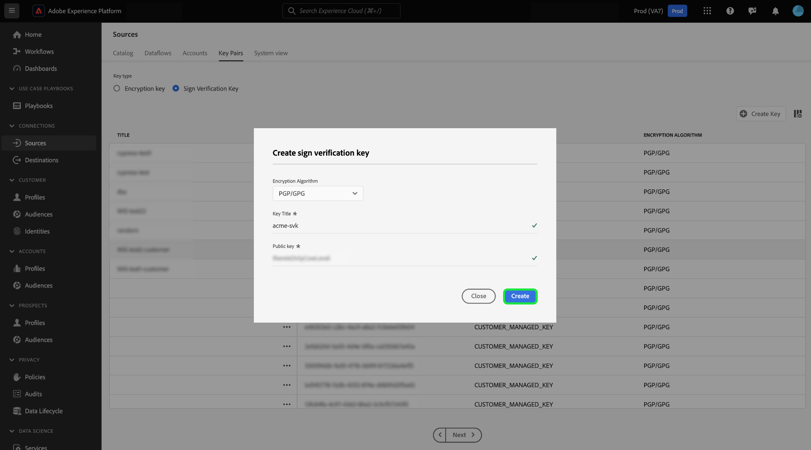

成功すると、新しいウィンドウが表示され、タイトルとキーIDを含む新しい署名確認キーが表示されます。

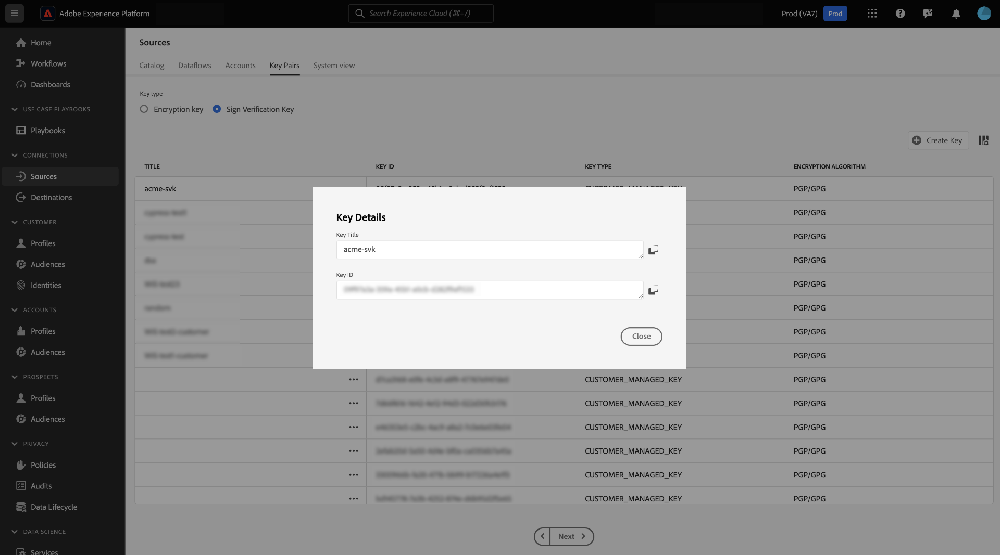

## 暗号化されたデータの取り込み {#ingest-encrypted-data}

>[!CONTEXTUALHELP]
>id="platform_sources_encrypted_isFileEncrypted"
>title="ファイルは暗号化されていますか？"
>abstract="既に暗号化されているファイルを取り込む場合は、この切替スイッチを選択します。"

>[!CONTEXTUALHELP]
>id="platform_sources_encrypted_sampleFile"
>title="サンプルファイルの選択"
>abstract="マッピングを作成するには、暗号化されたデータを取り込む際にサンプルファイルを取り込む必要があります。"

次のクラウドストレージのバッチソースを使用して、暗号化されたデータを取り込むことができます。

* [[!DNL Amazon S3]](../ui/create/cloud-storage/s3.md)
* [[!DNL Azure Blob]](../ui/create/cloud-storage/blob.md)
* [[!DNL Azure Data Lake Storage Gen2]](../ui/create/cloud-storage/adls-gen2.md)
* [[!DNL Azure File Storage]](../ui/create/cloud-storage/azure-file-storage.md)
* [[!DNL Data Landing Zone]](../ui/create/cloud-storage/data-landing-zone.md)
* [[!DNL FTP]](../ui/create/cloud-storage/ftp.md)
* [[!DNL Google Cloud Storage]](../ui/create/cloud-storage/google-cloud-storage.md)
* [[!DNL HDFS]](../ui/create/cloud-storage/hdfs.md)
* [[!DNL Oracle Object Storage]](../ui/create/cloud-storage/oracle-object-storage.md)
* [[!DNL SFTP]](../ui/create/cloud-storage/sftp.md)

選択したクラウドストレージソースで認証します。 ワークフローのデータ選択手順で、取り込む暗号化ファイルまたはフォルダーを選択し、**[!UICONTROL Is the file encrypted]**&#x200B;切り替えを有効にします。

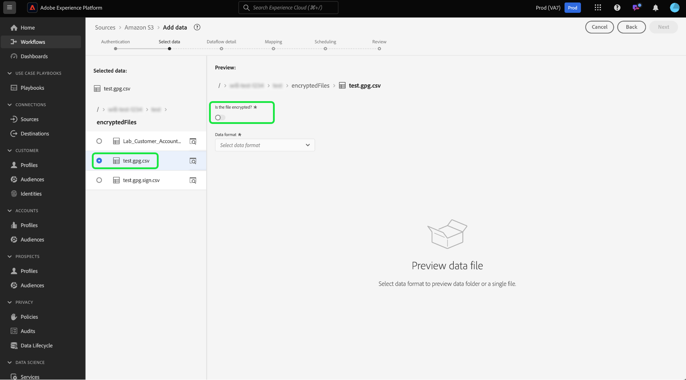

次に、ソースデータからサンプルファイルを選択します。 データは暗号化されているので、Experience Platformでは、ソースデータにマッピングできるXDM スキーマを作成するためにサンプルファイルが必要になります。

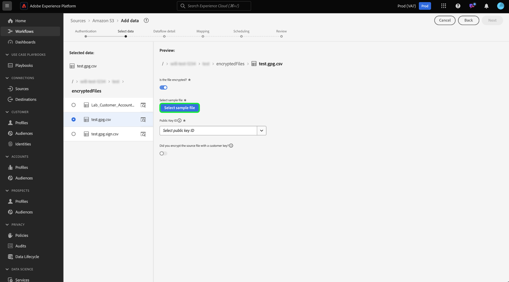。

サンプルファイルを選択したら、対応するデータ形式、区切り文字、圧縮タイプなど、データの設定を設定します。 プレビューインターフェイスが完全にレンダリングされるまでしばらく時間がかかり、次に&#x200B;**[!UICONTROL Save]**&#x200B;を選択します。

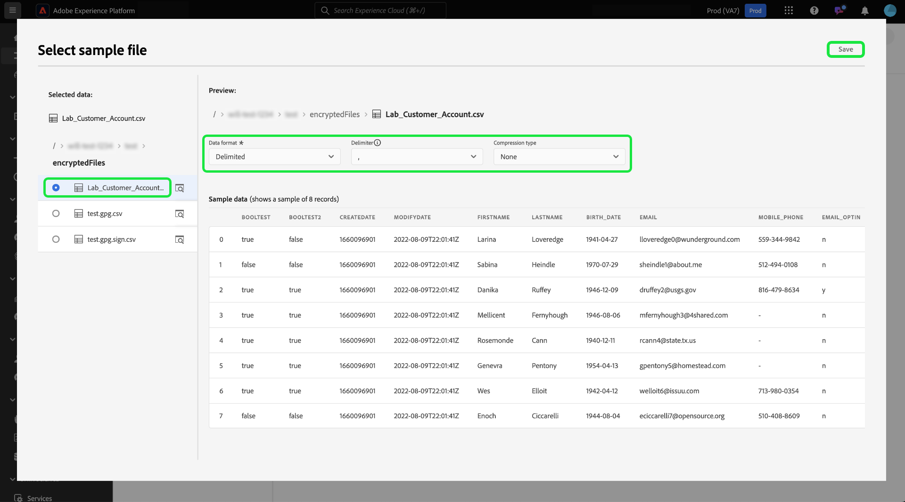

ここから、ドロップダウンメニューを使用して、データの暗号化に使用した公開鍵に対応する公開鍵IDの公開鍵タイトルを選択します。

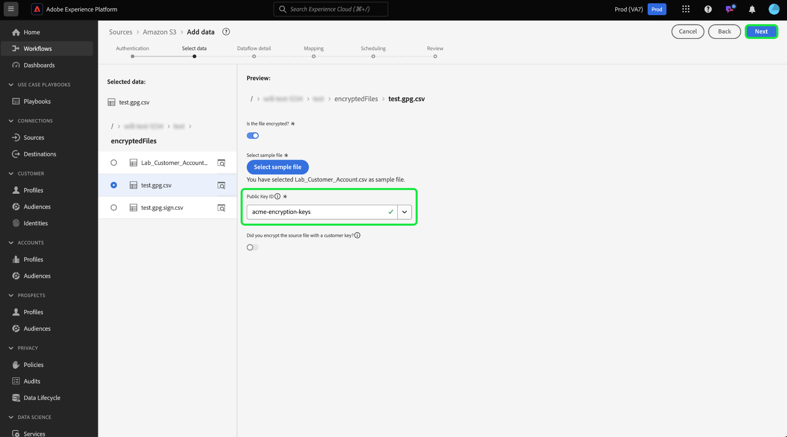

署名の検証キーのペアを使用して暗号化の追加レイヤーを提供し、署名検証キーの切り替えを有効にした場合は、ドロップダウンを使用して、データの暗号化に使用したキーに対応する署名検証キーIDを選択します。

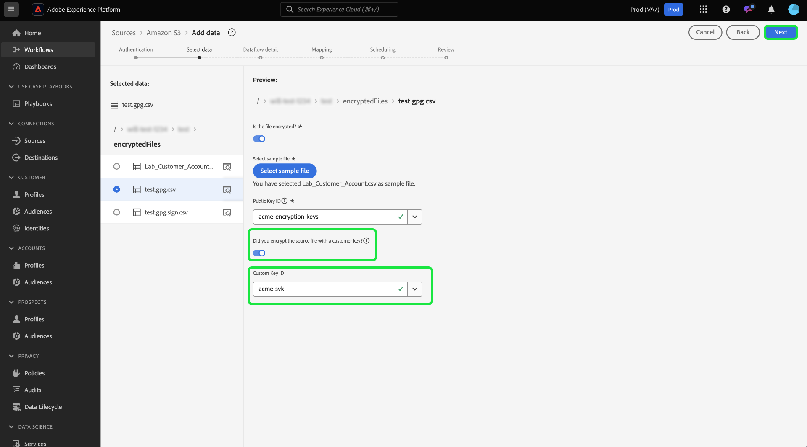

完了したら、**[!UICONTROL Next]**&#x200B;を選択します。

ソースワークフローの残りの手順を完了して、データフローの作成を完了します。

* [データフローとデータセットの詳細を提供](../ui/dataflow/batch/cloud-storage.md#provide-dataflow-details)
* [ソースデータをXDM スキーマにマッピングする](../ui/dataflow/batch/cloud-storage.md#map-data-fields-to-an-xdm-schema)
* [データフローの取り込みスケジュールの設定](../ui/dataflow/batch/cloud-storage.md#schedule-ingestion-runs)
* [データフローのレビュー](../ui/dataflow/batch/cloud-storage.md#review-your-dataflow)

データフローが正常に作成されたら、[ データフロー](../ui/update-dataflows.md)の更新を続行できます。

## 次の手順

このドキュメントを読むことで、クラウドストレージのバッチソースからExperience Platformに暗号化データを取り込むことができます。 APIを使用して暗号化されたデータを取り込む方法について詳しくは、[API [!DNL Flow Service] を使用した暗号化されたデータの取り込みに関するガイドを参照してください。 ](../api/encrypt-data.md)Experience Platformのソースに関する一般的な情報については、[ ソースの概要](../../home.md)を参照してください。
