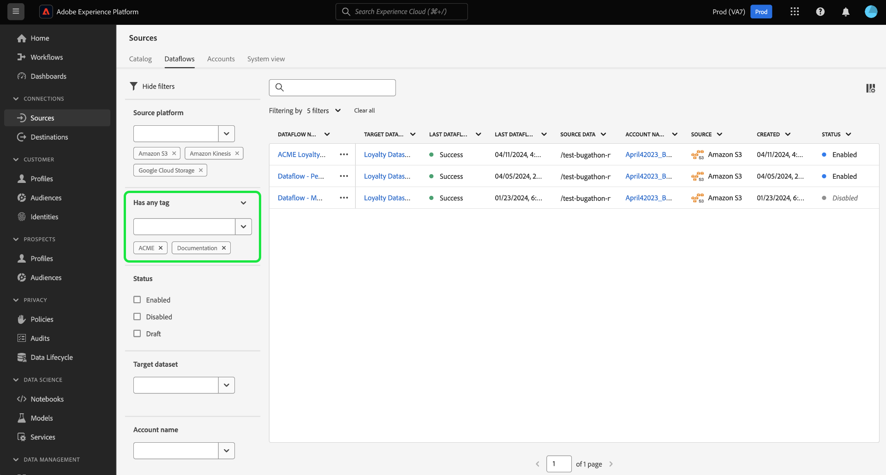
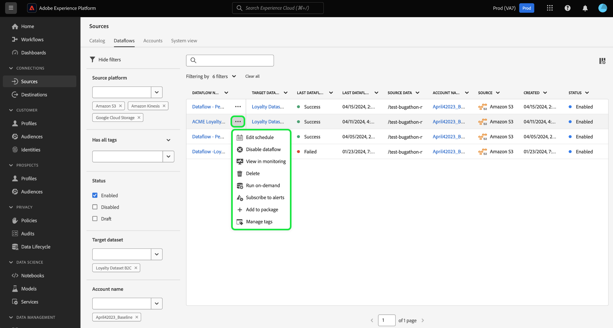

# UI でのソースオブジェクトのフィルタリング

Adobe Experience Platform ユーザーインターフェイスのフィルタリング、検索、インラインアクションツールを使用すると、 [!UICONTROL ソース] workspace

* フィルタリング機能と検索機能を使用して、組織内のソースアカウントとデータフローをナビゲートします。
* インラインアクションを使用して、データフローに適用される設定を変更し、組織のワークフローを改善します。 インラインアクションを使用して、タグの適用、アラートの設定、オンデマンドでの取り込みジョブの作成などを行うことができます。

## 基本を学ぶ

ソースワークスペースでオブジェクトExperience Platformツールを使用する前に、次のナビゲーション機能と概念を理解しておくと役に立ちます。

* [ソース](../../home.md):Experience Platformのソースを使用して、Adobeアプリケーションまたはサードパーティのデータソースからデータを取り込みます。
* [管理タグ](../../../administrative-tags/overview.md)：管理タグを使用してメタデータキーワードをオブジェクトに適用し、検索を有効にしてExperience Platformエコシステム内でそのオブジェクトを検索します。
* [アラート](../../../observability/home.md)：アラートを使用して、ソースデータフローなどのオブジェクトのステータスに関する更新を提供する通知を受け取ります。
* [データフロー](../../../dataflows/home.md)：データフローは、Experience Platform間でデータを移動するデータジョブを表します。 ソースワークスペースを使用すると、特定のソースからExperience Platformにデータを取り込むデータフローを作成できます。
* [データセット](../../../catalog/datasets/user-guide.md)：データセットは、スキーマ（列）とフィールド（行）を含んだデータコレクション（通常はテーブル）のストレージおよび管理用の構成体です。
* [サンドボックス](../../../sandboxes/home.md):Experience Platformでサンドボックスを使用して、開発インスタンス間に仮想パーティションを作成し、Experience Platform用または実稼動用の環境を作成します。

## ソースデータフローのフィルタリング {#filter-sources-dataflows}

Experience PlatformUI で、次を選択します。 **[!UICONTROL ソース]** 左側のナビゲーションでを選択し、 **[!UICONTROL データフロー]** 上部ヘッダーから。

デフォルトでは、フィルターメニューはインターフェイスの左側に表示されます。 メニューを非表示にするには、 **[!UICONTROL フィルターを非表示]**.

次のパラメーターを使用して、ソースデータフローをフィルタリングできます。

| フィルター | 説明 |
| --- | --- |
| [ソースプラットフォーム](#filter-dataflows-by-source-platform) | 作成に使用したソースに基づいてデータフローをフィルタリングします。 |
| [タグ](#filter-dataflows-by-tags) | 適用されるタグに基づいてデータフローをフィルタリングします。 |
| [ステータス](#filter-dataflows-by-status) | 現在のステータスに基づいてデータフローをフィルタリングします。 |
| [ターゲットデータセット](#filter-dataflows-by-target-dataset) | 作成に使用したターゲットデータセットに基づいてデータフローをフィルタリングします。 |
| [アカウント名](#filter-dataflows-by-account-name) | 対応するアカウントの名前に基づいてデータフローをフィルタリングします。 |
| [作成者](#filter-dataflows-by-user) | 誰が作成したかに基づいてデータフローをフィルタリングします。 |
| [作成日](#filter-dataflows-by-creation-date) | 作成日に基づいてデータフローをフィルタリングします。 |
| [変更日](#filter-dataflows-by-modification-date) | 最終更新日に基づいてデータフローをフィルタリングします。 |

### ソースプラットフォーム別のデータフローのフィルタリング {#filter-dataflows-by-source-platform}

の使用 [!UICONTROL ソースプラットフォーム] ソースのタイプでデータフローをフィルタリングするためのパネル。 特定のソースを入力するか、ドロップダウンメニューを使用して、カタログにソースのリストを表示できます。 また、特定のクエリに対して、複数の異なるソースでフィルタリングすることもできます。 例えば、 [!DNL Amazon S3], [!DNL Azure Data Lake Storage Gen2]、および [!DNL Google Cloud Storage] カタログを更新し、選択したソースを使用して作成されたデータフローのみを表示するには、次の手順を実行します。

### タグ別のデータフローのフィルタリング {#filter-dataflows-by-tags}

タグパネルを使用すると、データフローを各タグでフィルタリングできます。

を選択 **[!UICONTROL いずれかのタグがある]** 次に、ドロップダウンメニューを使用して、フィルタリングするタグを選択します。 この設定を使用して、選択したタグのいずれかを持つデータフローをフィルタリングします。

を選択 **[!UICONTROL すべてのタグがある]** 次に、ドロップダウンメニューを使用して、フィルタリングするタグを選択します。 この設定を使用して、選択したすべてのタグを持つデータフローをフィルタリングします。

### ステータスでデータフローをフィルタリング {#filter-dataflows-by-status}

を使用して、ステータスでフィルタリングできます [!UICONTROL ステータス] パネル。

| ステータス | 説明 |
| --- | --- |
| 有効 | を選択 **[!UICONTROL Enabled]** でビューをフィルタリングし、アクティブなデータフローのみを表示します。 |
| 無効 | を選択 **[!UICONTROL Disabled]** でビューをフィルタリングし、非アクティブ化されたデータフローのみを表示します。 |
| ドラフト | を選択 **[!UICONTROL ドラフト]** でビューをフィルタリングし、ドラフトモードのデータフローのみを表示します。 |

### ターゲットデータセットでデータフローをフィルタリング {#filter-dataflows-by-target-dataset}

を選択 **[!UICONTROL ターゲットデータセット]** すべてのターゲットデータセットのドロップダウンメニューにアクセスするには、 次に、ターゲットデータセットを選択してビューをフィルタリングし、指定したターゲットデータセットを使用して作成されたデータフローのみを表示します。

### アカウント名でデータフローをフィルタリング {#filter-dataflows-by-account-name}

を選択 **[!UICONTROL アカウント名]** すべてのアカウントのドロップダウンメニューにアクセスするには、次の手順を実行します。 次に、アカウントを選択して表示をフィルタリングし、選択したアカウントで作成されたデータフローを表示します。

### ユーザー別のデータフローのフィルタリング {#filter-dataflows-by-user}

の使用 [!UICONTROL 作成者] データフローを作成または最後に更新したユーザーでデータフローをフィルタリングするためのパネル。 ドロップダウンを選択し、データフローをフィルタリングするユーザー名を選択します。

### 作成日でデータフローをフィルタリング {#filter-dataflows-by-creation-date}

データフローは、作成日でフィルタリングできます。 が含まれる [!UICONTROL 作成日] パネルを開き、開始日と終了日を設定して時間枠ウィンドウを作成し、そのウィンドウ内で作成されたデータフローのみを表示するようにビューをフィルタリングします。

開始日と終了日を入力して、時間枠を設定できます。 または、カレンダーアイコンを選択し、カレンダーを使用して日付を設定します。

また、同じ手順に従うことができますが、作成日とは異なり、最終変更日でデータフローをフィルタリングします。

### 変更日でデータフローをフィルタリング {#filter-dataflows-by-modification-date}

同様に、同じ原則を適用し、変更日でデータフローをフィルタリングできます。 の使用 **[!UICONTROL 変更日]** 特定の時間枠を設定し、その期間中に変更されたデータフローのみを表示するようにビューをフィルタリングするには、

### フィルターの組み合わせ {#combine-filters}

様々なフィルターを組み合わせて、検索を広げたり絞り込んだりできます。 次の例では、検索にフィルターを適用しています。

* を使用して作成されたデータフロー [!DNL Amazon S3] ソース。
* を含んだデータフロー **[!DNL ACME]** タグ。
* 現在有効なデータフロー。
* を使用して作成されたデータフロー [!DNL Loyalty Dataset B2C] データセット。
* 2024 年 4 月 1 日（PT）から 2024 年 4 月 19 日（PT）の間に作成されたデータフロー。

すべてのフィルターを削除するには、次を選択します **[!UICONTROL すべてクリア]**.

## ソースアカウントのフィルタリング {#filter-sources-accounts}

Experience PlatformUI で、次を選択します。 [!UICONTROL ソース] 左側のナビゲーションでを選択し、 **[!UICONTROL アカウント]** 上部ヘッダーから。 ソースのアカウントは、ソースの作成者またはユーザーが作成したソースに基づいてフィルタリングできます。

## アカウントとデータフローの検索 {#search-for-accounts-and-dataflows}

検索バーを使用して特定のアカウントやデータフローにすぐに移動すると、効率を高めることができます。

>[!BEGINTABS]

>[!TAB データフローを検索]

の検索バーを使用する [!UICONTROL データフロー] 特定のデータフローを検索するページ。 名前または説明を使用して、データフローを検索できます。

>[!TAB アカウントの検索]

の検索バーを使用する [!UICONTROL アカウント] 特定のアカウントを検索するページ。 アカウントの名前または説明を使用してアカウントを検索できます。

>[!ENDTABS]

## ソースデータフローのインラインアクション {#inline-actions-for-sources-dataflows}

省略記号（`...`データフロー名の横にある）をクリックします。データフローの変更に使用できるインラインアクションのリストです。

| インラインアクション | 説明 |
| --- | --- |
| [!UICONTROL スケジュールを編集] | を選択 **[!UICONTROL スケジュールを編集]** データフローの取り込みスケジュールを更新します。 1 回限りの取り込みに設定されているデータフローは、編集できません。 |
| [!UICONTROL データフローの無効化] | を選択 **[!UICONTROL データフローの無効化]** データフロー実行を非アクティブ化します。 このオプションを選択しても、データフローは削除されません。 |
| [!UICONTROL 監視で表示] | を選択 **[!UICONTROL 監視で表示]** をクリックして、監視ダッシュボードでデータフローの指標とステータスを表示します。 詳しくは、のガイドを参照してください。 [ソースデータフローの監視](../../../dataflows/ui/monitor-sources.md). |
| [!UICONTROL 削除] | を選択 **[!UICONTROL 削除]** でデータフローを削除します。 |
| [!UICONTROL オンデマンドで実行] | を選択 **[!UICONTROL オンデマンドで実行]** データフロー実行の 1 回のイテレーションをトリガーにします。 詳しくは、のガイドを参照してください。 [オンデマンドデータフロー実行の作成](../ui/on-demand-ingestion.md). |
| [!UICONTROL アラートの購読] | を選択 **[!UICONTROL アラートの購読]** 購読できるアラートのポップアップウィンドウを表示するには： <ul><li>ソースデータフロー実行開始：オンデマンドデータフローの実行が開始されたときに通知を受け取るには、このアラートを選択します。</li><li>ソースデータフロー実行成功：オンデマンドデータフローの実行が正常に完了したときに通知を受け取るには、このアラートを選択します。</li><li>ソースデータフロー実行失敗：エラーが原因でオンデマンドデータフロー実行が失敗した場合に、このアラートを選択します。</li></ul> 詳しくは、のガイドを参照してください。 [ソースデータフローのアラートの購読](../ui/alerts.md). |
| [!UICONTROL パッケージに追加] | を選択 **[!UICONTROL パッケージに追加]** データフローをパッケージに追加し、別のサンドボックスで使用するために書き出します。 この手順では、新しいパッケージを作成するか、既存のパッケージにデータフローを追加します。 詳しくは、のガイドを参照してください [サンドボックスツール](../../../sandboxes/ui/sandbox-tooling.md). |
| [!UICONTROL タグを管理] | を選択 **[!UICONTROL タグを管理]** ：データフローにタグを追加またはデータフローからタグを削除します。 タグを使用すると、メタデータ分類を管理し、ビジネスオブジェクトを分類して、検出とカテゴリ化が容易になります。 詳しくは、のガイドを参照してください。 [タグの管理](../../../administrative-tags/ui/managing-tags.md). |

## 次の手順

このドキュメントでは、ソースアカウントとデータフローページをナビゲートする方法について説明しました。 ソースについて詳しくは、 [ソースの概要](../../home.md).