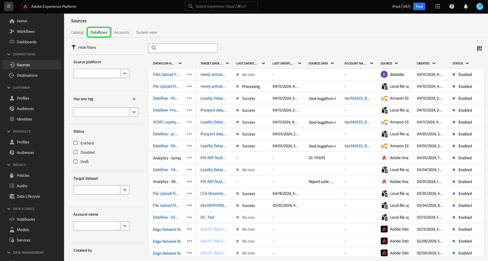
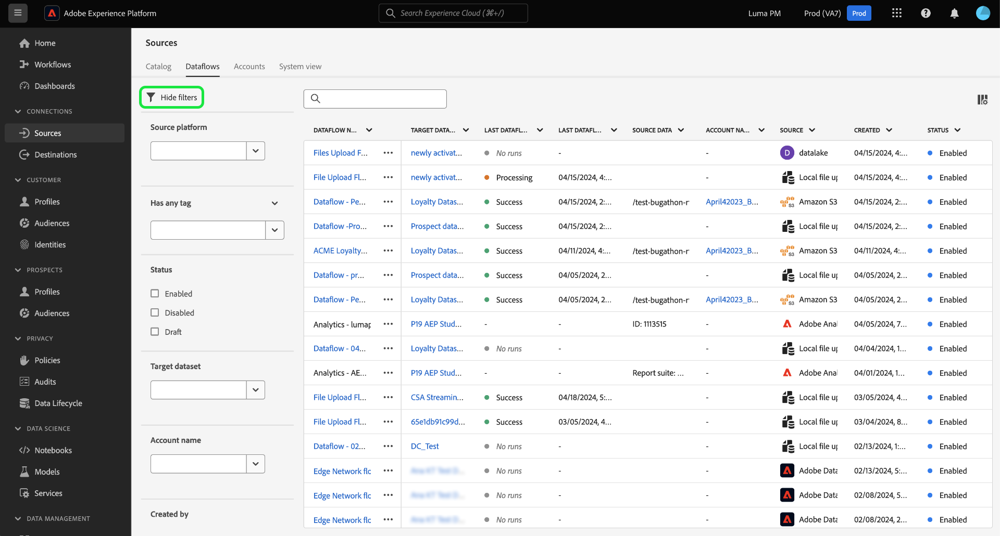
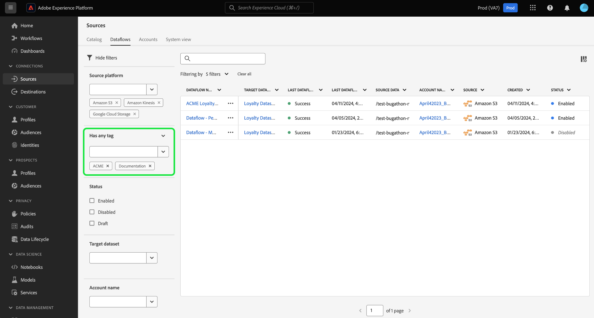
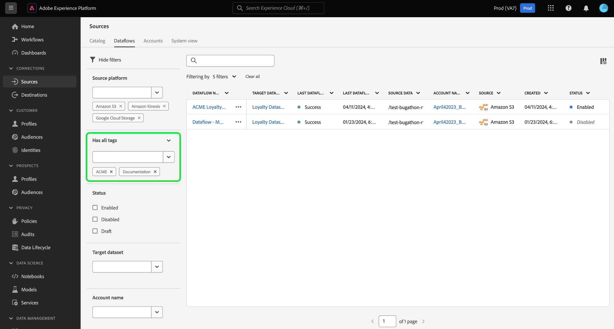
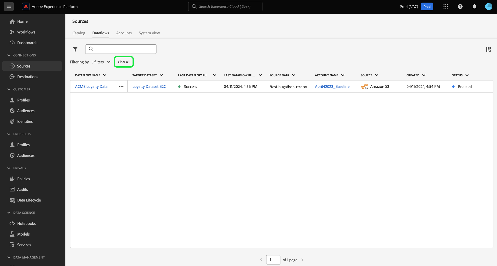
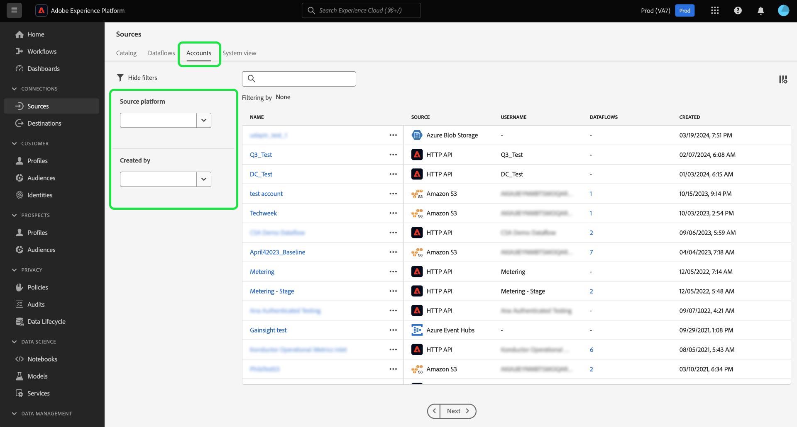
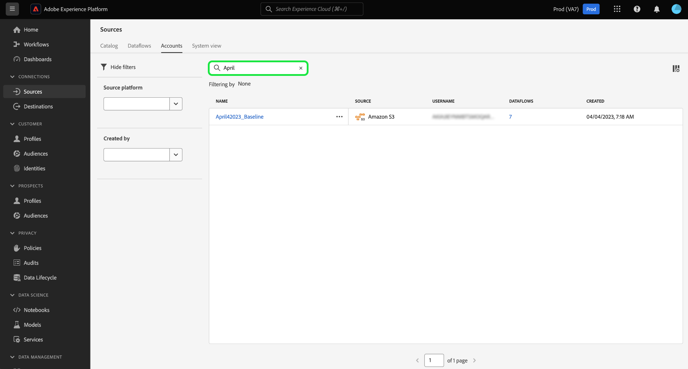
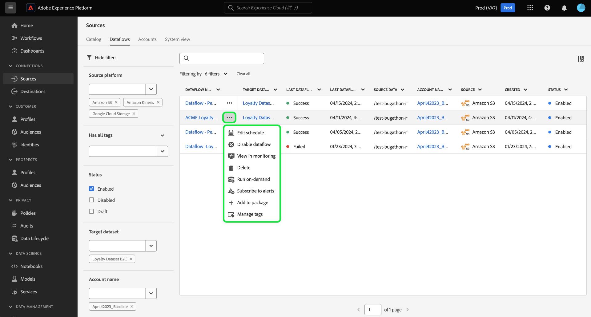

# UIでのソースオブジェクトのフィルタリング

Adobe Experience Platform ユーザーインターフェイスのフィルタリング、検索、インライン アクション ツールを使用して、[!UICONTROL Sources] ワークスペースのワークフローを効率化します

* フィルタリング機能と検索機能を使用して、組織内のソースアカウントやデータフローを移動します。
* インラインアクションを使用して、データフローに適用される設定設定を変更し、組織ワークフローを改善します。 インラインアクションを使用して、タグの適用、アラートの設定、取り込みジョブの作成をオンデマンドで実行できます。

## 基本を学ぶ

ソースワークスペースのオブジェクトナビゲーションツールを使用する前に、次のExperience Platformの機能と概念について理解しておくと便利です。

* [ ソース ](../../home.md): Experience Platformのソースを使用して、Adobe アプリケーションまたはサードパーティのデータソースからデータを取り込みます。
* [管理タグ ](../../../administrative-tags/overview.md)：管理タグを使用してメタデータ キーワードをオブジェクトに適用し、検索を有効にしてExperience Platform エコシステム内でそのオブジェクトを検索します。
* [ アラート ](../../../observability/home.md): アラートを使用して、ソースデータフローなどのオブジェクトのステータスに関する最新情報を提供する通知を受信します。
* [ データフロー](../../../dataflows/home.md): データフローは、Experience Platform間でデータを移動するデータジョブを表します。 ソースワークスペースを使用して、特定のソースからExperience Platformにデータを取り込むデータフローを作成できます。
* [ データセット ](../../../catalog/datasets/user-guide.md): データセットは、スキーマ（列）とフィールド（行）を含むデータのコレクション（通常はテーブル）のストレージおよび管理構造です。
* [ サンドボックス ](../../../sandboxes/home.md): Experience Platformのサンドボックスを使用して、Experience Platform インスタンス間のバーチャルパーティションを作成し、開発用または実稼動用の環境を作成します。

## ソースデータフローのフィルター {#filter-sources-dataflows}

Experience Platform UIで、左側のナビゲーションで「**[!UICONTROL Sources]**」を選択し、上部のヘッダーから「**[!UICONTROL Dataflows]**」を選択します。

デフォルトでは、フィルターメニューはインターフェイスの左側に表示されます。 メニューを非表示にするには、**[!UICONTROL Hide filters]**&#x200B;を選択します。

ソースデータフローは、次のパラメーターでフィルタリングできます。

| フィルター | 説明 |
| --- | --- |
| [Source platform](#filter-dataflows-by-source-platform) | データフローを作成したソースに基づいて、データフローをフィルタリングします。 |
| [タグ](#filter-dataflows-by-tags) | 適用されたタグに基づいて、データフローをフィルタリングします。 |
| [ステータス](#filter-dataflows-by-status) | 現在のステータスに基づいて、データフローをフィルタリングします。 |
| [ ターゲットデータセット ](#filter-dataflows-by-target-dataset) | 作成したターゲットデータセットに基づいて、データフローをフィルタリングします。 |
| [ アカウント名](#filter-dataflows-by-account-name) | 対応するアカウントの名前に基づいて、データフローをフィルタリングします。 |
| [作成者](#filter-dataflows-by-user) | データフローを作成者に基づいてフィルタリングします。 |
| [作成日](#filter-dataflows-by-creation-date) | データフローの作成日に基づいてデータフローをフィルタリングします。 |
| [変更日](#filter-dataflows-by-modification-date) | 最後に更新された日付に基づいて、データフローをフィルタリングします。 |

### ソースプラットフォーム別にデータフローをフィルタリング {#filter-dataflows-by-source-platform}

[!UICONTROL Source platform] パネルを使用して、データフローをソースのタイプでフィルタリングします。 特定のソースを入力するか、ドロップダウンメニューを使用して、カタログ内のソースのリストを表示できます。 特定のクエリに対して、複数の異なるソースをフィルタリングすることもできます。 例えば、[!DNL Amazon S3]、[!DNL Azure Data Lake Storage Gen2]、[!DNL Google Cloud Storage]を選択してカタログを更新し、選択したソースで作成されたデータフローのみを表示できます。

### タグによるデータフローのフィルタリング {#filter-dataflows-by-tags}

タグパネルを使用して、データフローをそれぞれのタグでフィルタリングします。

**[!UICONTROL Has any tag]**&#x200B;を選択し、ドロップダウンメニューを使用してフィルタリングするタグを選択します。 この設定を使用して、選択したタグのいずれかを持つデータフローをフィルタリングします。

**[!UICONTROL Has all tags]**&#x200B;を選択し、ドロップダウンメニューを使用してフィルタリングするタグを選択します。 この設定を使用して、選択したすべてのタグを持つデータフローをフィルタリングします。

### ステータス別にデータフローをフィルタリング {#filter-dataflows-by-status}

[!UICONTROL Status] パネルを使用して、ステータスでフィルタリングできます。

| ステータス | 説明 |
| --- | --- |
| 有効 | **[!UICONTROL Enabled]**&#x200B;を選択してビューをフィルタリングし、アクティブなデータフローのみを表示します。 |
| 無効 | **[!UICONTROL Disabled]**&#x200B;を選択してビューをフィルターし、非アクティブ化されたデータフローのみを表示します。 |
| ドラフト | **[!UICONTROL Draft]**&#x200B;を選択してビューをフィルタリングし、ドラフトモードのデータフローのみを表示します。 |

### ターゲットデータセット別にデータフローをフィルタリング {#filter-dataflows-by-target-dataset}

すべてのターゲットデータセットのドロップダウンメニューにアクセスするには、**[!UICONTROL Target dataset]**&#x200B;を選択します。 次に、ターゲットデータセットを選択してビューをフィルタリングし、指定したターゲットデータセットを使用して作成されたデータフローのみを表示します。

### アカウント名でデータフローをフィルタリング {#filter-dataflows-by-account-name}

**[!UICONTROL Account name]**&#x200B;を選択して、すべてのアカウントのドロップダウンメニューにアクセスします。 次に、アカウントを選択してビューをフィルタリングし、選択したアカウントで作成されたデータフローを表示します。

### ユーザー別にデータフローをフィルタリング {#filter-dataflows-by-user}

[!UICONTROL Created by] パネルを使用して、データフローを作成または最後に更新したユーザーがデータフローをフィルタリングします。 ドロップダウンを選択し、データフローをフィルタリングするユーザー名を選択します。

### 作成日によるデータフローのフィルタリング {#filter-dataflows-by-creation-date}

作成日によってデータフローをフィルタリングできます。 [!UICONTROL Created date] パネルで、開始日と終了日を設定して時間枠ウィンドウを作成し、そのウィンドウ内で作成されたデータフローのみを表示するようにビューをフィルタリングします。

開始日と終了日を入力して、時間枠を設定できます。 または、カレンダーアイコンを選択し、カレンダーを使用して日付を設定します。

同じ手順を実行することもできますが、作成日ではなく、最終変更日でデータフローをフィルタリングすることもできます。

### 変更日によるデータフローのフィルタリング {#filter-dataflows-by-modification-date}

同様に、同じ原則を適用し、データフローを変更日でフィルタリングすることもできます。 **[!UICONTROL Modified date]**&#x200B;を使用して特定の時間枠を設定し、その期間に変更されたデータフローのみを表示するようにビューをフィルタリングします。

### フィルターを結合 {#combine-filters}

さまざまなフィルターを組み合わせて、検索を拡大または縮小できます。 次の例では、フィルターを適用して次の検索を行います。

* [!DNL Amazon S3] ソースを使用して作成されたデータフロー。
* **[!DNL ACME]** タグを含むデータフロー。
* 現在有効になっているデータフロー。
* [!DNL Loyalty Dataset B2C] データセットを使用して作成されたデータフロー。
* 2024年4月1日から2024年4月19日の間に作成されたデータフロー。

すべてのフィルターを削除するには、**[!UICONTROL Clear all]**&#x200B;を選択します。

## ソースアカウントのフィルター {#filter-sources-accounts}

Experience Platform UIで、左側のナビゲーションで「[!UICONTROL Sources]」を選択し、上部のヘッダーから「**[!UICONTROL Accounts]**」を選択します。 ソースアカウントは、作成元のソースまたは作成元のユーザーに基づいてフィルタリングできます。

## アカウントとデータフローの検索 {#search-for-accounts-and-dataflows}

検索バーを使用して特定のアカウントやデータフローにすばやく移動し、効率を向上できます。

>[!BEGINTABS]

>[!TAB  データフローを検索]

[!UICONTROL Dataflows] ページの検索バーを使用して、特定のデータフローを検索します。 名前または説明を使用してデータフローを検索できます。

>[!TAB  アカウントを検索]

[!UICONTROL Accounts] ページの検索バーを使用して、特定のアカウントを検索します。 アカウント名または説明を使用してアカウントを検索できます。

>[!ENDTABS]

## ソースデータフローのインラインアクション {#inline-actions-for-sources-dataflows}

データフローの変更に使用できるインラインアクションのリストのデータフロー名の横にある省略記号（`...`）を選択します。

| インラインアクション | 説明 |
| --- | --- |
| [!UICONTROL Edit schedule] | **[!UICONTROL Edit schedule]**&#x200B;を選択して、データフローの取り込みスケジュールを更新します。 1回限りの取り込みに設定されたデータフローは編集できません。 |
| [!UICONTROL Disable dataflow] | データフロー実行を無効にするには、**[!UICONTROL Disable dataflow]**&#x200B;を選択します。 このオプションは、データフローを削除しません。 |
| [!UICONTROL View in monitoring] | 監視ダッシュボードでデータフローの指標とステータスを表示するには、**[!UICONTROL View in monitoring]**&#x200B;を選択します。 詳しくは、[ ソースデータフローの監視](../../../dataflows/ui/monitor-sources.md)に関するガイドを参照してください。 |
| [!UICONTROL Delete] | **[!UICONTROL Delete]**&#x200B;を選択してデータフローを削除します。 |
| [!UICONTROL Run on-demand] | データフロー実行の1回のイテレーションをトリガーするには、**[!UICONTROL Run on-demand]**&#x200B;を選択します。 詳しくは、[ オンデマンドデータフロー実行の作成](../ui/on-demand-ingestion.md)に関するガイドを参照してください。 |
| [!UICONTROL Subscribe to alerts] | **[!UICONTROL Subscribe to alerts]**&#x200B;を選択して、購読できるアラートのポップアップウィンドウを表示します。 <ul><li>ソース データフロー実行開始：このアラートを選択すると、オンデマンドデータフローの実行が開始されたときに通知を受け取ります。</li><li>ソース データフロー実行の成功：オンデマンドデータフロー実行が正常に終了したときに通知を受け取るには、このアラートを選択します。</li><li>ソース データフロー実行エラー：エラーが原因でオンデマンドデータフロー実行が失敗した場合に、このアラートを選択します。</li></ul> 詳しくは、「[ ソースデータフローのアラートの購読](../ui/alerts.md)」に関するガイドを参照してください。 |
| [!UICONTROL Add to package] | **[!UICONTROL Add to package]**&#x200B;を選択してデータフローをパッケージに追加し、別のサンドボックスで使用するために書き出します。 この手順では、新しいパッケージを作成するか、既存のパッケージにデータフローを追加できます。 詳しくは、[ サンドボックスツール ](../../../sandboxes/ui/sandbox-tooling.md)に関するガイドを参照してください。 |
| [!UICONTROL Manage tags] | データフローにタグを追加または削除するには、**[!UICONTROL Manage tags]**&#x200B;を選択します。 タグを使用してメタデータの分類を管理し、ビジネスオブジェクトを分類して、発見や分類を容易にします。 詳しくは、[ タグの管理](../../../administrative-tags/ui/managing-tags.md)に関するガイドを参照してください。 |

## 次の手順

このドキュメントでは、ソースアカウントとデータフローページを移動する方法について説明しました。 ソースについて詳しくは、[ ソースの概要](../../home.md)を参照してください。
