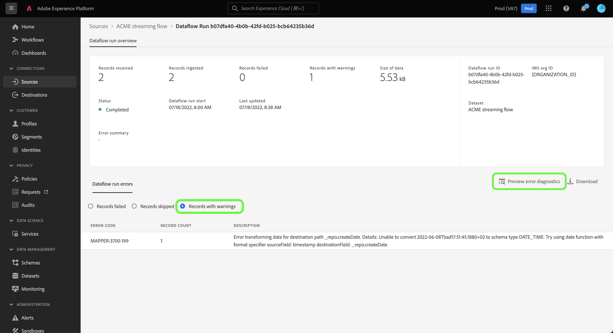

# UI でのストリーミングソースのデータフローの監視

このチュートリアルでは、 [!UICONTROL ソース] ワークスペース。

## はじめに

このチュートリアルは、Adobe Experience Platform の次のコンポーネントを実際に利用および理解しているユーザーを対象としています。

* [データフロー](../../../dataflows/home.md)：データフローは、Platform 間でデータを移動するデータジョブを表します。データフローは異なるサービスをまたいで設定され、ソースコネクタからターゲットデータセット、[!DNL Identity] および [!DNL Profile]、[!DNL Destinations] へとデータを移動できます。
   * [データフロー実行](../../notifications.md)：データフロー実行は、選択したデータフローの頻度設定に基づいて繰り返しスケジュールされたジョブです。
* [ソース](../../home.md)：Experience Platform を使用すると、データを様々なソースから取得しながら、Platform サービスを使用して受信データの構造化、ラベル付け、拡張を行うことができます。
* [サンドボックス](../../../sandboxes/home.md)：Experience Platform には、単一の Platform インスタンスを別々の仮想環境に分割し、デジタルエクスペリエンスアプリケーションの開発と発展に役立つ仮想サンドボックスが用意されています。

## ストリーミングソースのデータフローの監視

Platform の UI で、左側のナビゲーションバーで「**[!UICONTROL Sources]**」を選択し、[!UICONTROL Sources ]のワークスペースにアクセスします。[!UICONTROL カタログ]画面には、アカウントを作成できる様々なソースが表示されます。

ストリーミングソースの既存のデータフローを表示するには、「 」を選択します。 **[!UICONTROL データフロー]** を上部のヘッダーから削除します。

この [!UICONTROL データフロー] ページには、組織内のすべての既存のデータフローのリストが含まれています。このリストには、ソースデータ、アカウント名、データフローの実行ステータスに関する情報が含まれます。

表示するデータフローの名前を選択します。

次の表に、データフロー実行ステータスの詳細を示します。

| ステータス | 説明 |
| ------ | ----------- |
| 完了 | この `Completed` 「 」ステータスは、対応するデータフロー実行のすべてのレコードが 1 時間以内に処理されたことを示します。 A `Completed` ステータスには、データフローの実行でエラーを含めることができます。 |
| 成功 | この `Success` 「 」ステータスは、対応するデータフロー実行のすべてのレコードが 1 時間以内に処理され、データフローの実行中にエラーが発生しなかったことを示します。 |
| 処理中 | 「`Processing`」ステータスは、データフローがまだアクティブでないことを示します。 このステータスは、多くの場合、新しいデータフローを作成した直後に発生します。 |
| エラー | 「`Error`」ステータスは、データフローのアクティブ化プロセスが中断されたことを示します。 |
| 実行なし | この `No runs` 「 」ステータスは、データフローが作成されたが、データフローの実行が開始されなかったことを示します。 |

この [!UICONTROL データフローアクティビティ] ページには、ストリーミングデータフローに関する特定の情報が表示されます。 上部のバナーには、選択した日付範囲でのすべてのストリーミングデータフロー実行で取り込まれたレコードと失敗したレコードの累積数が表示されます。

デフォルトでは、表示されるデータには、過去 7 日間の取り込み率が含まれています。 選択 **[!UICONTROL 過去 7 日間]** を使用して、表示されるレコードの時間枠を調整します。

カレンダーポップアップウィンドウが開き、別の取り込み時間枠のオプションが表示されます。 データフローの実行時間枠を設定して、過去 7 日間または過去 30 日間のフロー実行を表示できます。 または、インタラクティブカレンダーを設定して、任意のカスタム期間を設定します。 完了したら、「**[!UICONTROL 適用]**」を選択します。

ページの下半分には、フロー実行ごとの受信、取り込み、失敗のレコード数に関する情報が表示されます。 各フロー実行は、1 時間ごとのウィンドウ内に記録されます。

### データフロー実行指標 {#dataflow-run-metrics}

>[!CONTEXTUALHELP]
>id="platform_sources_dataflow_records_received"
>title="受信したレコード"
>abstract="受信したレコードの指標は、データフローで受信したレコードの合計数を示します。"
>text="Learn more in documentation"

>[!CONTEXTUALHELP]
>id="platform_sources_dataflow_records_ingested"
>title="取り込まれたレコード"
>abstract="取り込まれたレコードの指標は、データレイクに取り込まれたレコードの合計数を示します。"
>text="Learn more in documentation"

>[!CONTEXTUALHELP]
>id="platform_sources_dataflow_records_failed"
>title="失敗したレコード"
>abstract="失敗したレコードの指標は、データのエラーが原因でデータレイクに取り込まれなかったレコードの合計数を示します。"
>text="Learn more in documentation"

>[!CONTEXTUALHELP]
>id="platform_sources_dataflow_records_warnings"
>title="警告のあるレコード"
>abstract="警告のあるレコードの指標は、マッパー変換警告を伴って取り込まれたレコードの合計数を示します。マッパー変換エラーはすべて警告としてレポートされます。部分的に取り込まれた行は、警告を伴う成功と見なされます。"
>text="Learn more in documentation"

個々のデータフロー実行ごとに、次の詳細が表示されます。

* **[!UICONTROL データフロー実行開始]**：データフロー実行が開始された時刻です。
* **[!UICONTROL 処理時間]**:データフローの処理に要した時間。
* **[!UICONTROL 受信したレコード]**:ソースコネクタからデータフローで受信したレコードの合計数。
* **[!UICONTROL 取り込まれたレコード]**:に取り込まれたレコードの合計数 [!DNL Data Lake].
* **[!UICONTROL 警告のあるレコード]**:取り込まれた警告を含むレコードの合計数です。 すべてのマッパー変換エラーは警告として報告され、部分的に取り込まれた行には「 `success` 警告付きで **注意**:警告を含むレコードの取り込みのサポートは、ストリーミングソースでのみ使用できます。
* **[!UICONTROL 失敗したレコード]**:に取り込まれなかったレコードの数 [!DNL Data Lake] データのエラーが原因で発生しています。
* **[!UICONTROL 取り込み率]**:に取り込まれたレコードの成功率 [!DNL Data Lake]. この指標は、次の場合に適用されます。 [!UICONTROL 部分取り込み] が有効になっている。
* **[!UICONTROL ステータス]**：データフローの状態（[!UICONTROL 完了]または[!UICONTROL 処理中]）を表します。[!UICONTROL 完了] は、対応するデータフロー実行のすべてのレコードが 1 時間以内に処理されたことを意味します。 [!UICONTROL 処理中]は、データフロー実行がまだ終了していないことを意味します。

この [!UICONTROL データフロー実行の概要] ページには、対応するデータフロー実行 ID、ターゲットデータセット、組織 ID など、データフローに関する追加情報が含まれています。

エラーが発生したフロー実行には、 [!UICONTROL データフロー実行エラー] パネル：実行の失敗につながった特定のエラーと、失敗したレコードの合計数を表示します。

### 警告のあるレコードを表示 {#warnings}

[!UICONTROL 警告のあるレコード] フロー実行中に発生したマッパー変換の警告のリストを表示します。 部分的に取り込まれた行は正常と見なされ、マッパーの変換エラーが見つかった場合は警告が付加されます。

デフォルトでは、マッパー変換エラーはすべて警告と見なされますが、次のエラーのいずれかを除きます。

* 構文エラー
* 存在しない属性への参照
* XDM データタイプの不一致

エラー診断を表示するには、「 」を選択します。 **[!UICONTROL エラー診断をプレビュー]**.

この [!UICONTROL エラー診断のプレビュー] ウィンドウでは、データフローの実行に関する最大 100 個のエラーや警告をプレビューできます。 ここから、 [!DNL Data Access] API

## 次の手順

このチュートリアルでは、 [!UICONTROL ソース] workspace を使用して、ストリーミングデータフローを監視し、データフローの失敗につながったエラーを特定します。 詳しくは、次のドキュメントを参照してください。

* [ソースの概要](../../home.md)
* [データフローの概要](../../../dataflows/home.md)
