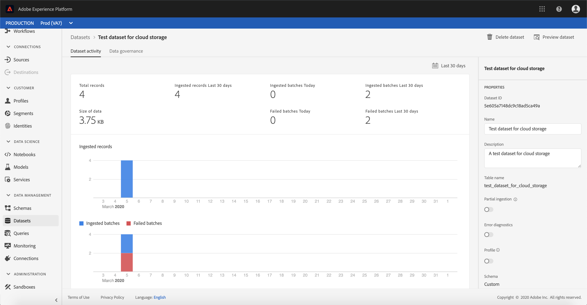

# アカウントとデータセットフローの監視

Adobe Experience Platformのソースコネクターは、外部ソースのデータをスケジュールに基づいて取り込む機能を提供します。 このチュートリアルでは、 *Sources* Workspaceから既存のアカウントとデータセットフローを表示する手順を説明します。

## はじめに

このチュートリアルでは、Adobe Experience Platformの次のコンポーネントについて、十分な理解を得る必要があります。

- [Experience Data Model(XDM)System](../../../xdm/home.md):エクスペリエンスプラットフォームが顧客エクスペリエンスデータを整理するための標準化されたフレームワーク。
   - [スキーマ構成の基本](../../../xdm/schema/composition.md):XDMスキーマの基本的な構成要素について説明します。この中には、主な原則や構成のベストプラクティスが含まれています。スキーマ構成の基本要素です。
   - [スキーマエディタのチュートリアル](../../../xdm/tutorials/create-schema-ui.md):カスタムスキーマを作成する方法についてスキーマエディターのUI。
- [リアルタイム顧客プロファイル](../../../profile/home.md):複数のソースからの集計データに基づいて、統合されたリアルタイムのプロファイルを顧客に提供します。

## アカウントの監視

<a href="https://platform.adobe.com" target="_blank">Adobe Experience Platformにログインし</a> 、左のナビゲーションバーから「 **Sources** 」を選択して、ソースワークスペースにアク *セスします* 。 カタロ *グ画面には* 、様々なソースが表示され、このソースを使用してアカウントのデータセットフローを作成できます。 各ソースには、既存のアカウントの数と、それらに関連付けられたデータセットフローが表示されます。

上部のヘッ *ダーから* 「アカウント」を選択し、既存のアカウントを表示します。

[アカウ *ント* ]ページが表示されます。 このページには、アカウントのソース、ユーザー名、データセットフローの数、作成日など、表示可能なアカウントのリストが表示されます。

左上のアイコンを選択して、並べ替えウィンドウを開きます。

並べ替えパネルを使用すると、特定のソースのアカウントにアクセスできます。 操作するソースを選択し、右側のリストからアカウントを選択します。

アカウント *ページで* 、アクセスしたアカウントに関連付けられた既存のデータセットフローのリストを表示できます。 選択するデータセットフローを表示します。

データセッ *トフローアクティビティ* 画面が表示されます。 このページには、グラフの形で消費されるメッセージの割合が表示されます。

## データセットフローの監視

データセットフローは、アカウントを表示しなくても、 *Catalog* ページから直接アクセスで *きます*。 上部のヘ *ッダーから* 「データセットフロー」を選択し、既存の表示フローのリストを選択します。

アカウントと同様に、左上の並べ替えアイコンを使用して、リストセットフローのデータを並べ替えることができます。 表示するソースを選択し、右側のリストからデータセットフローを選択します。

データセッ *トフローアクティビティ* 画面が表示されます。 このページには、グラフの形で消費されるメッセージの割合が表示されます。

データセットの監視と取り込みの詳細については、ストリーミングデータフローの監視に関するチュートリ [アルを参照してくださ](../../../ingestion/quality/monitor-data-flows.md)い。

## 次の手順

このチュートリアルに従うと、既存のアカウントとデータセットフローにソースワークスペースから正しくアクセスで *き* ます。 受信データは、リアルタイム顧客情報やData Science Workspaceなどのダウンストリームプラットフォームサービスで使用できるようになりました。 詳しくは、次のドキュメントを参照してください。

- [リアルタイム顧客プロファイルの概要](../../../profile/home.md)
- [Data Science Workspaceの概要](../../../data-science-workspace/home.md)