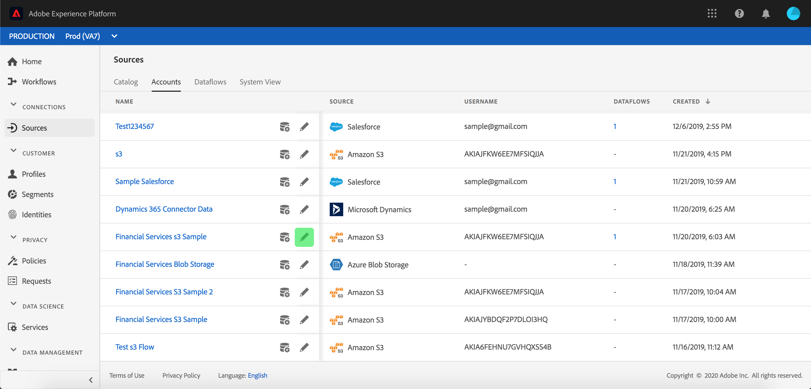
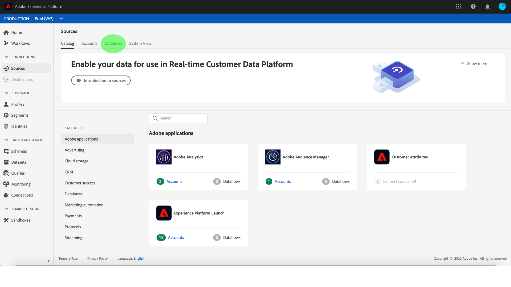

# UIでのアカウントとデータの監視

Adobe Experience Platformのソースコネクタは、外部ソースのデータをスケジュールに基づいて取り込む機能を提供します。 このチュートリアルでは、 [!UICONTROL ソース] ・ワークスペースから既存のアカウントとデータ・フローを表示する手順を説明します。

## はじめに

このチュートリアルは、Adobe Experience Platform の次のコンポーネントを実際に利用および理解しているユーザーを対象としています。

- [[!DNL Experience Data Model (XDM)] システム](../../../xdm/home.md):顧客体験データを [!DNL Experience Platform] 整理する際に使用される標準化されたフレームワーク。
   - [スキーマ構成の基本](../../../xdm/schema/composition.md)：スキーマ構成の主要な原則やベストプラクティスなど、XDM スキーマの基本的な構成要素について学びます。
   - [スキーマエディタのチュートリアル](../../../xdm/tutorials/create-schema-ui.md):スキーマエディターのUIを使用してカスタムスキーマを作成する方法を説明します。
- [[!DNL Real-time Customer Profile]](../../../profile/home.md):複数のソースからの集計データに基づいて、統合されたリアルタイムの消費者プロファイルを提供します。

## アカウントの監視

[Adobe Experience Platform](https://platform.adobe.com) にログインし、左のナビゲーションバーで **[!UICONTROL 「ソース]** 」を選択して「 **[!UICONTROL ソース]** 」ワークスペースにアクセスします。 「 **[!UICONTROL カタログ]** 」画面には、アカウントおよびデータフローを作成できる様々なソースが表示されます。 各ソースには、関連付けられた既存のアカウントおよびデータフローの数が表示されます。

上部のヘッダーから「 **[!UICONTROL アカウント]** 」を選択して、既存のアカウントを表示します。

[ **[!UICONTROL アカウント]** ]ページが表示されます。 このページには、ソース、ユーザー名、データ・フロー数、作成日など、表示可能なアカウントのリストが表示されます。

左上のファネルアイコンを選択して、並べ替えウィンドウを開きます。

並べ替えパネルを使用すると、特定のソースのアカウントにアクセスできます。 操作するソースを選択し、右側のリストからアカウントを選択します。

>[!TIP]
>
> 「  」列の「 **[!UICONTROL スペクトル制御]** 」ボタンを使用して、選択したアカウントの新しいソースデータフローを作成します。

また、既存のアカウント情報を編集し、アカウント資格情報を更新することもできます。 編集するアカウント情報の鉛筆アイコンを選択します。

「アカウントの **[!UICONTROL 詳細を編集]** 」モーダルが表示されます。 このページから、既存のアカウントの詳細と認証資格情報を更新できます。

>[!NOTE]
>
> アカウントの詳細の編集は、すべてのバッチソースコネクタで可能です。

「 **[!UICONTROL アカウント]** 」ページから、アクセスしたアカウントに関連付けられた既存のデータフローまたはターゲットデータセットのリストを表示できます。 「三点リーダー(`...`)」ボタンを選択し、選択したデータフローで使用可能なオプションを表示します。 これらのオプションについては、以下で詳しく説明します。

| 制御 | 説明 |
| ------- | ----------- |
| [!UICONTROL スケジュールを編集] | データフローのインジェストスケジュールを編集できます。 |
| [!UICONTROL データフローの無効化] | 選択したデータフローのデータ取り込みを無効にできます。 |
| [!UICONTROL 削除] | 選択したデータフローを削除できます。 |

## データフローの監視

データ・フローは、 **[!UICONTROL アカウントを表示せずに、]** カタログ **[!UICONTROL ・ページから直接アクセスできます]**。 上部ヘッダーから **[!UICONTROL データフローを選択し]** 、データフローのリストを表示します。

既存のデータフローのリストが表示されます。 このページには、ソース、ユーザー名、データフロー数およびステータスに関する情報を含む、表示可能なデータフローのリストが表示されます。

ステータスについて詳しくは、次の表を参照してください。

| ステータス | 説明 |
| ------ | ----------- |
| 有効 | ステータスは、データフローがアクティブであり、提供されたスケジュールに従ってデータを取り込んでいることを示します。 `Enabled` |
| 無効 | ステータスは、データフローが非アクティブで、データを取り込んでいないことを示します。 `Disabled` |
| Processing | ステータスは、データフローがまだアクティブでないことを示します。 `Processing` このステータスは、多くの場合、新しいデータフローの作成直後に発生します。 |
| エラー | ステータスは、データフローのアクティベーションプロセスが中断されたことを示します。 `Error` |

左上のファネルアイコンを選択して並べ替えます。

並べ替えパネルが表示されます。 スクロール・メニューからアクセスするソースを選択し、右側のリストからデータ・フローを選択します。 「三点リーダー(`...`)」ボタンを選択して、選択したデータフローに対して利用可能なオプションを表示することもできます。

[ **[!UICONTROL Dataflowアクティビティ]** ]ページには、取り込まれたレコードと失敗したレコードの数、およびデータフローの状態と処理時間に関する情報が含まれます。 データフローの上にあるカレンダーアイコンを選択して、インジェストレコードの時間枠を調整します。

カレンダーを使用すると、取り込むレコードに応じて異なる時間枠を表示できます。 「[!UICONTROL 過去7日間]」または「[!UICONTROL 過去30日間]」の2つの事前設定されたオプションのいずれかを選択できます。 または、カレンダーを使用してカスタムの期間を設定できます。 選択した期間を選択し、「 **[!UICONTROL 適用]** 」を選択して続行します。

デフォルトでは、 **[!UICONTROL Dataflowアクティビティ]** には、データフローに関連付けられた **[!UICONTROL プロパティ]** ・パネルが表示されます。 リストからフロー実行を選択し、固有の実行IDに関する情報を含む、関連するメタデータを表示します。

「 **[!UICONTROL Dataflow実行開始]** 」を選択して、 **[!UICONTROL Dataflow実行の概要にアクセスします]**。

デ **[!UICONTROL ータフロー実行の概要]** ：メタデータ、部分的な取り込みステータス、割り当てられたエラーしきい値など、データフローに関する情報が表示されます。 上部のヘッダーには、エラーの概要も含まれます。 エラ **[!UICONTROL ーの概要]** には、インジェストプロセスでエラーが発生したステップを示す、特定の最上位レベルのエラーが含まれます。

次の表に、 **[!UICONTROL エラーの概要に表示されるエラーを示します]**。

| エラー | 説明 |
| ---------- | ----------- |
| `CONNECTOR-1001-500` | ソースからデータをコピー中にエラーが発生しました。 |
| `CONNECTOR-2001-500` | コピーされたデータの処理中にエラーが発生し [!DNL Platform]ました。 このエラーは、解析、検証または変換に関するものです。 |

画面の下半分には、 **[!UICONTROL Dataflow実行エラーに関する情報が含まれています]**。 ここから、取り込んだファイルの表示、プレビューおよびダウンロードのエラー診断、またはファイルマニフェストのダウンロードを行うこともできます。

「 **[!UICONTROL Dataflow run errors]** 」セクションには、エラー・コード、失敗したレコード数、エラーを説明する情報が表示されます。

インジェストエラーの詳細を表示するには、 **[!UICONTROL プレビューエラー診断]** (Ingestion Error Diagnostics)を選択します。

[ **[!UICONTROL エラー診断プレビュー]** ]パネルが表示されます。 この画面には、ファイル名、エラーコード、エラーが発生した列の名前、エラーの説明など、インジェストエラーに関する具体的な情報が表示されます。

この節では、エラーを含む列のプレビューも説明します。

>[!IMPORTANT]
>
>エラー診断プレビューを有効にするには **[!UICONTROL 、データフローを構成する際に]** Partial ingestion **[!UICONTROL and]** Error diagnostics **** をアクティブにする必要があります。 これを行うと、フローの実行中に取り込まれたすべてのレコードをスキャンできます。

エラーをプレビューした後、「 **[!UICONTROL Dataflow runs overview]** 」パネルで「 **[!UICONTROL Download]** from the dataflow runs overview」を選択して、完全なエラー診断にアクセスし、ファイルマニフェストをダウンロードできます。 詳しくは、 [エラー診断とメタデータの](../../../ingestion/batch-ingestion/partial.md#retrieve-errors) ダウンロードのドキュメントを参照してください  。

データフローの監視と取り込みの詳細については、ストリーミングデータフローの [監視に関するチュートリアルを参照してください](../../../ingestion/quality/monitor-data-flows.md)。

## 次の手順

このチュートリアルに従うと、 **[!UICONTROL Sources]** ワークスペースから既存のアカウントおよびデータフローに正常にアクセスできます。 受信データは、やなどのダウンストリーム [!DNL Platform] サービスで使用でき [!DNL Real-time Customer Profile] るようになり [!DNL Data Science Workspace]ました。 詳しくは、次のドキュメントを参照してください。

- [リアルタイム顧客プロファイルの概要](../../../profile/home.md)
- [Data Science ワークスペースの概要](../../../data-science-workspace/home.md)
