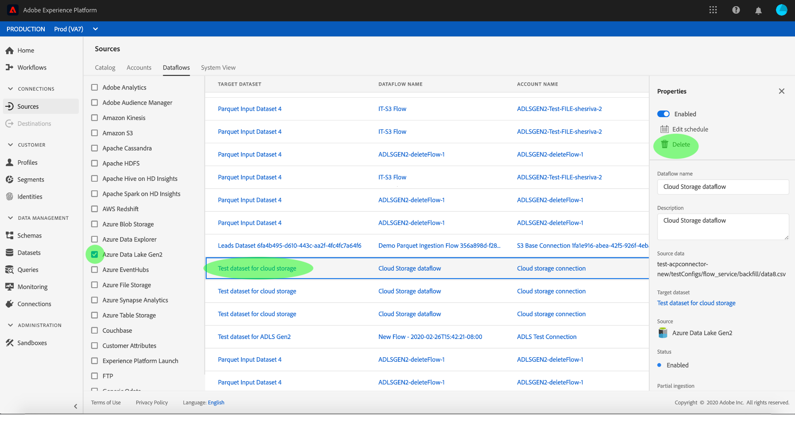

# データフローの監視と削除

Adobe Experience Platformのソースコネクタは、外部ソースのデータをスケジュールに基づいて取り込む機能を提供します。 このチュートリアルでは、 *[!UICONTROL ソース]* ・ワークスペースから既存のアカウントとデータ・フローを表示する手順を説明します。 また、 *[!UICONTROL ソース]* ・ワークスペースからデータ・フローを削除する手順も示します。

## はじめに

このチュートリアルは、Adobe Experience Platform の次のコンポーネントを実際に利用および理解しているユーザーを対象としています。

- [エクスペリエンスデータモデルl（XDM）システム](../../../xdm/home.md)[!DNL Experience Platform]： が顧客体験データを整理するための標準化されたフレームワークです。
   - [スキーマ構成の基本](../../../xdm/schema/composition.md)：スキーマ構成の主要な原則やベストプラクティスなど、XDM スキーマの基本的な構成要素について学びます。
   - [スキーマエディタのチュートリアル](../../../xdm/tutorials/create-schema-ui.md): スキーマエディターのUIを使用してカスタムスキーマを作成する方法を説明します。
- [リアルタイム顧客プロファイル](../../../profile/home.md)：複数のソースから集約されたデータに基づいて、統合されたリアルタイムのコンシューマープロファイルを提供します。

## アカウントの監視

「 [Adobe Experience Platform](https://platform.adobe.com) 」にログインし、左のナビゲーションバーで「 **[!UICONTROL ソース]** 」を選択して「 *[!UICONTROL ソース]* 」ワークスペースにアクセスします。 「 *[!UICONTROL カタログ]* 」画面には、アカウントおよびデータフローを作成できる様々なソースが表示されます。 各ソースには、関連付けられた既存のアカウントおよびデータフローの数が表示されます。

上部のヘッダーから「 *[!UICONTROL アカウント]* 」を選択して、既存のアカウントを表示します。

[ *[!UICONTROL アカウント]* ]ページが表示されます。 このページには、ソース、ユーザー名、データ・フロー数、作成日など、表示可能なアカウントのリストが表示されます。

左上のファネルアイコンを選択して、並べ替えウィンドウを開きます。

並べ替えパネルを使用すると、特定のソースのアカウントにアクセスできます。 操作するソースを選択し、右側のリストからアカウントを選択します。

「 *[!UICONTROL アカウント]* 」ページから、アクセスしたアカウントに関連付けられた既存のデータフローのリストを表示できます。 表示するデータフローを選択します。

「 *[!UICONTROL Dataflowアクティビティ]* 」画面が表示されます。 このページには、グラフの形式で消費されるメッセージの割合が表示されます。

## データフローの監視

データ・フローは、 *[!UICONTROL アカウントを表示せずに、]* カタログ *[!UICONTROL ・ページから直接アクセスできます]*。 上部ヘッダーから *[!UICONTROL データフローを選択し]* 、既存のデータフローのリストを表示します。

既存のデータフローのリストが表示されます。 このページには、ソース、ユーザー名、データフロー数およびステータスに関する情報を含む、表示可能なデータフローのリストが表示されます。 左上のファネルアイコンを選択して並べ替えます。

並べ替えパネルが表示されます。 スクロール・メニューからアクセスするソースを選択し、右側のリストからデータ・フローを選択します。

「 *[!UICONTROL Dataflowアクティビティ]* 」画面が表示されます。 このページには、グラフの形式で消費されるメッセージの割合が表示されます。

データフローの監視と取り込みの詳細については、ストリーミングデータフローの [監視に関するチュートリアルを参照してください](../../../ingestion/quality/monitor-data-flows.md)。

## データフローの削除

誤って作成されたデータフローや不要になったデータフローは、データフロー画面にアクセスして削除できます。 並べ替えファネルアイコンを使用して削除するデータフローを見つけ、データフローを選択して **[!UICONTROL プロパティ]** ・パネルを開きます。

データフローを削除するには、右上のプロパティから **[!UICONTROL 「削除]** 」を選択します。

最終確認メッセージが表示されます。 「 **[!UICONTROL 削除]** 」を選択して確認します。

しばらくすると、削除が成功したことを確認する緑の確認ボックスが画面の下部に表示されます。

または、 *[!UICONTROL アカウント]* 画面からデータフローを削除できます。 並べ替えファネルアイコンを使用してアクセスするアカウントを見つけ、リストからアカウントを選択します。

The *[!UICONTROL Accounts]* page appears. 削除するデータフローを選択し、プロパティ・パネルから **[!UICONTROL 「削除]** 」を選択してプロセスを完了します。

上記の確認手順に従って、プロセスを完了します。

## 次の手順

このチュートリアルに従うと、 *[!UICONTROL Sources]* ワークスペースから既存のアカウントおよびデータフローに正常にアクセスできます。 受信データは、やなどのダウンストリーム [!DNL Platform] サービスで使用でき [!DNL Real-time Customer Profile] るようになり [!DNL Data Science Workspace]ました。 詳しくは、次のドキュメントを参照してください。

- [リアルタイム顧客プロファイルの概要](../../../profile/home.md)
- [Data Science ワークスペースの概要](../../../data-science-workspace/home.md)