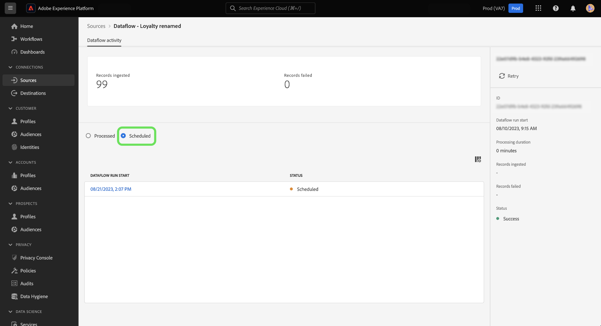

# UI でのソースデータフローのオンデマンド取り込み

オンデマンド取り込みを使用すると、Adobe Experience Platformユーザーインターフェイスのソースワークスペースを使用して、既存のデータフローのフロー実行反復をトリガー化できます。

このドキュメントでは、ソースに対するオンデマンドでデータフローを作成する手順と、処理されたフローまたは失敗したフローの実行を再試行する方法について説明します。

>[!BEGINSHADEBOX]

**フロー実行とは**

フロー実行は、データフロー実行のインスタンスを表します。 例えば、時間別のデータフローの午前 9 時、午前 10 時、午前 11 時に実行するようにスケジュールされている場合、フロー実行の 3 つのインスタンスがあります。 フロー実行は、特定の組織に固有です。

>[!ENDSHADEBOX]

## Destination SDK の

このドキュメントでは、Experience Platformの次のコンポーネントに関する十分な知識が必要です。

* [ソース](../../home.md)：Experience Platform を使用すると、データを様々なソースから取得しながら、Platform サービスを使用して受信データの構造化、ラベル付け、拡張を行うことができます。
* [データフロー](../../../dataflows/home.md)：データフローは、Platform 間でデータを移動するデータジョブを表します。 データフローは異なるサービス間で設定され、ソースコネクタからターゲットデータセット、ID サービスおよびリアルタイム顧客プロファイル、宛先へのデータの移動に役立ちます。
* [サンドボックス](../../../sandboxes/home.md)：Experience Platform は、単一の Platform インスタンスを個別の仮想環境に分割する仮想サンドボックスを提供し、デジタル体験アプリケーションの開発および進化を支援します。

## オンデマンドでのデータフローの作成 {#create-a-dataflow-on-demand}

次に移動： *[!UICONTROL データフロー]* 「ソース」ワークスペースの「 」タブ ここから、オンデマンドで実行するデータフローを探し、省略記号 (**`...`**) をクリックします。

次に、「 **[!UICONTROL オンデマンドで実行]** を選択します。

オンデマンド取り込みのスケジュールを設定します。 を選択します。 **[!UICONTROL 取り込み開始時間]**、 **[!UICONTROL 日付範囲の開始時間]**、および **[!UICONTROL 日付範囲の終了時間]**.

| スケジュール設定 | 説明 |
| --- | --- |
| [!UICONTROL 取り込み開始時間] | オンデマンドデータフローが開始する日時 (UTC)。 |
| [!UICONTROL 日付範囲の開始時間] | データの取り込み元の開始日時。 |
| [!UICONTROL 日付範囲の終了時間] | データの取り込み元の終了日時。 |

選択 **[!UICONTROL スケジュール]** オンデマンドのデータフローをトリガーするまで、しばらく待ちます。

データフロー名を選択して、データフローアクティビティを表示します。 処理されたデータフロー実行のリストが表示されます。 データフローの実行を選択し、「 」を選択します。 **[!UICONTROL 再試行]** を右側のレールから選択し、選択したデータフロー実行の反復の取り込みを再試行します。

選択 **[!UICONTROL Scheduled]** を参照して、将来の取り込み用にスケジュールされたデータフローの実行のリストを確認します。

## 次の手順

このドキュメントでは、既存のソースのデータフローに対するフロー実行をオンデマンドで作成する方法を学びました。 ソースの詳細については、 [ソースの概要](../../home.md)