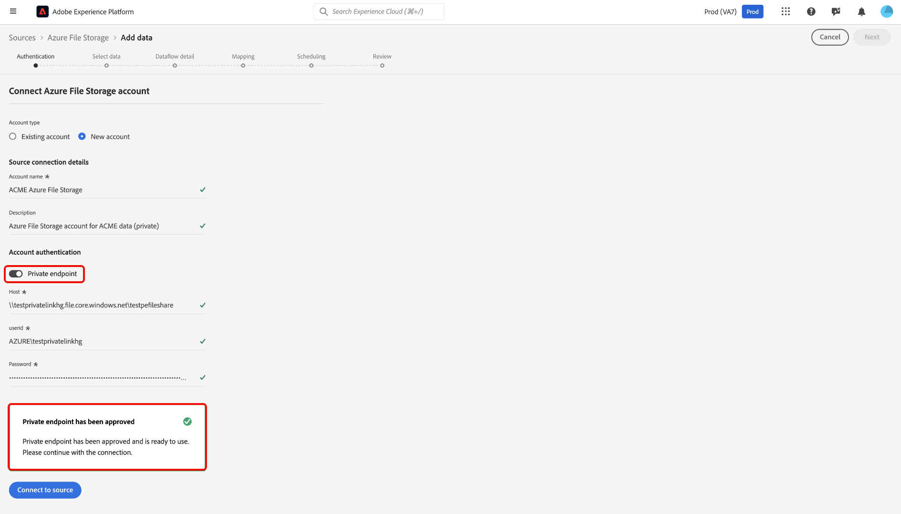

# UI でのソースに対する [!DNL Azure Private Link] の使用

>[!AVAILABILITY]
>
>この機能はベータ版で、現在、次のソースでのみサポートされています。
>
>* [[!DNL Azure Blob Storage]](../../connectors/cloud-storage/blob.md)
>* [[!DNL ADLS Gen2]](../../connectors/cloud-storage/adls-gen2.md)
>* [[!DNL Azure File Storage]](../../connectors/cloud-storage/azure-file-storage.md)
>* [[!DNL Snowflake]](../../connectors/databases/snowflake.md)

[!DNL Azure Private Link] 機能を使用して、Adobe Experience Platform ソースの接続先プライベートエンドポイントを作成できます。 プライベート IP アドレスを使用してソースを仮想ネットワークに安全に接続し、パブリック IP を不要にして、攻撃対象領域を削減します。複雑なファイアウォールやネットワーク アドレス翻訳設定を不要にして、ネットワークの設定を簡略化すると同時に、データ トラフィックが許可されたサービスのみに到達するようにします。

Experience Platform UI のソースワークスペースを使用してプライベートエンドポイントを作成し、使用する方法については、このガイドを参照してください。

## プライベートエンドポイントの作成

[!DNL Azure Private Link] の使用を開始するには、Experience Platform UI の *[!UICONTROL ソース]* カタログに移動し、ソースワークスペースのタブのメニューから **[!UICONTROL プライベートエンドポイント]** を選択します。

インターフェイスを使用して、ID、関連するソース、現在のステータスなど、既存のプライベートエンドポイントに関する情報を表示します。 新しいプライベートエンドポイントを作成するには、「**[!UICONTROL プライベートエンドポイントを作成]**」を選択します。

次に、目的のソースを選択し、次のプロパティの値を入力します。

| プロパティ | 説明 |
| --- | --- |
| `name` | プライベートエンドポイントの名前。 |
| `subscriptionId` | [!DNL Azure] サブスクリプションに関連付けられた ID。 詳しくは、[!DNL Azure] のガイド [ からサブスクリプションとテナント ID を取得する  [!DNL Azure Portal]](https://learn.microsoft.com/en-us/azure/azure-portal/get-subscription-tenant-id) を参照してください。 |
| `resourceGroupName` | [!DNL Azure] のリソースグループの名前。 リソースグループには、[!DNL Azure] ソリューションに関連するリソースが含まれています。 詳しくは、[!DNL Azure] リソースグループの管理 [ に関する ](https://learn.microsoft.com/en-us/azure/azure-resource-manager/management/manage-resource-groups-portal) ガイドを参照してください。 |
| `resourceGroup` | リソースの名前。 [!DNL Azure] えば、リソースとは、仮想マシン、Web アプリ、データベースなどのインスタンスを指します。 詳しくは、[!DNL Azure] リソースマネージャーについて [ に関する  [!DNL Azure]  ガイド ](https://learn.microsoft.com/en-us/azure/azure-resource-manager/management/overview) 参照してください。 |
| `fqdns` | ソースの完全修飾ドメイン名。 **メモ**：このプロパティは、[!DNL Snowflake] ソースを使用する場合にのみ必要です。 |

{style="table-layout:auto"}

終了したら、「**[!UICONTROL 送信]**」を選択します。

### プライベートエンドポイントの承認

新しく作成されたエンドポイントは、管理者が承認するまで保留状態のままになります。

[!DNL Azure Blob] および [!DNL Azure Data Lake Gen2] ソースに対するプライベートエンドポイントリクエストを承認するには、[!DNL Azure Portal] にログインします。 左側のナビゲーションで「**[!DNL Data storage]**」を選択し、「**[!DNL Security + networking]**」タブに移動して「**[!DNL Networking]**」を選択します。 次に、「**[!DNL Private endpoints]**」を選択して、お使いのアカウントに関連付けられているプライベートエンドポイントとその現在の接続状態のリストを表示します。 保留中のリクエストを承認するには、目的のエンドポイントを選択し、「**[!DNL Approve]**」をクリックします。

## プライベートエンドポイントを持つアカウントの作成

ソースカタログに移動して、プライベートエンドポイントをサポートするソースを選択します。 次に、ソースで新しいアカウントを作成し、アカウントの認証時に **[!UICONTROL プライベートエンドポイント]** 切り替えスイッチを選択します。 ソースの認証資格情報を入力し、「**[!UICONTROL ソースに接続]**」を選択します。接続が確立されるまで数分かかります。

>[!NOTE]
>
>「[!UICONTROL  プライベートエンドポイント ]」オプションが有効な場合、Experience Platformは選択したソースに承認済みのプライベートエンドポイントが存在するかどうかを確認します。 承認済みエンドポイントが見つからない場合は、接続を確立できません。

次に、ソースの [!UICONTROL  既存のアカウント ] インターフェイスに移動します。 このインターフェイスを使用して、既存のアカウントと対応するステータスのリストを表示します。 フィルターアイコン  を選択すると、プライベートエンドポイントとの接続が有効になっているアカウントのみを表示できます。

使用するアカウントを選択し、「**[!UICONTROL インタラクティブオーサリング]** を有効にします。 この切替スイッチは、接続のテスト、フォルダーリストの参照、データのプレビューを可能にする [!UICONTROL  機能である ] インタラクティブオーサリング [!DNL Azure] をアクティブにします。 プライベートエンドポイント接続には、[!UICONTROL  インタラクティブオーサリング ] を有効にする必要があります。 この切り替えは 60 分後に自動的に無効になるので、手動ではオフにできないことに注意してください。

[!UICONTROL  インタラクティブオーサリング ] を有効にするには数分かかります。 設定を有効にしたら、「**[!UICONTROL 次へ]**」を選択して次の手順に進み、取り込むデータを選択します。

## 次の手順

プライベートエンドポイントが正常に作成されたので、ソース接続とデータフローを作成し、プライベートエンドポイントを使用してデータを取り込むことができます。 UI でデータフローを作成する方法については、次のガイドを参照してください。

* [クラウドストレージソースのデータフローの作成](../ui/dataflow/batch/cloud-storage.md)
* [データベースソースのデータフローの作成](../ui/dataflow/databases.md)