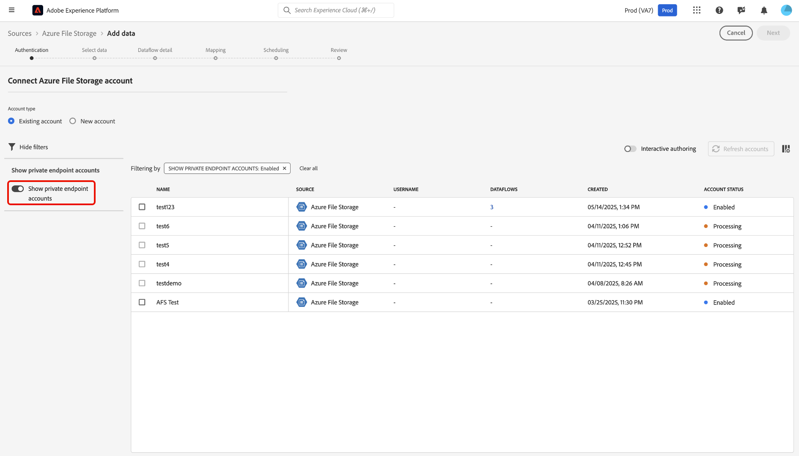
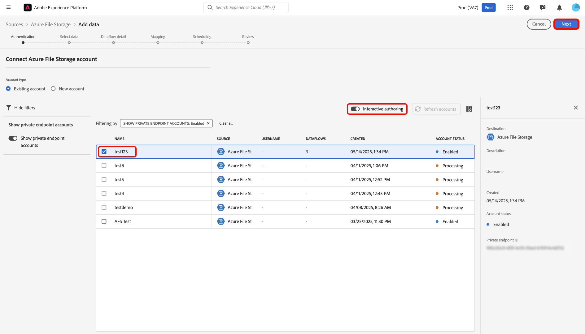

# UIでのソースのプライベートリンクのサポート

>[!AVAILABILITY]
>
>この機能は、次のソースでサポートされています。
>
>* [[!DNL Azure Blob Storage]](../../connectors/cloud-storage/blob.md)
>* [[!DNL ADLS Gen2]](../../connectors/cloud-storage/adls-gen2.md)
>* [[!DNL Azure File Storage]](../../connectors/cloud-storage/azure-file-storage.md)
>
>プライベートリンクサポートは、現在、Adobe Healthcare ShieldまたはAdobe Privacy &amp; Security Shieldを購入した組織のみが利用できます。

プライベートリンク機能を使用して、Adobe Experience Platform ソースを接続するためのプライベートエンドポイントを作成できます。 プライベート IP アドレスを使用してソースを仮想ネットワークに安全に接続することで、パブリック IPを必要とせず、攻撃対象も減らします。 複雑なファイアウォールやネットワークアドレス翻訳の設定を必要とせず、承認済みのサービスのみにデータトラフィックを配信することで、ネットワークの設定を簡素化できます。

このガイドでは、Experience Platform UIのソースワークスペースを使用して、プライベートエンドポイントを作成および使用する方法について説明します。

>[!BEGINSHADEBOX]

## プライベートリンクサポートのライセンス使用権限

ソースでのプライベートリンクのサポートに関するライセンス使用権限の指標は次のとおりです。

* お客様は、すべてのサンドボックスと組織で、サポートされているソース（[!DNL Azure Blob Storage]、[!DNL ADLS Gen2]、および[!DNL Azure File Storage]）を介して年間で最大2 TBのデータ転送を受ける権利があります。
* 各組織には、すべての実稼動サンドボックスに対して最大10個のエンドポイントを設定できます。
* 各組織には、すべての開発サンドボックスに対して最大1つのエンドポイントを設定できます。

>[!ENDSHADEBOX]

## プライベートエンドポイントの作成

プライベートリンクの使用を開始するには、Experience Platform UIの&#x200B;*[!UICONTROL Sources]* カタログに移動し、ソースワークスペースのタブのメニューから&#x200B;**[!UICONTROL Private endpoints]**&#x200B;を選択します。

インターフェイスを使用して、ID、関連するソース、現在のステータスなど、既存のプライベートエンドポイントに関する情報を表示します。 新しいプライベートエンドポイントを作成するには、**[!UICONTROL Create private endpoint]**&#x200B;を選択します。

次に、必要なソースを選択し、次のプロパティの値を入力します。

| プロパティ | 説明 |
| --- | --- |
| `name` | プライベートエンドポイントの名前。 |
| `subscriptionId` | [!DNL Azure] サブスクリプションに関連付けられているID。 詳しくは、[!DNL Azure][からサブスクリプション IDとテナント IDを [!DNL Azure Portal]取得する方法に関する](https://learn.microsoft.com/en-us/azure/azure-portal/get-subscription-tenant-id) ガイドを参照してください。 |
| `resourceGroupName` | [!DNL Azure]のリソースグループの名前。 リソースグループには、[!DNL Azure] ソリューションの関連リソースが含まれています。 詳しくは、[!DNL Azure] リソースグループの管理[に関する](https://learn.microsoft.com/en-us/azure/azure-resource-manager/management/manage-resource-groups-portal) ガイドを参照してください。 |
| `resourceGroup` | リソースの名前。 [!DNL Azure]では、リソースとは、仮想マシン、web アプリ、データベースなどのインスタンスを指します。 詳しくは、[!DNL Azure] リソースマネージャー[について [!DNL Azure] に関する](https://learn.microsoft.com/en-us/azure/azure-resource-manager/management/overview) ガイドを参照してください。 |

{style="table-layout:auto"}

終了したら「**[!UICONTROL Submit]**」を選択します。

### プライベートエンドポイントの承認

新しく作成されたエンドポイントは、管理者によって承認されるまで、保留状態のままになります。

[!DNL Azure Blob]および[!DNL Azure Data Lake Gen2] ソースに対するプライベート エンドポイント要求を承認するには、[!DNL Azure Portal]にログインします。 左側のナビゲーションで「**[!DNL Data storage]**」を選択し、「**[!DNL Security + networking]**」タブに移動して「**[!DNL Networking]**」を選択します。 次に、**[!DNL Private endpoints]**&#x200B;を選択して、アカウントに関連付けられているプライベートエンドポイントと現在の接続状態のリストを表示します。 保留中のリクエストを承認するには、目的のエンドポイントを選択し、**[!DNL Approve]**&#x200B;をクリックします。

## プライベートエンドポイントを使用したアカウントの作成

ソースカタログに移動し、プライベートエンドポイントをサポートするソースを選択します。 次に、ソースで新しいアカウントを作成し、アカウント認証中に&#x200B;**[!UICONTROL Private endpoint]**&#x200B;切り替えを選択します。 ソースの認証情報を指定し、**[!UICONTROL Connect to source]**&#x200B;接続を確立するために数分許可を選択します。

>[!NOTE]
>
>「[!UICONTROL Private endpoint]」オプションが有効になっている場合、Experience Platformは、選択したソースに承認済みのプライベートエンドポイントが存在するかどうかを確認します。 承認されたエンドポイントが見つからない場合は、接続を確立できません。

次に、ソースの[!UICONTROL Existing account] インターフェイスに移動します。 このインターフェイスを使用して、既存のアカウントと対応するステータスのリストを表示します。 フィルターアイコン を選択すると、プライベートエンドポイントとの接続が有効になっているアカウントのみを表示できます。

使用するアカウントを選択し、**[!UICONTROL Interactive Authoring]**&#x200B;を有効にします。 この切り替えにより、接続をテストし、フォルダーリストを参照し、データをプレビューできる[!UICONTROL Interactive Authoring]機能である[!DNL Azure]がアクティブになります。 プライベート エンドポイント接続には[!UICONTROL Interactive Authoring]を有効にする必要があります。 このトグルを手動でオフにすることはできません。60分後に自動的にオフになります。

[!UICONTROL Interactive Authoring]を有効にするには数分かかります。 設定が有効になったら、**[!UICONTROL Next]**&#x200B;を選択して次の手順に進み、取り込むデータを選択します。

## 次の手順

これで、プライベートエンドポイントを正常に作成できたので、ソース接続とデータフローを作成し、プライベートエンドポイントを使用してデータを取り込むことができます。 UIでのデータフローの作成方法について詳しくは、次のガイドを参照してください。

* [クラウドストレージソースのデータフローの作成](../ui/dataflow/batch/cloud-storage.md)
* [データベースソースのデータフローの作成](../ui/dataflow/databases.md)
