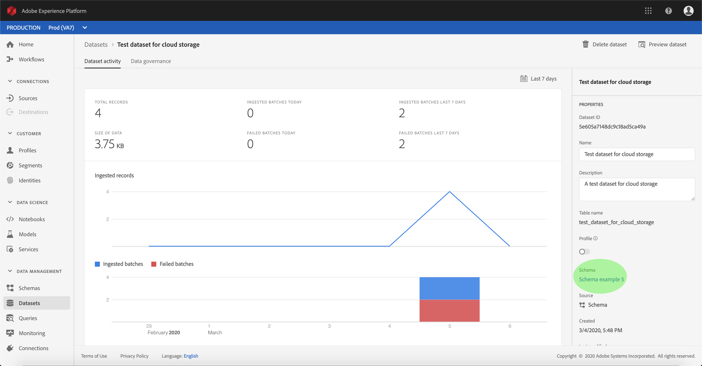
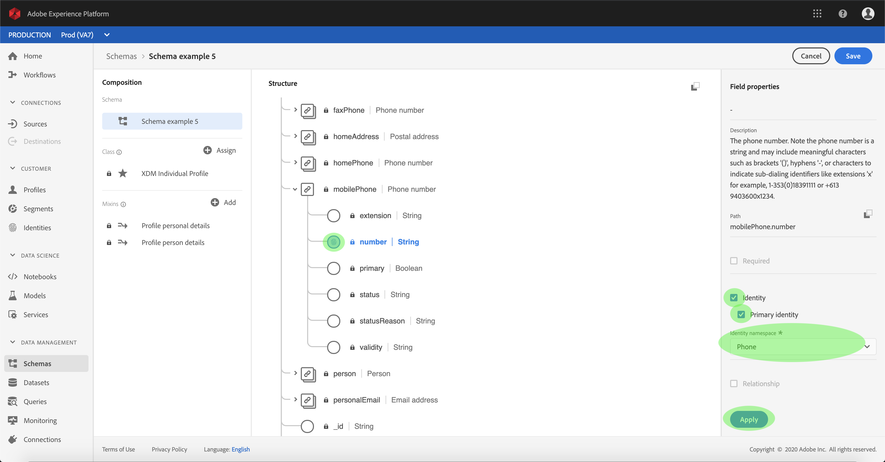

# インバウンドソースデータをアクティブ化して顧客プロファイル

ソースコネクタからの受信データは、リアルタイム顧客データを豊富にし、埋め込むために使用できます。プロファイルは、

## はじめに

このチュートリアルでは、Adobe Experience Platformの次のコンポーネントについて、十分な理解を得る必要があります。

- [Experience Data Model(XDM)System](../../../xdm/home.md):エクスペリエンスプラットフォームが顧客エクスペリエンスデータを整理するための標準化されたフレームワーク。
   - [スキーマ構成の基本](../../../xdm/schema/composition.md):XDMスキーマの基本的な構成要素について説明します。この中には、主な原則や構成のベストプラクティスが含まれています。スキーマ構成の基本要素です。
   - [スキーマエディタのチュートリアル](../../../xdm/tutorials/create-schema-ui.md):カスタムスキーマを作成する方法についてスキーマエディターのUI。
- [リアルタイム顧客プロファイル](../../../profile/home.md):複数のソースからの集計データに基づいて、統合されたリアルタイムのプロファイルを顧客に提供します。

また、このチュートリアルでは、ソースコネクタを既に作成し、設定している必要があります。  UIで異なるコネクタを作成するためのチュートリアルのリストは、ソースコネクタの概要 [を参照してください](../../home.md)。

## リアルタイム顧客データの入力プロファイル

顧客のプロファイルを強化するには、ターゲットデータセットのソーススキーマがリアルタイム顧客プロファイルでの使用に対応している必要があります。 互換性のあるスキーマは、次の要件を満たします。

- スキーマに、identityプロパティとして指定された属性が1つ以上あります。
- スキーマには、プライマリIDとして定義されたIDプロパティがあります。
- データフロー内のマッピングは、プライマリIDがターゲット属性です。

「ソース」ワークスペース内で、「参照」タブを **クリックし** 、ベース接続をリストします。 表示されたリストで、データを入力するデータフローを含むプロファイルを探します。 接続の名前をクリックして、詳細を表示します。

接続のソースアクティビティ画面が *表示され* 、接続がソースデータを取り込むデータセットが表示されます。 プロファイルを有効にするデータセットの名前をクリックします。

データセッ *トアクティビティ* 画面が表示されます。 画面の *右側の***** 「プロパティ」列には、データセットの詳細が表示され、プロファイルスイッチと、データセットが対応するスキーマへのリンクが含まれます。 構成を表示するスキーマの名前をクリックします。

[ *スキーマ* エディタ]が表示され、中央のキャンバスにスキーマの構造が表示されます。 キャンバス内で、プライマリIDとして設定するフィールドを選択します。 表示される「 *Field properties* 」タブで、「 **Identity** 」チェックボックスを選択し、「 **Primary identity**」を選択します。 最後に、適切なID名前空間を **選択し**、「 **Apply**」をクリックします。

構造の最上位オブジェクトをクリックすると、スキーマの「 *スキーマプロパティ* 」列が表示されます。 スキーマスイッチを切り替えてプロファイル用の **プロファイル** を有効にします。 「保存」 **をクリックし** 、変更を確定します。

スキーマのプロファイルが有効になったら、データセットのアクティビティ *画面に戻り、「プロパティ」列の「* プロファイル **」切り替えをクリックして、プロファイルのデータセットを有効** にします ** 。

データセットとスキーマセットの両方をプロファイル可能にすると、そのデータセットに取り込まれたデータも顧客のプロファイルに反映されます。

>[!NOTE] 最近有効にしたデータセット内の既存のデータは、プロファイル

## 次の手順

このチュートリアルに従うと、プロファイル母集団の受信データを有効にします。 詳しくは、リアルタイム顧客 [プロファイルの概要](../../../profile/home.md)。