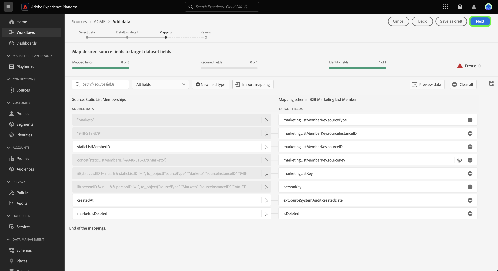

# UI のテンプレートを使用してソースのデータフローを作成する {#create-a-sources-dataflow-using-templates-in-the-ui}

>[!CONTEXTUALHELP]
>id="platform_sources_marketo_mapping"
>title="Platform UI のソース用テンプレート"
>abstract="テンプレートには、ソースから Experience Platform にデータを取り込む際に使用できる、スキーマ、データセット、ID、マッピングルール、ID 名前空間およびデータフローなどの自動生成されたアセットが含まれます。自動生成されたアセットを更新して、ユースケースに合わせてカスタマイズできます。"

>[!IMPORTANT]
>
>テンプレートはベータ版で、次のソースでサポートされています。
>
>* [[!DNL Marketo Engage]](../../connectors/adobe-applications/marketo/marketo.md)
>* [[!DNL Microsoft Dynamics]](../../connectors/crm/ms-dynamics.md)
>* [[!DNL Salesforce]](../../connectors/crm/salesforce.md)
>
>ドキュメントと機能は変更される場合があります。

Adobe Experience Platform には、データ取り込みプロセスを高速化するために使用できる、事前設定済みのテンプレートが用意されています。テンプレートには、ソースから Experience Platform にデータを取り込む際に使用できる、スキーマ、データセット、ID、マッピングルール、ID 名前空間およびデータフローなどの自動生成されたアセットが含まれます。

テンプレートを使用すると、次のことができます。

* テンプレート化されたアセットの作成を高速化することで、取り込みの価値創出までの時間を短縮します。
* 手動データ取り込みプロセス中に発生する可能性のあるエラーを最小限に抑えます。
* ユースケースに合わせて、自動生成されたアセットを随時更新します。

次のチュートリアルでは、Platform UI でテンプレートを使用する手順を説明します。

## はじめに

このチュートリアルは、 Experience Platform の次のコンポーネントを実際に利用および理解しているユーザーを対象としています。

* [ソース](../../home.md)：Experience Platform を使用すると、データを様々なソースから取得しながら、Platform サービスを使用して受信データの構造化、ラベル付け、拡張を行うことができます。
* [[!DNL Experience Data Model (XDM)] システム](../../../xdm/home.md)：Experience Platform が顧客体験データを整理する際に使用する標準化されたフレームワーク。
* [サンドボックス](../../../sandboxes/home.md)：Experience Platform には、単一の Platform インスタンスを別々の仮想環境に分割し、デジタルエクスペリエンスアプリケーションの開発と発展に役立つ仮想サンドボックスが用意されています。

## Platform UI でテンプレートを使用する {#use-templates-in-the-platform-ui}

>[!CONTEXTUALHELP]
>id="platform_sources_templates_accounttype"
>title="ビジネスタイプを選択する"
>abstract="ユースケースに適したビジネスタイプを選択します。アクセス権は、Real-time Customer Data Platform サブスクリプションアカウントによって異なる場合があります。"
>additional-url="https://experienceleague.adobe.com/docs/experience-platform/rtcdp/overview.html?lang=ja" text="Real-time CDP の概要"

Platform UI で、「 」を選択します。 **[!UICONTROL ソース]** 左側のナビゲーションから、 [!UICONTROL ソース] workspace を参照し、Experience Platformで使用可能なソースのカタログを確認します。

以下を使用します。 *[!UICONTROL カテゴリ]* メニューを使用して、ソースをカテゴリでフィルタリングできます。 または、検索バーにソース名を入力して、カタログから特定のソースを検索します。

次に移動： [!UICONTROL Adobe] 表示するカテゴリ [!DNL Marketo Engage] ソースカードを選択し、 [!UICONTROL データを追加] をクリックして開始します。

ポップアップウィンドウが表示され、テンプレートを参照するか、既存のスキーマおよびデータセットを使用するかを選択できます。

* **テンプレートを参照**：ソーステンプレートは、マッピングルールを使用して、スキーマ、ID、データセットおよびデータフローを自動作成します。必要に応じて、これらのアセットをカスタマイズできます。
* **既存のアセットを使用**：作成した既存のデータセットとスキーマを使用して、データを取り込みます。必要に応じて、新しいデータセットやスキーマも作成できます。

自動生成されたアセットを使用するには、「**[!UICONTROL テンプレートを参照]**」、「**[!UICONTROL 選択]**」の順に選択します。

### 認証

認証手順が表示され、新しいアカウントを作成するか、既存のアカウントを使用するかを尋ねられます。

>[!BEGINTABS]

>[!TAB 既存のアカウントを使用]

既存のアカウントを使用するには、「[!UICONTROL 既存のアカウント]」を選択し、表示されるリストから使用するアカウントを選択します。

>[!TAB 新しいアカウントを作成]

新しいアカウントを作成するには、「**[!UICONTROL 新しいアカウント]**」を選択し、ソース接続の詳細とアカウント認証資格情報を入力します。終了したら、「**[!UICONTROL ソースに接続]**」を選択し、新しい接続が確立されるまでしばらく待ちます。

>[!ENDTABS]

### テンプレートを選択する

アカウントが認証された状態で、データフローに使用するテンプレートを選択できるようになりました。

+++[!DNL Marketo Engage] templates 次の表に、 [!DNL Marketo Engage] ソース。

| [!DNL Marketo Engage] テンプレート | 説明 |
| --- | --- |
| アクティビティ | アクティビティテンプレートは、電子メールインタラクション、Web サイトでのインタラクション、販売呼び出しなど、アクティビティのイベントベースのスナップショットをキャプチャします。 |
| 会社 | 会社テンプレートは、会社の企業情報、場所、請求情報などのビジネスアカウントの詳細をキャプチャします。 |
| 指定顧客 | 重点顧客テンプレートは、追跡するターゲットアカウントとして決定されたアカウントの詳細をキャプチャします。 |
| 商談 | 商談テンプレートは、タイプ、販売ステージ、関連するアカウントなどのビジネス商談の詳細をキャプチャします。 |
| オポチュニティ連絡先の役割 | 商談連絡先ロールテンプレートは、特定の商談に関連付けられたリードの役割に関する詳細をキャプチャします。 |
| ユーザー | 人物テンプレートは、人口統計の詳細、連絡先情報、同意設定など、個々の人物の属性をキャプチャします。 |
| プログラムメンバーシップ | プログラムメンバーシップテンプレートは、ビジネスキャンペーンに関連付けられた連絡先の詳細をキャプチャし、育成ケイデンスと連絡先の応答を含めます。 |
| プログラム | プログラムテンプレートは、ステータス、チャネル、タイムライン、コストなどのビジネスキャンペーンの詳細をキャプチャします。 |
| 静的リストメンバーシップ | 静的リストメンバーシップテンプレートは、静的リスト内のユーザーとそのメンバーシップとの関係をキャプチャします。 |
| 静的リスト | 静的リストテンプレートは、特定の使用例向けに、インスタンス化されたリストの人物のリストを取り込みます。 |

{style="table-layout:auto"}

+++

+++[!DNL Salesforce] B2B テンプレート次の表に、 [!DNL Salesforce] ソース。

| [!DNL Salesforce] B2B テンプレート | 説明 |
| --- | --- |
| アカウント連絡先関係 | アカウント連絡先関係テンプレートは、連絡先と 1 つ以上のアカウントとの関係をキャプチャします。 |
| アカウント | アカウントテンプレートは、企業の企業情報、場所、請求情報などのビジネスアカウントの詳細をキャプチャします。 |
| キャンペーンメンバー | キャンペーンメンバーテンプレートは、個々のリードまたは連絡先と特定のリードとの関係をキャプチャします [!DNL Salesforce] キャンペーン。 |
| キャンペーン | キャンペーンテンプレートは、会社の企業情報、場所、請求情報など、ビジネスアカウントの詳細をキャプチャします。 |
| 連絡先 | 連絡先テンプレートは、人口統計の詳細、連絡先情報、関連事業体など、連絡先の属性をキャプチャします。 |
| リード数 | リードテンプレートは、リードの属性（人口統計の詳細、連絡先情報、関連事業体など）をキャプチャします。 |
| 商談 | 商談テンプレートは、タイプ、販売ステージ、関連するアカウントなどのビジネスオポチュニティの詳細をキャプチャします。 |
| オポチュニティ連絡先の役割 | 商談連絡先ロールテンプレートは、特定の商談に関連付けられたリードの役割に関する詳細をキャプチャします。 |

{style="table-layout:auto"}

+++

+++[!DNL Salesforce] B2C テンプレート次の表に、 [!DNL Salesforce] ソース。

| [!DNL Salesforce] B2C テンプレート | 説明 |
| --- | --- |
| 連絡先 | 連絡先テンプレートは、人口統計の詳細、連絡先情報、関連事業体など、連絡先の属性をキャプチャします。 |
| リード | リードテンプレートは、リードの属性（人口統計の詳細、連絡先情報、関連ビジネスエンティティなど）をキャプチャします。 |

{style="table-layout:auto"}

+++

+++[!DNL Microsoft Dynamics] B2B テンプレート次の表に、 [!DNL Microsoft Dynamics] ソース。

| [!DNL Microsoft Dynamics] B2B テンプレート | 説明 |
| --- | --- |
| アカウント | アカウントテンプレートは、企業の企業情報、場所、請求情報などのビジネスアカウントの詳細をキャプチャします。 |
| キャンペーン | キャンペーンテンプレートは、会社の企業情報、場所、請求情報など、ビジネスアカウントの詳細をキャプチャします。 |
| 連絡先 | 連絡先テンプレートは、人口統計の詳細、連絡先情報、関連事業体など、連絡先の属性をキャプチャします。 |
| リード数 | リードテンプレートは、リードの属性（人口統計の詳細、連絡先情報、関連事業体など）をキャプチャします。 |
| マーケティングリスト | マーケティングリストテンプレートは、マーケティングキャンペーンやその他の販売目的で作成された既存または潜在的な顧客のグループをキャプチャします。 |
| マーケティングリストメンバー | マーケティングリストメンバーは、リード、アカウント、連絡先など、1 つのタイプの顧客レコードの詳細をマーケティングリストにキャプチャします。 |
| 商談 | 商談テンプレートは、タイプ、販売ステージ、関連するアカウントなどのビジネスオポチュニティの詳細をキャプチャします。 |
| オポチュニティ連絡先の役割 | 商談連絡先ロールテンプレートは、特定の商談に関連付けられたリードの役割に関する詳細をキャプチャします。 |

{style="table-layout:auto"}

+++

+++[!DNL Microsoft Dynamics] B2C テンプレート次の表に、 [!DNL Microsoft Dynamics] ソース。

| [!DNL Microsoft Dynamics] B2C テンプレート | 説明 |
| --- | --- |
| 連絡先 | 連絡先テンプレートは、人口統計の詳細、連絡先情報、関連事業体など、連絡先の属性をキャプチャします。 |
| リード | リードテンプレートは、リードの属性（人口統計の詳細、連絡先情報、関連ビジネスエンティティなど）をキャプチャします。 |

{style="table-layout:auto"}

+++

選択したビジネスタイプに応じて、テンプレートのリストが表示されます。 プレビューアイコンを選択  をクリックして、テンプレート名の横にあるサンプルデータをプレビューします。

プレビューウィンドウが表示され、テンプレートからサンプルデータを調べたり、確認することができます。終了したら、「**[!UICONTROL 了解]**」を選択します。

次に、リストから使用するテンプレートを選択します。複数のテンプレートを選択し、一度に複数のデータフローを作成できます。ただし、テンプレートはアカウントにつき 1 回だけ使用できます。テンプレートを選択したら、「**[!UICONTROL 終了]**」を選択し、アセットが生成されるまでしばらく待ちます。

使用可能なテンプレートのリストから 1 つまたは一部の項目を選択した場合でも、すべての B2B スキーマと ID 名前空間が生成され、スキーマ間の B2B の関係が正しく設定されます。

>[!NOTE]
>
>既に使用されているテンプレートは、選択できなくなります。

### スケジュールを設定

The [!DNL Microsoft Dynamics] そして [!DNL Salesforce] ソースはどちらもスケジューリングデータフローをサポートしています。

スケジューリングインターフェイスを使用して、データフローの取り込みスケジュールを設定します。 取り込み頻度をに設定します。 **1 回** :1 回限りの取り込みを作成します。

または、取り込み頻度を **分**, **時間**, **日**&#x200B;または **週**. データフローを複数の取り込み用にスケジュールする場合は、取り込みのたびに時間枠を設定する間隔を設定する必要があります。 例えば、取り込み頻度を **時間** そして、次の間隔が **15** とは、データフローが **15 時間**.

この手順の間に、 **バックフィル** およびは、データを増分的に取り込むための列を定義します。 バックフィルは、履歴データを取り込むために使用されます。一方、増分取り込み用に定義する列では、新しいデータを既存のデータと区別することができます。

取り込みスケジュールの設定が完了したら、「 」を選択します。 **[!UICONTROL 完了]**.

### アセットのレビュー {#review-assets}

>[!CONTEXTUALHELP]
>id="platform_sources_templates_review"
>title="自動生成されたアセットのレビュー"
>abstract="すべてのアセットを生成するには最大 5 分かかる場合があります。 ページを離れる場合は、アセットが完了したら戻るように促す通知を受け取ります。アセットの生成後に確認し、いつでもデータフローに追加の設定を行うことができます。"

[!UICONTROL テンプレートアセットのレビュー]ページには、テンプレートの一部として自動生成されたアセットが表示されます。 このページでは、ソース接続に関連付けられた自動生成スキーマ、データセット、ID 名前空間、データフローを確認できます。 すべてのアセットを生成するには最大 5 分かかる場合があります。 ページを離れる場合は、アセットが完了したら戻るように促す通知を受け取ります。アセットの生成後に確認し、いつでもデータフローに追加の設定を行うことができます。

デフォルトでは、自動生成されたデータフローはドラフト状態に設定され、マッピングルールやスケジュールされた頻度など、設定をさらにカスタマイズできます。 省略記号 (`...`) をクリックし、「 」を選択します。 **[!UICONTROL マッピングをプレビュー]** を参照して、ドラフトデータフロー用に作成されたマッピングセットを確認します。

プレビューページが表示され、ソースデータフィールドとターゲットスキーマフィールドの間のマッピング関係を調べることができます。 データフローのマッピングを表示したら、 「**[!UICONTROL 了解]**」を選択します。

データフローは、実行後いつでも更新できます。 データフロー名の横にある省略記号（`...`）をクリックし、「**[!UICONTROL データフローを更新]**」を選択します。  ソースワークフローページに移動します。このページでは、部分取り込み、エラー診断、アラート通知の設定、データフローのマッピングなど、データフローの詳細を更新できます。

スキーマエディタービューを使用して、自動生成されたスキーマを更新することができます。 詳しくは、[スキーマエディターの使用](../../../xdm/tutorials/create-schema-ui.md)に関するガイドを参照してください。

>[!TIP]
>
>ドラフトデータフローには、 [!UICONTROL データフロー] ソースワークスペースのカタログページ 選択 **[!UICONTROL データフロー]** 上部のヘッダーから、更新するデータフローをリストから選択します。
>
>

### データフローを公開する

ソースワークフローを実行して、公開プロセスを開始します。 次を選択した後： [!UICONTROL データフローを更新]に設定されている場合、 *[!UICONTROL データを追加]* ワークフローのステップ。 「**[!UICONTROL 次へ]**」を選択して次に進みます。

次に、データフローの詳細を確認し、エラー診断、部分取り込み、アラート通知の設定を構成します。 終了したら、「**[!UICONTROL 次へ]**」を選択します。

>[!NOTE]
>
>次の項目を選択できます。 **[!UICONTROL ドラフトとして保存]** データフローに加えた変更を停止して保存するための任意の時点。

マッピング手順が表示されます。 この手順の間に、データフローのマッピング設定を再設定できます。 マッピングに使用されるデータ準備関数の包括的なガイドについては、 [data prep UI ガイド](../../../data-prep/ui/mapping.md).

最後に、データフローの詳細を確認し、「 」を選択します。 **[!UICONTROL 保存して取り込み]** 下書きを公開するには、以下を実行します。

## 次の手順

このチュートリアルに従って、データフローと、テンプレートを使用したスキーマ、データセット、ID 名前空間などのアセットを作成しました。 ソースに関する一般的な情報については、[ソースの概要](../../home.md)を参照してください。

## アラートと通知 {#alerts-and-notifications}

テンプレートはAdobe Experience Platform Alerts でサポートされており、通知パネルを使用して、アセットのステータスの更新を受け取ったり、レビューページに戻ったりすることができます。

Platform UI の上部ヘッダーにある通知アイコンを選択し、ステータスアラートを選択して、確認するアセットを表示します。

テンプレートのアラート設定を更新して、データフローのステータスに関する電子メール通知と Platform 内通知の両方を受け取ることができます。 アラートの設定の詳細については、 [ソースデータフローのアラートをサブスクライブする方法](../ui/alerts.md).