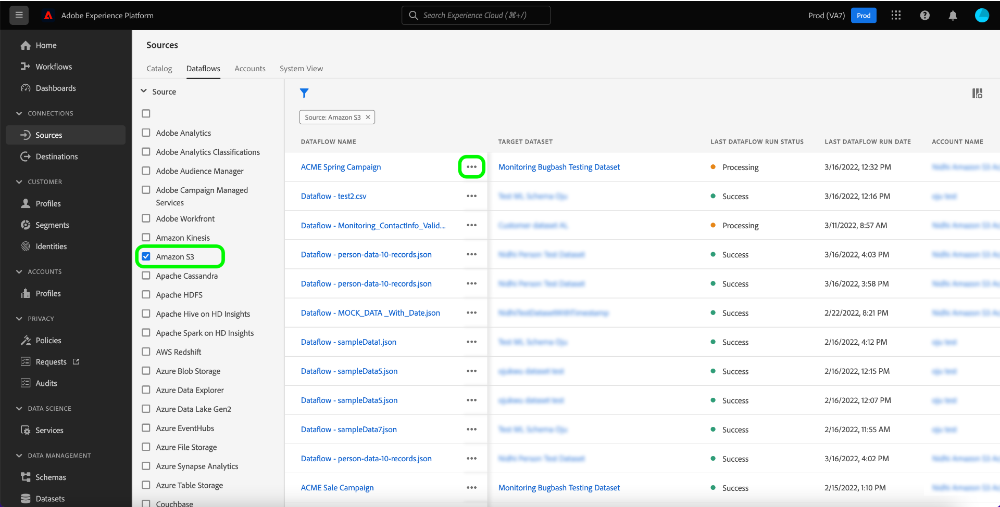
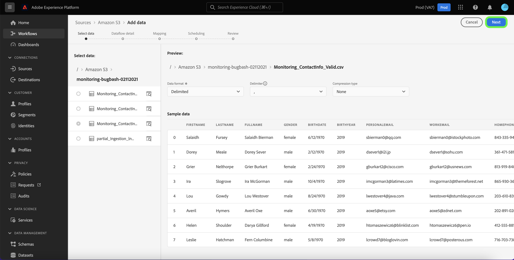
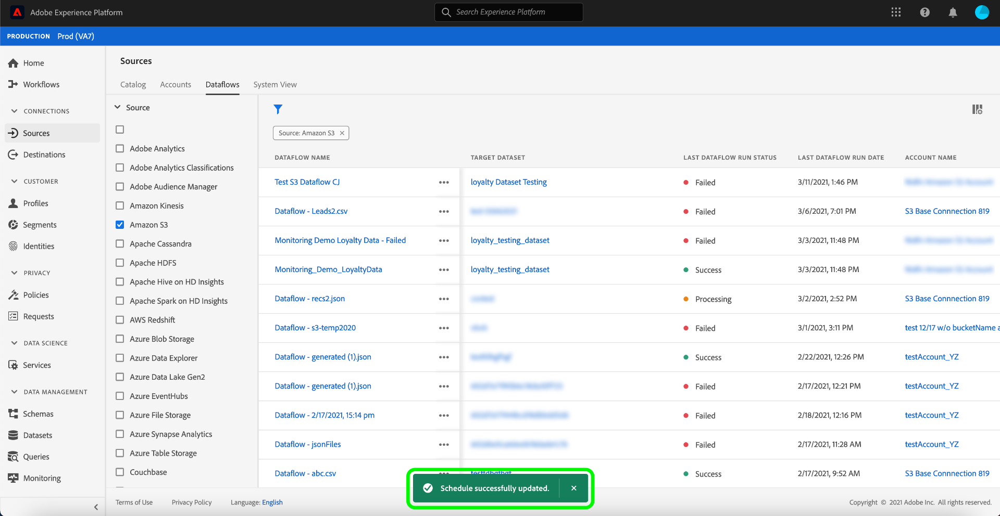

# UI でのデータフローの更新

このチュートリアルでは、[!UICONTROL Sources] ワークスペースを使用したデータフロースケジュールの編集やマッピングの情報など、既存のソースデータフローを更新する手順を説明します。

## はじめに

このチュートリアルは、Adobe Experience Platform の次のコンポーネントを実際に利用および理解しているユーザーを対象としています。

- [ソース](../../home.md):Experience Platformを使用すると、様々なソースからデータを取り込みながら、Platform サービスを使用して、受信データの構造化、ラベル付け、拡張をおこなうことができます。
- [サンドボックス](../../../sandboxes/home.md)：Experience Platform は、単一の Platform インスタンスを別々の仮想環境に分割して、デジタルエクスペリエンスアプリケーションの開発と発展を支援する仮想サンドボックスを提供します。

## マッピングの編集

>[!NOTE]
>
>次のソースでは、マッピング編集機能は現在サポートされていません。Adobe Analytics、Adobe Audience Manager、HTTP API、および [!DNL Marketo Engage]。

Platform UI で、左のナビゲーションから「 **[!UICONTROL ソース]** 」を選択して、「 [!UICONTROL  ソース ] 」ワークスペースにアクセスします。 上部のヘッダーから **[!UICONTROL Dataflows]** を選択して、既存のデータフローのリストを表示します。

[!UICONTROL  データフロー ] ページには、実行ステータス、最終実行日、アカウント名に関する情報を含む、既存のすべてのデータフローのリストが含まれます。

左上のフィルターアイコン  を選択して、並べ替えパネルを起動します。

並べ替えパネルには、使用可能なすべてのソースのリストが表示されます。 リストから複数のソースを選択して、異なるソースに属するデータフローのフィルタ選択にアクセスできます。

既存のデータフローのリストを表示するために使用するソースを選択します。 更新するデータフローを特定したら、アカウント名の横にある省略記号 (`...`) を選択します。

ドロップダウンメニューが表示され、選択したデータフローを更新するオプションが表示されます。 ここから、データフローのマッピングセットおよび取得スケジュールを更新できます。 また、監視ダッシュボードでデータフローを調べるオプションや、データフローを無効または削除するオプションを選択することもできます。

「**[!UICONTROL ソースを編集]**」を選択して、マッピングを更新します。

「[!UICONTROL データ追加]」手順が表示されます。適切なデータ形式を選択して選択したデータの内容を確認し、「**[!UICONTROL 次へ]**」を選択して次に進みます。

[!UICONTROL  マッピング ] ページには、データセットに関連付けられたマッピングセットを追加および削除できるインターフェイスが用意されています。

>[!TIP]
>
>マッピング更新は、将来スケジュールされたデータフロー実行にのみ適用されます。

「**[!UICONTROL 新しいマッピングを追加]**」を選択して、新しいマッピングセットを追加します。

次に、適切なソースフィールド属性とターゲット XDM フィールド値を入力して、追加のマッピングセットを完了します。 「**[!UICONTROL 次へ]**」を選択して次に進みます。

「[!UICONTROL  スケジュール ]」手順が表示され、データフローの取り込みスケジュールを更新し、選択したソースデータを更新したマッピングで自動的に取り込むことができます。

>[!NOTE]
>
>1 回限りの取り込みと開始時間が過去のデータフローのマッピングセットは更新できません。

[!UICONTROL  データフローの詳細 ] ページで、データフローの更新された名前と説明を指定し、データフローのエラーしきい値を再設定できます。

更新した値を指定したら、「**[!UICONTROL 次へ]**」を選択します。

**[!UICONTROL レビュー]** 手順が表示され、更新前にデータフローを確認できます。

データフローをレビューしたら、「**[!UICONTROL Finish]**」を選択し、新しいマッピングセットを作成してデータフローを作成する時間を設定します。

## スケジュールを編集

既存のデータフローの取り込みスケジュールを編集するには、データフロー名の横にある省略記号 (`...`) を選択し、ドロップダウンメニューから「**[!UICONTROL スケジュールを編集]**」を選択します。

「**[!UICONTROL スケジュールを編集]**」ダイアログ・ボックスには、データフローの取得頻度と間隔率を更新するオプションが表示されます。 更新した頻度と間隔の値を設定したら、「**[!UICONTROL 保存]**」を選択します。

>[!NOTE]
>
>1 回限りの取り込み用にスケジュールされたデータフローを再スケジュールすることはできません。

| スケジュール設定 | 説明 |
| ---------- | ----------- |
| 頻度 | データフローがデータを収集する頻度。 既存のデータフローの頻度スケジュールを編集する際に指定できる値は次のとおりです。`minute`、`hour`、`day`、または `week`。 |
| 間隔 | この間隔は、2 つの連続したフロー実行の間隔を指定します。 間隔の値はゼロ以外の整数で、`15` 以上である必要があります。 |

しばらくすると、更新が正常に完了したことを確認する確認ボックスが画面の下部に表示されます。

## 次の手順

このチュートリアルでは、[!UICONTROL Sources] ワークスペースを使用して、データフローの取り込みスケジュールとマッピングセットを更新しました。

[!DNL Flow Service] API を使用してこれらの操作をプログラムで実行する手順については、[ フローサービス API](../../tutorials/api/update-dataflows.md) を使用したデータフローの更新に関するチュートリアルを参照してください。
