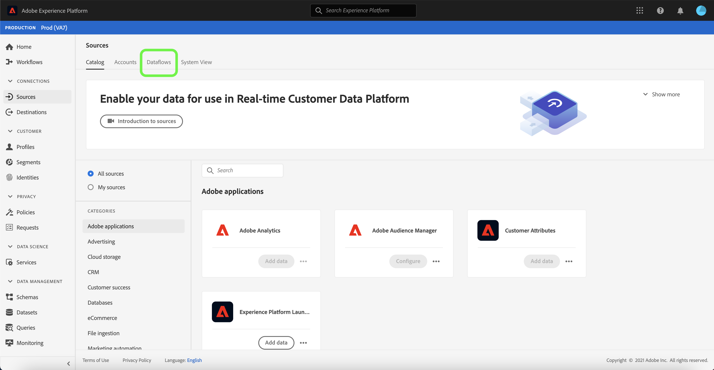
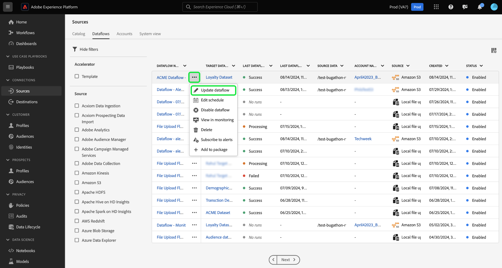
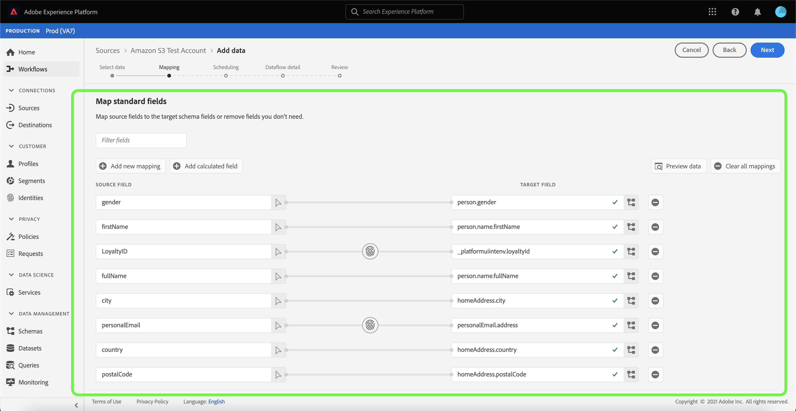
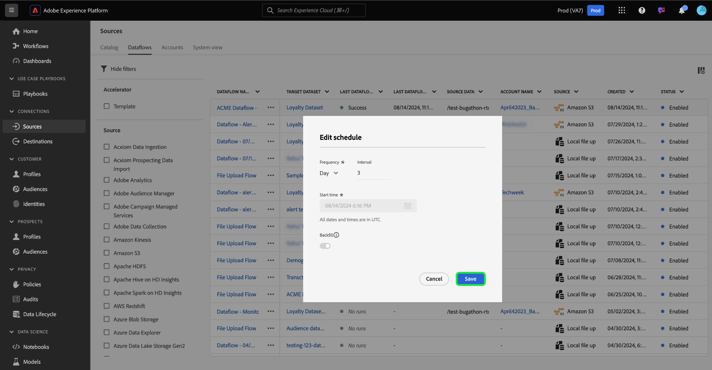
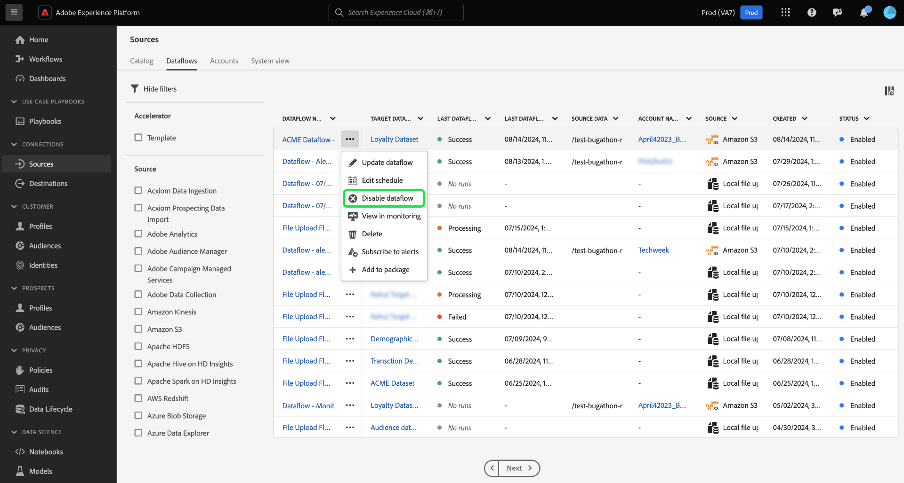
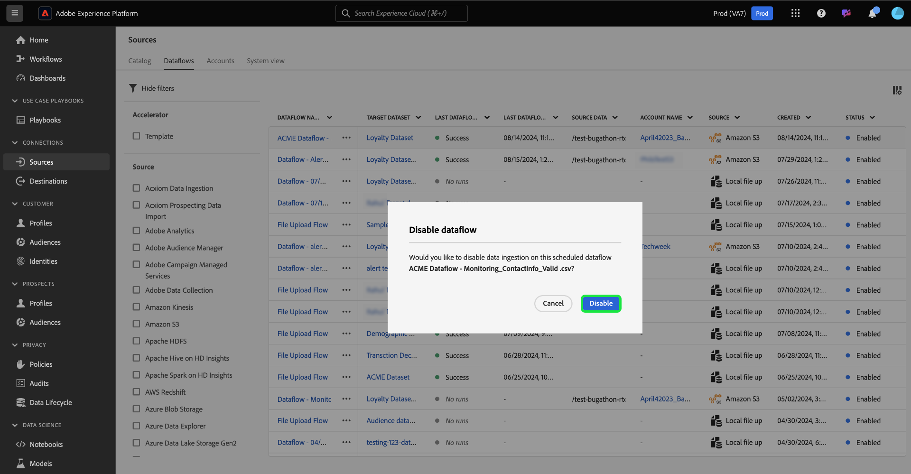

# UIでのデータフローの更新

Adobe Experience Platform ユーザーインターフェイスのソースワークスペースを使用して、スケジュール設定やマッピング設定など、既存のデータフローを更新する手順については、このチュートリアルを参照してください。

## 基本を学ぶ

このチュートリアルは、 Experience Platform の次のコンポーネントを実際に利用および理解しているユーザーを対象としています。

* [&#x200B; ソース &#x200B;](../../home.md): Experience Platformを使用すると、様々なソースからデータを取り込むことができますが、Experience Platform サービスを使用して着信データを構造化、ラベル付け、強化することができます。
* [&#x200B; サンドボックス &#x200B;](../../../sandboxes/home.md): Experience Platformは、1つのExperience Platform インスタンスを個別のバーチャル環境に分割して、デジタルエクスペリエンスアプリケーションの開発と進化に役立つバーチャルサンドボックスを提供します。

## データフローの更新 {#update-dataflows}

>[!CONTEXTUALHELP]
>id="platform_sources_dataflows_daysRemaining"
>title="データセットの有効期限"
>abstract="この列は、ターゲットデータセットが自動的に期限切れになるまでの残り日数を示します。 ターゲットデータセットの有効期限が切れると、データフローは失敗します。 データフローが失敗しないようにするには、ターゲットデータセットが正しい日付に期限切れになるように設定されていることを確認します。 有効期限を更新する方法については、ドキュメントを参照してください。"

Experience Platform UIで、左側のナビゲーションから「**[!UICONTROL Sources]**」を選択し、上部のヘッダーから「**[!UICONTROL Dataflows]**」を選択します。

>[!TIP]
>
>フィルタリング機能を使用して、データフローを並べ替え、フィルタリングできます。 詳しくは、[UIでのソースオブジェクトのフィルタリングに関するガイド &#x200B;](./filter.md)を参照してください。

[!UICONTROL Dataflows] ページには、組織内のすべての既存のデータフローのリストが表示されます。 更新するデータフローを見つけ、その横にある省略記号（`...`）を選択します。 ドロップダウンメニューが表示され、選択できるオプションのリストが表示され、既存のデータフローに追加の設定を行うことができます。

データフローを更新するには、**[!UICONTROL Update dataflow]**&#x200B;を選択します。

ソースワークフローに移動し、[!UICONTROL Provide dataflow details] ステップの詳細を含め、データフローの側面の更新に進みます。

### マッピングの更新 {#update-mapping}

>[!NOTE]
>
>マッピングを編集する機能は、現在、Adobe Analytics、Adobe Audience Manager、HTTP APIのソースではサポートされていません。

このプロセス中に、データフローに関連付けられているマッピングセットを更新することもできます。  マッピングインターフェイスには、データフローの既存のマッピングが表示され、新しい推奨マッピングセットは表示されません。 マッピングの更新は、今後スケジュールされたデータフロー実行にのみ適用されます。 1回限りの取り込み用にスケジュールされたデータフローでは、マッピングセットを更新できません。

マッピングインターフェイスを使用して、データフローに適用されるマッピングセットを変更します。 マッピングインターフェイスの使用方法に関する包括的な手順については、[&#x200B; データ準備UI ガイド &#x200B;](../../../data-prep/ui/mapping.md)を参照してください。

### スケジュールを更新

データフローのマッピングを更新したら、取り込みスケジュールの更新に進み、新しいマッピングデータをデータフローに取り込むことができます。 定期的なスケジュールに取り込むように設定されたデータフローの取り込みスケジュールのみを更新できます。 1回限りの取り込み用に設定されたデータフローはスケジュールを変更できません。

データフローページで提供されるインライン更新オプションを使用して、データフローの取り込みスケジュールを更新することもできます。

データフローページで、データフロー名の横にある省略記号（`...`）を選択し、表示されるドロップダウンメニューから「**[!UICONTROL Edit schedule]**」を選択します。

**[!UICONTROL Edit schedule]** ダイアログボックスには、データフローの取り込み頻度と間隔レートを更新するオプションが表示されます。 更新された頻度と間隔の値を設定したら、**[!UICONTROL Save]**&#x200B;を選択します。

週次の取り込みスケジュールの仕組みについて詳しくは、次の節を参照してください。

#### 週別取り込みスケジュールについて {#weekly}

週単位のスケジュールで実行するようにデータフローを設定する場合、データフローは次のいずれかのシナリオに基づいて実行されます。

* データソースが作成されたが、まだデータが取り込まれていない場合、最初の週次データフローはソース作成日から7日後に実行されます。 この7日間の間隔は、スケジュールを設定するタイミングに関係なく、常にソースが作成された時点から開始されます。 最初の実行後、データフローは、設定されたスケジュールに従って週単位で実行され続けます。
* ソースからのデータが以前に取り込まれ、毎週取り込むようにスケジュールした場合、次のデータフローは、直近に正常に取り込まれてから7日後に実行されます。

### データフローを無効にする

同じドロップダウンメニューを使用して、データフローを無効にすることができます。 データフローを無効にするには、**[!UICONTROL Disable dataflow]**&#x200B;を選択します。

次に、表示されるポップアップウィンドウから「[!UICONTROL Disable]」を選択します。

後でこのデータフローを再度有効にすると、Experience Platformは、データフローが無効になった期間をカバーするバックフィル実行を自動的にスケジュールします。 例えば、データフローが1時間ごとに実行するように設定され、48時間無効になっている場合、このデータフローを再度有効にすると、Experience Platformは48回のバックフィル実行を作成して、欠落したインターバルを処理します。

## 次の手順

このチュートリアルに従うことで、[!UICONTROL Sources] ワークスペースを正常に使用して、データフローの取り込みスケジュールとマッピングセットを更新しました。

[!DNL Flow Service] APIを使用してこれらの操作をプログラムで実行する手順については、[Flow Service APIを使用したデータフローの更新](../../tutorials/api/update-dataflows.md)に関するチュートリアルを参照してください。
