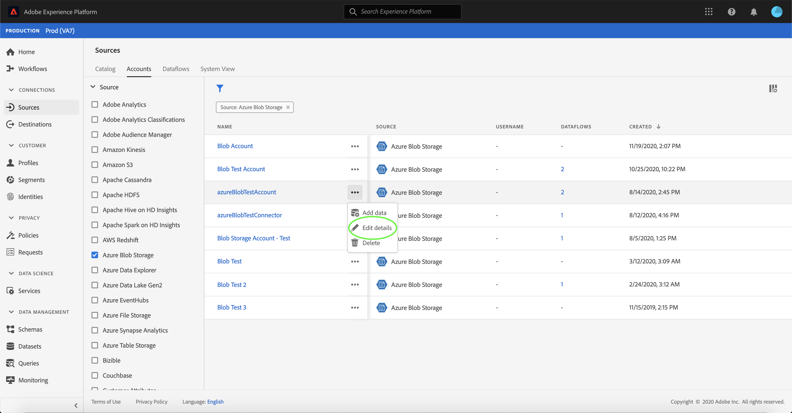

# UIでのアカウントの詳細の更新

状況によっては、既存のソースアカウントの詳細の更新が必要になる場合があります。 「 [!UICONTROL ソース] 」ワークスペースでは、アカウントの名前、説明、認証資格情報の値など、アカウントの詳細を編集、追加および削除できます。

このチュートリアルでは、 [!UICONTROL Sources] Workspaceから既存のアカウントの詳細と秘密鍵証明書を更新する手順を説明します。

## はじめに

このチュートリアルは、Adobe Experience Platform の次のコンポーネントを実際に利用および理解しているユーザーを対象としています。

- [[!DNL Experience Data Model (XDM)] システム](../../../xdm/home.md):顧客体験データを [!DNL Experience Platform] 整理する際に使用される標準化されたフレームワーク。
   - [スキーマ構成の基本](../../../xdm/schema/composition.md)：スキーマ構成の主要な原則やベストプラクティスなど、XDM スキーマの基本的な構成要素について学びます。
   - [スキーマエディタのチュートリアル](../../../xdm/tutorials/create-schema-ui.md):スキーマエディターのUIを使用してカスタムスキーマを作成する方法を説明します。
- [[!DNL Real-time Customer Profile]](../../../profile/home.md):複数のソースからの集計データに基づいて、統合されたリアルタイムの消費者プロファイルを提供します。

## アカウントの更新

「 [Experience PlatformUIにログイン」にログインし](https://platform.adobe.com) 、左側のナビゲーションから「 **[!UICONTROL ソース]** 」を選択して [!UICONTROL ソース] ワークスペースにアクセスします。 上部のヘッダーから「 **[!UICONTROL アカウント]** 」を選択して、既存のアカウントを表示します。

The **[!UICONTROL Accounts]** page appears. このページには、ソース、ユーザー名、データ・フロー数、作成日など、表示可能なアカウントのリストが表示されます。

左上のフィルターアイコン  を選択して、並べ替えパネルを起動します。

並べ替えパネルには、すべてのソースのリストが表示されます。 リストから複数のソースを選択して、様々なソースに関連付けられたアカウントのフィルタされた選択範囲にアクセスできます。

既存のアカウントのリストを表示するために操作するソースを選択します。 更新するアカウントを特定したら、アカウント名の横にある三点リーダー(`...`)を選択します。

ドロップダウンメニューが表示され、 **[!UICONTROL 追加]**&#x200B;データ **[!UICONTROL 、]**&#x200B;詳細の編集 **[!UICONTROL 、]**&#x200B;削除のオプションが表示されます。 メニューから「 **[!UICONTROL 詳細を編集]** 」を選択して、アカウントを更新します。

[ **[!UICONTROL アカウントの詳細を]** 編集]ダイアログボックスを使用すると、アカウントの名前、説明、認証資格情報を更新できます。 必要な情報を更新したら、「 **[!UICONTROL 保存]**」を選択します。

しばらくすると、更新が成功したことを確認する緑の確認ボックスが画面の下部に表示されます。

## 次の手順

このチュートリアルに従うと、 [!UICONTROL Sources] Workspaceを使用してアカウント情報を更新することに成功しました。

APIを使用してプログラムでこれらの操作を実行する手順については、Flow Service APIを使用した接続情報の [!DNL Flow Service] 更新に関するチュートリアルを参照してください 。