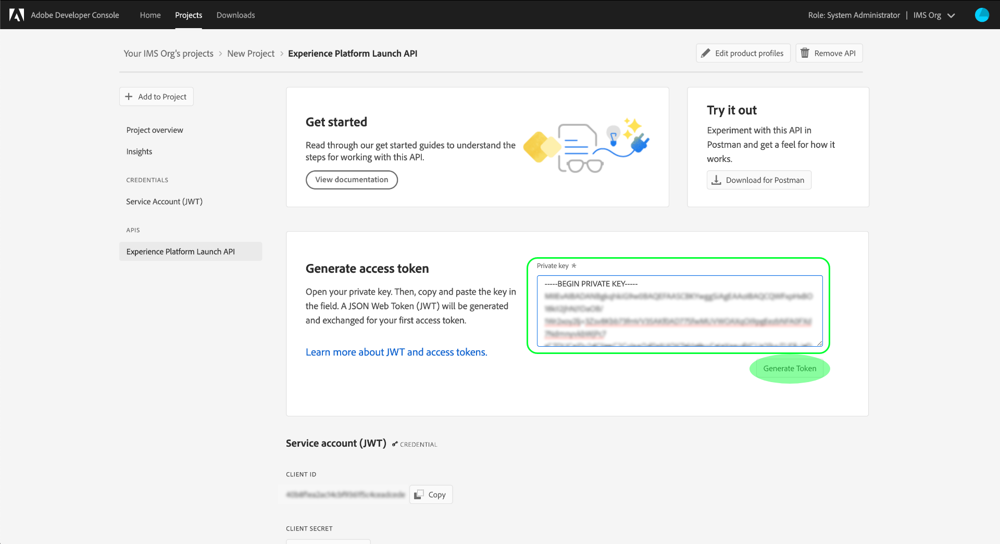
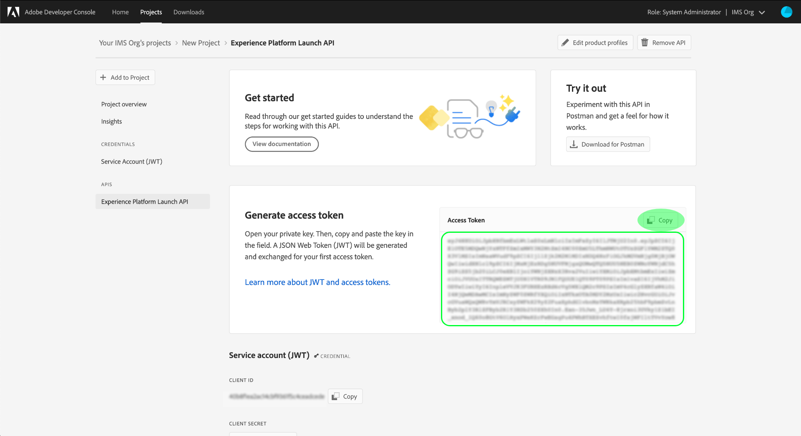

# Reactor API の概要

[Reactor API](https://www.adobe.io/experience-platform-apis/references/reactor/) を使用するには、各リクエストに次の認証ヘッダーを含める必要があります。

* `Authorization: Bearer {ACCESS_TOKEN}`
* `x-api-key: {API_KEY}`
* `x-gw-ims-org-id: {ORG_ID}`

このガイドでは、Adobe Developer Console を使用してこれらの各ヘッダーの値を収集し、Reactor API の呼び出しを開始する方法について説明します。

## Adobe Experience Platform への開発者のアクセス

Reactor API の認証値を生成する前に、開発者が Experience Platform にアクセスできる必要があります。開発者アクセス権を取得するには、[Experience Platform 認証チュートリアル](https://experienceleague.adobe.com/docs/experience-platform/landing/platform-apis/api-authentication.html?lang=ja)の最初の手順に従ってください。「Adobe Developer Console でアクセス認証情報を生成する」の手順に進んだら、このチュートリアルに戻って Reactor API に固有の認証情報を生成します。

## アクセス認証情報の生成

Adobe Developer Console を使用して、次の 3 つのアクセス認証情報を生成する必要があります。

* `{ORG_ID}`
* `{API_KEY}`
* `{ACCESS_TOKEN}`

IMS 組織の ID（`{ORG_ID}`）と API キー（`{API_KEY}`）は、最初に生成された後、今後の API 呼び出しで再利用できます。ただし、アクセストークン（`{ACCESS_TOKEN}`）は一時的なもので、24 時間ごとに再生成する必要があります。

これらの値を生成する手順については、以下で詳しく説明します。

### 1 回限りのセットアップ

[Adobe Developer Console](https://www.adobe.com/go/devs_console_ui) に移動し 、Adobe ID を使用してログインします。次に、Developer Console のドキュメントにある[空のプロジェクトを作成](https://www.adobe.io/apis/experienceplatform/console/docs.html#!AdobeDocs/adobeio-console/master/projects-empty.md)に関するチュートリアルで説明されている手順に従います。

プロジェクトを作成したら、**プロジェクトの概要**&#x200B;画面で「**API を追加**」を選択します。


**API の追加**&#x200B;画面が表示されます。 「**次へ**」を選択する前に、使用可能な API のリストから「**Experience Platform Reactor API**」を選択します。


次の画面で、新しいキーペアを生成するか、独自の公開鍵をアップロードして JSON Web Token（JWT）認証情報を作成するよう求められます。このチュートリアルでは、「**キーペアを生成**」オプションを選択し、右下隅で「**キーペアを生成**」を選択します。


次の画面では、キーペアが正常に生成されたことを確認し、公開証明書と秘密キーを含む圧縮フォルダーが自動的にマシンにダウンロードされます。この秘密キーは、後の手順でアクセストークンを生成するために必要です。

「**次へ**」をクリックして続行します。


次の画面では、API 統合に関連付ける 1 つ以上の製品プロファイルを選択するように求められます。

>[!NOTE]
>
>製品プロファイルは、Adobe Admin Console を通じて組織によって管理され、詳細な機能に対する特定の権限セットが含まれています。製品プロファイルとその権限は、組織内の管理者権限を持つユーザーのみが管理できます。API 用に選択する製品プロファイルが不明な場合は、管理者に問い合わせてください。

リストから目的の製品プロファイルを選択し、「**設定済み API を保存**」を選択して API の登録を完了します。


API をプロジェクトに追加すると、プロジェクトページが Experience Platform Reactor API のページに再び表示されます。ここから、「**サービスアカウント（JWT）**」セクションまでスクロールします。このセクションには、Reactor API へのすべての呼び出しで必要な次のアクセス資格情報が表示されます。

* **クライアント ID**：クライアント ID は必須の `{API_KEY}` で、`x-api-key` ヘッダーで指定する必要があります。
* **組織 ID**：組織 ID は、`x-gw-ims-org-id` ヘッダーで使用する必要がある `{ORG_ID}` 値です。


### 各セッションの認証

これで、`{API_KEY}` と `{ORG_ID}` の値が揃ったので、最後の手順として `{ACCESS_TOKEN}` の値を生成します。

>[!NOTE]
>
>これらのトークンは、24 時間後に期限切れになります。この統合をアプリケーションに使用している場合は、アプリケーション内からプログラムでベアラートークンを取得することをお勧めします。

使用例に応じて、アクセストークンを生成するための 2 つのオプションがあります。

* [トークンの手動生成](#manual)
* [プログラムによるトークンの生成](#program)

#### アクセストークンの手動生成 {#manual}

以前にダウンロードした秘密キーをテキストエディターまたはブラウザーで開き、その内容をコピーします。次に、Developer Console に戻り、「**トークンを生成**」を選択する前に、プロジェクトの Reactor API ページの「**アクセストークンを生成**」セクションに秘密キーを貼り付けます。



新しいアクセストークンが生成され、トークンをクリップボードにコピーするためのボタンが提供されます。 この値は、必要な `Authorization` ヘッダーに使用され、`Bearer {ACCESS_TOKEN}` の形式で指定する必要があります。



#### プログラムによるアクセストークンの生成 {#program}

アプリケーションで 統合を使用している場合、API リクエストを通じてプログラムによってアクセストークンを生成できます。これを実現するには、次の値を取得する必要があります。

* クライアント ID (`{API_KEY}`)
* クライアントシークレット（`{SECRET}`）
* JSON Web トークン（`{JWT}`）

クライアント ID とシークレットは、[前の手順](#one-time-setup)で説明したように、プロジェクトのメインページから取得できます。


JWT 認証情報を取得するには、左側のナビゲーションで「**サービスアカウント（JWT）**」に移動し、「**JWT を生成**」タブを選択します。 このページの「**カスタム JWT を生成**」で、秘密鍵の内容を指定されたテキストボックスに貼り付けて、「**トークンを生成**」を選択します。


生成された JWT は、処理が完了すると以下に表示されます。また、必要に応じてトークンのテストに使用できるサンプルの cURL コマンドも含まれます。 「**コピー**」ボタンを使用して、トークンをクリップボードにコピーします。


認証情報を収集したら、以下の API 呼び出しをアプリケーションに統合して、プログラムでアクセストークンを生成できます。

**リクエスト**

リクエストは、次に示す認証資格情報を提供して、`multipart/form-data` ペイロードを送信する必要があります。

```shell
curl -X POST \
  https://ims-na1.adobelogin.com/ims/exchange/jwt/ \
  -H 'Content-Type: multipart/form-data' \
  -F 'client_id={API_KEY}' \
  -F 'client_secret={SECRET}' \
  -F 'jwt_token={JWT}'
```

**応答**

応答が成功すると、新しいアクセストークンと、有効期限が切れるまでの残りの秒数が返されます。

```json
{
  "token_type": "bearer",
  "access_token": "{ACCESS_TOKEN}",
  "expires_in": 86399999
}
```

| プロパティ | 説明 |
| :-- | :-- |
| `access_token` | 新しく生成されたアクセストークンの値。 この値は、必要な `Authorization` ヘッダーに使用され、`Bearer {ACCESS_TOKEN}` の形式で指定する必要があります。 |
| `expires_in` | トークンの有効期限が切れるまでの残り時間（ミリ秒）。 トークンの有効期限が切れたら、新しいトークンを生成する必要があります。 |

{style=&quot;table-layout:auto&quot;}

## 次の手順

このチュートリアルの手順に従うことで、`{ORG_ID}`、`{API_KEY}`、および `{ACCESS_TOKEN}` に有効な値を指定できます。 これらの値を、Reactor API への簡単な cURL リクエストで使用してテストできるようになりました。

まず、[すべての会社をリスト](./endpoints/companies.md#list)する API 呼び出しを試みます。

>[!NOTE]
>
>組織に会社が存在しない場合、応答は HTTP ステータス 404（未検出）になります。403（禁止）エラーが発生しない限り、アクセス資格情報は有効となり、機能します。

アクセス資格情報が機能していることを確認したら、引き続き他の API リファレンスドキュメントを参照して、API の多くの機能を確認します。

## その他のリソース

JWT ライブラリおよび SDK：[https://jwt.io/](https://jwt.io/)

Postman API の開発：[https://www.postman.com/](https://www.postman.com/)
