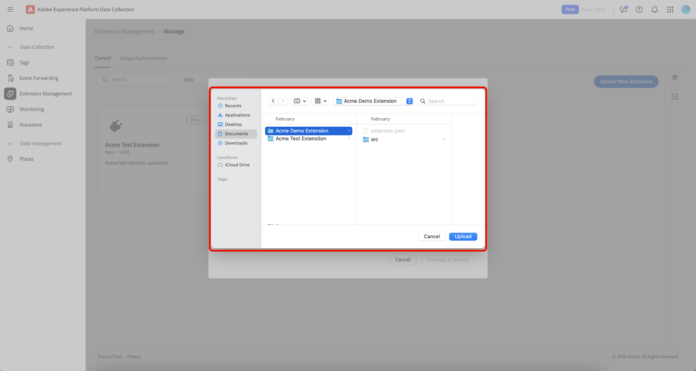
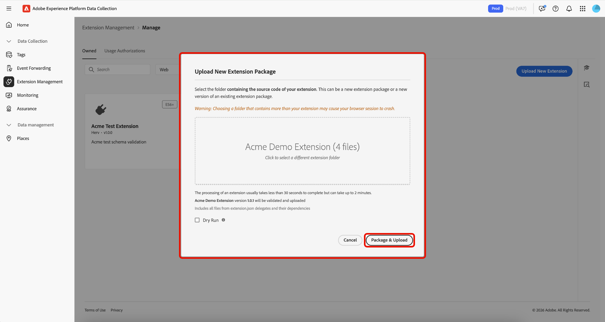

# タグ拡張機能の管理

Adobe Experience Platformでは、**[!UICONTROL Owned]**&#x200B;個の拡張機能を管理できます。 新しい拡張機能をアップロードして新しいバージョンをデプロイし、プライベートまたはパブリックの可用性にリリースできます。

## 拡張機能を管理  {#manage-extension}

拡張機能パッケージをローカルで準備したら、データ収集UIで&#x200B;**[!UICONTROL Extension Management]**&#x200B;を使用してパッケージをアップロードし、パッケージを検証して、**開発**、**プライベート**、**パブリック**&#x200B;の可用性を通じてバージョンをリリースします。 その後、プロパティに拡張機能をインストールし、テストに使用できます。

### 拡張機能のアップロード {#upload-extension}

拡張機能をアップロードするには、データ収集UIに移動し、左側のナビゲーションから「**[!UICONTROL Extension Management]**」を選択します。 ここから、「**[!UICONTROL Owned]**」タブを選択します。 このタブには、あなたまたはあなたの組織が所有する拡張機能が表示されます。 これらはプラットフォーム別に区切られており、ドロップダウンを使用して、各プラットフォーム（Web、モバイル、Edge）に含まれる拡張機能を確認できます。 **[!UICONTROL Upload New Extension]** を選択します。

**新しい拡張機能をアップロード** ページで、**[!UICONTROL Select Extension Folder]**&#x200B;を選択し、拡張機能を含むフォルダーに移動し、フォルダーを選択してから&#x200B;**[!UICONTROL Upload]**&#x200B;を選択します。

**[!UICONTROL Upload]**&#x200B;を選択して、アップロードされるファイルの数を確認します。

アップロードされるファイルの数は、拡張子の名前とバージョンを含めて表示されます。 **[!UICONTROL Dry Run]**&#x200B;を実行して、zip ファイルをローカルマシンにダウンロードして検査するオプションがあります。 **[!UICONTROL Validate & Upload]** を選択します。

拡張機能が正常にアップロードされ、処理されたことを確認すると、**拡張機能パッケージ ID**&#x200B;と共に表示されます。 **[!UICONTROL Close]**&#x200B;を選択して、拡張機能が表示されている&#x200B;**[!UICONTROL Owned]** タブに戻ります。

更新された拡張機能が表示される[!UICONTROL Owned] タブに戻ります。

>[!IMPORTANT]
>
>拡張機能は&#x200B;**開発**&#x200B;の可用性にアップロードされます。 **開発**&#x200B;の可用性の拡張機能は、**プライベート**&#x200B;の可用性にリリースされるまで共有できません。

### 拡張機能のリリース {#release-extension}

非公開で使用できるように拡張機能をリリースするには、拡張機能を選択して、右側に情報パネルを表示します。 ここでは、拡張機能の次の詳細を確認できます。

* **バージョン** – 最新バージョンと、現在の状態を表示します。 ドロップダウンメニューを使用して、拡張機能のバージョン履歴を表示できます。
* **アクション** – 拡張機能の&#x200B;**[!UICONTROL Upload New Version]**&#x200B;と&#x200B;**[!UICONTROL Release To Private]**&#x200B;を使用できます。
* **拡張機能パッケージ ID** – 下部に表示されます。 これは、選択したバージョンによって異なります。

バージョン、アクション、パッケージ IDを強調表示する

「**[!UICONTROL Release To Private]**」を選択してから、もう一度「**[!UICONTROL Release To Private]**」を選択してリリースを確認します。

拡張機能が正常にリリースされ、**Private**&#x200B;が利用できるようになったら、確認を受け取ります。 更新された可用性は、右側のパネルに表示されます。

バージョンとプライベートの可用性を強調する

>[!NOTE]
>
>拡張機能が&#x200B;**Private**&#x200B;にリリースされると、他の組織と共有できるようになります。

拡張機能を&#x200B;**パブリック**&#x200B;の可用性にリリースするには、右側のパネルから「**[!UICONTROL Request Public Release]**」を選択します。

**[!UICONTROL Release Extension Package]**&#x200B;画面には、リクエストフォームに必要な詳細が表示され、詳細をコピーするオプションも表示されます。 **[!UICONTROL Go To Request Form]** を選択します。

リクエストフォームを含む新しいブラウザータブが開きます。 **[!UICONTROL Release Extension Package]**&#x200B;画面から関連するフィールドに情報をコピーして貼り付けます。 完成したフォームをレビュー用に送信します。 拡張機能が公開されると通知されます。

## 拡張機能パッケージを他の組織と共有する {#share-extension}

>[!NOTE]
>
>拡張機能パッケージには、[!UICONTROL Usage Authorizations]を通じて共有するために、プライベートまたはパブリックのバージョンが必要です。 開発者向け可用性としてマークされたバージョンは共有の対象にはならず、認証ドロップダウンには表示されません。 これは、以前のバージョン（例：1.0.0）が既に共有されている場合でも適用されます。 新しいバージョン（例：1.0.1）は、受信組織が承認またはインストールする前に、少なくとも非公開にする必要があります。
>
>プライベート拡張機能パッケージの共有に関するすべてのガイダンスは、後でこれらのパッケージを公開することを選択した場合にも適用されます。 可用性、バージョン管理、セキュリティ、互換性、サポート、ドキュメントに関して同じ考慮事項が、パッケージの可用性ステータスに関係なく引き続き関連しています。

**[!UICONTROL Usage Authorizations]**&#x200B;は、拡張機能カタログで公開することなく、プライベート拡張機能パッケージを信頼できるパートナーと安全に共有するために使用できる強力な機能です。 この機能を使用すると、組織間に安全なブリッジを作成でき、お互いのカスタム拡張コードを活用しながら、独自のソリューションのプライバシーと制御を維持できます。

多くの企業は、独自のビジネス要件に合わせて専用の拡張機能を開発します。 これらの拡張機能には、一般に公開すべきではない独自のロジック、カスタム統合、機密性の高い設定が含まれている場合があります。 使用権限では、次の機能を有効にすることで、この課題を解決できます。

* **選択的共有**：信頼できるパートナー組織とのみプライベート拡張機能を共有します。
* **プライバシーを維持**：機密性の高い拡張コードを公開カタログから除外します。
* **共同開発**：信頼できるパートナーがカスタムソリューションから利益を得られるようにします。
* **アクセスの制御**: プライベート拡張機能にアクセスして使用できるユーザーを完全に制御します。

共有プロセスには、次の2つの主要な参加者が関与します。

1. **共有組織**: プライベート拡張機能パッケージを所有および共有する組織
2. **受信組織**：共有拡張機能にアクセスできる信頼できる組織

プライベートバージョンが共有されると、受信側の組織はその特定のバージョンにアクセスし、2つの組織間に直接つながります。 新しいバージョンが後で非公開になった場合、受信側の追加の手順を必要とせずに、受信側の組織でも利用できるようになります。

### 拡張機能パッケージ使用認証の作成 {#package-usage-authorization}

拡張機能を共有するには、データ収集UIに移動し、左側のナビゲーションから「**[!UICONTROL Extension Management]**」を選択します。 ここから、「**[!UICONTROL Usage Authorizations]**」タブを選択します。

ここでは、既存の共有権限のリストが、次の2つのカテゴリに整理されています。

* **この組織と共有**：他の組織が共有している拡張機能。
* **他の組織と共有**：他の組織と共有した拡張機能。

**[!UICONTROL Add Authorization]** を選択します。

![この組織と共有されている拡張機能のリストを表示する[!UICONTROL Usage Authorizations] タブ、[!UICONTROL Add Authorization]](../images/shared-extensions/add-authorization.png)を強調表示

>[!IMPORTANT]
>
>ターゲット組織の&#x200B;**`Organization ID`**&#x200B;組織の所有者を取得する必要があります。 組織は名前で検索できません。

ドロップダウンから拡張機能を承認する&#x200B;**[!UICONTROL Platform]**&#x200B;を選択します。 **[!UICONTROL Web]**、**[!UICONTROL Mobile]**&#x200B;および&#x200B;**[!UICONTROL Edge]**&#x200B;個の拡張機能を共有できます。

次に、ドロップダウンで使用可能な拡張機能から共有する&#x200B;**[!UICONTROL Extension]**&#x200B;を選択します。 このリストには、組織が所有する拡張機能とその可用性ステータスが表示されます。 最新バージョンが&#x200B;**開発**&#x200B;の可用性を持つ拡張機能は、このリストには表示されません。

次に、受信組織のIDを入力し、**[!UICONTROL Save]**&#x200B;を選択します。

![選択した拡張機能とAdobe組織IDが表示されている[!UICONTROL Create extension package usage authorization] ページが入力されました。[!UICONTROL Save]](../images/shared-extensions/save-authorization.png)が強調表示されます

[!UICONTROL Usage Authorizations] タブに戻り、**[!UICONTROL Shared with other orgs]** リストに拡張機能が表示されます。 受信組織が承認を承認するまで、ステータスには&#x200B;**承認待ち**&#x200B;が表示され、その時点で&#x200B;**承認済み**&#x200B;に更新されます。

![他の組織と共有されている拡張機能のリストを表示する[!UICONTROL Usage Authorizations] タブ。新しい認証を強調する](../images/shared-extensions/new-authorization.png)

>[!TIP]
>
>拡張機能カードのメニュー（⋯）を選択し、メニューから共有オプションを選択して、**[!UICONTROL Extension Catalog]**&#x200B;から直接拡張機能を共有することもできます。

認証がアクティブな場合、共有拡張機能は、カタログに&#x200B;***共有*** バッジを表示し、他の組織と共有されていることを示します。

![&#x200B; バッジを持つ共有拡張機能を表示する[!UICONTROL Catalog] タブ &#x200B;](../images/shared-extensions/sharing-badge.png)

### 共有拡張機能の認証と管理 {#manage-shared-extension}

>[!NOTE]
>
>受け取り組織として、共有された拡張機能のみを承認または却下できます。 認証の詳細は、共有組織によって管理されているため、管理または変更できません。

組織の共有拡張機能を承認するには、データ収集UIに移動し、左側のナビゲーションから「**[!UICONTROL Extension Management]**」を選択してから「**[!UICONTROL Usage Authorizations]**」タブを選択します。

**承認待ち**&#x200B;を含む共有拡張機能のリストは、**[!UICONTROL Shared with this org]** セクションに表示されます。 承認する拡張機能を選択し、**[!UICONTROL Approve]**&#x200B;を選択します。

![この組織と共有され、承認待ちの拡張機能が選択された拡張機能のリストを表示する[!UICONTROL Usage Authorizations] タブ。[!UICONTROL Approve]](../images/shared-extensions/approve-authorization.png)がハイライト表示されている

>[!NOTE]
>
>組織で共有された拡張機能が不要になった場合は、**[!UICONTROL Usage Authorizations]** タブ内でリクエストを拒否することもできます。

**[!UICONTROL OK]** ダイアログで「**[!UICONTROL Authorization Usages]**」を選択します。

![[!UICONTROL Authorization Usages]を強調表示する[!UICONTROL OK]](../images/shared-extensions/confirmation.png) ダイアログ

[!UICONTROL Usage Authorizations] タブに戻り、拡張機能に&#x200B;**Approved** ステータスが表示されるようになりました。

![この組織と共有されている拡張機能のリストを表示する[!UICONTROL Usage Authorizations] タブ。承認済みステータスの拡張機能を強調表示する](../images/shared-extensions/approved-authorization.png)

承認が承認されると、拡張機能はカタログで利用でき、他の拡張機能と同様にインストールして使用できます。 共有された拡張機能には、***受信*** バッジが表示され、別の組織と共有されている拡張機能であることを示します。

![共有された拡張機能を「受信」バッジで表示している[!UICONTROL Catalog] タブ &#x200B;](../images/shared-extensions/receiving-badge.png)

### 承認の取り消し {#revoke-authorization}

所有している組織として、現在のステータス（承認待ち、却下、または承認済み）に関係なく、任意の時点で認証を削除できます。

**拡張機能が公開されなかった場合：**

* 受信組織が既にインストールしているプライベートバージョンは、インストール済みの拡張機能リストに引き続き表示されます。
* 受信側の組織が拡張機能をインストールしなかった場合、インターフェイスのどこにも表示されなくなります。

**拡張機能が公開された場合：**

* 受信組織がインストールしたプライベートバージョンは、インストール済みの拡張機能リストに表示されたままになります。
* プライベートバージョンをまだインストールしていない場合は、最新のパブリックバージョンがカタログに表示され、インストールできます。
* 必要に応じて、プライベートバージョンから最新の利用可能なパブリックバージョンにダウングレードすることもできます。

認証を取り消すと、受信側の組織は、既存の実装を保護するための特定の権利を保持します。

* **引き続き使用**：受信側の組織は、アクセス権を取り消した後でも、既にインストールされているプライベートバージョンを引き続き使用できます。
* **ビルド保護**：受け取り側の組織がプライベート v1.0.0をインストールし、後でプライベート v1.0.1をリリースした場合、新しいバージョンは表示されませんが、v1.0.0で引き続きビルドできます。中断はありません。
* **今後のアップグレード**：後で拡張機能を公開する場合（v2.0.0を公開するなど）、受信側の組織は、プライベート v1.0.0から新しいパブリック v2.0.0に直接アップグレードできます。

>[!IMPORTANT]
>
>承認を取り消しても、既存のビルドや実装は壊れません。 導入企業は、ビジネスを継続的に維持するために、既にインストールされているプライベートバージョンに常にアクセスできます。

## 次の手順 {#next-steps}

このドキュメントでは、Experience Platform内で共有拡張機能を使用する方法を示しました。 拡張機能の開発について詳しくは、[拡張機能の開発ユーザーガイド &#x200B;](./getting-started.md)を参照してください。

Experience Platformでの拡張機能開発の概要については、[概要ドキュメント &#x200B;](./overview.md)を参照してください。
