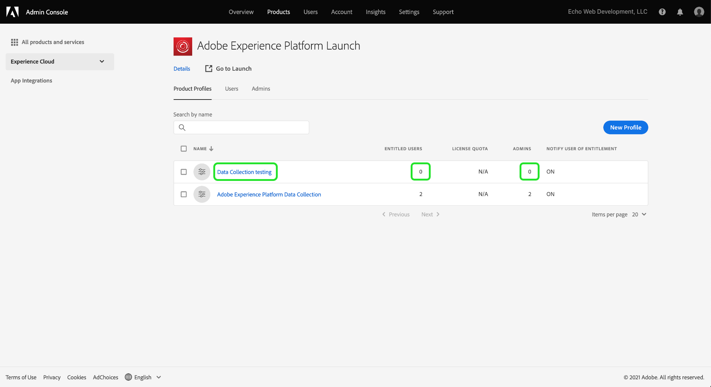

# ユーザーアクセスの許可

>[!NOTE]
>
>Adobe Experience Platform Launch は、Experience Platform のデータ収集テクノロジースイートとしてリブランドされています。 その結果、製品ドキュメント全体でいくつかの用語の変更がロールアウトされました。 用語の変更点の一覧については、次の[ドキュメント](../../term-updates.md)を参照してください。

拡張機能パッケージを使用する前に、チームメンバーのユーザーアカウントおよび権限を設定する必要があります。それには、[Adobe Admin Console](https://adminconsole.adobe.com/) を使用します。

このドキュメントでは、Admin Consoleを使用してAdobe Experience Platformのタグにアクセスを許可する手順を説明します。

## 前提条件

このガイドは、ユーザーが Admin Console で指定された組織管理者であることを前提としています。Admin Console とロールの割り当てに関する追加情報が必要な場合は、次のリソースを参照してください。

* [管理ユーザーガイド](https://helpx.adobe.com/jp/enterprise/administering/user-guide.html?topic=/enterprise/administering/morehelp/introduction.ug.js)：Admin Console 内のすべての機能に関する情報
* [エンタープライズ版の管理ロール](https://helpx.adobe.com/jp/enterprise/using/admin-roles.html)：様々な種類の管理ロールに関する詳しい情報以下のガイドでは、ユーザーが組織管理者であることを前提としています。

## 組織を選択する

Adobe Experience Cloud の組織管理者は、[Admin Console](https://adminconsole.adobe.com/) にサインインする必要があります。最初の画面は概要です。

一部のユーザーは、複数の組織（組織）にアクセスできます。 正しい組織にタグ機能を追加するには、画面の右上隅に表示される組織の名前を選択します。 次に、ドロップダウンリストからタグを使用する組織を選択します。

## 製品プロファイルの作成

製品プロファイルはグループです。 個々の権限が製品プロファイルに割り当てられ、プロファイル内のすべてのユーザーがそれらの権限を継承します。

上部にある&#x200B;**[!UICONTROL Products]**&#x200B;リンクを選択し、左側に&#x200B;**[!UICONTROL Experience Cloud]**&#x200B;を選択します。 Adobe Experience Platform Launchがリストに表示されない場合、顧客はアカウントチームに連絡し、パートナーは<ExchangeTechEC@adobe.com>に電子メールを送信する必要があります。

上のスクリーンショットは、サンプルのプロファイルを示しています。まだプロファイルがない可能性があります。 作成するには、「**[!UICONTROL 新しいプロファイル]**」を選択します。 **新しいプロファイルを作成**&#x200B;画面で、**プロファイル名**（例えば、データ収集テスト）とオプションの&#x200B;**説明**&#x200B;を追加し、**[!UICONTROL 保存]**&#x200B;を選択します。

これで、製品プロファイルが組織に追加されました。 次に、製品プロファイルにユーザーを追加します。

## 製品プロファイルへのユーザーの割り当て

製品プロファイルには、**ENTITLED USERS**&#x200B;および&#x200B;**ADMINS**&#x200B;に対して0が表示されます。 作成した製品プロファイルの名前を選択します（この例では「データ収集テスト」）。

「**[!UICONTROL ユーザー]**」タブを選択します。 ここでは、既存のAdobe IDユーザーを電子メールで検索したり、この製品プロファイルに新しいユーザーを追加したりできます。 「**[!UICONTROL ユーザーリンクを追加]**」を選択します。

該当するテキストフィールドに、名前、ユーザーグループまたは電子メールアドレスを入力します。 可能な場合は、姓と名を含めることをお勧めします。 「**[!UICONTROL 保存]**」を選択して、ユーザーを追加します。

この製品プロファイルで必要なすべてのユーザーが揃ったら、そのユーザーに対する権限を追加します。 「**[!UICONTROL 権限]**」タブを選択します。権限設定画面に、「**[!UICONTROL プロパティ]**」、「**[!UICONTROL 会社権限]**」、「**[!UICONTROL プロパティ権限]**」が表示されます。 「**[!UICONTROL 編集]**」を選択します。

拡張機能を作成するには、チームに次の権限が必要です。

* 会社グループの「プロパティの管理」。
* プロパティグループから、「拡張機能の管理」、「環境の管理」および「開発」を選択します。

必要に応じて、権限が制限された製品プロファイルを後で作成できますが、ここでは、「 **[!UICONTROL 会社権限** 」と「 **プロパティ権限** 」の両方で「 **+すべて]** 」を選択します。 必ず&#x200B;**[!UICONTROL 「]**&#x200B;を保存」を選択してください。

これまで、適切な組織を選択し、製品プロファイルを作成し、製品プロファイルにユーザーを追加し、権限を割り当てました。

これで、必要な設定が完了し、Admin Console。 ユーザーとして設定されたユーザーとチームメンバーは、[データ収集UI](https://launch.adobe.com/)にログインできるようになりました。

## プロビジョニングの確認

会社にタグへのアクセスがプロビジョニングされ、ユーザーが前述のように設定されたら、[データ収集UI](https://launch.adobe.com/)から実稼動環境にアクセスできるようになります。 タグのプロビジョニングが完了し、上記のAdmin Console手順を完了してもデータ収集UIにログインできない場合は、Adobeサポート担当者にお問い合わせください。
