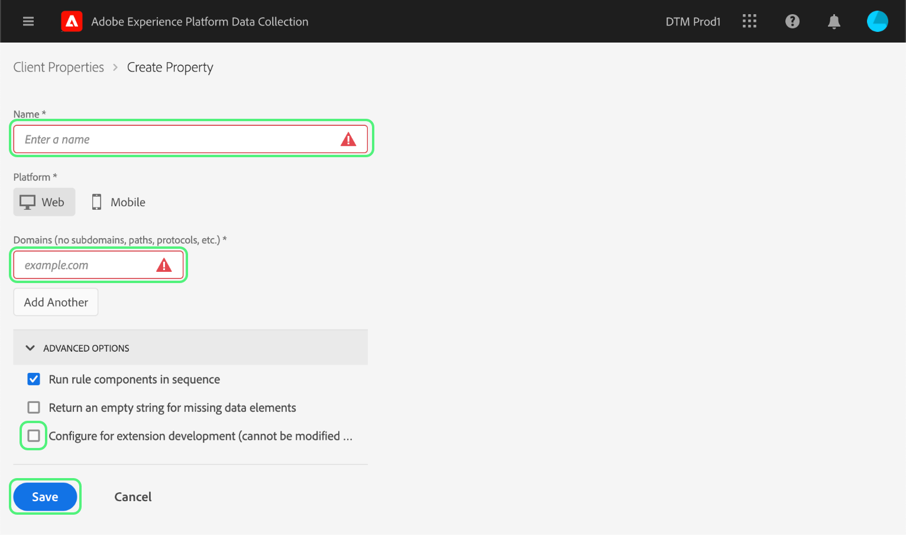
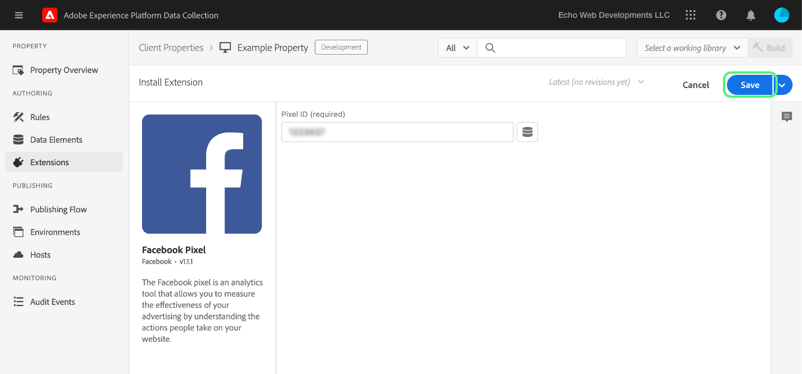
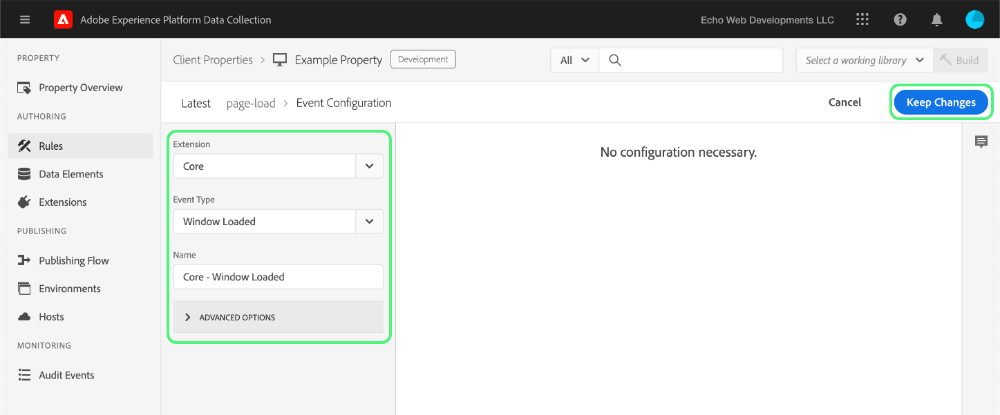

# エンドツーエンドテストのアップロードと実装

>[!NOTE]
>
>Adobe Experience Platform Launch は、Adobe Experience Platform のデータ収集テクノロジースイートとしてリブランドされています。 その結果、製品ドキュメント全体でいくつかの用語の変更がロールアウトされました。 用語の変更点の一覧については、次の[ドキュメント](../../term-updates.md)を参照してください。

Adobe Experience Platform でタグ拡張機能をテストするには、タグ API やコマンドラインツールを使用して拡張機能パッケージをアップロードします。次に、データ収集 UI を使用して、拡張機能パッケージをプロパティにインストールし、タグライブラリ内でその機能を実行してビルドします。

このドキュメントでは、拡張機能のエンドツーエンドテストの実装方法について説明します。

>[!NOTE]
>
>このガイドでは、使用している macOS には Node.js および npm がインストールされ、それらが使用可能な状態にあることを前提としています。

## 拡張機能の検証 {#validate}

チームが拡張機能のパフォーマンスと[サンドボックス](https://www.npmjs.com/package/@adobe/reactor-sandbox#running-the-sandbox)ツールに表示される結果に満足したら、拡張機能パッケージをタグにアップロードする準備が整います。

アップロードする前に、必須フィールドまたは設定が存在することを確認してください。例えば、（少なくとも）[拡張機能マニフェスト](../manifest.md)、[拡張機能の設定](../configuration.md)、[ビュー](../web/views.md)、[ライブラリモジュール](../web/format.md)を確認することをお勧めします。

具体的な例としては、ロゴファイルが挙げられます。`extension.json` ファイルに `"iconPath": "example.svg",` 行を追加して、そのロゴ画像ファイルをプロジェクトに含めます。これは、拡張機能に表示されるアイコンの相対パスです。先頭にスラッシュを配置することはできません。拡張子が `.svg` の SVG ファイルを参照する必要があります。SVG は、正方形にレンダリングされると通常どおりに表示され、ユーザーインターフェイスで拡大縮小できます。詳しくは、 [SVG の拡大・縮小方法](https://css-tricks.com/scale-svg/) を参照してください。

>[!NOTE]
>
>公開拡張機能の場合は、項目と Exchange 用リストへのリンクを `extension.json` に含めてください。[拡張機能マニフェスト](../manifest.md)には、Exchange 用リストの URL を指す `"exchangeUrl":"https://www.adobeexchange.com/experiencecloud.details.12345.html"` のようなエントリを含める必要があります。

## Adobe I/O 統合環境の作成 {#integration}

API またはコマンドラインツールを使用するには、Adobe I/O に関するテクニカルアカウントが必要です。I/O コンソールでテクニカルアカウントを作成し、アップローダツールを使用して拡張機能パッケージをアップロードする必要があります。

Adobe Experience Platform でタグに使用するテクニカルアカウントの作成について詳しくは、[アクセストークン](https://developer.adobelaunch.com/api/guides/access_tokens/)のガイドを参照してください。

>[!IMPORTANT]
>
>Adobe I/O で統合を作成するには、Experience Cloud 組織管理者または Experience Cloud 組織開発者である必要があります。

統合を作成できない場合は、適切な権限を持っていない可能性があります。この場合は、組織管理者が手順を完了するか、開発者として割り当てる必要があります。

## 拡張機能パッケージのアップロード {#upload}

これで資格情報が用意でき、エンドツーエンドで拡張機能パッケージをテストする準備が整いました。

拡張機能パッケージを初めてアップロードすると、`development` の状態になります。つまり、自身の組織に対してのみ、および拡張機能の開発用にマークされたプロパティでのみ表示されます。

コマンドラインを使用して、.zip パッケージを含むディレクトリ内で次のコマンドを実行します。

```bash
npx @adobe/reactor-uploader
```

`npx`：npm パッケージをダウンロードして実行できます。実際にはこのパッケージをコンピューターにインストールする必要はありません。これは、アップローダを実行する最も簡単な方法です。

アップローダでは、複数の情報を入力する必要があります。テクニカルアカウント ID、API キー、およびその他の情報は、Adobe I/O コンソールから取得できます。I/O コンソールの[統合ページ](https://console.adobe.io/integrations)に移動します。ドロップダウンから正しい組織を選択し、適切な統合を見つけて「**[!UICONTROL 表示]**」を選択します。

- 秘密鍵へのパス：/path/to/private.keyこれは、前述の手順 2 で秘密鍵を保存した場所です。
- 組織 ID：先ほど開いた I/O コンソールの概要ページからコピーして貼り付けます。
- テクニカルアカウント ID：これを I/O コンソールからコピーして貼り付けます。
- API キー：これを I/O コンソールからコピーして貼り付けます。
- クライアントシークレットとはこれを I/O コンソールからコピーして貼り付けます。
- アップロードする拡張機能パッケージへのパス：/path/to/extension_package.zip.zip パッケージを含むディレクトリ内からアップローダを呼び出す場合は、パスを入力する代わりに、リストからアップローダを選択するだけで済みます。

拡張機能パッケージがアップロードされ、アップローダによって拡張パッケージの ID が提供されます。

>[!NOTE]
>
>アップロード時またはパッチ適用時に、拡張機能パッケージは保留状態になりますが、システムによりパッケージが非同期で抽出されデプロイされます。この処理がおこなわれている間に、API を使用して、データ収集 UI 内で `extension_package` ID をポーリングできます。カタログ内に、「保留」とマークされた拡張機能カードが表示されます。

>[!NOTE]
>
>アップローダを頻繁に実行する予定がある場合、毎回これらの情報を入力するのが負担になる場合があります。これらは、コマンドラインから引数として渡すこともできます。詳細については、NPM ドキュメントの[コマンドラインの引数に関する節](https://www.npmjs.com/package/@adobe/reactor-uploader#command-line-arguments)を参照してください。

## 開発プロパティの作成 {#property}

データ収集 UI にログインすると、プロパティ画面が表示されます。プロパティは、デプロイするタグのコンテナであり、1 つまたは複数のサイトで使用できます。


初めてログインしたときに、画面にプロパティは表示されません。新しいプロパティを作成するには、「**新規プロパティ**」をクリックします。名前と URL を入力します。テストサイトの URL、または拡張機能をテストするページを使用します。このドメインフィールドは、一部の拡張機能や、コア拡張機能を使用した条件で使用できます。

>[!NOTE]
>
>`localhost` は URL 値として機能しません。代わりに、`localhost` URL を使用する場合は、任意のモック値をテストに使用します。例：example.com。

このプロパティを拡張機能の開発テストに使用するには、**ADVANCEDOPTIONS** を展開し、「**拡張機能の開発用に設定**」のチェックボックスをオンにする必要があります。



下部の「**保存**」を選択して、新しいプロパティを保存します。

「プロパティ」画面が表示されます。作成したプロパティの名前を選択します。「プロパティの概要」画面が表示されます。左側の列にグローバルナビゲーションリンクが含まれ、システムの各領域へのリンクが表示されます。

## 拡張機能のインストール {#install-extension}

このプロパティに拡張機能をインストールするには、上部のメインナビゲーションリンクにある「**拡張機能**」リンクを選択します。**コア**&#x200B;拡張機能は、**インストール済み**&#x200B;画面に表示されます。コア拡張機能には、データ収集内のすべてのタグ管理機能が含まれています。


拡張機能を追加するには、「**カタログ**」を選択します。


カタログには、使用可能な各拡張機能に対応するカードアイコンが表示されます。拡張機能がカタログに表示されない場合は、前述の Adobe 管理コンソールの設定の節と、拡張機能パッケージの作成の節の手順を完了していることを確認してください。また、Platform が初期処理を完了していない場合は、拡張機能パッケージが「保留」と表示される場合があります。

前の手順に従っていて、カタログに保留中または失敗の拡張機能パッケージが表示されない場合は、API を使用して直接拡張機能パッケージのステータスを確認する必要があります。適切な API 呼び出しの実行方法について詳しくは、API ドキュメントの[ExtensionPackage の取得](https://developer.adobelaunch.com/api/reference/1.0/extension_packages/fetch/)を参照してください。

拡張機能パッケージの処理が完了したら、カードの下部にある「**インストール**」を選択します。


設定画面が開きます（拡張機能に設定画面がある場合）。拡張機能の設定に必要な情報を追加し、下部にある「**保存**」を選択します。ここに示す設定画面の例では、ピクセル ID が必要な Facebook 拡張機能を使用しています。



これで、コア拡張機能と拡張機能が設定された「**インストール済み**」拡張機能の画面が表示されます。


## 拡張機能をテストするためのリソースを作成する {#resources}

拡張機能は、Adobe Experience Platform のユーザーに新しい機能を提供します。これらは通常、データ要素またはルールビルダーに表示されます。

### データ要素

タグデータ要素の目的は、ユーザーが値を保持できるようにすることです。各データ要素は、ソースデータへのマッピングまたはポインターです。 単一のデータ要素は、クエリ文字列、URL、Cookie 値、JavaScript 変数などにマッピングできる変数です。左側のナビゲーションバーから「**データ要素**」を選択し、「**新しいデータ要素を作成**」を選択します。


拡張機能では、必要に応じてデータ要素タイプを定義し、拡張機能を動作させることも、ユーザーにとっての利便性を考慮して定義することもできます。 拡張機能でデータ要素タイプを指定すると、**データ要素を作成**&#x200B;画面のユーザー用のドロップダウンリストに表示されます。


ユーザーが「**拡張機能**」ドロップダウンから拡張機能を選択すると、「**データ要素タイプ**」ドロップダウンに、拡張機能から提供されたデータ要素タイプが入力されます。次に、ユーザーは各データ要素をソース値にマップできます。その後、データ要素の変更イベントまたはカスタムコードイベントでルールを作成する際にデータ要素を使用して、ルールの実行をトリガーできます。 データ要素は、データ要素の条件や、ルール内の他の条件、例外、アクションでも使用できます。

データ要素を作成したら（マッピングを設定します）、ユーザーは、データ要素を参照するだけでソースデータを参照できます。 値のソースが変更された場合（サイトの再設計など）、ユーザーはデータ収集 UI で 1 回だけマッピングを更新する必要があり、すべてのデータ要素が新しいソース値を自動的に受け取ります。

### ルール

左側のナビゲーションで「**ルール**」リンクを選択し、「**新しいルールを作成**」を選択します。


まず、ルールにわかりやすい名前を入力します。**ルールを作成**&#x200B;画面を、`if-then` ステートメントのように設定します。


イベントが発生し、条件が満たされて例外がない場合は、アクションがトリガーされます。このようなフローは、イベント、条件、例外、データ要素、またはアクションを作成または活用できる拡張機能にも存在します。

Facebook 拡張機能の例を使用して、テストサイトでページが読み込まれるたびにイベントを追加します。



`Window Loaded` **イベントタイプ**&#x200B;は、テストサイトでページが読み込まれるたびに、このルールがトリガーされるようにします。「**変更を保持**」を選択します。この例では、テストサイトの任意のページに対してルールをトリガーする必要があるので、**条件**&#x200B;を無視します。

「**アクション**」で、「**追加**」を選択します。**アクションの設定**&#x200B;画面が表示されます。次に、ルールの適用対象となる拡張機能と、ルールがトリガーされたときに実行されるアクションを選択する必要があります。「**拡張機能**」ドロップダウンリストから「**Facebook ピクセル**」を選択し、「**アクションタイプ**」ドロップダウンリストから「**ページビューを送信**」を選択します。「**変更を保持**」を選択し、次の&#x200B;**ルールを編集**&#x200B;画面で「**保存**」を選択します。


拡張機能をテストする際に、 関連するイベントや条件など、任意の数のルールで選択できます。

## 変更を公開する {#publish}

メインナビゲーションで「**公開**」を選択し、「**新しいライブラリを追加**」リンクを選択します。


ライブラリは、拡張機能、データ要素、ルールの相互のやり取り、およびWeb サイトとやり取りする方法を示す命令のセットです。ライブラリはビルドにコンパイルされます。ライブラリには、必要に応じて、一度に作成またはテストできる数の変更を含めることができます。

**ライブラリを作成**&#x200B;画面で、「**名前**」テキストフィールドに名前を追加します。タグは、「**開発**」という名前のデフォルトの開発環境を提供します。「**環境**」ドロップダウンリストから「**開発**」を選択します。簡単にするために、使用可能なすべてのリソースを追加します。「**変更されたすべてのリソースを追加**」を選択し、「**保存**」を選択します。

>[!NOTE]
>
>リソースをライブラリに追加する場合、追加時点のそのリソースのスナップショットが作成され、ライブラリに追加されます。後でリソースに変更を加える場合（必要な修正の結果など）は、ライブラリを更新して、リソースに対する最新の変更を含める必要もあります。「**変更したすべてのリソースを追加**」ボタンもこの操作に役立ちます。


すべての変更が新しく作成されたライブラリ（この例では&#x200B;**dev** という名前）に含まれたので、「**保存して開発にビルド**」を選択します。


ビルドプロセスが完了すると、ライブラリ名の横に緑色の&#x200B;**成功**&#x200B;インジケーターが表示されます。


これで、タグライブラリが公開され、使用できるようになりました。 ブラウザーでエンドユーザーのページ動作をテストするには、テストページで新しく作成したライブラリを使用する必要があります。

## テストサイトでタグをインストールする {#install-data-collection-tags}

インストール手順は、「環境」タブで確認できます。このページには使用可能なすべての環境が表示され、追加で環境を作成することもできます。ライブラリが開発環境に公開されたら、「**開発**」行の「**インストール**」列にあるボックスのアイコンを選択します。


開発環境の **Web インストール手順** ダイアログが表示されます。コピーアイコンを選択して、`<script>` タグ全体をコピーします。


この 1 つの `<script>` タグをドキュメントまたはサイトテンプレートの `<head>` セクション内に配置して、インストールを完了します。次に、テストサイトにアクセスして、公開済みのタグライブラリの動作を確認します。

## テスト {#test}

次のリストは、テストページまたはサイト上で拡張機能を検証する際に役立つコンソールコマンドを示しています。

- `_satellite.setDebug(true);` はデバッグモードを有効にし、有用なログステートメントをコンソールに出力します。
- `_satellite._container` オブジェクトには、ビルド、データ要素、ルール、拡張機能に関する詳細など、デプロイ済みのライブラリに関する有用な情報が含まれています。

このテストの目的は、デプロイ済みのライブラリの機能を確認し、ライブラリにコンパイルされた後、拡張機能パッケージが期待どおりに動作することを確認することです。

拡張機能パッケージに加える必要のある変更を見つけた場合、その繰り返し処理は開発プロセスと似ています。

1. プロジェクト内のコードに変更を加えます。。
1. サンドボックスツールを使用して変更を検証します。
1. Packager ツールを使用して新しい .zip パッケージを作成します。
1. アップローダツールを使用して、新しい .zip パッケージをアップロードします。このプロセスは、初期アップロードに関する前述の手順と同じに従います。ただし、開発モードでは同じ名前の拡張パッケージが既に存在するので、新しいパッケージを作成する代わりに、古いバージョンがこの新しいパッケージによって上書きされることに注意してください。

   >[!NOTE]
   >
   >引数をコマンドラインで渡すと、資格情報の繰り返し入力を避けて時間を節約できます。詳しくは、 [reactor-uploader のドキュメント](https://www.npmjs.com/package/@adobe/reactor-uploader) を参照してください。
1. 既存のパッケージを更新する際に、インストール手順をスキップできます。
1. リソースを変更します。拡張機能コンポーネントの設定が変更されている場合は、データ収集 UI でこれらのリソースを更新する必要があります。
1. ライブラリに最新の変更を追加して、再びビルドします。
1. 別のテストを実施します。
