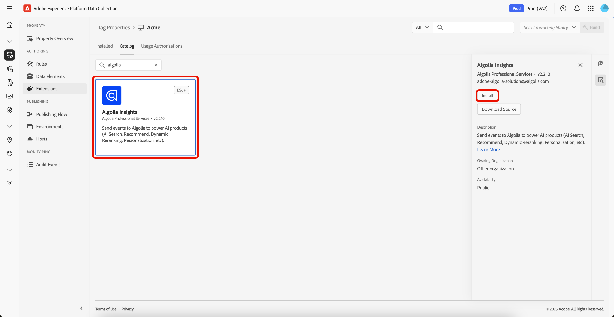
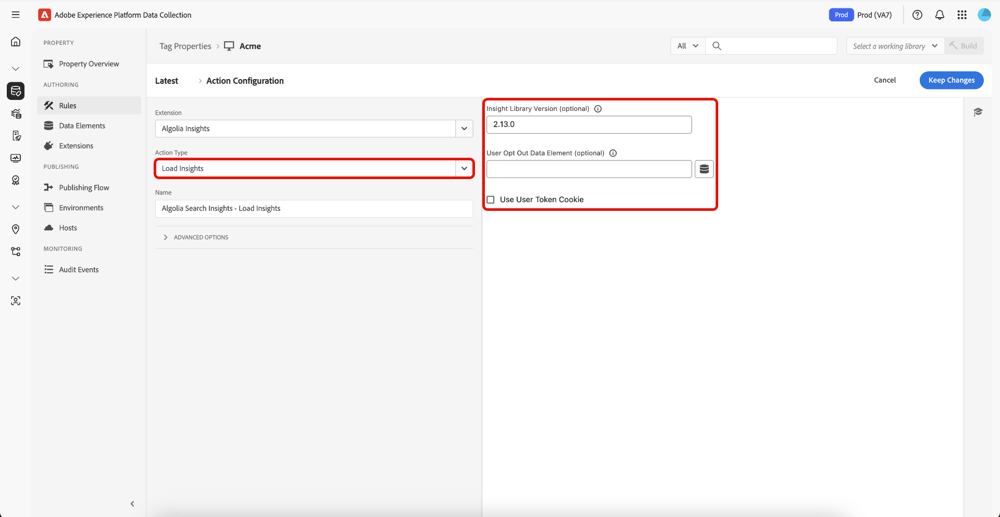
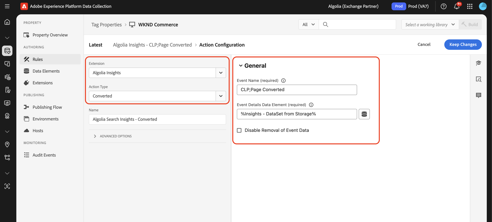
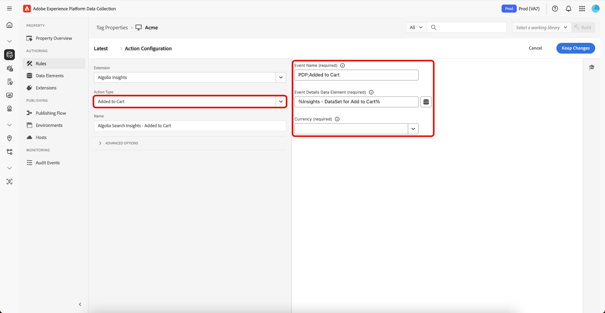
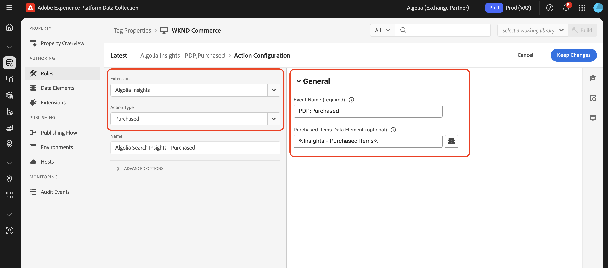
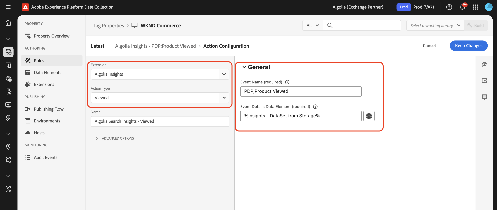
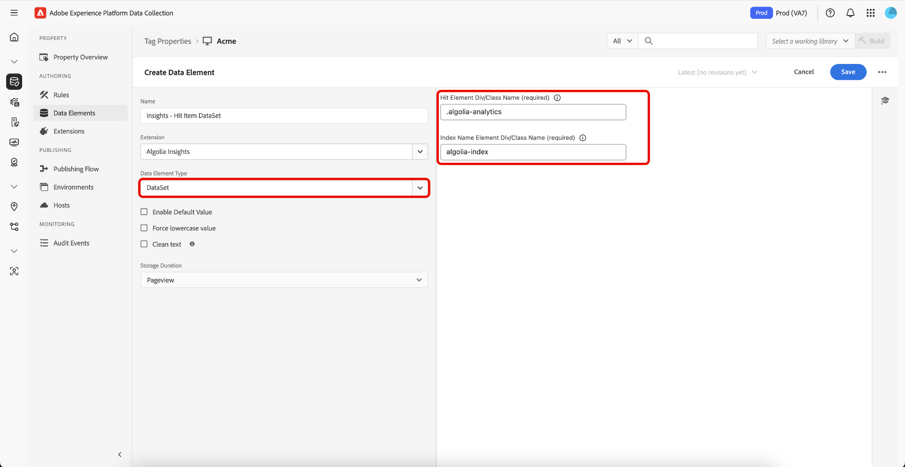
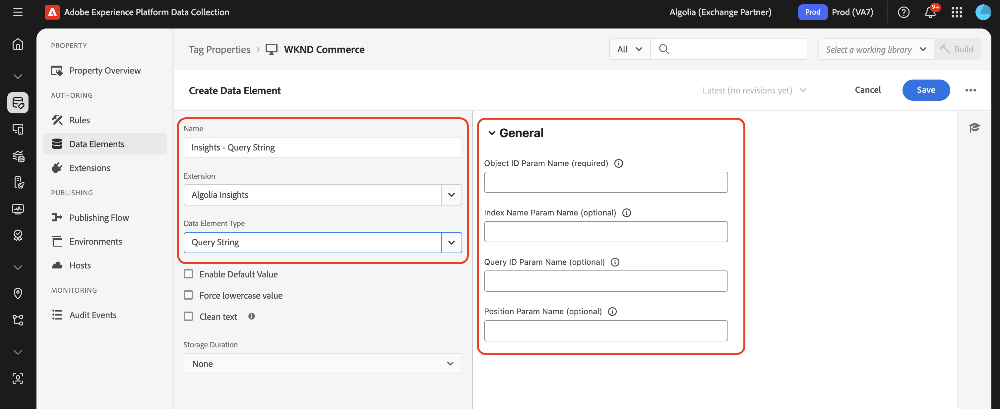
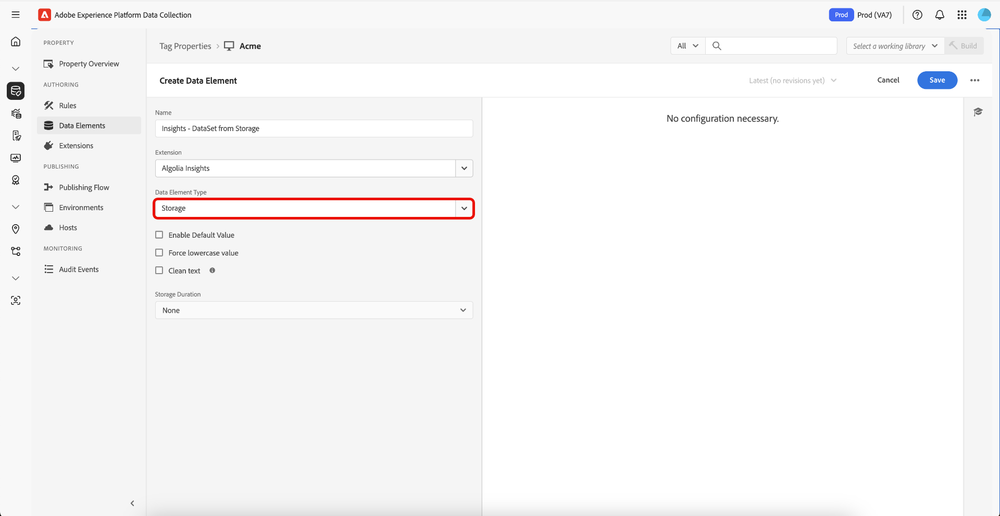

# [!DNL Algolia] タグ拡張機能の概要

[!DNL Algolia] タグ拡張機能を使用すると、マーケターはユーザーインタラクションデータを[!DNL Algolia]に送信するルールを簡単に設定できるようになり、よりパーソナライズされたAI 検索と検出エクスペリエンスを提供できるようになります。

この拡張機能は、次の重要な機能によって強化されています。

* **[!DNL Algolia]インサイト**: ユーザーのインタラクションイベントを自動的に取得して[!DNL Algolia]に送信します。これにより、強力な分析、パーソナライズされたエクスペリエンス、検索の関連性の向上が可能になります。

## 前提条件 {#prerequisites}

この拡張機能を使用するには、有効な[!DNL Algolia] アカウントが必要です。 アカウントを作成するには、[[!DNL Algolia] 登録ページ ](https://dashboard.algolia.com/users/sign_up)に移動します。まだアカウントをお持ちでない場合は、

### 必要な設定の詳細を収集する {#configuration-details}

[!DNL Algolia]をAdobe Experience Platformに接続するには、次の情報が必要です。

| 資格情報 | 説明 | 例 |
| --- | --- | --- |
| アプリケーション ID | お客様のアプリケーション IDは、[ ダッシュボードの](https://www.algolia.com/account/api-keys/all)API キー[!DNL Algolia] セクションにあります。 | 0ABCDEFG12 |
| 検索API キー | 検索API キーは、[ ダッシュボードの](https://www.algolia.com/account/api-keys/all)API キー[!DNL Algolia] セクションにあります。 | 1234a12345678901b1234567890c1ab1 |

## [!DNL Algolia] インサイト拡張機能をインストールして設定します {#install-configure}

[!DNL Algolia] Insights拡張機能をインストールするには、[!UICONTROL Data Collection UI]に移動し、左側のナビゲーションから&#x200B;**[!UICONTROL Tags]**&#x200B;を選択します。 ここで、拡張機能を追加するプロパティを選択するか、代わりに新しいプロパティを作成します。

目的のプロパティを選択または作成したら、左側のナビゲーションで「**[!UICONTROL Extensions]**」を選択し、「**[!UICONTROL Catalog]**」タブを選択します。 [!DNL Algolia] インサイト カードを検索し、**[!UICONTROL Install]**&#x200B;を選択します。



表示される設定ビューで、次の詳細を指定する必要があります。

| プロパティ | 説明 |
| --- | --- |
| [!UICONTROL Application ID] | 以前に収集した[!UICONTROL Application Id]を「[設定の詳細](#configuration-details)」セクションに入力します。 |
| [!UICONTROL Search API Key] | 以前に収集した[!UICONTROL Search API Key]を「[設定の詳細](#configuration-details)」セクションに入力します。 |
| [!UICONTROL Index Name] | [!UICONTROL Index Name]には、製品またはコンテンツが含まれています。  このインデックスはデフォルトとして使用されます。 |
| [!UICONTROL User Token Data Element] | ユーザートークンを返すデータ要素。 |
| [!UICONTROL Authenticated User Token Data Element] | 認証済みユーザートークンを返すデータ要素を設定します。 |
| [!UICONTROL Currency Code] | 通貨コードをUSDやEURなどのISO-4217形式で入力します。 このフィールドはデータ要素をサポートしています。 |


## [!DNL Algolia]個のインサイト拡張機能アクションタイプ {#action-types}

[!DNL Algolia]は、特定のコンテキストとプロパティを持つ、事前定義済みの標準イベントのセットをサポートしています。 [!DNL Algolia]拡張機能で使用できるアクションは、これらのイベントタイプと一致しているため、[!DNL Algolia]に送信するイベントをそのタイプに基づいて簡単に分類および設定できます。

### インサイトの読み込み {#load-insights}

>[!NOTE]
>
>ほとんどの場合、サイトのすべてのページで[!DNL Algolia]個のインサイトを読み込むことをお勧めします。

ルールのコンテキストに基づいて&#x200B;**[!UICONTROL Load Insights]** インサイトを読み込むのに最も意味のある場所で、[!DNL Algolia] アクションをタグルールに追加します。 このアクションは、`search-insights.js` ライブラリをページに読み込みます。

新しいタグルールを作成するか、既存のタグルールを開きます。 要件に従って条件を定義し、**[!UICONTROL Algolia]**&#x200B;を[!UICONTROL Extension]として選択し、**[!UICONTROL Load Insights]**&#x200B;を[!UICONTROL Action Type]として選択します。

| プロパティ | 説明 |
| --- | --- |
| [!UICONTROL Insight Library Version] | [!DNL Algolia] インサイトのバージョン。 デフォルトは `2.17.3` です。 |
| [!UICONTROL User Opt Out Data Element] | ユーザーのトラッキング設定をキャプチャするデータ要素。 |
| [!UICONTROL Use User Token Cookie] | [!DNL Algolia]がユーザートークン Cookieを生成することを許可するには、このチェックボックスをオンにします。 デフォルトでは、このオプションは`true`に設定されています。 |



### クリック済み {#clicked}

タグルールに&#x200B;**[!UICONTROL Click]** アクションを追加して、クリックしたイベントを[!DNL Algolia]に送信します。 新しいタグルールを作成するか、既存のタグルールを開きます。 要件に従って条件を定義し、**[!UICONTROL Algolia]**&#x200B;を[!UICONTROL Extension]として選択し、**[!UICONTROL Clicked]**&#x200B;を[!UICONTROL Action Type]として選択します。

| プロパティ | 説明 |
| --- | --- |
| [!UICONTROL Event Name] | このクリックイベントをさらに絞り込むために使用できるイベント名。 |
| [!UICONTROL Event Details Data Element] | データ要素は、以下を含むイベントの詳細をJSON形式で返します。 <ul><li>`indexName`</li><li>`objectIDs`</li><li>`queryID` （オプション）</li><li>`positions` （オプション）</li><li>`price` （オプション）</li><li>`quantity` （オプション）</li><li>`discount` （オプション）</li><li>`objectData` （オプション）</li><li>`currency` （オプション）</li></ul> |


>[!NOTE]
>
>`queryID`と`positions`の両方が含まれる場合、イベントは検索&#x200B;**の後に** クリックされたオブジェクト IDとして分類されます。 それ以外の場合は、**クリック済みオブジェクト ID** イベントとして分類されます。
><br>
>データ要素が`indexName`を提供しない場合、イベントの送信時に&#x200B;**デフォルトのインデックス名**&#x200B;が使用されます。


イベントカテゴリについて詳しくは、[検索後にクリックしたオブジェクト ID](https://www.algolia.com/doc/api-reference/api-methods/clicked-object-ids-after-search/)を参照してください
と[ クリックしたオブジェクト ID](https://www.algolia.com/doc/api-reference/api-methods/clicked-object-ids/) ガイド。

### コンバージョン済み {#converted}

タグ ルールに&#x200B;**[!UICONTROL Converted]** アクションを追加して、変換済みイベントを[!DNL Algolia]に送信します。 新しいタグルールを作成するか、既存のタグルールを開きます。 要件に従って条件を定義し、**[!UICONTROL Algolia]**&#x200B;を[!UICONTROL Extension]として選択し、**[!UICONTROL Converted]**&#x200B;を[!UICONTROL Action Type]として選択します。

| プロパティ | 説明 |
| --- | --- |
| [!UICONTROL Event Name] | この&#x200B;**convert** イベントをさらに絞り込むために使用されるイベント名。 |
| [!UICONTROL Event Details Data Element] | データ要素は、次のようなイベントの詳細を返します。 <ul><li>`indexName`</li><li>`objectIDs`</li><li>`queryID` （オプション）</li><li>`recordID` （オプション）</li></ul> |

>[!NOTE]
>
>データ要素に`queryId`が含まれている場合、イベントは&#x200B;**検索**&#x200B;の後に変換されたものとして分類されます。 それ以外の場合は、**Converted** イベントとして分類されます。
><br>
>データ要素が`indexName`を提供しない場合、イベントの送信時に&#x200B;**デフォルトのインデックス名**&#x200B;が使用されます。



イベントカテゴリについて詳しくは、[検索後に変換されたオブジェクト ID](https://www.algolia.com/doc/api-reference/api-methods/converted-object-ids-after-search/)および[変換されたオブジェクト ID](https://www.algolia.com/doc/api-reference/api-methods/converted-object-ids/)のガイドを参照してください。

### 買い物かごに追加 {#added-to-cart}

タグ ルールに&#x200B;**[!UICONTROL Added to Cart]** アクションを追加して、追加されたイベントをカート イベントに[!DNL Algolia]に送信します。 新しいタグルールを作成するか、既存のタグルールを開きます。 要件に従って条件を定義し、**[!UICONTROL Algolia]**&#x200B;を[!UICONTROL Extension]として選択し、**[!UICONTROL Added to cart]**&#x200B;を[!UICONTROL Action Type]として選択します。

| プロパティ | 説明 |
| --- | --- |
| [!UICONTROL Event Name] | この&#x200B;**カートに追加** イベントをさらに絞り込むために使用されるイベント名。 |
| [!UICONTROL Event Details Data Element] | データ要素は、以下を含むイベントの詳細をJSON形式で返します。 <ul><li>`indexName`</li><li>`objectIDs`</li><li>`objectData`</li><li>`price`</li><li>`quantity`</li><li>`discount` （オプション）</li><li>`queryID` （オプション）</li><li>`currency` （オプション）</li></ul>。 |

>[!NOTE]
>
>データ要素に`queryId`が含まれている場合、イベントは&#x200B;**検索**&#x200B;の後にカート オブジェクト IDに追加されました。 それ以外の場合は、**カート オブジェクト ID**に追加されたイベントとして分類されます。
><br>
>データ要素が`indexName`を提供しない場合、イベントの送信時に&#x200B;**デフォルトのインデックス名**が使用されます。
><br>
>デフォルトのデータ要素が要件を満たさない場合は、カスタムのデータ要素を作成して、目的のイベントの詳細を返すことができます。



イベントカテゴリについて詳しくは、[検索後にカートオブジェクト IDに追加](https://www.algolia.com/doc/api-reference/api-methods/added-to-cart-object-ids-after-search/)および[ カートオブジェクト IDに追加](https://www.algolia.com/doc/api-reference/api-methods/added-to-cart-object-ids/) ガイドを参照してください。

### 購入日 {#purchased}

タグ ルールに&#x200B;**[!UICONTROL Purchased]** アクションを追加して、購入したイベントを[!DNL Algolia]に送信します。 新しいタグルールを作成するか、既存のタグルールを開きます。 要件に従って条件を定義し、**[!UICONTROL Algolia]**&#x200B;を[!UICONTROL Extension]として選択し、**[!UICONTROL Purchased]**&#x200B;を[!UICONTROL Action Type]として選択します。

| プロパティ | 説明 |
| --- | --- |
| [!UICONTROL Event Name] | この&#x200B;**購入** イベントをさらに絞り込むために使用されるイベント名。 |
| [!UICONTROL Event Details Data Element] | データ要素は、以下を含むイベントの詳細をJSON形式で返します。 <ul><li>`indexName`</li><li>`objectIDs`</li><li>`objectData`</li><li>`price`</li><li>`quantity`</li><li>`discount` （オプション）</li><li>`queryID` （オプション）</li><li>`currency` （オプション）</li></ul>。 |

>[!NOTE]
>
>購入アクションは、購入したアイテム IDに基づいて、ブラウザーストレージからイベントデータを取得します。 購入したアイテムのいずれかに`queryID`が格納されたデータに含まれている場合、イベントは検索&#x200B;**の後に**&#x200B;購入したオブジェクト IDとして分類されます。 それ以外の場合は、**購入したオブジェクト ID** イベントとして分類されます。
><br>
>このアプローチにより、購入イベントには、ユーザーが以前にアイテムとやり取りした際のあらゆる関連コンテキスト（クエリ ID、インデックス名、価格、数量、割引）が自動的に含まれます。



イベントカテゴリについて詳しくは、[検索後に購入したオブジェクト ID](https://www.algolia.com/doc/api-reference/api-methods/purchased-object-ids-after-search/)を参照してください
および[購入したオブジェクト ID](https://www.algolia.com/doc/api-reference/api-methods/purchased-object-ids/) ガイド。

### 表示済み {#viewed}

タグ ルールに&#x200B;**[!UICONTROL Viewed]** アクションを追加して、購入したイベントを[!DNL Algolia]に送信します。 新しいタグルールを作成するか、既存のタグルールを開きます。 要件に従って条件を定義し、**[!UICONTROL Algolia]**&#x200B;を[!UICONTROL Extension]として選択し、**[!UICONTROL Viewed]**&#x200B;を[!UICONTROL Action Type]として選択します。

| プロパティ | 説明 |
| --- | --- |
| [!UICONTROL Event Name] | この&#x200B;**ビュー** イベントをさらに絞り込むために使用されるイベント名。 |
| [!UICONTROL Event Details Data Element] | データ要素は、以下を含むイベントの詳細をJSON形式で返します。 <ul><li>`indexName`</li><li>`objectIDs`</li></ul> |

>[!NOTE]
>
>データ要素が`indexName`を提供しない場合、**デフォルトのインデックス名**&#x200B;がイベントの送信時に使用されます。



ビューイベントについて詳しくは、[表示されたオブジェクト ID](https://www.algolia.com/doc/api-reference/api-methods/viewed-object-ids/) ガイドを参照してください。

## [!DNL Algolia]個のインサイト拡張機能のデータ要素 {#data-elements}

[!DNL Algolia]は、特定のコンテキストとプロパティを持つ事前定義済みデータ要素のセットをサポートしています。 次の節では、[!DNL Algolia] インサイト拡張機能で使用可能なデータ要素について説明します。

### DataSet {#dataset}

DataSet Data Elementは、HTML要素に関連付けられたデータを取得し、その後[!DNL Algolia]個のアクションで使用されます。 このデータ要素は、後で使用するために（コンバージョンイベントや購入イベントなど）取得したイベントデータをブラウザストレージに自動的に保存します。

**一般設定：**

| プロパティ | 説明 |
| --- | --- |
| [!UICONTROL Hit Element Div/Class Name] | HTML要素名および/またはCSS クラス名。HTML要素上の`data-insights-object-id`とオプションで`data-insights-query-id`および`data-insights-position`を含むデータセット属性が含まれています。 |
| [!UICONTROL Index Name Element Div/Class Name] | HTML要素上のデータセット属性（`data-indexname`）を持つHTML要素名またはCSS クラス名。 |

**Commerce設定（オプション）:**

| プロパティ | 説明 |
| --- | --- |
| [!UICONTROL Price Data Element] | 項目の価格を返すデータ要素。 提供された場合、これはコマースイベントの保存されたイベントデータに含まれます。 |
| [!UICONTROL Quantity Data Element] | 項目の数量を返すデータ要素。 指定しない場合、デフォルトは1です。 |
| [!UICONTROL Discount Data Element] | 項目の割引小数点値を返すデータ要素。 |
| [!UICONTROL Currency Code] | ISO-4217形式の通貨コード。 通貨コードが指定されていない場合は、拡張機能の設定のデフォルト通貨が使用されます。 |

**上書き（オプション）:**

これらのフィールドを使用すると、HTML データセット属性からデータを取得するデフォルトの動作を上書きできます。

| プロパティ | 説明 |
| --- | --- |
| [!UICONTROL Record ID Data Element] | レコード IDとしてページ URLを使用するデフォルトのアプローチを上書きします。 レコード IDは、この製品/ページの[!DNL Algolia]に送信するデータの保存と検索に使用されます。 |
| [!UICONTROL Query ID Data Element] | クエリ IDは、HTML要素のデータセットから取得されます。 この動作を上書きするには、このプロパティを使用して、クエリ IDを文字列として返すデータ要素を指定します。 |
| [!UICONTROL Object IDs Data Element] | オブジェクト IDは、HTML要素のデータセットから取得されます。 この動作を上書きするには、このプロパティを使用して、オブジェクト IDを配列として返すデータ要素を指定します。 |
| [!UICONTROL Positions Data Element] | Positionsは、HTML要素のデータセットから取得されます。 この動作を上書きするには、このプロパティを使用して、Positionsを配列として返すデータ要素を指定します。 |
| [!UICONTROL Index Name Data Element] | インデックス名は、HTML要素のデータセットから取得されます。 この動作を上書きするには、このプロパティを使用して、索引名を文字列として返すデータ要素を指定します。 |



このデータ要素は次を返します。

```javascript
{
  timestamp,
  queryID,
  indexName,
  objectIDs,
  positions,
  objectData,  // Optional: commerce data if price is provided
  currency,    // Optional: if provided
  recordID
}
```

データセットを含むHTMLの例：

```html
<div data-indexname="acme_master_default_products" class="instant-search-comp__hits">
  <div class="hit-card"
    data-insights-object-id="${hit.objectID}"
    data-insights-position="${hit.__position}"
    data-insights-query-id="${hit.__queryID}">
    <h4 class="hit-name">...</h4>   
  </div>
</div>
```

### クエリ文字列 {#query-string}

クエリ文字列データ要素は、[!DNL Algolia] アクションで使用するURL クエリ文字列からデータを抽出します。

| プロパティ | 説明 |
| --- | --- |
| [!UICONTROL Object ID Param Name] | オブジェクト IDを含むクエリパラメーター名。 |
| [!UICONTROL Index Name Param Name] | インデックス名を含むクエリパラメーター名。 |
| [!UICONTROL Query ID Param Name] | クエリ IDを含むクエリパラメーター名。 |
| [!UICONTROL Position Param Name] | Positionを含むクエリパラメーター名。 |



このデータ要素は次を返します。

```javascript
{
  timestamp,
  queryID,
  indexName,
  objectIDs,
  positions
}
```

クエリパラメーターを含むHTMLの例：

```html
<a href="product.html?objectID=${hit.objectID}&queryID=${hit.__queryID}&indexName=${indexName}&position=${hit.position}">Read More</a>
```

### ストレージ {#storage}

ストレージ データ要素は、[!DNL Algolia] アクションで使用するブラウザーセッション ストレージからデータを取得します。 このデータ要素は、追加のコマース情報を使用して、格納されたデータを拡張するためにも使用できます。

このデータ要素は、セッションストレージに以前に保存されたイベントの詳細を取得します（通常は、クリックイベント中にDataSet データ要素によって取得されます）。 削除が明示的に無効になっていない限り、コンバージョンイベント中にデータが自動的に削除されます。

**上書き（オプション）:**

| プロパティ | 説明 |
| --- | --- |
| [!UICONTROL Record ID Data Element] | レコード IDは、ブラウザーストレージに保存されているイベントデータを検索するためのキーとして使用されます。 ページ URLはデフォルトのレコード IDです。 この動作を上書きするには、このプロパティを使用して、レコード IDを文字列として返すデータ要素を指定します。 |
| [!UICONTROL Price Data Element] | 項目の価格を返すデータ要素。 提供された場合、これは保存されたイベントデータを価格情報で更新します。 |
| [!UICONTROL Quantity Data Element] | 項目の数量を返すデータ要素。 これを指定すると、保存されたイベントデータが数量情報で更新されます。 |
| [!UICONTROL Discount Data Element] | 項目の割引小数点値を返すデータ要素。 提供された場合、これは保存されたイベントデータを割引情報で更新します。 |
| [!UICONTROL Currency Code] | ISO-4217形式で通貨コードを入力します。 これを指定すると、保存されたイベントデータが通貨情報で更新されます。 |



このデータ要素は、拡張コマースデータを含む、セッションストレージに保存されているものを返します。

```javascript
{
  timestamp,
  queryID,
  indexName,
  objectIDs,
  positions,      // If available from original event
  objectData,     // Optional: commerce data if price is provided
  currency,       // Optional: if provided
  recordID
}
```

## 検索後にクリックまたは変換 {#clicked-converted-after-search}

検索&#x200B;*後にクリックされた*&#x200B;または検索&#x200B;*後に変換された* イベントには`queryID`が必要です。また、検索`positions`後にクリックされた&#x200B;*件には*&#x200B;も必要です。 これらのプロパティは、`insights` フラグがInstantSearchおよび/またはオートコンプリート クエリ パラメーターで有効になっている場合に使用できます。 サイトにインサイトを設定する方法については、次のリソースを参照してください。

* [ オートコンプリートに関するインサイトの設定](https://www.algolia.com/doc/ui-libraries/autocomplete/api-reference/autocomplete-js/autocomplete/#param-insights)
* [InstantSearch.jsでのインサイトの設定](https://www.algolia.com/doc/guides/building-search-ui/events/js/#set-the-insights-option-to-true)
* [ クリックとコンバージョンイベントの概要](https://www.algolia.com/doc/guides/sending-events/implementing/how-to/sending-events-backend/)
* [送信中 [!DNL Algolia]  インサイトイベント ](https://www.algolia.com/doc/ui-libraries/autocomplete/guides/sending-algolia-insights-events/)
* [[!DNL Algolia] 拡張機能GitHub リポジトリを起動](https://github.com/algolia/algolia-launch-extension)
* [InstantSearch.js ドキュメント ](https://www.algolia.com/doc/guides/building-search-ui/what-is-instantsearch/js/)
* [[!DNL Algolia] Insights API ドキュメント ](https://www.algolia.com/doc/rest-api/insights/)
* [Algolia Launch拡張機能コード リポジトリ ](https://github.com/algolia/algolia-launch-extension)

## 次の手順 {#next-steps}

このガイドでは、[!DNL Algolia] タグ拡張機能を使用して[!DNL Algolia Insights]にデータを送信する方法について説明しました。 サーバーサイドのイベントを[!DNL Algolia]にも送信することを計画している場合は、[[!DNL Conversions API]  イベント転送拡張機能](../../server/algolia/overview.md)のインストールと設定に進むことができます。

Experience Platformのタグについて詳しくは、[ タグの概要](../../../home.md)を参照してください。
