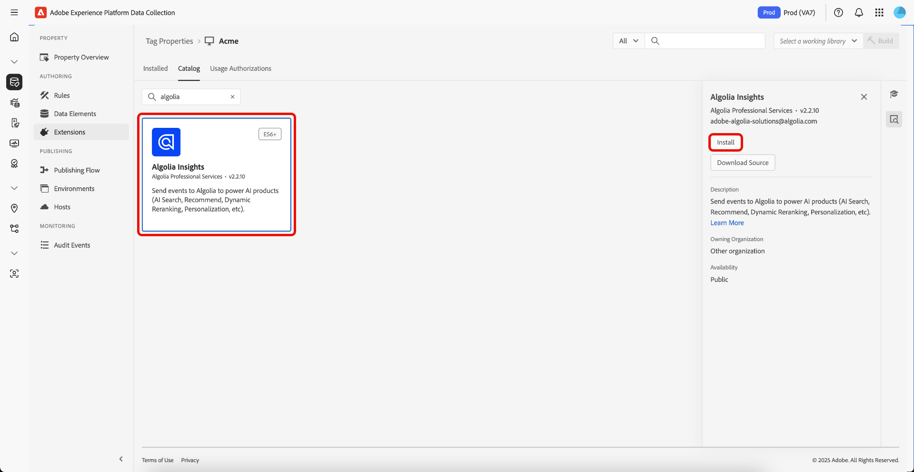

# [!DNL Algolia] Tags 拡張機能の概要

[!DNL Algolia] タグ拡張機能を使用すると、マーケターはユーザーインタラクションデータを [!DNL Algolia] に送信するルールを簡単に設定でき、AI 検索および検出エクスペリエンスをよりパーソナライズできるようになります。

この拡張機能は、次のような主要な機能によって動作します。

* **[!DNL Algolia]Insights**: ユーザーインタラクションイベントを自動的にキャプチャして [!DNL Algolia] に送信します。これにより、強力な分析、パーソナライズされたエクスペリエンス、検索の関連性の向上を可能にします。

## 前提条件 {#prerequisites}

この拡張機能を使用するには、有効な [!DNL Algolia] アカウントが必要です。 アカウントをまだお持ちでない場合は、[[!DNL Algolia]  新規登録ページ ](https://dashboard.algolia.com/users/sign_up) に移動してアカウントを作成してください。

### 必要な設定の詳細の収集 {#configuration-details}

[!DNL Algolia] をAdobe Experience Platformに接続するには、次の情報が必要です。

| 資格情報 | 説明 | 例 |
| --- | --- | --- |
| アプリケーション ID | お使いのアプリケーション ID は、アプリ [ ーションダッシュボードの「](https://www.algolia.com/account/api-keys/all)API キー [!DNL Algolia]」セクションにあります。 | 0ABCDEFG12 |
| 検索 API キー | 検索 API キーは、[ ールダッシュボードの「](https://www.algolia.com/account/api-keys/all)API キー [!DNL Algolia]」セクションにあります。 | 1234a12345678901b1234567890c1ab1 |

## [!DNL Algolia] Insights 拡張機能のインストールと設定 {#install-configure}

[!DNL Algolia] Insights 拡張機能をインストールするには、[!UICONTROL &#x200B; データ収集 UI] に移動し、左側のナビゲーションから **[!UICONTROL タグ]** を選択します。 ここから、拡張機能を追加するプロパティを選択するか、代わりに新しいプロパティを作成します。

目的のプロパティを選択または作成したら、左側のナビゲーションで **[!UICONTROL 拡張機能]** を選択し、「**[!UICONTROL カタログ]**」タブを選択します。 [!DNL Algolia] Insights カードを検索し、「**[!UICONTROL インストール]**」を選択します。



表示される設定ビューで、次の詳細を指定する必要があります。

| プロパティ | 説明 |
| --- | --- |
| [!UICONTROL アプリケーション ID] | 「[!UICONTROL &#x200B; 設定の詳細 &#x200B;]」セクションで以前に収集した [ アプリケーション ID](#configuration-details) を入力します。 |
| [!UICONTROL &#x200B; 検索 API キー &#x200B;] | 「[!UICONTROL &#x200B; 設定の詳細 &#x200B;] セクションで以前に収集した [ 検索 API キー ](#configuration-details) を入力します。 |
| [!UICONTROL &#x200B; インデックス名 &#x200B;] | [!UICONTROL &#x200B; インデックス名 &#x200B;] には、製品またはコンテンツが含まれます。  このインデックスは、デフォルトとして使用されます。 |
| [!UICONTROL &#x200B; ユーザートークンデータ要素 &#x200B;] | ユーザートークンを返すデータ要素。 |
| [!UICONTROL &#x200B; 認証済みユーザートークンデータ要素 &#x200B;] | 認証済みユーザートークンを返すデータ要素を設定します。 |
| [!UICONTROL 通貨] | 通貨タイプを選択します。 デフォルト値は `USD` に設定されています。 |


## [!DNL Algolia] Insights 拡張機能のアクションタイプ {#action-types}

[!DNL Algolia] れぞれ特定のコンテキストとプロパティを持つ、事前定義済みの一連の標準イベントをサポートしています。 [!DNL Algolia] 拡張機能で使用できるアクションはこれらのイベントタイプに一致するため、タイプに基づいて [!DNL Algolia] に送信するイベントを簡単に分類および設定できます。

### インサイトの読み込み {#load-insights}

>[!NOTE]
>
>ほとんどの場合、サイトのすべてのページに [!DNL Algolia] Insights を読み込むことをお勧めします。

ルールのコンテキストに基づいてインサイトを読み込む場合に最も適した場所で、タグルールに **[!UICONTROL インサイトを読み込み]** アクション [!DNL Algolia] 追加します。 `search-insights.js` ライブラリをページに読み込みます。

新しいタグルールを作成するか、既存のルールを開きます。 要件に従って条件を定義し、**[!UICONTROL 拡張機能]** として [!UICONTROL Algolia] を選択し、**[!UICONTROL アクションタイプ]** として [!UICONTROL &#x200B; インサイトを読み込み &#x200B;] を選択します。

| プロパティ | 説明 |
| --- | --- |
| [!UICONTROL Insight ライブラリのバージョン &#x200B;] | [!DNL Algolia] Insights のバージョン。 デフォルトは `2.13.0` です。 |
| [!UICONTROL &#x200B; ユーザーのオプトアウトデータ要素 &#x200B;] | ユーザーのトラッキング環境設定をキャプチャするデータ要素。 |
| [!UICONTROL &#x200B; ユーザートークン Cookie の使用 &#x200B;] | ユーザートークン Cookie の生成を許可する [!DNL Algolia] 合は、このチェックボックスをオンにします。 デフォルトでは、このオプションは `false` に設定されています。 |


### クリック済み {#clicked}

**[!UICONTROL クリック]** アクションをタグルールに追加して、クリックされたイベントを [!DNL Algolia] に送信します。 新しいタグルールを作成するか、既存のルールを開きます。 要件に従って条件を定義し、**[!UICONTROL 拡張機能]** として [!UICONTROL &#x200B; アルゴリア &#x200B;] を選択、**[!UICONTROL アクションタイプ]** として [!UICONTROL &#x200B; クリック済み &#x200B;] を選択します。

| プロパティ | 説明 |
| --- | --- |
| [!UICONTROL &#x200B; イベント名 &#x200B;] | このクリックイベントをさらに絞り込むために使用できるイベント名。 |
| [!UICONTROL &#x200B; イベントの詳細データ要素 &#x200B;] | データ要素は、次のようなイベントの詳細を返します。 <ul><li>`indexName`</li><li>`objectIDs`</li><li>`queryID` （オプション）</li><li>`position` （オプション）</li></ul> |
| [!UICONTROL &#x200B; レコード ID データ要素 &#x200B;] | レコード ID は、`click` イベント中にブラウザーのストレージに保存されるイベントデータのキーとして使用されます。 デフォルトでは、ページ URL はレコード ID となります。 この動作をオーバーライドするには、このプロパティを使用して、レコード ID を文字列として返すデータ要素を指定します。 |

>[!NOTE]
>
>`queryID` と `position` の両方が含まれる場合、イベントは **検索後にクリックされたオブジェクト ID** に分類されます。 それ以外の場合は、「クリックされたオブジェクト ID **イベントとしてクラス** されます。
>&#x200B;><br>
>&#x200B;>データ要素で `indexName` が指定されない場合、イベントが送信される際に **デフォルトのインデックス名** が使用されます。


イベントカテゴリについて詳しくは、[ 検索後にクリックされたオブジェクト ID](https://www.algolia.com/doc/api-reference/api-methods/clicked-object-ids-after-search/) を参照してください。
と [ クリックオブジェクト ID](https://www.algolia.com/doc/api-reference/api-methods/clicked-object-ids/) ガイド。

### 変換済 {#converted}

**[!UICONTROL 変換済み]** アクションをタグルールに追加して、変換済みのイベントを [!DNL Algolia] に送信します。 新しいタグルールを作成するか、既存のルールを開きます。 要件に従って条件を定義し、**[!UICONTROL 拡張機能]** として [!UICONTROL &#x200B; アルゴリア &#x200B;] を選択し、**[!UICONTROL アクションタイプ]** として [!UICONTROL &#x200B; 変換済み &#x200B;] を選択します。

| プロパティ | 説明 |
| --- | --- |
| [!UICONTROL &#x200B; イベント名 &#x200B;] | この **convert** イベントをさらに絞り込むために使用されるイベント名。 |
| [!UICONTROL &#x200B; イベントの詳細データ要素 &#x200B;] | データ要素は、次のようなイベントの詳細を返します。 <ul><li>`indexName`</li><li>`objectIDs`</li><li>`queryID` （オプション）</li></ul> |
| [!UICONTROL &#x200B; イベントデータの削除の無効化 &#x200B;] | コンバージョンイベントでは、イベントデータがストレージから削除されます。 後続のコンバージョンイベントでこのデータが必要な場合は、削除プロセスを無効にして、イベントデータを引き続き使用できるようにします。 |
| [!UICONTROL &#x200B; レコード ID データ要素 &#x200B;] | レコード ID は、ブラウザーストレージに保存されているイベントデータを検索するためのキーとして使用されます。 デフォルトのレコード ID はページ URL です。 この動作をオーバーライドするには、このプロパティを使用して、レコード ID を文字列として返すデータ要素を指定します。 |

>[!NOTE]
>
>データ要素に `queryId` が含まれる場合、イベントは **検索後に変換済み** と分類されます。 そうでない場合は、**変換済み** イベントとして分類されます。
>&#x200B;><br>
>&#x200B;>データ要素で `indexName` が指定されない場合、イベントが送信される際に **デフォルトのインデックス名** が使用されます。


イベント カテゴリの詳細については、「[ 検索後の変換済みオブジェクト ID](https://www.algolia.com/doc/api-reference/api-methods/converted-object-ids-after-search/)」および [ 変換済みオブジェクト ID](https://www.algolia.com/doc/api-reference/api-methods/converted-object-ids/) ガイドを参照してください。

### 買い物かごに追加 {#added-to-cart}

タグルールに **[!UICONTROL 買い物かごに追加]** アクションを追加して、追加した買い物かごへのイベントを [!DNL Algolia] に送信します。 新しいタグルールを作成するか、既存のルールを開きます。 要件に従って条件を定義し、**[!UICONTROL 拡張機能]** として [!UICONTROL Algolia] を選択し、**[!UICONTROL アクションタイプ]** として [!UICONTROL &#x200B; 買い物かごに追加 &#x200B;] を選択します。

| プロパティ | 説明 |
| --- | --- |
| [!UICONTROL &#x200B; イベント名 &#x200B;] | この **convert** イベントをさらに絞り込むために使用されるイベント名。 |
| [!UICONTROL &#x200B; イベントの詳細データ要素 &#x200B;] | データ要素は、次のようなイベントの詳細を返します。 <ul><li>`indexName`</li><li>`objectIDs`</li><li>`objectData`<ul><li>`queryID` （オプション）</li><li>`price`</li><li>`quantity`</li><li>`discount`</li></ul></li><li>`queryID` （オプション）</li></ul>。 |
| [!UICONTROL 通貨] | 通貨タイプを選択します。 デフォルト値は `USD` に設定されています。 |

>[!NOTE]
>
>データ要素に「`queryId`」が含まれる場合、イベントは「**検索後に買い物かごのオブジェクト ID に追加** と分類されます。 そうでない場合は、**買い物かごオブジェクト ID に追加** イベントとして分類されます。
>&#x200B;><br>
>&#x200B;>データ要素で `indexName` が指定されない場合、イベントが送信される際に **デフォルトのインデックス名** が使用されます。
>&#x200B;><br>
>&#x200B;>デフォルトのデータ要素が要件を満たさない場合は、目的のイベントの詳細を返すカスタムのデータ要素を作成できます。


イベントカテゴリについて詳しくは、[ 検索後に買い物かごオブジェクト ID に追加 ](https://www.algolia.com/doc/api-reference/api-methods/added-to-cart-object-ids-after-search/) および [ 買い物かごオブジェクト ID に追加 ](https://www.algolia.com/doc/api-reference/api-methods/added-to-cart-object-ids/) ガイドを参照してください。

### Purchased {#purchased}

タグルールに **[!UICONTROL 購入済み]** アクションを追加して、購入したイベントを [!DNL Algolia] に送信します。 新しいタグルールを作成するか、既存のルールを開きます。 要件に従って条件を定義し、**[!UICONTROL 拡張機能]** として [!UICONTROL &#x200B; アルゴリア &#x200B;] を選択し、**[!UICONTROL アクションタイプ]** として [!UICONTROL &#x200B; 購入済み &#x200B;] を選択します。

| プロパティ | 説明 |
| --- | --- |
| [!UICONTROL &#x200B; イベント名 &#x200B;] | この **購入** イベントをさらに絞り込むために使用されるイベント名。 |
| [!UICONTROL &#x200B; イベントの詳細データ要素 &#x200B;] | データ要素は、次のようなイベントの詳細を返します。 <ul><li>`indexName`</li><li>`objectIDs`</li><li>`objectData`<ul><li>`queryID` （オプション）</li><li>`price`</li><li>`quantity`</li><li>`discount`</li></ul></li><li>`queryID` （オプション）</li></ul>。 |
| [!UICONTROL 通貨] | 通貨タイプを選択します。 デフォルト値は `USD` に設定されています。 |

>[!NOTE]
>
>データ要素に `queryId` が含まれる場合、イベントは **検索後の購入したオブジェクト ID** に分類されます。 それ以外の場合は、**購入したオブジェクト ID** イベントとして分類されます。
>&#x200B;><br>
>&#x200B;>データ要素で `indexName` が指定されない場合、イベントが送信される際に **デフォルトのインデックス名** が使用されます。
>&#x200B;><br>
>&#x200B;>デフォルトのデータ要素が要件を満たさない場合は、目的のイベントの詳細を返すカスタムのデータ要素を作成できます。


イベントカテゴリについて詳しくは、[ 検索後の購入したオブジェクト ID](https://www.algolia.com/doc/api-reference/api-methods/purchased-object-ids-after-search/) を参照してください
と [ 購入済みオブジェクト ID](https://www.algolia.com/doc/api-reference/api-methods/purchased-object-ids/) ガイド。

### 表示済み {#viewed}

タグルールに **[!UICONTROL 閲覧済み]** アクションを追加して、購入したイベントを [!DNL Algolia] に送信します。 新しいタグルールを作成するか、既存のルールを開きます。 要件に従って条件を定義し、**[!UICONTROL 拡張機能]** として [!UICONTROL &#x200B; アルゴリア &#x200B;] を選択し、**[!UICONTROL アクションタイプ]** として [!UICONTROL &#x200B; 閲覧済み &#x200B;] を選択します。

| プロパティ | 説明 |
| --- | --- |
| [!UICONTROL &#x200B; イベント名 &#x200B;] | この **表示** イベントをさらに絞り込むために使用されるイベント名。 |
| [!UICONTROL &#x200B; イベントの詳細データ要素 &#x200B;] | データ要素は、次のようなイベントの詳細を返します。 <ul><li>`indexName`</li><li>`objectIDs`</li></ul> |

>[!NOTE]
>
>データ要素で `indexName` が指定されない場合は、イベントの送信時に **デフォルトのインデックス名** が使用されます。


表示イベントについて詳しくは、「[ 表示されたオブジェクト ID](https://www.algolia.com/doc/api-reference/api-methods/viewed-object-ids/)」ガイドを参照してください。

## [!DNL Algolia] Insights 拡張機能のデータ要素 {#data-elements}

[!DNL Algolia] は、それぞれ特定のコンテキストとプロパティを持つ、事前定義済みの一連のデータ要素をサポートしています。 以下の節では、[!DNL Algolia] Insights 拡張機能で使用できるデータ要素について説明します。

### DataSet {#dataset}

DataSet Data Element は、HTML要素に関連付けられたデータを取得し、そのデータを [!DNL Algolia] のアクションで使用します。

| プロパティ | 説明 |
| --- | --- |
| [!UICONTROL &#x200B; ヒット要素の Div/クラス名 &#x200B;] | HTML要素の `data-insights-object-id`、オプションで `data-insights-query-id` などのデータセット属性を含む `data-insights-position`HTML要素名と CSS クラス名。 |
| [!UICONTROL &#x200B; インデックス名要素 Div/クラス名 &#x200B;] | HTML要素のデータセット属性（`data-indexname`）を持つHTML要素名や CSS クラス名。 |
| [!UICONTROL &#x200B; クエリ ID データ要素 &#x200B;] | クエリ ID は、HTML要素のデータセットから取得されます。 この動作をオーバーライドするには、このプロパティを使用して、クエリ ID を文字列として返すデータ要素を指定します。 |
| [!UICONTROL &#x200B; オブジェクト ID データ要素 &#x200B;] | オブジェクト ID は、HTML要素のデータセットから取得されます。 この動作をオーバーライドするには、このプロパティを使用して、オブジェクト ID を配列として返すデータ要素を指定します。 |
| [!UICONTROL &#x200B; 位置データ要素 &#x200B;] | Positions は、HTML要素のデータセットから取得されます。 この動作をオーバーライドするには、このプロパティを使用して、位置を配列として返すデータ要素を指定します。 |
| [!UICONTROL &#x200B; インデックス名データ要素 &#x200B;] | インデックス名は、HTML要素のデータセットから取得されます。 この動作をオーバーライドするには、このプロパティを使用して、インデックス名を文字列として返すデータ要素を指定します。 |


このデータ要素は次を返します。

```javascript
{
  timestamp,
  queryID,
  indexName,
  objectIDs,
  positions
}
```

データセットを含むHTMLの例：

```html
<div data-indexname="acme_master_default_products" class="instant-search-comp__hits">
  <div class="hit-card"
    data-insights-object-id="${hit.objectID}"
    data-insights-position="${hit.__position}"
    data-insights-query-id="${hit.__queryID}">
    <h4 class="hit-name">...</h4>   
  </div>
</div>
```

### クエリ文字列 {#query-string}

クエリ文字列データ要素は、URL クエリ文字列からデータを抽出し、[!DNL Algolia] のアクションで使用します。

| プロパティ | 説明 |
| --- | --- |
| [!UICONTROL &#x200B; オブジェクト ID パラメーター名 &#x200B;] | オブジェクト ID を含むクエリパラメーター名。 |
| [!UICONTROL &#x200B; インデックス名パラメーター名 &#x200B;] | インデックス名を含んだクエリパラメーター名。 |
| [!UICONTROL &#x200B; クエリ ID パラメーター名 &#x200B;] | クエリ ID を含むクエリパラメーター名。 |
| [!UICONTROL &#x200B; 位置パラメーター名 &#x200B;] | Position を含むクエリパラメーター名。 |


このデータ要素は次を返します。

```javascript
{
  timestamp,
  queryID,
  indexName,
  objectIDs
}
```

クエリパラメーターを含むHTMLの例。

```
<a href="product.html?objectID=${hit.objectID}&queryID=${hit.__queryID}&indexName=${indexName}&position=${hit.position}">Read More</a>
```

### ストレージ {#storage}

ストレージ・データ要素は、アクションで使用するためにセッション・ストレージからデータ [!DNL Algolia] 取得します。

このデータ要素は、セッションストレージからイベントの詳細を取得します。 設定は不要です。 データは、*クリック* イベントアクション中に自動的に追加され、*変換* イベントアクション中に削除されます。

| プロパティ | 説明 |
| --- | --- |
| [!UICONTROL &#x200B; レコード ID データ要素 &#x200B;] | レコード ID は、ブラウザーストレージに保存されているイベントデータを検索するためのキーとして使用されます。 デフォルトのレコード ID はページ URL です。 この動作をオーバーライドするには、このプロパティを使用して、レコード ID を文字列として返すデータ要素を指定します。 |


このデータ要素は、セッションストレージに保存されているものを返します。

```javascript
{
  timestamp,
  queryID,
  indexName,
  objectIDs
}
```

## 検索後にクリックまたは変換 {#clicked-converted-after-search}

*検索後にクリック済み* または *検索後に変換済み* イベントには `queryId` が必要です。また、`position` 検索後にクリック済み *にも* が必要です。 これらのプロパティは、InstantSearch やオートコンプリートのクエリパラメーターで `insights` フラグが有効な場合に使用できます。 サイトに関するインサイトの設定方法については、次のリソースを参照してください。

* [ オートコンプリートでのインサイトの設定 ](https://www.algolia.com/doc/ui-libraries/autocomplete/api-reference/autocomplete-js/autocomplete/#param-insights)
* [InstantSearch.js での Insights の設定 ](https://www.algolia.com/doc/guides/building-search-ui/events/js/#set-the-insights-option-to-true)
* [ クリックおよびコンバージョンイベントの概要 ](https://www.algolia.com/doc/guides/sending-events/implementing/how-to/sending-events-backend/)
* [Sending [!DNL Algolia] Insights イベント ](https://www.algolia.com/doc/ui-libraries/autocomplete/guides/sending-algolia-insights-events/)
* [[!DNL Algolia] Launch 拡張機能 GitHub リポジトリ ](https://github.com/algolia/algolia-launch-extension)
* [InstantSearch.js のドキュメント ](https://www.algolia.com/doc/guides/building-search-ui/what-is-instantsearch/js/)
* [[!DNL Algolia] Insights API ドキュメント ](https://www.algolia.com/doc/rest-api/insights/)
* [Algolia Launch 拡張機能コードリポジトリ ](https://github.com/algolia/algolia-launch-extension)

## 次の手順 {#next-steps}

このガイドでは、[!DNL Algolia] タグ拡張機能を使用して [!DNL Algolia Insights] にデータを送信する方法について説明しました。 サーバーサイドのイベントも [!DNL Algolia] に送信することを計画している場合は、[[!DNL Conversions API]  イベント転送拡張機能 ](../../server/algolia/overview.md) のインストールと設定に進むことができます。

Experience Platformのタグについて詳しくは、[ タグの概要 ](../../../home.md) を参照してください。
