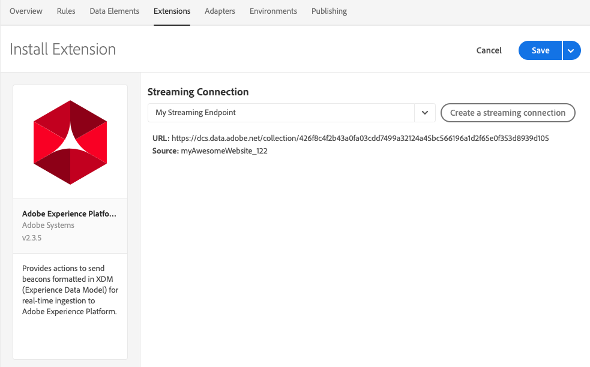

# Adobe Experience Platform デモ拡張機能

>[!NOTE]
>
>Adobe Experience Platform Launch は、Adobe Experience Platform のデータ収集テクノロジースイートとしてリブランドされています。 その結果、製品ドキュメント全体でいくつかの用語が変更されました。用語の変更点の一覧については、次の[ドキュメント](../../../term-updates.md)を参照してください。

>[!NOTE]
>
>この拡張機能は廃止され、[Adobe Experience Platform Web SDK](../sdk/overview.md) に置き換わりました。

この拡張機能の内容は、新しい拡張機能に移植されています。現在の機能の簡単な比較を示します。

| Platform デモ拡張機能 | Platform Web SDK |
| ------------------ | ----------- |
| カスタム顧客 ID のサポート | カスタム顧客 ID のサポート |
| XDM 用のクライアント側マッピング UI | ECID で構築（visitor.js は不要） |
| ストリーミング接続の作成 | オプトインのサポート |
|  | データ要素としての XDM のサポート |
|  | ファーストパーティドメインのサポート |
|  | 組み込みのデバッグツール |
|  | ブラウザーコンテキストを自動的に収集 |
|  | 完全なオープンソース |

## Adobe Experience Platform 拡張機能の設定

この節では、Adobe Experience Platform 拡張機能を設定する際に使用できるオプションについて説明します。

Adobe Experience Platform 拡張機能がまだインストールされていない場合は、プロパティを開いて、**[!UICONTROL 拡張機能／カタログ]**&#x200B;を選択し、Adobe Experience Platform 拡張機能にカーソルを置いて「**[!UICONTROL インストール]**」を選択します。

拡張機能を設定するには、「[!UICONTROL エクステンション]」タブを開き、拡張機能にカーソルを置いて「**[!UICONTROL 設定]**」を選択します。

### ストリーミング接続

Adobe Experience Platform へのデータのストリーミングを開始する際、最初の手順は、ストリーミング接続を選択することです。ストリーミング接続のコンボボックスからいずれかを選択できます。ストリーミング接続は必須フィールドです。ストリーミング接続が作成されていない場合は、「**[!UICONTROL ストリーミング接続を作成]**」ボタンを選択して作成できます。

「**[!UICONTROL ストリーミング接続を作成]**」を選択すると、モーダルウィンドウが表示されます。

モーダルには、値が事前入力されたフィールドが含まれています。この値は必要に応じて変更できます。複数のストリーミング接続を作成する場合は、**[!UICONTROL データソース]**&#x200B;フィールドを一意にする必要があります。別の接続で既に使用されている&#x200B;**[!UICONTROL データソース]**&#x200B;を使用して別のストリーミング接続を作成しようとすると、失敗します。

ストリーミングエンドポイントを選択すると、ストリーミングエンドポイントの URL とソースが表示されます。

## Adobe Experience Platform 拡張のアクションタイプ

ここでは、Adobe Experience Platform 拡張で使用できるアクションタイプについて説明します。

### ビーコンを送信 {#send-beacon}

Adobe Experience Platform にデータを送信するために使用するアクションタイプです。

まず、データの保存先となるデータセットを選択する必要があります。通常、データセットとは、ストリーミング接続経由で送信されるデータを格納するテーブルを表します。このアクションタイプを使用する前に、Adobe Experience Platform 内でデータセットを作成する必要があります。

データの保存先となるデータセットを選択すると、選択したデータセットにリンクされているスキーマに関する詳細が表示されます。

### スキーママッピング

データセットを選択したら、スキーママッピングを定義できます。

ソース値フィールドには、値またはデータ要素を使用できます。データ要素を追加するには、ソース値フィールドの横にあるデータ要素ボタンを選択します。

ターゲットスキーマフィールドには、データセットスキーマで定義された XDM フィールドのパスが含まれます。スキーマ階層で詳細に定義されたフィールドの場合、パス部分の区切り文字としてドットを使用できます（例： timeSeriesEvents.eventType）。

### スキーマフィールドセレクター

拡張機能では、視覚的なセレクターを使用してターゲットスキーマフィールドを選択することもできます。ターゲットスキーマフィールドの入力の横にあるターゲットボタンを選択すると、モーダルが表示され、データセットのスキーマツリーを確認できます。フィールドを選択して、「**選択**」ボタンを選択すると、ターゲットスキーマフィールドの入力を更新して正しい XDM パスを含めることができます。

### Adobe Experience Platform 内の ID フィールド

レコードデータスキーマと時系列データスキーマには、1 つ以上の ID フィールドを含めることができます。ID フィールドは結合されて、サブジェクトの単一の ID 表現が形成され、CRM 識別子、Experience Cloud ID（ECID）、ブラウザー cookie、AdvertisingId、またはその他の ID などの情報が異なるドメインに含まれます。

ID フィールドは、スキーマ内の 2 つの方法で定義できます。

1. レコードおよび時系列スキーマの両方に、ID のマップを含めることができる、`xdm:identityMap` という特別なフィールドがあります。
1. キーフィールドは、スキーマ内の「ID」フィールドとしてマークできます。

### Adobe Experience Platform 拡張機能内の ID フィールド

ID フィールドとして定義されているスキーマフィールドごとに、行がスキーママッピングセクションに追加されます。追加された各行には、対応する XDM スキーマパスが既に入力されているターゲットスキーマフィールドが含まれます。フィールドの近くにプロファイルアイコンが表示されている場合、スキーマフィールドも ID フィールドであることを認識できます。

プライマリ ID フィールドは常に必須なので、スキーママッピングセクションから行を削除することはできません。

プライマリ以外のID フィールドとして定義されているスキーマフィールドは、スキーママッピングセクションに自動的に追加されますが、ソース値の入力は空のままにすることができます。このフィールドは削除できます。対応するソース値の入力が空の場合、フィールドは破棄されます。

値が入っていないプライマリの各非プライマリフィールドの近くに警告アイコンが表示されます。

スキーマに `xdm:identityMap` フィールドが含まれている場合は、ID セクションが表示されます。`xdm:identityMap` を使用して ID に関連するデータを送信したい場合は、このセクションを使用します。

ID マッピングセクションには複数の行を含めることができます。各行に特定の ID タイプを定義できます。ID に対し、タイプ、認証状態、プライマリ、値の属性を定義できます。

ID マッピングセクション内に複数の ID がある場合、プライマリとしてマークできる ID は 1 つだけです。

`xdm:identityMap` フィールドを持つスキーマがあり、別のフィールドがプライマリ ID フィールドとしてマークされている場合、ID マッピングセクション内のプライマリ列は表示されません。

### 必須フィールド

一部のスキーマには最上位の必須フィールドがあります。最も一般的なものは `timestamp` および `_id` です。これらのフィールドを定義していない場合、ビーコンは失敗します。これらは、スキーママッピングセクション内で定義できます。

スキーママッピングセクションに `timestamp` や `_id` が含まれていなけれど、データセットスキーマで必要な場合、Adobe Experience Platform 拡張機能は自動生成された値を含むビーコンを送信し、ビーコンが失敗しないようにします。自動生成された値は、スキーママッピングセクション内でこれらのフィールドを定義していない場合にのみ、ビーコンデータに追加されます。
