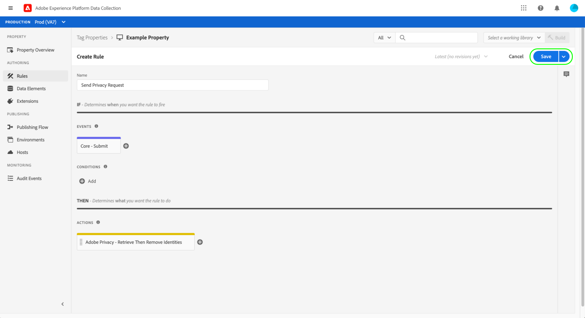

# Adobe Privacy 拡張機能の概要

>[!NOTE]
>
>Adobe Experience Platform Launch は、Adobe Experience Platform のデータ収集テクノロジースイートとしてリブランドされています。 その結果、製品ドキュメント全体でいくつかの用語が変更されました。用語の変更点の一覧については、次の[ドキュメント](../../../term-updates.md)を参照してください。

Adobe Privacy タグ拡張機能を使用すると、クライアントサイドデバイス上のアドビソリューションによってエンドユーザーに割り当てられているユーザー ID を収集および削除できます。 その後、収集した ID を[Adobe Experience Platform Privacy Service](../../../../privacy-service/home.md) に送信し、Adobe Experience Cloud のサポート対象アプリケーションにある関連する個人データにアクセスしたり削除したりできます。

このガイドでは、Experience PlatformUI またはデータ収集 UI でAdobeプライバシー拡張機能をインストールして設定する方法について説明します。

>[!NOTE]
>
>タグを使用せずにこれらの機能をインストールする場合は、 [プライバシー JavaScript ライブラリの概要](../../../../privacy-service/js-library.md) raw コードを使用したを実装する手順を参照してください。

## 拡張機能のインストールと設定

選択 **[!UICONTROL 拡張機能]** 左のナビゲーションで、 **[!UICONTROL カタログ]** タブをクリックします。 検索バーを使用して使用可能な拡張機能のリストを絞り込み、Adobe Privacy を見つけます。「**[!UICONTROL インストール]**」を選択して続行します。

次の画面では、拡張機能で ID を収集するソースとソリューションを設定できます。 拡張機能では、次のソリューションがサポートされています。

* Adobe Analytics（AA）
* Adobe Audience Manager（AAM）
* Adobe Target
* Adobe Experience Cloud Identity Service（訪問者または ECID）
* Adobe Advertising Cloud（AdCloud）

1 つ以上のソリューションを選択してから、「**[!UICONTROL 更新]**」を選択します。

画面が更新され、選択したソリューションに基づいて、必要な設定パラメーターの入力が表示されます。

以下のドロップダウンメニューを使用して、ソリューション固有のパラメーターを設定に追加することもできます。

>[!NOTE]
>
>サポート対象の各ソリューションに設定可能な値について詳しくは、Privacy の JavaScript ライブラリの概要にある[設定パラメーター](../../../../privacy-service/js-library.md#config-params)セクションを参照してください。

選択したソリューションのパラメーターの追加が完了したら、「**[!UICONTROL 保存]**」を選択して設定を保存します。

## 拡張機能の使用 {#using}

Adobe Privacy の拡張機能には、特定のイベントが発生した場合や条件を満たした場合に、[ルール](../../../ui/managing-resources/rules.md)に従って使用できる 3 つのアクションタイプが用意されています。

* **[!UICONTROL ID の取得]**：ユーザーが保存した ID 情報が取得されます。
* **[!UICONTROL ID の削除]**：ユーザーが保存した ID 情報を削除します。
* **[!UICONTROL ID を取得してから削除]**：ユーザーが保存した ID 情報を取得してから削除します。

上記の各アクションに対して、取得した ID データを受け取り、オブジェクトパラメーターとして処理するコールバック JavaScript 関数を指定する必要があります。 ここから、これらの ID を必要に応じて保存、表示、または [Privacy Service API](../../../../privacy-service/api/overview.md) に送信できます。

Adobe Privacy タグ拡張機能を使用する場合、必要なコールバック関数をデータ要素の形式で指定する必要があります。 このデータ要素の設定方法の手順については、次のセクションを参照してください。

### ID を処理するデータ要素の定義

新しいデータ要素の作成プロセスを開始するには、次を選択します。 **[!UICONTROL データ要素]** 左のナビゲーションで、の後にが続きます。 **[!UICONTROL データ要素を追加]**. 設定画面が表示されたら、拡張機能で「**[!UICONTROL Core]**」を選択し、データ要素タイプで「**[!UICONTROL カスタムコード]**」を選択します。ここから、右側のパネルの「**[!UICONTROL 編集画面を開く]**」を選択します。

表示されるダイアログで、取得した ID を処理する JavaScript 関数を定義します。 このコールバックは、1 つのオブジェクトタイプ引数（以下の例では `ids`）を受け入れる必要があります。 その後、この関数は必要に応じて ID を処理できます。また、サイト上でグローバルに使用可能な変数や関数を呼び出して、さらに処理することもできます。

>[!NOTE]
>
>コールバック関数で処理する `ids` オブジェクトの構造について詳しくは、Privacy の JavaScript ライブラリの概要にある[コードサンプル](../../../../privacy-service/js-library.md#samples)を参照してください。

終了したら「**[!UICONTROL 保存]**」を選択します。

別のイベントに対して別のコールバックが必要な場合は、引き続き他のカスタムコードデータ要素を作成できます。

### プライバシーアクションに関するルールの作成

取得した ID を処理するコールバックデータ要素を設定したら、サイトで特定のイベントが発生した場合やいずれかの条件を満たした場合は常に Adobe Privacy 拡張機能を呼び出すルールを作成できます。

ルールのアクションを設定する際に、拡張機能で「**[!UICONTROL Adobe Privacy]**」を選択します。 アクションタイプには、拡張機能に用意されている [3 つの機能](#using)のいずれかを選択します。

右側のパネルでは、アクションのコールバックとして機能するデータ要素を選択するよう求められます。 「データベース」アイコン（）をクリックし、前に作成したデータ要素をリストから選択します。 「**[!UICONTROL 変更を保持]**」を選択して続行します。

ここから、目的のイベントと条件で Adobe Privacy アクションが実行されるように、ルールの設定を続行できます。 内容を確認して、「**[!UICONTROL 保存]**」を選択します。

これで、ルールをライブラリに追加して、web サイト上にビルドとしてデプロイし、テストできるようになりました。 詳しくは、[タグのパブリッシングフロー](../../../ui/publishing/overview.md)についての概要を参照してください。

## 拡張機能の無効化またはアンインストール

拡張機能をインストールした後、その拡張機能を無効化または削除することができます。インストールした拡張機能の Adobe Privacy カードで「**[!UICONTROL 設定]**」を選択し、「**[!UICONTROL 無効化]**」または「**[!UICONTROL アンインストール]**」を選択します。

## 次の手順

このガイドでは、UI でのAdobeプライバシータグ拡張の使用について説明しました。 ローコードを使用して適用する方法をはじめ、拡張機能に用意されている各機能について詳しくは、Privacy Serviceドキュメントにある [Privacy の JavaScript ライブラリの概要](../../../../privacy-service/js-library.md)を参照してください。
