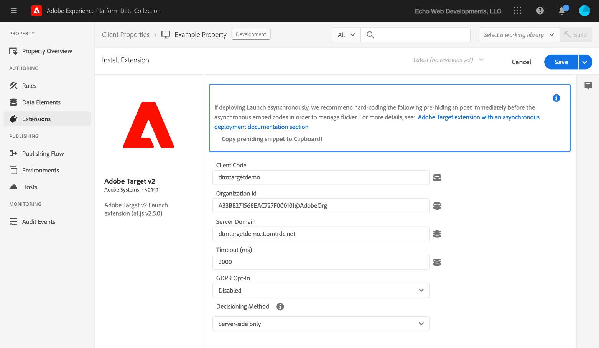

# Adobe Target v2 拡張機能の概要

>[!NOTE]
>
>Adobe Experience Platform Launch は、Adobe Experience Platform のデータ収集テクノロジースイートとしてリブランドされています。 その結果、製品ドキュメント全体でいくつかの用語が変更されました。用語の変更点の一覧については、次の[ドキュメント](../../../term-updates.md)を参照してください。

このリファレンスは、この拡張機能を使用してルールを作成するときに使用できるオプションに関する情報です。

## Adobe Target v2 拡張機能の設定

>[!IMPORTANT]
>
> Adobe Target 拡張機能には At.js 2.x が必要です。

Adobe Target 拡張機能がまだインストールされていない場合は、プロパティを開いて、**[!UICONTROL 拡張機能／カタログ]**&#x200B;を選択し、Target 拡張機能にカーソルを置いて「**[!UICONTROL インストール]**」を選択します。

拡張機能を設定するには、「拡張」タブを開き、拡張機能にカーソルを置いて「**[!UICONTROL 設定]**」を選択します。



### at.js の設定

タイムアウトを除く at.js 設定はすべて、Target UI で at.js 設定から自動的に取得されます。拡張機能は、最初に追加されたときに Target UI から設定を取得するだけです。追加の更新が必要な場合は、すべての設定を UI で管理する必要があります。

次の設定オプションを使用できます。

#### Client Code

クライアントコードは Target のアカウント識別子です。 このコードはほとんど常にデフォルト値のまま使用されます。データ要素を使用して変更できます。

#### Organization ID

この ID は、実装を Adobe Experience Cloud アカウントと結び付けます。このコードはほとんど常にデフォルト値のまま使用されます。データ要素を使用して変更できます。

#### Server Domain

サーバードメインは、Target リクエストが送信されるドメインを指します。 このコードはほとんど常にデフォルト値のまま使用されます。

#### GDPR Opt-In

有効にすると、Adobe Target はオプトイン機能を提供して同意の管理戦略をサポートします。オプトイン機能を使用すると、Target タグを実行する方法とタイミングを制御できます。アドビのオプトインについて詳しくは、「[プライバシーと EU 一般データ保護規則（GDPR）](https://experienceleague.adobe.com/docs/target/using/implement-target/before-implement/privacy/cmp-privacy-and-general-data-protection-regulation.html?lang=ja)」を参照してください。

#### Timeout (ms)

定義された期間内に Target からの受信されなかった場合、リクエストはタイムアウトし、デフォルトコンテンツが表示されます。訪問者のセッション中、追加のリクエストが引き続き試行されます。デフォルト値は「3000ms」です（Target ユーザーインターフェイスで設定されているタイムアウトとは異なる可能性があります）。

タイムアウトの設定の仕組みについて詳しくは、 [Adobe Target ヘルプ](https://experienceleague.adobe.com/docs/target/using/implement-target/client-side/deploy-at-js/implementing-target-without-a-tag-manager.html?lang=ja) を参照してください。

## Target 拡張機能のアクションタイプ

ここでは、Target 拡張機能で使用できるアクションタイプについて説明します。

Target 拡張機能は、ルールの「Then」部分に次のアクションを提供します。

### Load Target

ルールのコンテキストで Target を読み込むと効果的な場合、タグルールにこのアクションを追加します。これにより、at.js ライブラリがページに読み込まれます。ほとんどの実装では、サイトの各ページに Target を読み込む必要があります。Load Target アクションは、Target 呼び出しの後にのみ使用することをお勧めします。そうしないと、Analytics 呼び出しが遅延するなどの問題が発生する可能性があります。

設定は不要です。

### On-Device Decisioning を使用した Target の読み込み

ルールのコンテキストで [on-device decisioning](https://experienceleague.adobe.com/docs/target/using/implement-target/client-side/at-js-implementation/on-device-decisioning/on-device-decisioning.html?lang=ja) を有効にして Target を読み込むと効果的な場合、タグルールにこのアクションを追加します。 これにより、on-device decisioning が有効の at.js ライブラリがページに読み込まれます。 ほとんどの実装では、サイトの各ページに Target を読み込む必要があります。On-Device Decisioning を使用した Load Target アクションは、Target 呼び出しの後にのみ使用することをお勧めします。 そうしないと、Analytics 呼び出しが遅延するなどの問題が発生する可能性があります。

設定は不要です。

### Add Params to All Requests

このアクションタイプを使用すると、すべての Target リクエストにパラメーターを追加できます。 これより前に、Load Target アクションを使用する必要があります。

1. 追加するパラメーターの名前と値を指定します。
1. パラメーターを追加するには、追加アイコンを選択します。

### ページ読み込みリクエストにパラメーターを追加

このアクションタイプを使用すると、ページ読み込みリクエストに特別にパラメーターを追加できます。 これより前に、Load Target アクションを使用する必要があります。

1. 追加するパラメーターの名前と値を指定します。
1. パラメーターを追加するには、追加アイコンを選択します。

### ページ読み込み要求の実行

このアクションタイプを使用すると、ページの読み込み時に Target がリクエストを実行できます。 これより前に、Load Target アクションを使用する必要があります。

ちらつきを防ぐために本分の非表示を有効にするかどうか、および本文要素を非表示にするときに使用するスタイルを指定する必要があります。次のオプションがあります。

* **Body Hiding：**&#x200B;この設定を有効または無効にすることができます。デフォルト値は false です。この場合、HTML BODY は非表示にはなります。
* **Body Hidden Style：**&#x200B;デフォルトの値は「body{opacity:0}」です。この値は body{display:none} など他の値に変更することもできます。

詳しくは、 [Target のオンラインヘルプドキュメント](https://experienceleague.adobe.com/docs/target/using/implement-target/client-side/mbox-implement/advanced-mboxjs-settings.html?lang=ja) を参照してください。

### トリガービュー

トリガービューアクションは、新しいページが読み込まれるときや、ページ上のコンポーネントが再びレンダリングされるときに呼び出すことができます。トリガービューは、単一ページアプリケーションに実装する必要があります。

1. トリガーするビューの名前を指定します。
1. 「Page」チェックボックスをオンにして、ビューのトリガーをレポートのインプレッションに含めるかどうかを指定します。再レンダリングされ、レポートのインプレッションに属していないコンポーネントとビューが相関関係にある場合は、「Page」チェックボックスをオフにしたままにします。

ビューのトリガーについて詳しくは、 [`triggerView()` ヘルプドキュメント](https://experienceleague.adobe.com/docs/target/using/implement-target/client-side/functions-overview/adobe-target-triggerview-atjs-2.html?lang=ja) を参照してください。

## Adobe Target の基本的なデプロイメント

Target 拡張機能がインストールされたら、1 つ以上のルールを作成して適切にデプロイします。最初に、Target ライブラリ（at.js）を読み込み、ページ読み込みリクエストで使用するパラメーターを指定してから、ページ読み込みリクエストを実行します。

この基本的な実装を含む Target ルールは次のようになります。


このルールを保存したら、動作をテストできるよう、ライブラリに追加してビルド／デプロイします。

## 非同期デプロイメントを使用した Adobe Target 拡張機能

タグは非同期でデプロイできます。Target を使用してタグライブラリを非同期で読み込む場合、Target も非同期で読み込まれます。これは完全にサポートされているシナリオですが、処理が必要な追加の検討事項が 1 つあります。

非同期デプロイメントでは、Target ライブラリが完全に読み込まれてコンテンツの入れ替えが実行される前に、ページがデフォルトコンテンツのレンダリングを終了する可能性があります。これにより、Target で指定し、パーソナライズされたコンテンツに置き換えられる前に、デフォルトのコンテンツが短時間表示される、「ちらつき」と呼ばれる現象が発生することがあります。コンテンツのちらつきを回避するには、事前非表示のスニペットを使用し、タグバンドルを非同期で読み込むことをお勧めします。

事前非表示のスニペットを使用する際には、次の点に注意してください。

* タグヘッダー埋め込みコードを読み込む前に、スニペットを追加する必要があります。
* このコードはタグでは管理できないので、直接ページに追加する必要があります。
* ページは、次のイベントのうち最も早いタイミングで表示されます。
   * ページ読み込み応答を受信したとき
   * ページ読み込みリクエストがタイムアウトしたとき
   * スニペット自体がタイムアウトしたとき
* 事前非表示の時間を最小限に抑えるために、「ページ読み込み要求を実行」アクションは、事前非表示スニペットを使用するすべてのページで使用する必要があります。
* 本文の非表示は、Target に使用するページ型ルールのページ型リクエストアクションでも有効にする必要があります。そうしないと、タイムアウト期間中、すべてのページ読み込みが非表示のままになります。

事前非表示スニペットの例を次に示します。これらは縮小できます。設定可能なオプションは最後にあります。

```js
;(function(win, doc, style, timeout) {
  var STYLE_ID = 'at-body-style';

  function getParent() {
    return doc.getElementsByTagName('head')[0];
  }

  function addStyle(parent, id, def) {
    if (!parent) {
      return;
    }

    var style = doc.createElement('style');
    style.id = id;
    style.innerHTML = def;
    parent.appendChild(style);
  }

  function removeStyle(parent, id) {
    if (!parent) {
      return;
    }

    var style = doc.getElementById(id);

    if (!style) {
      return;
    }

    parent.removeChild(style);
  }

  addStyle(getParent(), STYLE_ID, style);
  setTimeout(function() {
    removeStyle(getParent(), STYLE_ID);
  }, timeout);
}(window, document, "body {opacity: 0 !important}", 3000));
```

デフォルトでは、このスニペットによって HTML BODY 全体が事前に非表示になります。ページ全体ではなく、特定の HTML 要素のみを事前に非表示したい場合もあります。その場合はスタイルのパラメーターをカスタマイズします。ページ内の特定の領域のみを事前に非表示にするよう置き換えることができます。

例えば、container-1 と container-2 という ID で識別される 2 つのセクションがある場合は、次のスタイルに置き換えることができます。

```css
#container-1, #container-2 {opacity: 0 !important}
```

デフォルトの代わりに次を使用します。

```css
body {opacity: 0 !important}
```

デフォルトでは、スニペットは 3000 ミリ秒または 3秒でタイムアウトします。この値はカスタマイズできます。
