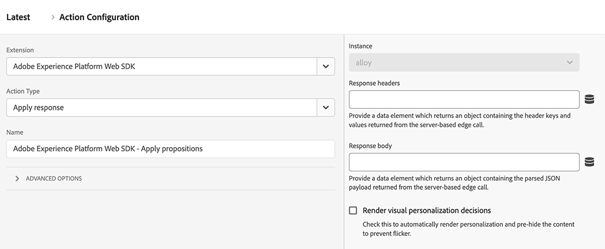

# アクションタイプ

[Adobe Experience Platform Web SDK タグ拡張機能 ](web-sdk-extension-configuration.md) を設定したら、アクションタイプを設定する必要があります。

ここでは、[Adobe Experience Platform Web SDK タグ拡張機能 ](web-sdk-extension-configuration.md) でサポートされているアクションタイプについて説明します。

## 提案の適用 {#apply-propositions}

**[!UICONTROL 提案を適用]** アクションタイプを使用すると、単一ページアプリケーションで、指標を増分せずに提案をレンダリングできます。

このアクションタイプは、単一ページアプリケーションを操作している際に、ページの一部が再レンダリングされ、ページに適用済みのパーソナライゼーションが上書きされる可能性が生じる場合に役立ちます。

このアクションタイプは、次のような様々なユースケースに使用できます。

1. **mboxHTMLオファーをレンダリング**。 **[!UICONTROL イベントを送信]** アクションから範囲またはサーフェスを介して明示的にリクエストされた提案は、自動的にはレンダリングされません。 **[!UICONTROL 提案を適用]** アクションタイプを使用し、提案メタデータを指定してレンダリングする場所を Web SDK に指示できます。
2. **単一ページアプリケーションでビューのオファーをレンダリング** ビューの変更イベントをレンダリングする際、分析データの準備がまだ整っていない場合は、**[!UICONTROL 提案を適用]** アクションを使用して、ページの上部にビューの提案をレンダリングできます。 詳しくは [ ページイベントの上部と下部（2 番目のページビュー – オプション 2） ](../../../../web-sdk/use-cases/top-bottom-page-events.md) を参照してください。 これを使用するには、フォームに **[!UICONTROL ビュー名]** を入力します。
3. **提案を再レンダリング**。 サイトで React などのフレームワークを使用してコンテンツを再レンダリングする場合、パーソナライゼーションの再適用が必要になる場合があります。 そのような場合は、「**[!UICONTROL 提案を適用]**」アクションタイプを使用してこれを行うことができます。

このアクションタイプでは、レンダリングされた提案の表示イベントは送信されません。 レンダリングされた提案を追跡し、後続の **[!UICONTROL イベントを送信]** 呼び出しに含められるようにします。

このアクションタイプでは、次のフィールドがサポートされます。

* **[!UICONTROL 提案]**：再レンダリングする提案オブジェクトの配列。
* **[!UICONTROL ビュー名]**: レンダリングするビューの名前。
* **[!UICONTROL 提案メタデータ]**:HTMLオファーの適用方法を決定するオブジェクト。 この情報は、フォームまたはデータ要素を通じて提供できます。 これには、次のプロパティが含まれます。
   * **[!UICONTROL スコープ]**
   * **[!UICONTROL セレクター]**
   * **[!UICONTROL アクションタイプ]**

## 応答を適用 {#apply-response}

Edge Networkからの応答に基づいて様々なアクションを実行する場合は、「**[!UICONTROL 応答を適用]**」アクションタイプを使用します。 このアクションタイプは、通常、サーバーがブラウザーに対して最初の呼び出しを行い、その呼び出しから応答を受け取ってEdge Networkーで Web SDK を初期化するハイブリッドデプロイメントで使用されます。

このアクションタイプを使用すると、ハイブリッドパーソナライゼーションのユースケースでクライアントの読み込み時間が短縮される可能性があります。

このアクションタイプは、次の設定オプションをサポートしています。

* **[!UICONTROL インスタンス]**：使用する Web SDK インスタンスを選択します。
* **[!UICONTROL Response headers]**:Edge Networkサーバーコールから返されたヘッダーキーと値を含むオブジェクトを返すデータ要素を選択します。
* **[!UICONTROL Response body]**:Edge Networkレスポンスによって提供された JSON ペイロードを含むオブジェクトを返すデータ要素を選択します。
* **[!UICONTROL ビジュアルパーソナライゼーションの決定をレンダリング]**:Edge Networkが提供するパーソナライゼーションコンテンツを自動的にレンダリングし、コンテンツをあらかじめ非表示にしてちらつきを防ぐには、このオプションを有効にします。

## ルールセットの評価 {#evaluate-rulesets}

このアクションタイプは、ルールセットの評価を手動でトリガーします。 ルールセットはAdobe Journey Optimizerから返され、ブラウザー内メッセージなどの機能をサポートします。

このアクションタイプは、次のオプションをサポートしています。

* **[!UICONTROL ビジュアルパーソナライゼーション決定のレンダリング]**：一致するルールセット項目のビジュアルパーソナライゼーション決定をレンダリングするには、このオプションを有効にします。
* **[!UICONTROL Decision context]**：これは、オンデバイス判定のAdobe Journey Optimizer ルールセットを評価する際に使用されるキー値マップです。 決定コンテキストは手動で、またはデータ要素を通じて提供できます。

## Media Analytics トラッカーを取得 {#get-media-analytics-tracker}

このアクションは、従来の Media Analytics API を取得するために使用されます。 アクションを設定してオブジェクト名が指定されると、従来の Media Analytics API がそのウィンドウオブジェクトに書き出されます。 何も指定されない場合、現在の Media JS ライブラリと同様に `window.Media` に書き出されます。

## ID でリダイレクト {#redirect-with-identity}

このアクションタイプを使用して、現在のページの ID を他のドメインに共有します。 このアクションは、**[!UICONTROL クリック]** イベントタイプおよび値比較条件で使用するように設計されています。 このアクションタイプの使用方法について詳しくは、[Web SDK 拡張機能を使用した URL への ID の追加 ](../../../../web-sdk/commands/appendidentitytourl.md#extension) を参照してください。

## イベントを送信 {#send-event}

Platform が送信したデータを収集し、その情報に基づいて行動できるように、Experience Platformにイベントを送信します。 送信したいデータは、「**[!UICONTROL XDM データ]**」フィールドで送信できます。 [!DNL XDM] スキーマの構造に準拠する [!DNL JSON] オブジェクトを使用します。 このオブジェクトは、ページまたは **[!UICONTROL カスタムコード]****[!UICONTROL データ要素]** を使用して作成できます。

**[!UICONTROL イベントを送信]** アクションタイプは、以下に説明するフィールドと設定をサポートしています。 これらのフィールドはすべてオプションです。

### インスタンス設定 {#instance}

**[!UICONTROL インスタンス]** セレクターを使用して、設定する Web SDK インスタンスを選択します。 インスタンスが 1 つしかない場合は、事前に選択されています。

* **[!UICONTROL インスタンス]**：設定する Web SDK インスタンスを選択します。 インスタンスが 1 つしかない場合は、事前に選択されます。
* **[!UICONTROL ガイド付きイベントを使用]**：特定のユースケースを有効にするために、特定のフィールドを自動的に入力または非表示にするには、このオプションを有効にします。 このオプションを有効にすると、次のトリガーの表示が設定されます。
   * **[!UICONTROL リクエストのパーソナライゼーション]**：このイベントは、ページの上部で呼び出されることを目的としています。 このイベントを選択すると、次のフィールドが設定されます。
      * **[!UICONTROL タイプ]**:**[!UICONTROL Decisioning 提案の取得]**
      * **[!UICONTROL 表示イベントを自動的に送信]**:**[!UICONTROL false]**
      * この場合にパーソナライゼーションを自動的にレンダリングするには、「**[!UICONTROL ビジュアルパーソナライゼーション決定をレンダリング]** オプションを有効にします。
   * **[!UICONTROL 分析を収集]**：このイベントは、ページの下部で呼び出されることを目的としています。 このイベントを選択すると、次のフィールドが設定されます。
      * **[!UICONTROL レンダリングされた提案を含める]**:**[!UICONTROL true]**
      * **[!UICONTROL Personalization]** の設定は非表示です

  >[!NOTE]
  >
  >ガイド付きイベントは、[ ページイベントの上部と下部 ](../../../../web-sdk/use-cases/top-bottom-page-events.md) に関連しています。

### データ {#data}

* **[!UICONTROL タイプ]**：このフィールドでは、XDM スキーマに記録されるイベントタイプを指定できます。 詳細は、`sendEvent` コマンドの [`type`](/help/web-sdk/commands/sendevent/type.md) を参照してください。
* **[!UICONTROL XDM]**:
* **[!UICONTROL データ]**：このフィールドを使用して、XDM スキーマに一致しないデータを送信します。 このフィールドは、Adobe Target プロファイルを更新したり、Target Recommendations属性を送信したりする場合に便利です。 詳細は、`sendEvent` コマンドの [`data`](/help/web-sdk/commands/sendevent/data.md) を参照してください。
* **[!UICONTROL レンダリングされた提案を含める]**：レンダリングされたすべての提案を含めるが、表示イベントが送信されていない場合は、このオプションを有効にします。 「表示イベントを自動的に送信 **[!UICONTROL を無効にした状態で]** この機能を使用します。 この設定は、レンダリングされた提案に関する情報で `_experience.decisioning` XDM フィールドを更新します。
* **[!UICONTROL ドキュメントがアンロードされます]**：ユーザーがページから移動した場合でもイベントがサーバーに到達するようにするには、このオプションを有効にします。 これにより、イベントはサーバーに到達できますが、応答は無視されます。
* **[!UICONTROL 結合 ID]**:**このフィールドは非推奨です**。 これにより、`eventMergeId` XDM フィールドに値が入力されます。

### パーソナライズ機能 {#personalization}

* **[!UICONTROL 範囲]**：パーソナライズ機能から明示的にリクエストする範囲（Adobe Target [!DNL mboxes]）を選択します。 範囲は、手動で入力することも、データ要素を指定して入力することもできます。
* **[!UICONTROL サーフェス]**：ページ上でパーソナライゼーションに使用できる web サーフェスを設定します。 詳しくは、[Adobe Journey Optimizer ドキュメント ](https://experienceleague.adobe.com/docs/journey-optimizer/using/web/create-web.html) を参照してください。
* **ビジュアルパーソナライゼーション決定のレンダリング：** ページ上でパーソナライズされたコンテンツをレンダリングする場合は、「**[!UICONTROL ビジュアルパーソナライゼーション決定のレンダリング]** チェックボックスをオンにします。 必要に応じて、決定範囲やサーフェスを指定することもできます。 パーソナライズされたコンテンツのレンダリングについて詳しくは、[ パーソナライゼーションドキュメント ](/help/web-sdk/personalization/rendering-personalization-content.md#automatically-rendering-content) を参照してください。
* **[!UICONTROL デフォルトのパーソナライゼーションをリクエスト]**：このセクションを使用して、ページ全体の範囲（グローバル mbox）とデフォルトのサーフェス（現在の URL に基づく web サーフェス）がリクエストされるかどうかを制御します。 デフォルトでは、これはページ読み込みの最初の `sendEvent` 呼び出し時に自動的に要求されます。 次のオプションから選択できます。
   * **[!UICONTROL 自動]**：これはデフォルトの動作です。 まだリクエストされていない場合にのみ、デフォルトのパーソナライゼーションをリクエストします。 これは、Web SDK コマンド `requestDefaultPersonalization` 設定されていないに対応します。
   * **[!UICONTROL 有効]**：ページ範囲とデフォルトサーフェスを明示的にリクエストします。 これにより、SPA ビューのキャッシュが更新されます。 これは、`true``requestDefaultPersonalization` 設定に対応します。
   * **[!UICONTROL 無効]**：ページ範囲とデフォルトサーフェスのリクエストを明示的に抑制します。 これは、`false``requestDefaultPersonalization` 設定に対応します。
* **[!UICONTROL Decision context]**：これは、オンデバイス判定のAdobe Journey Optimizer ルールセットを評価する際に使用されるキー値マップです。 決定コンテキストは手動で、またはデータ要素を通じて提供できます。

### データストリーム設定の上書き {#datastream-overrides}

データストリームの上書きを使用すると、Web SDK を介して Edge Network に渡されるデータストリームの追加設定を定義できます。

これにより、新しいデータストリームを作成したり、既存のトリガーを変更したりすることなく、デフォルトとは異なるデータストリームの動作を設定できます。 詳しくは、[ データストリームの上書きの設定 ](web-sdk-extension-configuration.md#datastream-overrides) に関するドキュメントを参照してください。

## メディアイベントを送信 {#send-media-event}

メディアイベントをAdobe Experience PlatformまたはAdobe Analytics（あるいはその両方）に送信します。 このアクションは、web サイト上のメディアイベントを追跡する場合に役立ちます。 インスタンスを選択します（複数のインスタンスがある場合）。 このアクションには、トラッキングされるメディアセッションの一意の ID を表す `playerId` が必要です。 また、メディアセッションを開始する際には、**[!UICONTROL エクスペリエンスの品質]** と `playhead` データ要素も必要です。

**[!UICONTROL メディアイベントを送信]** アクションタイプでは、次のプロパティをサポートしています。

* **[!UICONTROL インスタンス]**：使用されている Web SDK インスタンス。
* **[!UICONTROL メディアイベントタイプ]**：追跡するメディアイベントのタイプ。
* **[!UICONTROL プレーヤー ID]**：メディアセッションの一意の ID。
* **[!UICONTROL 再生ヘッド]**：メディア再生の現在の位置（秒単位）。
* **[!UICONTROL メディアセッションの詳細]**：メディア開始イベントを送信する場合、必要なメディアセッションの詳細を指定する必要があります。
* **[!UICONTROL チャプターの詳細]**：このセクションでは、チャプター開始メディアイベントを送信する際のチャプターの詳細を指定できます。
* **[!UICONTROL Advertisingの詳細]**: `AdBreakStart` イベントを送信する場合、必要な広告の詳細を指定する必要があります。
* **[!UICONTROL Advertising ポッドの詳細]**:`AdStart` イベントを送信する際の広告ポッドに関する詳細。
* **[!UICONTROL エラーの詳細]**：トラッキングされている再生エラーに関する詳細。
* **[!UICONTROL 状態更新の詳細]**：更新されているプレーヤーの状態。
* **[!UICONTROL カスタムメタデータ]**：追跡するメディアイベントに関するカスタムメタデータです。
* **[!UICONTROL エクスペリエンスの品質]**：トラッキングされるエクスペリエンスデータのメディア品質。

## 同意を設定 {#set-consent}

ユーザーから同意を得たら、「同意を設定」アクションタイプを使用して、この同意をAdobe Experience Platform Web SDK に伝える必要があります。 現在、「Adobe」と「IAB TCF」の 2 種類の標準がサポートされています。[ 顧客の同意環境設定のサポート ](../../../../web-sdk/commands/setconsent.md) を参照してください。 Adobeバージョン 2.0 を使用する場合、データ要素の値のみがサポートされます。 同意オブジェクトに解決されるデータ要素を作成します。

このアクションでは、ID マップを含めて同意を得た後で ID を同期できるようにするオプションのフィールドも提供されます。 同期は、同意が「保留中」または「アウト」と設定されている場合に役立ちます。これは、同意呼び出しが最初に実行される可能性が高いからです。

## 変数を更新 {#update-variable}

イベントの結果として XDM オブジェクトを変更するには、このアクションを使用します。 このアクションは、イベント XDM オブジェクトを記録するために、後で **[!UICONTROL イベントを送信]** アクションから参照できるオブジェクトを作成することを目的としています。

このアクションタイプを使用するには、[variable](data-element-types.md#variable) データ要素を定義する必要があります。 変更する変数データ要素を選択すると、[XDM オブジェクト ](data-element-types.md#xdm-object) データ要素のエディターと同様のエディターが表示されます。

エディターに使用される XDM スキーマは、[!UICONTROL  変数 ] データ要素で選択されたスキーマです。 左側のツリーでプロパティの 1 つをクリックし、右側の値を変更することで、オブジェクトの 1 つ以上のプロパティを設定できます。例えば、次のスクリーンショットでは、producedBy プロパティを、「Produced by data element」というデータ要素に設定しています。

変数の更新アクションのエディターと XDM オブジェクトデータ要素のエディターにはいくつかの違いがあります。 まず、変数の更新アクションには、「xdm」というラベルの付いたルートレベル項目があります。 この項目をクリックすると、オブジェクト全体の設定に使用するデータ要素を指定できます。 次に、変数の更新アクションには、xdm オブジェクトからデータを消去するチェックボックスがあります。 左側のプロパティの 1 つをクリックし、右側のチェックボックスをオンにして値をクリアします。 これにより、変数の値を設定する前に現在の値がクリアされます。

## 次の手順 {#next-steps}

この記事を読むことで、アクションの設定方法に関する理解を深めることができました。 次に、[ データ要素タイプの設定 ](data-element-types.md) 方法について説明します。
