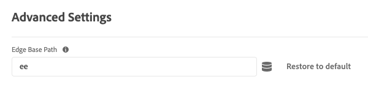

# 詳細設定 {#advanced}

>[!CONTEXTUALHELP]
>id="platform_tags_websdk_advanced"
>title="詳細設定"
>abstract="詳細設定。 アドビでは、ほとんどの実装で、これらのオプションをそのままにしておくことをお勧めします。"

この設定セクションでは、詳細設定を変更できます。 アドビでは、ほとんどの実装で、これらのオプションをそのままにしておくことをお勧めします。

1. Adobe IDの資格情報を使用して[experience.adobe.com](https://experience.adobe.com)にログインします。
1. **[!UICONTROL Data Collection]**／**[!UICONTROL Tags]**&#x200B;に移動します。
1. 目的のタグプロパティを選択します。
1. **[!UICONTROL Extensions]**&#x200B;に移動し、[!UICONTROL Adobe Experience Platform Web SDK] カードの&#x200B;**[!UICONTROL Configure]**&#x200B;を選択します。
1. **[!UICONTROL Advanced Settings]** セクションまでスクロールします。

現在、利用可能なオプションが1つあります。

## [!UICONTROL Edge base path]

このフィールドを使用して、Edge Networkとのやり取りに使用するベースパスを変更します。 Adobeでは、特定のアルファ版またはベータ版のテストに参加している場合は、このフィールドを変更するようリクエストする場合があります。そうでない場合は、Adobeでデフォルト値`ee`のままにすることをお勧めします。

このフィールドは、JavaScript ライブラリを設定する際の[`edgeBasePath`](/help/collection/js/commands/configure/edgebasepath.md)に相当するタグです。
