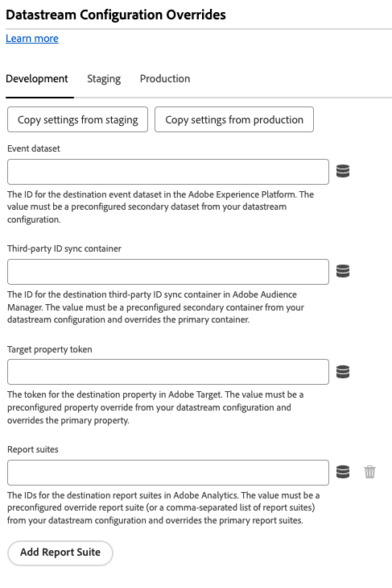
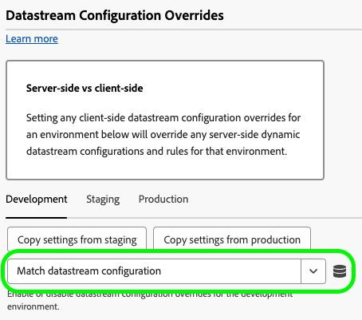
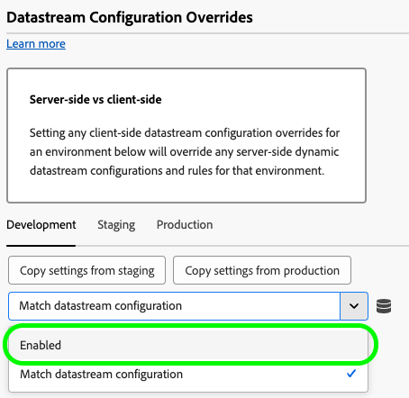

# データストリーム設定の上書き設定 {#config-overrides}

>[!CONTEXTUALHELP]
>id="platform_tags_websdk_overrides"
>title="データストリーム設定の上書き"
>abstract="個別のデータストリームを必要とせずに、条件に応じて異なるデータストリームの動作をトリガーします。 このセクションで環境に対してクライアントサイドのデータストリーム設定の上書きを設定すると、その環境に対するサーバーサイドの動的データストリーム設定とルールが上書きされます。"

データストリームのオーバーライドを使用すると、Web SDKを介してEdge Networkに渡されるデータストリームの追加の設定を定義できます。 この機能を使用すると、新しいデータストリームを作成したり、既存のトリガーを変更したりすることなく、さまざまなデータストリームの動作を条件付きで設定できます。

1. Adobe IDの資格情報を使用して[experience.adobe.com](https://experience.adobe.com)にログインします。
1. **[!UICONTROL Data Collection]**／**[!UICONTROL Tags]**&#x200B;に移動します。
1. 目的のタグプロパティを選択します。
1. **[!UICONTROL Extensions]**&#x200B;に移動し、[!UICONTROL Adobe Experience Platform Web SDK] カードの&#x200B;**[!UICONTROL Configure]**&#x200B;を選択します。
1. **[!UICONTROL Datastream configuration overrides]** セクションまでスクロールします。

データストリーム設定の上書きは、次の 2 つの手順で構成されます。

1. まず、データストリーム UIで[&#x200B; データストリームを設定](/help/datastreams/configure.md)する際に、データストリーム設定の上書きを定義する必要があります。 オーバーライドの設定方法について詳しくは、データストリームのドキュメントの[&#x200B; データストリーム設定オーバーライド &#x200B;](/help/datastreams/overrides.md)を参照してください。
1. データストリーム UIでデータストリームの上書きを設定したら、タグ拡張機能を設定できます。

データストリームの上書きは、環境ごとに設定する必要があります。 開発環境、ステージング環境、実稼動環境はすべて個別のオーバーライドを持ちます。 任意の環境の間でオーバーライド設定をコピーできます。

デフォルトでは、データストリーム設定の上書きは無効になっています。 **[!UICONTROL Match datastream configuration]** オプションはデフォルトで選択されています。

タグ拡張機能でデータストリームの上書きを有効にするには、ドロップダウンメニューから「**[!UICONTROL Enabled]**」を選択します。

データストリーム設定の上書きを有効にすると、以下で説明する各サービスの上書きを設定できます。 これらのデータストリーム上書き設定は、選択した環境のサーバーサイドのデータストリーム設定とルールを上書きします。

## Adobe Analytics

Adobe Analytics サービスへのデータルーティングを上書きします。

* **[!UICONTROL Enabled]** / **[!UICONTROL Disabled]**: Adobe Analyticsへのデータルーティングを有効または無効にします。
* **[!UICONTROL Report suites]**: Adobe Analyticsの宛先レポートスイートのID。 値は、データストリーム設定から事前設定済みのオーバーライドレポートスイート（またはレポートスイートのコンマ区切りリスト）である必要があります。 この設定は、プライマリレポートスイートを上書きします。
* **[!UICONTROL Add Report Suite]**：追加のレポートスイートを追加するには、このオプションを選択します。

## Adobe Audience Manager

Adobe Audience Managerへのデータルーティングを上書きします。

* **[!UICONTROL Enabled]** / **[!UICONTROL Disabled]**: Adobe Audience Managerへのデータルーティングを有効または無効にします。
* **[!UICONTROL Third-party ID sync container]**: Audience Managerの宛先サードパーティ ID同期コンテナのID。 値は、データストリーム設定から事前設定されたセカンダリコンテナである必要があり、プライマリコンテナを上書きします。

## Adobe Experience Platform

Adobe Experience Platformへのデータルーティングを上書きします。

* **[!UICONTROL Enabled]** / **[!UICONTROL Disabled]**: Adobe Experience Platformへのデータルーティングを有効または無効にします。
* **[!UICONTROL Event dataset]**: Adobe Experience Platformの宛先イベントデータセットのID。 値は、データストリーム設定から事前設定されたセカンダリデータセットである必要があります。
* **[!UICONTROL Offer Decisioning]**: [!DNL Offer Decisioning] サービスへのデータルーティングを有効または無効にします。
* **[!UICONTROL Edge Segmentation]**: [!DNL Edge Segmentation] サービスへのデータルーティングを有効または無効にします。
* **[!UICONTROL Personalization Destinations]**: パーソナライゼーション宛先へのデータルーティングを有効または無効にします。
* **[!UICONTROL Adobe Journey Optimizer]**: [!DNL Adobe Journey Optimizer]へのデータルーティングを有効または無効にします。

## Adobe サーバーサイドイベント転送

Adobe Server-Side Event Forwarding サービスへのデータルーティングを上書きします。

* **[!UICONTROL Enabled]** / **[!UICONTROL Disabled]**: Adobe Server-Side Event Forwarding サービスへのデータルーティングを有効または無効にします。

## Adobe Target {#target}

Adobe Targetへのデータルーティングを上書きします。

* **[!UICONTROL Enabled]** / **[!UICONTROL Disabled]**: Adobe Targetへのデータルーティングを有効または無効にします。
