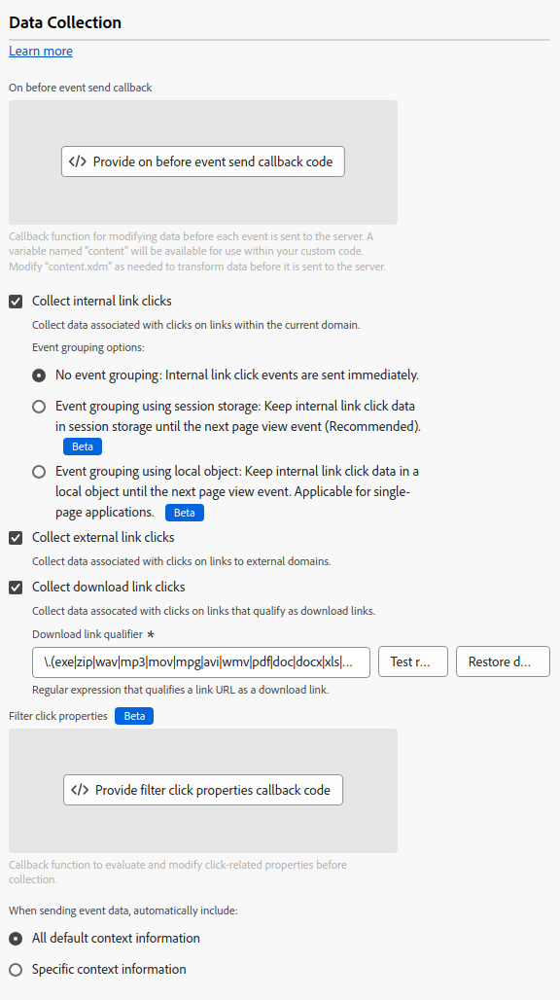

# データ収集設定 {#data-collection}

>[!CONTEXTUALHELP]
>id="platform_tags_websdk_datacollection"
>title="データ収集"
>abstract="収集するデータと、そのデータをタグ拡張機能全体で収集する方法を決定します。"

この設定セクションでは、拡張機能でデータが収集される方法を指定できます。

1. Adobe IDの資格情報を使用して[experience.adobe.com](https://experience.adobe.com)にログインします。
1. **[!UICONTROL Data Collection]**／**[!UICONTROL Tags]**&#x200B;に移動します。
1. 目的のタグプロパティを選択します。
1. **[!UICONTROL Extensions]**&#x200B;に移動し、[!UICONTROL Adobe Experience Platform Web SDK] カードの&#x200B;**[!UICONTROL Configure]**&#x200B;を選択します。
1. **[!UICONTROL Data collection]** セクションまでスクロールします。

タグ UIのWeb SDK タグ拡張機能のデータ収集設定を示す

次のオプションがあります。

## [!UICONTROL On before event send callback]

Adobeに送信されるペイロードを評価および変更するコールバック関数。 コードエディターでは、次の変数にアクセスできます。

* **`content.xdm`**: イベントのXDM ペイロード。
* **`content.data`**: イベントのデータオブジェクトペイロード。
* **`return true`**: コールバックをすぐに終了し、`content` オブジェクトの現在の値を使用してAdobeにデータを送信します。
* **`return false`**: コールバックをすぐに終了し、Adobeへのデータ送信を中止します。

`content`以外で定義された変数は使用できますが、Adobeに送信されるペイロードには含まれません。

>[!WARNING]
>
>このコールバックでは、カスタムコードを使用できます。 コールバックに含めるコードで捕捉されない例外がスローされた場合、イベントの処理は停止します。 **データはAdobeに送信されません。**

```js
// Use nullish coalescing assignments to add objects if they don't yet exist
content.xdm.commerce ??= {};
content.xdm.commerce.order ??= {};

// Then add the purchase ID
content.xdm.commerce.order.purchaseID = "12345";

// Use optional chaining to prevent undefined errors when setting tracking code to lower case
if(content.xdm.marketing?.trackingCode) content.xdm.marketing.trackingCode = content.xdm.marketing.trackingCode.toLowerCase();

// Delete operating system version
if(content.xdm.environment) delete content.xdm.environment.operatingSystemVersion;

// Immediately end onBeforeEventSend logic and send the data to Adobe for this event type
if (content.xdm.eventType === "web.webInteraction.linkClicks") {
  return true;
}

// Cancel sending data if it is a known bot
if (myBotDetector.isABot()) {
  return false;
}
```

>[!TIP]
>ページの最初のイベントで`false`を返さないようにします。 最初のイベントで`false`を返すと、パーソナライゼーションに悪影響を及ぼす可能性があります。

このコールバックは、JavaScript ライブラリの[`onBeforeEventSend`](/help/collection/js/commands/configure/onbeforeeventsend.md)に相当するタグです。

## [!UICONTROL Collect internal link clicks]

サイトまたはプロパティ内のリンクトラッキングデータの収集を有効にするチェックボックス。 このチェックボックスは、JavaScript ライブラリの[`clickCollection.internalLinkEnabled`](/help/collection/js/commands/configure/clickcollection.md)に相当するタグです。 このチェックボックスを有効にすると、イベントのグループ化オプションが表示されます。

* **[!UICONTROL No event grouping]**: リンクトラッキングデータは別のイベントでAdobeに送信されます。 別のイベントで送信されたリンククリックは、Adobe Experience Platformに送信されたデータの契約上の使用率を高めることができます。
* **[!UICONTROL Event grouping using session storage]**：次の「ページビュー」イベントまで、リンク追跡データをセッションストレージに保存します。 「ページビュー」と見なされる次のイベントでは、保存されたリンク追跡データが「ページビュー」イベントペイロードと結合されます。 Adobeでは、内部リンクをトラッキングする際にこの設定を有効にすることをお勧めします。
* **[!UICONTROL Event grouping using local object]**：次の「ページビュー」イベントまで、リンク追跡データをローカルオブジェクトに保存します。 訪問者が新しいブラウザーページに移動すると、リンク追跡データが失われます。 この設定は、シングルページアプリケーションのコンテキストで最も有益です。

タグライブラリは、ペイロードに次の要素が含まれている場合、特定のイベントを「ページビュー」と見なします。

* `xdm.web.webPageDetails.name`には文字列値が含まれています
* `xdm.web.webPageDetails.pageViews.value`が`0`より大きい

## [!UICONTROL Collect external link clicks]

外部リンクの収集を有効にするチェックボックス。 このチェックボックスは、JavaScript ライブラリの[`clickCollection.externalLinkEnabled`](/help/collection/js/commands/configure/clickcollection.md)に相当するタグです。

## [!UICONTROL Collect download link clicks]

ダウンロードリンクの収集を有効にするチェックボックス。 このチェックボックスは、JavaScript ライブラリの[`clickCollection.downloadLinkEnabled`](/help/collection/js/commands/configure/clickcollection.md)に相当するタグです。

## [!UICONTROL Download link qualifier]

リンク URLをダウンロードリンクとして修飾する正規表現。 この文字列は、JavaScript ライブラリの[`downloadLinkQualifier`](/help/collection/js/commands/configure/downloadlinkqualifier.md)に相当するタグです。

## [!UICONTROL Filter click properties]

コレクションの前に、クリック関連のプロパティを評価および変更するコールバック関数。 この関数は[!UICONTROL On before event send callback]の前に実行され、JavaScript ライブラリの[`clickCollection.filterClickDetails`](/help/collection/js/commands/configure/clickcollection.md)と同等のタグです。 コードエディターでは、次の変数にアクセスできます。

* **`content.clickedElement`**: クリックされたDOM要素。
* **`content.pageName`**: クリック時のページ名。
* **`content.linkName`**: クリックしたリンクの名前。
* **`content.linkRegion`**: クリックしたリンクの領域。
* **`content.linkType`**: リンクの種類（終了、ダウンロードなど）。
* **`content.linkURL`**: クリックしたリンクの宛先URL。
* **`return true`**：現在の変数値でコールバックをすぐに終了します。
* **`return false`**: コールバックをすぐに終了し、データの収集を中止します。
* `content`以外で定義された変数は使用できますが、Adobeに送信されるペイロードには含まれません。

>[!TIP]
>
>**[!UICONTROL On before link click send]** フィールドは、既に設定されているプロパティにのみ表示される非推奨のコールバックです。 これは、JavaScript ライブラリの[`onBeforeLinkClickSend`](/help/collection/js/commands/configure/onbeforelinkclicksend.md)に相当するタグです。 **[!UICONTROL Filter click properties]** コールバックを使用してクリックデータをフィルタリングまたは調整するか、**[!UICONTROL On before event send callback]**&#x200B;を使用してAdobeに送信されるペイロード全体をフィルタリングまたは調整します。 **[!UICONTROL Filter click properties]** コールバックと&#x200B;**[!UICONTROL On before link click send]** コールバックの両方が設定されている場合、**[!UICONTROL Filter click properties]** コールバックのみが実行されます。

## コンテキスト設定

特定のXDM フィールドに情報を入力する訪問者情報を自動的に収集します。 **[!UICONTROL All default context information]**&#x200B;または&#x200B;**[!UICONTROL Specific context information]**&#x200B;を選択できます。 これは、JavaScript ライブラリの[`context`](/help/collection/js/commands/configure/context.md)に相当するタグです。

* **[!UICONTROL Web]**：現在のページに関する情報を収集します。
* **[!UICONTROL Device]**: ユーザーのデバイスに関する情報を収集します。
* **[!UICONTROL Environment]**: ユーザーのブラウザーに関する情報を収集します。
* **[!UICONTROL Place context]**: ユーザーの場所に関する情報を収集します。
* **[!UICONTROL High entropy user-agent hints]**: ユーザーのデバイスに関する詳細情報を収集します。
* **[!UICONTROL Send referrer to Adobe Analytics only once per page view]**：重複するリファラーデータがAdobe Analyticsに送信されないようにします。
