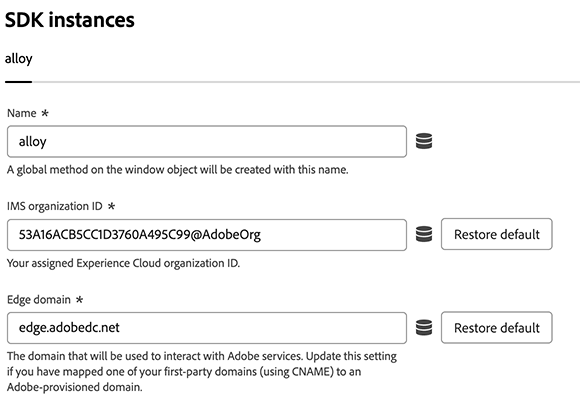

# SDK インスタンス設定 {#sdk-instance}

>[!CONTEXTUALHELP]
>id="platform_tags_websdk_sdkinstance"
>title="SDK インスタンス"
>abstract="SDK インスタンス名、属する IMS 組織、Edge ドメインを設定します。"

この設定セクションでは、Web SDK インスタンス名、適用されるIMS組織、データの送信先の場所を指定します。 デフォルトでは、インスタンスの名前は`alloy`です。

1. Adobe IDの資格情報を使用して[experience.adobe.com](https://experience.adobe.com)にログインします。
1. **[!UICONTROL Data Collection]**／**[!UICONTROL Tags]**&#x200B;に移動します。
1. 目的のタグプロパティを選択します。
1. **[!UICONTROL Extensions]**&#x200B;に移動し、[!UICONTROL Adobe Experience Platform Web SDK] カードの&#x200B;**[!UICONTROL Configure]**&#x200B;を選択します。
1. 拡張された[!UICONTROL SDK instances] アコーディオンのすぐ下にあるインスタンス名を探します。

のWeb SDK タグ拡張機能の一般的な設定を示す画像

次のオプションがあります。

## [!UICONTROL Name]

Adobe Experience Platform Web SDK タグ拡張機能は、ページ上の複数のインスタンスをサポートしています。 名前は、重複したWeb SDK タグライブラリを必要とせずに、複数の組織にデータを送信するために使用されます。 インスタンス名は、有効な任意のJavaScript オブジェクト名に変更できます。

## [!UICONTROL IMS organization ID]

Adobeでデータを送信する組織のID。 ほとんどの場合、自動入力されるデフォルト値を使用します。 ページに複数のインスタンスがある場合は、データを送信する2番目の組織の値をこのフィールドに入力します。

## [!UICONTROL Edge domain]

拡張機能がデータを送受信するドメイン。 デフォルトでは、フィールドには`<COMPANYID>.data.adobedc.net`が含まれています。 古い実装では、デフォルト値`edge.adobedc.net`が含まれている場合があります。これも有効です。

Adobeでは、ほとんどの場合、1st パーティドメインを使用することをお勧めします。 データ収集に適したファーストパーティドメインを設定する方法については、[Adobeが管理する証明書プログラム &#x200B;](https://experienceleague.adobe.com/en/docs/core-services/interface/data-collection/adobe-managed-cert)を参照してください。 この値の設定に関するガイダンスについては、JavaScript ライブラリのドキュメントの[`edgeDomain`](/help/collection/js/commands/configure/edgedomain.md)も参照してください。
