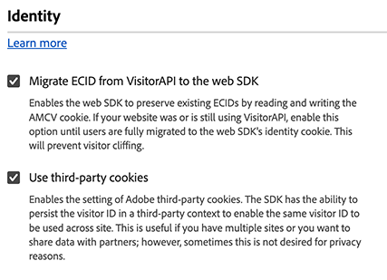

# ID 設定 {#identity}

>[!CONTEXTUALHELP]
>id="platform_tags_websdk_identity"
>title="ID"
>abstract="タグ拡張機能で訪問者を識別する方法を定義します。"

このコンフィギュレーションセクションでは、Web SDKの動作を定義できます。

1. Adobe IDの資格情報を使用して[experience.adobe.com](https://experience.adobe.com)にログインします。
1. **[!UICONTROL Data Collection]**／**[!UICONTROL Tags]**&#x200B;に移動します。
1. 目的のタグプロパティを選択します。
1. **[!UICONTROL Extensions]**&#x200B;に移動し、**[!UICONTROL Configure]** カードの[!UICONTROL Adobe Experience Platform Web SDK]を選択します。
1. **[!UICONTROL Identity]** セクションまでスクロールします。

タグ UI画像

次のオプションがあります。

## [!UICONTROL Migrate ECID from VisitorAPI]

Web SDKが`AMCV`および`s_ecid` Cookieを読み取り、`AMCV`が使用する`Visitor.js` Cookieを設定できるようにするチェックボックス。 この機能は、`VisitorAPI.js`を使用するライブラリからWeb SDKに移行する際に重要です。一部のページは`Visitor.js`を引き続き使用している可能性があります。 このオプションを使用すると、SDKで同じECIDを引き続き使用できるため、ユーザーが2人の別々のユーザーとして識別されることはありません。 このチェックボックスに相当するJavaScript ライブラリは[`idMigrationEnabled`](/help/collection/js/commands/configure/idmigrationenabled.md)です。

## [!UICONTROL Use third-party cookies]

このオプションを有効にすると、Web SDKはサードパーティ CookieにユーザーIDを保存しようとします。 成功した場合、ユーザーは、各ドメインで個別のユーザーとして識別されるのではなく、複数のドメインを移動する単一のユーザーとして識別されます。 このオプションが有効になっている場合、ブラウザーがサードパーティ Cookieをサポートしていないか、ユーザーがサードパーティ Cookieを許可しないように設定している場合、SDKは引き続きサードパーティ CookieにユーザーIDを保存できない可能性があります。 この場合、SDKはIDをファーストパーティドメインにのみ保存します。 このチェックボックスに相当するJavaScript ライブラリは[`thirdPartyCookiesEnabled`](/help/collection/js/commands/configure/thirdpartycookiesenabled.md)です。
