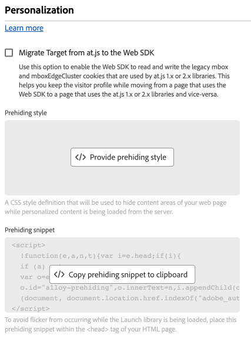

# パーソナライゼーション設定 {#personalization}

>[!CONTEXTUALHELP]
>id="platform_tags_websdk_personalization"
>title="パーソナライズ機能"
>abstract="タグ拡張機能でパーソナライズされたコンテンツを処理する方法を決定します。"

この設定セクションでは、パーソナライズされたコンテンツの読み込み中にページの特定の部分を非表示にする方法を指定できます。 これらの設定を正しく設定すると、訪問者に対して適切にパーソナライズされたコンテンツが表示されます。

1. Adobe IDの資格情報を使用して[experience.adobe.com](https://experience.adobe.com)にログインします。
1. **[!UICONTROL Data Collection]**／**[!UICONTROL Tags]**&#x200B;に移動します。
1. 目的のタグプロパティを選択します。
1. **[!UICONTROL Extensions]**&#x200B;に移動し、[!UICONTROL Adobe Experience Platform Web SDK] カードの&#x200B;**[!UICONTROL Configure]**&#x200B;を選択します。
1. **[!UICONTROL Personalization]** セクションまでスクロールします。

次のオプションがあります。

## [!UICONTROL Migrate Target from at.js to the Web SDK]**

このオプションを使用すると、Web SDKで`at.js` 1.xまたは2.x ライブラリで使用される従来の`mbox`および`mboxEdgeCluster` Cookieの読み取りと書き込みが可能になります。 この設定は、Web SDKまたは同じweb サイト上の`at.js`を使用してページ間を移動する際に、訪問者のプロファイルを維持するのに役立ちます。 サイト上のどこにも`at.js`が実装されていない場合は、このチェックボックスを有効にする必要はありません。 このチェックボックスに相当するJavaScript ライブラリは[`targetMigrationEnabled`](/help/collection/js/commands/configure/targetmigrationenabled.md)です。

このオプションを有効にする場合は、`targetGlobalSettings()`で[`overrideMboxEdgeServer`](https://experienceleague.adobe.com/en/docs/target-dev/developer/client-side/at-js-implementation/functions-overview/targetglobalsettings#overridemboxedgeserver)も有効にしてください。

## [!UICONTROL Prehiding style] {#prehiding-style}

事前非表示スタイルエディターを使用すると、ページの特定のセクションを非表示にするカスタム CSS ルールを定義できます。 ページが読み込まれると、Web SDKはこのスタイルを使用して、パーソナライズする必要があるセクションを非表示にし、パーソナライゼーションを取得した後、パーソナライズされたページセクションの非表示を解除します。 このワークフローを使用すると、訪問者はパーソナライゼーション取得プロセスの読み込みをちらつかせて見ることなく、パーソナライズされたコンテンツを見ることができます。 このコードエディターと同等のJavaScript ライブラリは[`prehidingStyle`](/help/collection/js/commands/configure/prehidingstyle.md)です。

## [!UICONTROL Prehiding snippet] {#prehiding-snippet}

このセクションは、直接の設定設定ではなく、実装コードを取得できる便利な場所です。 Web SDK ライブラリの読み込み中に目的のコンテンツを非表示にするには、サイトの`<head>` タグ内にこの事前非表示スニペットを実装します。

>[!IMPORTANT]
>
>事前非表示スニペットを使用する場合、Adobeでは、事前非表示スニペットと事前非表示スタイルの間で同じCSS ルールを使用することをお勧めします。

## [!UICONTROL Enable personalization storage]

Web SDKにパーソナライゼーションイベントを保存できるようにするチェックボックス。 URLを貼り付けます。 ページ読み込み時に、訪問者が閲覧したエクスペリエンスを追跡したい場合に役立ちます。

## [!UICONTROL Auto click collection for Adobe Journey Optimizer]

Web SDKがAdobe Journey Optimizerから返されたコンテンツのクリックを自動的に収集するタイミングを決定するドロップダウンメニュー。

* **[!UICONTROL Always]**：提案に関するすべてのインタラクションを収集します。
* **[!UICONTROL Decorated elements only]**: `data-aep-click-label`または`data-aep-click-token`個のHTML属性を持つ要素に対してのみインタラクションを収集します。
* **[!UICONTROL Never]**：提案とのやり取りを収集しません。

このドロップダウンメニューに相当するJavaScript ライブラリは[`autoCollectPropositionInteractions.AJO`](/help/collection/js/commands/configure/autocollectpropositioninteractions.md)です。 デフォルト値は[!UICONTROL Always]です。

## [!UICONTROL Auto click collection for Adobe Target]

Web SDKがAdobe Targetから返されたコンテンツのクリックを自動的に収集するタイミングを決定するドロップダウンメニュー。

* **[!UICONTROL Always]**：提案に関するすべてのインタラクションを収集します。
* **[!UICONTROL Decorated elements only]**: `data-aep-click-label`または`data-aep-click-token`個のHTML属性を持つ要素に対してのみインタラクションを収集します。
* **[!UICONTROL Never]**：提案とのやり取りを収集しません。

このドロップダウンメニューに相当するJavaScript ライブラリは[`autoCollectPropositionInteractions.TGT`](/help/collection/js/commands/configure/autocollectpropositioninteractions.md)です。 デフォルト値は[!UICONTROL Never]です。
