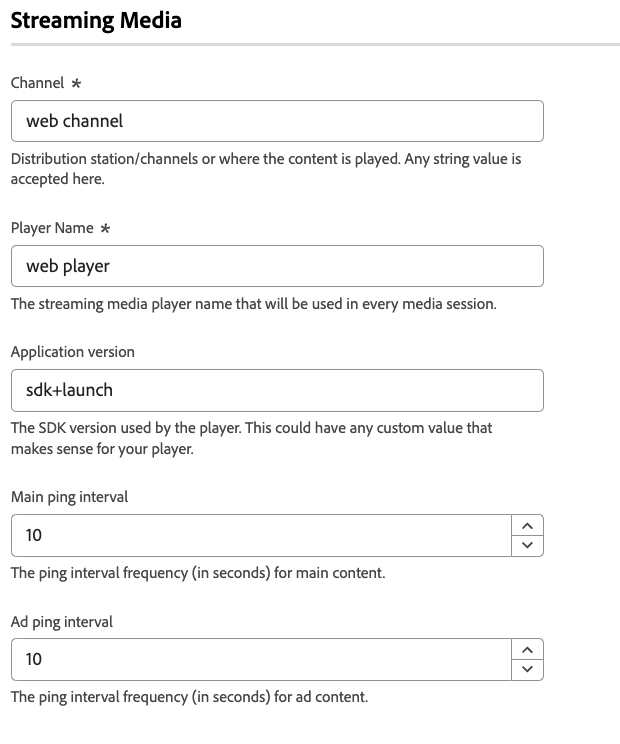

# ストリーミングメディア設定 {#streaming-media}

>[!CONTEXTUALHELP]
>id="platform_tags_websdk_streamingmedia"
>title="ストリーミングメディア"
>abstract="メディア再生セッション中のストリーミングメディアデータの収集方法を決定します。"

メディア収集機能は、メディアプレイバック、一時停止、完了、その他の関連イベントなど、メディアセッションに関連するデータを収集するのに役立ちます。 収集したら、このデータをAdobe Experience PlatformまたはAdobe Analyticsに送信して、レポートを生成できます。 この機能は、web サイトでのメディア消費行動を追跡および把握するための包括的なソリューションを提供します。

1. Adobe IDの資格情報を使用して [experience.adobe.com](https://experience.adobe.com) にログインします。
1. **[!UICONTROL Data Collection]**／**[!UICONTROL Tags]**&#x200B;に移動します。
1. 目的のタグプロパティを選択します。
1. **[!UICONTROL Extensions]** に移動し、**[!UICONTROL Configure]** カードで [!UICONTROL Adobe Experience Platform Web SDK] を選択します。
1. **[!UICONTROL Streaming media]** セクションまで下にスクロールします。

## 前提条件

Web SDKのストリーミングメディアコンポーネントを使用するには、次の前提条件を満たす必要があります。

* Adobe Experience PlatformまたはAdobe Analyticsへのアクセス権があることを確認します。
* 使用しているデータストリームの「**[[!UICONTROL Media Analytics]](/help/datastreams/configure.md#advanced-options)**」オプションを有効にします。
* データストリームで使用するスキーマに、メディアコレクションのスキーマフィールドが含まれていることを確認してください。
* このページで示すように、Web SDK タグ拡張機能でストリーミングメディア機能を設定します。

## [!UICONTROL Channel]

メディアコレクションが発生するチャネルの名前。 たとえば、`Video channel` のように設定します。任意の文字列値が有効です。

## [!UICONTROL Player Name]

プロパティがメディア再生に使用するメディアプレーヤーの名前。

## [!UICONTROL Application Version]

プロパティがメディア再生に使用するメディアプレーヤーアプリケーションのバージョン。

## [!UICONTROL Main ping interval]

メインコンテンツに対する ping の頻度（秒単位）。 デフォルト値は `10` です。値の範囲は `10` ～ `50` 秒です。 値を指定しない場合、[&#x200B; 自動的にトラッキングされるセッション &#x200B;](/help/collection/js/commands/createmediasession.md#automatic) を使用するときにデフォルト値が使用されます。

## [!UICONTROL Ad ping interval]

広告コンテンツに対する ping の頻度（秒）。 デフォルト値は `10` です。値の範囲は `1` ～ `10` 秒です。 値を指定しない場合、[&#x200B; 自動的にトラッキングされるセッション &#x200B;](/help/collection/js/commands/createmediasession.md#automatic) を使用するときにデフォルト値が使用されます。
