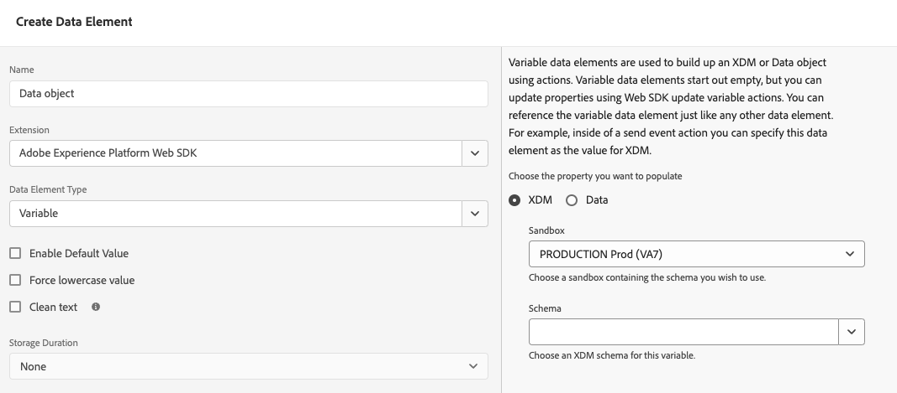

# データ要素タイプ

タグ拡張機能で [&#x200B; アクションタイプ &#x200B;](actions/actions-overview.md) を設定したら、データ要素タイプを設定する必要があります。 このページでは、使用可能なデータ要素タイプについて説明します。

## ID マップ {#identity-map}

ID マップを使用すると、web ページの訪問者の ID を確立できます。 ID マップは、`CRMID`、`Phone`、`Email` などの名前空間で構成され、各名前空間には 1 つ以上の識別子が含まれています。 例えば、web サイトの個人が 2 つの電話番号を提供している場合、電話の名前空間には 2 つの識別子を含める必要があります。

[!UICONTROL Identity map] データ要素では、各識別子に対して次の情報を提供します。

* **[!UICONTROL ID]**：訪問者を識別する値。 例えば、識別子が _phone_ 名前空間に属する場合、[!UICONTROL ID] は _555-555-5555_ になります。 通常、この値はページ上のJavaScript変数または他のデータから派生するので、ページデータを参照するデータ要素を作成し、[!UICONTROL ID] データ要素内の [!UICONTROL Identity map] フィールドでデータ要素を参照することをお勧めします。 ページ上で実行しているとき、ID 値が入力された文字列以外の場合、識別子は ID マップから自動的に削除されます。
* **[!UICONTROL Authenticated state]**：訪問者が認証されているかどうかを示す選択。
* **[!UICONTROL Primary]**：識別子を個人のプライマリ識別子として使用する必要があるかどうかを示す選択。 プライマリとしてマークされている識別子がない場合、ECID がプライマリ識別子として使用されます。

>[!TIP]
>
>Adobeでは、プライマリ ID として `Luma CRM Id` など、人物を表す ID を送信することをお勧めします。
>
>ID マップに人物識別子（例：`Luma CRM Id`）が含まれている場合、人物識別子はプライマリ識別子になります。 それ以外の場合は、`ECID` がプライマリ ID になります。

ID マップを作成する際は、[!DNL ECID] を指定しないでください。 SDKを使用すると、[!DNL ECID] がサーバー上で自動的に生成され、ID マップに含まれます。

ID マップデータ要素は、多くの場合、[[!UICONTROL Variable]](#variable) データ要素および [[!UICONTROL Set consent]](actions/set-consent.md) アクションと共に使用されます。

詳しくは、[Adobe Experience Platform ID サービス &#x200B;](/help/identity-service/home.md) を参照してください。

## XDM オブジェクト {#xdm-object}

XDM オブジェクトデータ要素を使用すると、データを XDM にフォーマットする方が簡単です。 このデータ要素を初めて開いたときに、正しい Adobe Experience Platform サンドボックスとスキーマを選択してください。スキーマを選択すると、スキーマの構造が表示されるので、簡単に入力できます。

スキーマの特定のフィールド（`web.webPageDetails.URL` など）を開くと、一部の項目が自動的に収集されます。 自動的に収集される項目は複数ありますが、必要に応じて上書きできます。 すべての値は、手動で入力することも、他のデータ要素を使用して入力することもできます。

>[!NOTE]
>
>収集したい情報のみを入力します。 入力されていない部分は、データがソリューションに送信される際に省略されます。

## Variable {#variable}

**[!UICONTROL Variable]** データ要素を使用して、ペイロードオブジェクトを作成できます。 [!UICONTROL XDM] オブジェクトと [!UICONTROL Data] オブジェクトの両方がサポートされています。

* [!UICONTROL XDM] を選択した場合は、目的の [!UICONTROL Sandbox] と [!UICONTROL Schema] を選択します。
* [!UICONTROL Data] を選択した場合は、目的のソリューションを選択します。 使用可能なソリューションには、[!UICONTROL Adobe Analytics] と [!UICONTROL Adobe Target] があります。

このデータ要素を作成したら、[&#x200B; 変数を更新 &#x200B;](actions/update-variable.md) アクションを使用して変更できます。 準備が整ったら、このデータ要素を [&#x200B; イベントを送信 &#x200B;](actions/send-event.md) アクションに含めて、データをデータストリームに送信できます。

## メディア：エクスペリエンスの品質 {#quality-experience}

**[!UICONTROL Quality of Experience]** データ要素は、ストリーミングメディアイベントをAdobe Experience Platformに送信する際に役立ちます。 この要素は、メディアセッションの作成時に追加できます。追加したメディアイベントには、更新されたエクスペリエンス品質データが含まれます。

## 次の手順 {#next-steps}

[ECID へのアクセス &#x200B;](accessing-the-ecid.md) など、特定のユースケースについて説明します。
