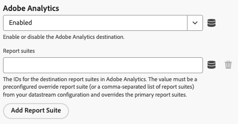

# Web SDK 拡張機能の設定

[!DNL Web SDK] タグ拡張機能は、web プロパティからAdobe Experience Cloud Edge Networkを介してExperience Platformにデータを送信します。

拡張機能を使用すると、データをExperience Platformにストリーミングし、ID を同期し、顧客の同意シグナルを処理して、コンテキストデータを自動的に収集できます。

このドキュメントでは、タグ UI でタグ拡張機能を設定する方法について説明します。

## Web SDK タグ拡張機能のインストール {#install}

Web SDK タグ拡張機能には、プロパティをインストールする必要があります。 まだ行っていない場合は、[&#x200B; タグプロパティの作成 &#x200B;](https://experienceleague.adobe.com/docs/platform-learn/implement-in-websites/configure-tags/create-a-property.html?lang=ja) に関するドキュメントを参照してください。

プロパティを作成したら、プロパティを開き、左側のバーにある **[!UICONTROL 拡張機能]** タブを選択します。

「**[!UICONTROL カタログ]**」タブを選択します。 使用可能な拡張機能のリストから、[!DNL Web SDK] の拡張機能を見つけて **[!UICONTROL インストール]** を選択します。

**[!UICONTROL インストール]** を選択した後、web SDK タグ拡張機能を設定し、設定を保存する必要があります。

>[!NOTE]
>
>タグ拡張機能は、設定を保存した後にのみインストールされます。 タグ拡張機能の設定方法については、次の節を参照してください。

## カスタム Web SDK ビルドの作成 {#custom-build}

Web SDK ライブラリには、パーソナライゼーション、ID、リンクトラッキングなど、様々な機能のための複数のモジュールが含まれています。 ユースケースによっては、ライブラリ全体ではなく、特定の機能のみが必要になる場合があります。 カスタム web SDK ビルドを作成すると、必要なモジュールのみを選択でき、ライブラリのサイズを減らし、パフォーマンスを向上させることができます。

カスタム Web SDK ビルドを作成すると、そのビルドがすべての Web SDK インスタンスで使用されます。

>[!IMPORTANT]
>
>Web SDK コンポーネントを無効にすると、既存の実装が壊れる可能性があります。 コンポーネントを無効にするたびに、実装を徹底的にテストして、必要なすべての機能が期待どおりに動作していることを確認します。
>&#x200B;>コンポーネントを無効にすると、そのコンポーネントの設定を編集できなくなります。

Web SDK タグ拡張機能を使用してカスタム web SDK ビルドを作成するには、次の手順に従います。

1. タグ拡張機能の設定ページで、「**[!UICONTROL カスタムビルドコンポーネント]**」セクションを展開します。
1. 必要に応じて、コンポーネントを有効または無効にします。 次のコンポーネントから選択できます。
   * **[!UICONTROL アクティビティコレクター]**：このコンポーネントを使用すると、リンクの自動収集と Activity Map のトラッキングを行えます。
   * **[!UICONTROL Advertising]**：このコンポーネントには、Adobe Advertisingに必要なすべてのJavaScript コードが含まれています。 また、アトリビューション測定への広告データの使用方法を定義するために、[!UICONTROL SDK インスタンス &#x200B;] セクションの [!UICONTROL 0&rbrace;Adobe Advertising&rbrace; 設定とタグルールの &#x200B;]Advertising[!UICONTROL &#x200B; 設定も追加されます。]
   * **[!UICONTROL オーディエンス]**：このコンポーネントを使用すると、URL や cookie ベースの宛先などのAudience Manager統合や、ID の同期を有効にできます。
   * **[!UICONTROL 同意]**：このコンポーネントは、同意統合を有効にします。 このコンポーネントを無効にすると、次の要素が無効になります。
      * [&#x200B; 同意を設定 &#x200B;](action-types.md#set-consent) アクションタイプ
   * **[!UICONTROL コンテキスト]**：このコンポーネントを使用すると、コンテキストデータを自動的に収集できます。
   * **[!UICONTROL イベントの結合]**: _非推奨_。 このコンポーネントを無効にすると、次の要素が無効になります。
      * [&#x200B; イベント結合 ID](action-types.md#data) データ要素
      * **[!UICONTROL イベント結合 ID をリセット]** アクションタイプ
   * **[!UICONTROL Media Analytics ブリッジ]**：このコンポーネントは、Media Analytics インターフェイスを使用してEdge Network Streaming Media を有効にします。 このコンポーネントを無効にすると、次の要素が無効になります。
      * [Media Analytics トラッカーを取得 &#x200B;](action-types.md#get-media-analytics-tracker) アクションタイプ
   * **[!UICONTROL Personalization]**：このコンポーネントは、Adobe TargetとAdobe Journey Optimizerの統合を有効にします。 このコンポーネントを無効にすると、次の要素が無効になります。
      * [&#x200B; 提案の適用 &#x200B;](action-types.md#apply-propositions) アクションタイプ
   * **[!UICONTROL プッシュ通知]**：このコンポーネントは、Adobe Journey Optimizerの web プッシュ通知を有効にします。
   * **[!UICONTROL ルールエンジン]**：このコンポーネントは、Adobe Journey Optimizer オンデバイス判定を有効にします。 このコンポーネントを無効にすると、次の要素が無効になります。
      * [&#x200B; ルールセットを評価 &#x200B;](action-types.md#evaluate-rulesets) アクションタイプ
      * [&#x200B; ルールセット項目を登録 &#x200B;](event-types.md#subscribe-ruleset-items) イベントタイプ
   * **[!UICONTROL ストリーミングメディア]**：このコンポーネントは、Edge Network Streaming Media を有効にします。 このコンポーネントを無効にすると、次の要素が無効になります。
      * [&#x200B; メディアイベントを送信 &#x200B;](action-types.md#send-media-event) アクションタイプ

## インスタンス設定を指定 {#general}

ページ上部の設定オプションは、データのルーティング先と、サーバーで使用する設定をAdobe Experience Platformに指示します。

* **[!UICONTROL 名前]**:Adobe Experience Platform Web SDK拡張機能は、ページ上の複数のインスタンスをサポートします。 この名前は、タグ設定を持つ複数の組織にデータを送信する場合に使用します。 インスタンス名のデフォルトは `alloy` です。 ただし、インスタンス名を任意の有効なJavaScript オブジェクト名に変更できます。
* **[!UICONTROL IMS 組織 ID]**:Adobeでデータを送信する組織の ID です。 ほとんどの場合、自動入力されるデフォルト値を使用します。 ページ上に複数のインスタンスがある場合、データの送信先の 2 番目の組織の値をこのフィールドに入力します。
* **[!UICONTROL Edge ドメイン]**：拡張機能がデータを送受信するドメイン。 Adobeでは、この拡張機能にファーストパーティドメイン（CNAME）を使用することをお勧めします。 デフォルトのサードパーティドメインは開発環境で使用できますが、実稼動環境には適していません。ファーストパーティ CNAME の設定方法については、[ここ](https://experienceleague.adobe.com/docs/core-services/interface/ec-cookies/cookies-first-party.html?lang=ja)で説明します。
* **[!UICONTROL Adobe Advertising]**: `Advertising` コンポーネントが選択されている場合に使用できます。 Adobe Advertising DSPのみを使用する組織の設定：
   * **[!UICONTROL Adobe Advertising DSP]**: ビュースルートラッキングを有効にします。
   * **[!UICONTROL 広告主]**: [!UICONTROL Adobe Advertising DSP] が有効な場合に使用できます。 ビュースルートラッキングを有効にする広告主。
   * **[!UICONTROL ID5 パートナー ID]**：オプション。 [!UICONTROL Adobe Advertising DSP] が有効な場合に使用できます。 組織の ID5 パートナー ID。 この設定を使用すると、Web SDKで ID5 ユニバーサル ID を収集できます。
   * **[!UICONTROL RampID JavaScriptのパス]**：オプション。 [!UICONTROL Adobe Advertising DSP] が有効な場合に使用できます。 組織の [!DNL LiveRamp RampID] JavaScript コード（`ats.js`）へのパス。  この設定を使用すると、Web SDKでユニバーサル ID[!DNL RampID] 収集できます。

## データストリーム設定の指定 {#datastreams}

このセクションでは、使用可能な 3 つの環境（実稼働、ステージング、開発）のそれぞれに使用するデータストリームを選択できます。

リクエストがEdge Networkに送信されると、データストリーム ID がサーバーサイド設定の参照に使用されます。 Web サイト上でコードを変更することなく、設定を更新できます。

データストリームの設定方法については、[&#x200B; データストリーム &#x200B;](../../../../datastreams/overview.md) に関するガイドを参照してください。

使用可能なドロップダウンメニューからデータストリームを選択するか、**[!UICONTROL 値を入力]** を選択して、各環境のカスタムデータストリーム ID を入力できます。

## プライバシー設定の指定 {#privacy}

このセクションでは、web SDKが web サイトからのユーザー同意シグナルをどのように処理するかを設定できます。 特に、他の明示的な同意環境設定が指定されていない場合にユーザーが想定されるデフォルトの同意レベルを選択できます。

デフォルトの同意レベルは、ユーザープロファイルに保存されません。

| [!UICONTROL &#x200B; デフォルトの同意レベル &#x200B;] | 説明 |
| --- | --- |
| [!UICONTROL &#x200B; イン &#x200B;] | ユーザーが同意環境設定を指定する前に発生するイベントを収集します。 |
| [!UICONTROL &#x200B; アウト &#x200B;] | ユーザーが同意環境設定を指定する前に発生するイベントを破棄します。 |
| [!UICONTROL 保留中] | ユーザーが同意環境設定を指定する前に発生するイベントをキューに追加します。 同意の環境設定が指定されると、指定された環境設定に応じてイベントが収集または破棄されます。 |
| [!UICONTROL &#x200B; データ要素によって提供 &#x200B;] | デフォルトの同意レベルは、定義した別のデータ要素によって決まります。 このオプションを使用する場合は、提供されたドロップダウンメニューを使用してデータ要素を指定する必要があります。 |

>[!TIP]
>
>ビジネス運営に明示的なユーザー同意が必要な場合は、「**[!UICONTROL アウト]**」または **[!UICONTROL 保留中]** を使用します。

## ID 設定の指定 {#identity}

この節では、ユーザー ID の処理に関する Web SDKの動作を定義できます。

* **[!UICONTROL VisitorAPI から ECID を移行]**：このオプションはデフォルトで有効になっています。 この機能が有効な場合、SDKは `AMCV` および `s_ecid` Cookie を読み取り、`AMCV` が使用する [!DNL Visitor.js] Cookie を設定できます。 この機能は、一部のページがまだ [!DNL Visitor.js] を使用している可能性があるので、Web SDKに移行する際に重要です。 このオプションを使用すると、SDKは引き続き同じ [!DNL ECID] を使用できるので、ユーザーが 2 人の異なるユーザーとして識別されることはありません。
* **[!UICONTROL サードパーティ cookie を使用]**：このオプションを有効にすると、Web SDKはユーザー ID をサードパーティ cookie に保存しようとします。 成功した場合、ユーザーは、各ドメインで個別のユーザーとして識別されるのではなく、複数のドメインを移動する際に単一のユーザーとして識別されます。 このオプションが有効になっている場合、ブラウザーがサードパーティ cookie をサポートしていない場合や、ユーザーによってサードパーティ cookie が許可されないように設定されている場合には、SDKでサードパーティ cookie にユーザー ID を格納できない可能性があります。 この場合、SDKはファーストパーティドメインにのみ ID を保存します。

  >[!IMPORTANT]
  >&#x200B;>サードパーティ cookie は、Web SDKの [&#x200B; ファーストパーティデバイス ID](../../../../web-sdk/identity/first-party-device-ids.md) 機能と互換性がありません。
  >&#x200B;>ファーストパーティデバイス ID またはサードパーティ Cookie のいずれかを使用できますが、両方の機能を同時に使用することはできません。
  >

## パーソナライゼーション設定の指定 {#personalization}

このセクションでは、パーソナライズされたコンテンツの読み込み中にページの特定の部分を非表示にする方法を設定できます。 これにより、訪問者にはパーソナライズされたページのみが表示されます。

* **[!UICONTROL Target を at.js から web SDKに移行]**:at.js [!DNL Web SDK] または `mbox` ライブラリで使用される従来の `mboxEdgeCluster` および `1.x` cookie の読み取りと書き込みを `2.x` で行えるようにする場合は、このオプションを使用します。 これにより、訪問者プロファイルを維持しながら、Web SDKを使用するページから at.js `1.x` または `2.x` ライブラリを使用するページに（その逆も同様に）移行できます。

### スタイルの事前非表示 {#prehiding-style}

事前非表示のスタイルエディターでは、ページの特定のセクションを非表示にするカスタム CSS ルールを定義できます。 ページが読み込まれると、Web SDKはこのスタイルを使用して、パーソナライズの必要なセクションを非表示にし、パーソナライゼーションを取得した後、パーソナライズされたページセクションの非表示を解除します。 これにより、訪問者には、パーソナライゼーション取得プロセスが表示されずに、既にパーソナライズされたページが表示されます。

### 事前非表示のスニペット {#prehiding-snippet}

事前非表示スニペットは、Web SDK ライブラリが非同期で読み込まれる際に役立ちます。 この場合、ちらつきを避けるために、Web SDK ライブラリが読み込まれる前にコンテンツを非表示にすることをお勧めします。

事前非表示のスニペットを使用するには、コピーしてページの `<head>` 要素内に貼り付けます。

>[!IMPORTANT]
>
>事前非表示スニペットを使用する場合、Adobeでは [!DNL CSS] 事前非表示スタイル [&#x200B; で使用したのと同じ &#x200B;](#prehiding-style) ルールを使用することをお勧めします。

## データ収集設定の指定 {#data-collection}

データ収集設定を管理します。 [`configure`](/help/web-sdk/commands/configure/overview.md) コマンドを使用すると、JavaScript ライブラリの同様の設定を利用できます。

* **[!UICONTROL On before event send callback]**:Adobeに送信されるペイロードを評価して変更するコールバック関数。 コールバック関数内の `content` 変数を使用して、ペイロードを変更します。 このコールバックは、JavaScript ライブラリの [`onBeforeEventSend`](/help/web-sdk/commands/configure/onbeforeeventsend.md) と同等のタグです。
* **[!UICONTROL 内部リンククリック数を収集]**：サイトまたはプロパティ内部のリンクトラッキングデータの収集を有効にするチェックボックス。 このチェックボックスを有効にすると、イベントのグループ化オプションが表示されます。
   * **[!UICONTROL イベントのグループ化なし]**：リンクトラッキングデータは、別々のイベントでAdobeに送信されます。 別々のイベントで送信されるリンククリック数は、Adobe Experience Platformに送信されるデータの契約上の使用を増やす可能性があります。
   * **[!UICONTROL セッションストレージを使用したイベントのグループ化]**：次のページイベントまで、リンクトラッキングデータをセッションストレージに保存します。 次のページでは、保存されたリンクトラッキングデータとページビューデータがAdobeに同時に送信されます。 Adobeでは、内部リンクをトラッキングする場合にこの設定を有効にすることをお勧めします。
   * **[!UICONTROL ローカルオブジェクトを使用したイベントのグループ化]**：次のページイベントまで、リンクトラッキングデータをローカルオブジェクトに保存します。 訪問者が新しいページに移動すると、リンクトラッキングデータが失われます。 この設定は、単一ページアプリケーションのコンテキストで最も役立ちます。

  セッションストレージまたはローカルオブジェクトを使用したイベントのグループ化を選択する場合、データをReal-Time CDP、Customer Journey Analytics、Adobe Journey OptimizerまたはMix Modelerに送信するには、タグ付けルールを更新する必要があります。 すべてのページビューイベントで、データをAdobeに送信する前に、ページ名（文字列）とページビュー値（整数、通常は 1）の両方を XDM オブジェクトに明示的にマッピングしてください。

  Adobe Analyticsにデータを送信する場合、これらの値は自動的に含まれるので、追加の設定は必要ありません。

* **[!UICONTROL 外部リンククリック数を収集]**：外部リンクの収集を有効にするチェックボックス。
* **[!UICONTROL ダウンロードリンクのクリック数を収集]**：ダウンロードリンクの収集を有効にするチェックボックス。
* **[!UICONTROL ダウンロードリンク修飾子]**：リンク URL をダウンロードリンクとして認定する正規表現。
* **[!UICONTROL クリックのプロパティをフィルター]**：コレクション前にクリック関連のプロパティを評価および変更するコールバック関数。 この関数は、イベント送信コールバックの前 [!UICONTROL On] に実行されます。
* **コンテキスト設定**：特定の XDM フィールドに値を入力する訪問者情報を自動的に収集します。 **[!UICONTROL すべてのデフォルトのコンテキスト情報]** または **[!UICONTROL 特定のコンテキスト情報]** を選択できます。 これは、JavaScript ライブラリの [`context`](/help/web-sdk/commands/configure/context.md) と同等のタグです。
   * **[!UICONTROL Web]**：現在のページに関する情報を収集します。
   * **[!UICONTROL デバイス]**：ユーザーのデバイスに関する情報を収集します。
   * **[!UICONTROL 環境]**：ユーザーのブラウザーに関する情報を収集します。
   * **[!UICONTROL 場所のコンテキスト]**：ユーザーの場所に関する情報を収集します。
   * **[!UICONTROL 高エントロピーのユーザーエージェントヒント]**：ユーザーのデバイスに関するより詳細な情報を収集します。

>[!TIP]
>
>**[!UICONTROL リンククリックの前にオン送信]** フィールドは、既に設定されているプロパティにのみ表示される非推奨のコールバックです。 これは、JavaScript ライブラリの [`onBeforeLinkClickSend`](/help/web-sdk/commands/configure/onbeforelinkclicksend.md) と同等のタグです。 **[!UICONTROL フィルタークリックプロパティ]** コールバックを使用してクリックデータをフィルタリングまたは調整するか、**[!UICONTROL イベント送信前にオン]** コールバックを使用して、Adobeに送信されるペイロード全体をフィルタリングまたは調整します。 **[!UICONTROL フィルタークリックのプロパティ]** コールバックと **[!UICONTROL リンククリックの送信前にオン]** コールバックの両方が設定されている場合、**[!UICONTROL フィルタークリックのプロパティ]** コールバックのみが実行されます。

## メディアコレクション設定の指定 {#media-collection}

メディア収集機能は、web サイト上のメディアセッションに関連するデータを収集するのに役立ちます。

収集されたデータには、メディアプレイバック、一時停止、完了およびその他の関連イベントに関する情報を含めることができます。 収集したら、このデータをAdobe Experience PlatformやAdobe Analyticsに送信して、レポートを生成できます。 この機能は、web サイトでのメディア消費行動を追跡および把握するための包括的なソリューションを提供します。

* **[!UICONTROL Channel]**：メディアコレクションが実行されるチャネルの名前。 例：`Video channel`。
* **[!UICONTROL Player Name]**：メディアプレーヤーの名前。
* **[!UICONTROL アプリケーションのバージョン]**：メディアプレーヤーアプリケーションのバージョン。
* **[!UICONTROL メイン ping 間隔]**：メインコンテンツに対する ping の頻度（秒単位）。 デフォルト値は `10` です。値の範囲は `10` ～ `50` 秒です。  値を指定しない場合、[&#x200B; 自動的にトラッキングされるセッション &#x200B;](../../../../web-sdk/commands/createmediasession.md#automatic) を使用するときにデフォルト値が使用されます。
* **[!UICONTROL 広告 ping 間隔]**：広告コンテンツに対する ping の頻度（秒単位）。 デフォルト値は `10` です。値の範囲は `1` ～ `10` 秒です。 値を指定しない場合、[&#x200B; 自動的にトラッキングされるセッション &#x200B;](../../../../web-sdk/commands/createmediasession.md#automatic) を使用するときにデフォルト値が使用されます

## データストリームの上書きの設定 {#datastream-overrides}

データストリームの上書きを使用すると、Web SDK を介して Edge Network に渡されるデータストリームの追加設定を定義できます。

これにより、新しいデータストリームを作成したり、既存の設定を変更したりすることなく、デフォルトとは異なるデータストリームの動作をトリガーできます。

データストリーム設定の上書きは、次の 2 つの手順で構成されます。

1. 最初に、[データストリーム設定ページ](/help/datastreams/configure.md)でデータストリーム設定の上書きを定義する必要があります。
2. 次に、Web SDK コマンドまたは Web SDK タグ拡張機能を使用して、上書きをEdge Networkに送信する必要があります。

データストリーム設定を上書きする方法について詳しくは、データストリーム [&#x200B; 設定の上書きドキュメント &#x200B;](/help/datastreams/overrides.md) を参照してください。

Web SDK コマンドを使用して上書きを渡す代わりに、以下に示すタグ拡張機能画面で上書きを設定できます。

>[!IMPORTANT]
>
> データストリームの上書きは、環境ごとに設定する必要があります。 開発環境、ステージング環境および実稼動環境では、すべて別々のオーバーライドが行われます。 次の画面に示す専用オプションを使用して、設定間でコピーできます。

デフォルトでは、データストリーム設定の上書きは無効になっています。 「**[!UICONTROL データストリーム設定を一致させる]**」オプションがデフォルトで選択されています。

タグ拡張機能でデータストリームの上書きを有効にするには、ドロップダウンメニューから「**[!UICONTROL 有効]**」を選択します。

データストリーム設定の上書きを有効にすると、以下に説明する各サービスの上書きを設定できます。

以下のデータストリーム優先設定は、選択した環境のサーバーサイドのデータストリーム設定およびルールを上書きします。

### Adobe Analytics {#analytics}

このセクションの設定を使用して、Adobe Analytics サービスへのデータルーティングを上書きします。

* **[!UICONTROL 有効]**/**[!UICONTROL 無効]**：このドロップダウンメニューを使用して、Adobe Analytics サービスへのデータルーティングを有効または無効にします。
* **[!UICONTROL レポートスイート]**:Adobe Analyticsの宛先レポートスイートの ID。 値は、データストリーム設定から事前設定された上書きレポートスイート（またはレポートスイートのコンマ区切りリスト）である必要があります。 この設定は、プライマリレポートスイートを上書きします。
* **[!UICONTROL レポートスイートを追加]**：レポートスイートを追加するには、このオプションを選択します。

### Adobe Audience Manager {#audience-manager}

このセクションの設定を使用して、Adobe Audience Manager サービスへのデータルーティングを上書きします。

* **[!UICONTROL 有効]**/**[!UICONTROL 無効]**：このドロップダウンメニューを使用して、Adobe Audience Manager サービスへのデータルーティングを有効または無効にします。
* **[!UICONTROL サードパーティ ID 同期コンテナ]**:Audience Managerの宛先サードパーティ ID 同期コンテナの ID。 この値は、データストリーム設定から事前設定されたセカンダリコンテナである必要があり、プライマリコンテナを上書きします。

### Adobe Experience Platform {#experience-platform}

このセクションの設定を使用して、Adobe Experience Platform サービスへのデータルーティングを上書きします。

* **[!UICONTROL 有効]**/**[!UICONTROL 無効]**：このドロップダウンメニューを使用して、Adobe Experience Platform サービスへのデータルーティングを有効または無効にします。
* **[!UICONTROL イベントデータセット]**:Adobe Experience Platformの宛先イベントデータセットの ID。 値は、データストリーム設定の事前設定済みセカンダリデータセットである必要があります。
* **[!UICONTROL Offer Decisioning]**：このドロップダウン メニューを使用して、[!DNL Offer Decisioning] サービスへのデータ ルーティングを有効または無効にします。
* **[!UICONTROL Edge セグメント化]**：このドロップダウンメニューを使用して、[!DNL Edge Segmentation] サービスへのデータルーティングを有効または無効にします。
* **[!UICONTROL Personalizationの宛先]**：このドロップダウンメニューを使用して、パーソナライゼーションの宛先へのデータルーティングを有効または無効にします。
* **[!UICONTROL Adobe Journey Optimizer]**：このドロップダウン メニューを使用して、[!DNL Adobe Journey Optimizer] サービスへのデータ ルーティングを有効または無効にします。

### Adobe サーバーサイドイベント転送 {#ssf}

この節の設定を使用して、Adobe サーバーサイドイベント転送サービスへのデータルーティングを上書きします。

* **[!UICONTROL 有効]**/**[!UICONTROL 無効]**：このドロップダウンメニューを使用して、Adobe サーバーサイドイベント転送サービスへのデータルーティングを有効または無効にします。

### Adobe Target {#target}

このセクションの設定を使用して、Adobe Target サービスへのデータルーティングを上書きします。

* **[!UICONTROL 有効]**/**[!UICONTROL 無効]**：このドロップダウンメニューを使用して、Adobe Target サービスへのデータルーティングを有効または無効にします。

## 詳細設定を指定

Edge Networkとのやり取りに使用するベースパスを変更する必要がある場合は **&#x200B;**&#x200B;Edge ベースパス &rbrace; フィールドを使用します。 ベータ版やアルファ版の場合は、Adobeからフィールドの変更を求められる場合があります。

