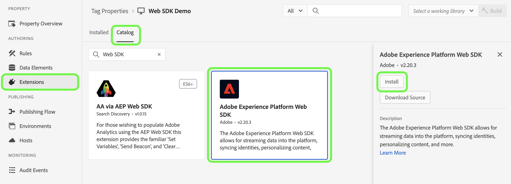

# Web SDK 拡張機能の設定

The [!DNL Web SDK] タグ拡張は、Web プロパティからAdobe Experience Cloud Edge Network を通じてExperience Platformを送信します。

拡張機能を使用すると、データを Platform にストリーミングし、ID を同期し、顧客の同意シグナルを処理して、コンテキストデータを自動的に収集できます。

このドキュメントでは、タグ UI でタグ拡張を設定する方法を説明します。

## Web SDK タグ拡張機能のインストール {#install}

Web SDK タグ拡張機能をインストールするには、プロパティが必要です。 まだおこなっていない場合は、 [タグプロパティの作成](https://experienceleague.adobe.com/docs/platform-learn/implement-in-websites/configure-tags/create-a-property.html?lang=ja).

プロパティを作成したら、プロパティを開き、 **[!UICONTROL 拡張機能]** 」タブをクリックします。

を選択します。 **[!UICONTROL カタログ]** タブをクリックします。 使用可能な拡張機能のリストから、 [!DNL Web SDK] 拡張機能と選択 **[!UICONTROL インストール]**.

選択後 **[!UICONTROL インストール]**&#x200B;を設定する場合は、Web SDK タグ拡張を設定し、設定を保存する必要があります。

>[!NOTE]
>
>タグ拡張機能は、設定を保存した後にのみインストールされます。 タグ拡張の設定方法については、次の節を参照してください。

## インスタンス設定の指定 {#general}

ページ上部の設定オプションは、データのルーティング先と、サーバー上で使用する設定をAdobe Experience Platformに通知します。

* **[!UICONTROL 名前]**: Adobe Experience Platform Web SDK 拡張機能は、ページ上の複数のインスタンスをサポートします。 この名前は、タグ設定を使用して複数の組織にデータを送信するために使用されます。 インスタンス名のデフォルト値はです。 `alloy`. ただし、インスタンス名は任意の有効な JavaScript オブジェクト名に変更できます。
* **[!UICONTROL IMS 組織 ID]**:Adobe時にデータの送信先となる組織の ID。 ほとんどの場合、自動入力されるデフォルト値を使用します。 ページに複数のインスタンスが存在する場合は、データの送信先となる 2 つ目の組織の値をこのフィールドに入力します。
* **[!UICONTROL Edge ドメイン]**：拡張機能がデータの送受信をおこなうドメイン。 Adobeでは、この拡張機能にファーストパーティドメイン (CNAME) を使用することをお勧めします。 デフォルトのサードパーティドメインは開発環境で使用できますが、実稼動環境には適していません。ファーストパーティ CNAME の設定方法については、[ここ](https://experienceleague.adobe.com/docs/core-services/interface/ec-cookies/cookies-first-party.html?lang=ja)で説明します。

## データストリーム設定の指定 {#datastreams}

このセクションでは、3 つの使用可能な環境（実稼動、ステージング、開発）それぞれに使用するデータストリームを選択できます。

リクエストが Edge ネットワークに送信されると、データストリーム ID がサーバー側設定の参照に使用されます。 Web サイト上でコードを変更しなくても、設定を更新できます。

次のガイドを参照してください： [datastreams](../../../../datastreams/overview.md) を参照してください。

使用可能なドロップダウンメニューからデータストリームを選択するか、「 」を選択します。 **[!UICONTROL 値を入力]** および各環境のカスタムデータストリーム ID を入力します。

## プライバシー設定の指定 {#privacy}

この節では、Web サイトからのユーザーの同意シグナルを Web SDK で処理する方法を設定できます。 特に、他の明示的な同意の環境設定が指定されていない場合に、ユーザーが想定するデフォルトの同意レベルを選択できます。

デフォルトの同意レベルは、ユーザープロファイルに保存されません。

| [!UICONTROL デフォルトの同意レベル] | 説明 |
| --- | --- |
| [!UICONTROL 次に含まれる] | ユーザーが同意設定を提供する前に発生したイベントを収集します。 |
| [!UICONTROL 出力] | ユーザーが同意設定を提供する前に発生したイベントを破棄します。 |
| [!UICONTROL 保留中] | ユーザーが同意設定を提供する前に発生したイベントをキューに入れます。 同意の環境設定が指定されると、指定された環境設定に応じてイベントが収集または破棄されます。 |
| [!UICONTROL データ要素によって提供されます] | デフォルトの同意レベルは、定義する別のデータ要素で決定します。 このオプションを使用する場合は、提供されたドロップダウンメニューを使用してデータ要素を指定する必要があります。 |

>[!TIP]
>
>用途 **[!UICONTROL 出力]** または **[!UICONTROL 保留中]** ビジネス運営に対して明示的なユーザーの同意が必要な場合。

## ID 設定の構成 {#identity}

この節では、ユーザー ID の処理に関して、Web SDK の動作を定義できます。

* **[!UICONTROL VisitorAPI から ECID を移行する]**：このオプションはデフォルトで有効になっています。 この機能が有効な場合、SDK は `AMCV` および `s_ecid` cookie と `AMCV` 使用する Cookie [!DNL Visitor.js]. 一部のページでは引き続きを使用している可能性があるので、この機能は Web SDK に移行する際に重要です。 [!DNL Visitor.js]. このオプションを使用すると、SDK は引き続き同じ [!DNL ECID] したがって、ユーザーは 2 人の個別のユーザーとして識別されません。
* **[!UICONTROL サードパーティ Cookie の使用]**：このオプションが有効な場合、Web SDK は、ユーザー識別子をサードパーティ Cookie に保存しようとします。 成功した場合、ユーザーは、各ドメインで個別のユーザーとして識別されるのではなく、複数のドメインをまたいで移動する際に、単一のユーザーとして識別されます。 このオプションが有効になっている場合、ブラウザーがサードパーティ Cookie をサポートしていない場合や、ユーザーがサードパーティ Cookie を許可しないように設定している場合、SDK は引き続き、ユーザー ID をサードパーティ Cookie に保存できません。 この場合、SDK は識別子をファーストパーティドメインにのみ保存します。

## パーソナライゼーション設定の指定 {#personalization}

このセクションでは、パーソナライズされたコンテンツを読み込む際に、ページの特定の部分を非表示にする方法を設定できます。

非表示にする要素は、事前非表示のスタイルエディターで指定できます。 次に、提供されたデフォルトの事前非表示スニペットをコピーし、 `<head>` サイトの要素 [!DNL HTML] コード。

* **[!UICONTROL at.js から Web SDK への Target の移行]**：このオプションを使用して、を有効にします。 [!DNL Web SDK] レガシーを読み書きするには `mbox` および `mboxEdgeCluster` at.js で使用される cookie `1.x` または `2.x` ライブラリ。 これにより、Web SDK を使用するページから at.js を使用するページに移動する際に、訪問者プロファイルを保持できます `1.x` または `2.x` ライブラリとその逆も同様です。

## データ収集設定の指定 {#data-collection}

* **[!UICONTROL コールバック関数]**：拡張機能で提供されるコールバック関数は、 [`onBeforeEventSend` 関数](https://experienceleague.adobe.com/docs/experience-platform/edge/fundamentals/configuring-the-sdk.html?lang=ja) ライブラリ内に保存されます。 この関数を使用すると、Edge ネットワークに送信される前に、イベントをグローバルに変更できます。 この関数の使用方法の詳細については、を参照してください。 [ここ](../../../../edge/fundamentals/tracking-events.md#modifying-events-globally).
* **[!UICONTROL クリックデータの収集を有効にする]**:Web SDK は、リンククリック情報を自動的に収集できます。 デフォルトでは、この機能は有効ですが、このオプションを使用して無効にできます。 また、 [!UICONTROL リンク修飾子のダウンロード] テキストボックス。 Adobeには、いくつかのデフォルトのダウンロードリンク修飾子が用意されています。 必要に応じて編集できます。
* **[!UICONTROL 自動的に収集されたコンテキストデータ]**：デフォルトでは、Web SDK は、デバイス、Web、環境、場所コンテキストに関する特定のコンテキストデータを収集します。 収集された情報Adobeの一覧を表示するには、次の URL を見つけます [ここ](../../../../edge/data-collection/automatic-information.md). このデータを収集しない場合や、特定のカテゴリのデータのみを収集する場合は、「 **[!UICONTROL 特定のコンテキスト情報]** をクリックし、収集するデータを選択します。

## データストリームの上書きの設定 {#datastream-overrides}

データストリームの上書きを使用すると、Web SDK を介して Edge Network に渡されるデータストリームの追加設定を定義できます。

これにより、新しいデータストリームを作成したり、既存の設定を変更したりすることなく、デフォルトとは異なるデータストリームの動作をトリガーできます。

データストリーム設定の上書きは、次の 2 つの手順で構成されます。

1. 最初に、[データストリーム設定ページ](../../../../datastreams/configure.md)でデータストリーム設定の上書きを定義する必要があります。
2. 次に、Web SDK コマンドまたは Web SDK タグ拡張機能を使用して、上書きを Edge Network に送信する必要があります。

データストリームを見る [設定の上書きドキュメント](../../../../datastreams/overrides.md) データストリーム設定を上書きする方法の詳細な手順については、を参照してください。

オーバーライドを Web SDK コマンドに渡す代わりに、次に示すタグ拡張画面でオーバーライドを設定できます。

>[!IMPORTANT]
>
> データストリームの上書きは、環境ごとに設定する必要があります。 開発環境、ステージング環境および実稼動環境には、すべて別々のオーバーライドがあります。 次の画面に示す専用オプションを使用して、設定をコピーできます。

## 詳細設定

以下を使用します。 **[!UICONTROL エッジの基本パス]** Edge ネットワークとのやり取りに使用されるベースパスを変更する必要がある場合は、「 」フィールドを使用します。 これは更新する必要はありませんが、ベータ版またはアルファ版に参加する場合は、Adobeからこのフィールドを変更するように求められる場合があります。

