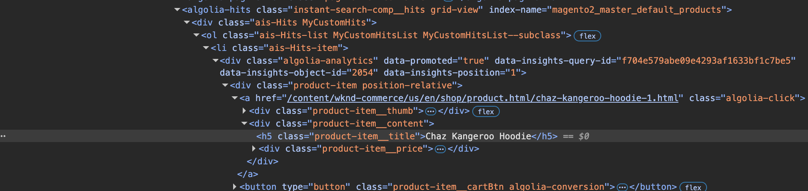

# [!DNL Algolia] イベント転送拡張機能の概要 {#overview}

[!DNL Algolia] を使用すると、関連性が高く、パーソナライズされた検索エクスペリエンスを迅速に提供できます。 AI を活用した最適化を使用すると、検索結果やレコメンデーションを強化して、ユーザーが必要とする製品、コンテンツ、情報をすばやく見つけるのに役立ちます。

[!DNL Algolia] イベント転送拡張機能を使用して、[!DNL Algolia] を介して [!DNL Insights API] にユーザー行動イベントを送信します。 この行動データにより、AI を活用したレコメンデーション、パーソナライズされたエクスペリエンス、インテリジェントな検索機能が可能になります。

## 前提条件 {#prerequisites}

拡張機能をインストールする前に、拡張機能へのアクセス権を持つ [!DNL Algolia] アカウントがあることを確認してくだ [!DNL Insights API] い。 アカウントがない場合は、[ 新規登録 ](https://dashboard.algolia.com/users/sign_up) し、API へのアクセスを有効にします。

また、[!DNL Algolia] [!DNL Insights API] の使用方法を理解していることを確認します。 イベントの送信方法の概要については、[Insights API を使用したイベントの送信 ](https://www.algolia.com/doc/guides/sending-events/getting-started/) を参照してください。

[!DNL Algolia] アカウントダッシュボードから次の値を収集します。
- **[!UICONTROL Application ID]**
- **[!UICONTROL Search API Key]**
- **[!UICONTROL Index Name]**

## 拡張機能のインストール {#install}

[!DNL Algolia] 拡張機能をインストールするには、次の手順に従います。

**[!UICONTROL Data Collection]** の [!DNL Adobe Experience Platform] に移動します。 「**[!UICONTROL Extensions]**」タブを選択します。

**[!UICONTROL Catalog]** を開き、**[!UICONTROL Algolia Event Forwarding]** 拡張機能を探して、「**[!UICONTROL Install]**」を選択します。

### 拡張機能の設定 {#configure-extension}

[!DNL Algolia] イベント転送拡張機能を設定するには、「**[!UICONTROL Extensions]**」タブに移動し、「**[!UICONTROL Algolia]**」拡張機能を選択してから「**[!UICONTROL Configure]**」を選択します。

| プロパティ | 説明 |
|----------|-------------|
| **[!UICONTROL Application ID]** | 「[!UICONTROL Application ID]API キー [」セクションの下の Algolia ダッシュボードにある ](https://www.algolia.com/account/api-keys/all) を入力します。 |
| **[!UICONTROL Search API Key]** | 「[!UICONTROL Search API Key]API キー [」セクションの下の Algolia ダッシュボードにある ](https://www.algolia.com/account/api-keys/all) を入力します。 |
| **[!UICONTROL Index Name]** | 製品またはコンテンツを含む [!UICONTROL Index Name] を入力します。 このインデックスはデフォルト値として使用されます。 |

{style="table-layout:auto"}

## [!DNL Algolia] イベント転送拡張機能のアクションタイプ {#action-types}

[!DNL Algolia] イベント転送拡張機能には、ルールの **[!UICONTROL Then]** セクションで使用できる単一のアクションタイプが用意されています。

### イベントを送信 {#send-event}

イベントを **[!UICONTROL Send event]** に転送するように、[!DNL Algolia] アクションを設定します。

**[!UICONTROL Rules]**/**[!UICONTROL Add Rule]** を選択するか、既存のルールを選択します。 ルールの **[!UICONTROL Then]** の部分でアクションを追加し、**[!UICONTROL Extension]**: [!DNL Algolia] イベント転送/**[!UICONTROL Action Type]**: **[!UICONTROL Send Events]** を選択します。

## [!DNL Algolia] イベントフィールドグループの実装 {#algolia-field-group}

[!DNL Algolia] イベント転送拡張機能を使用する前に、[!DNL Algolia] イベントフィールドグループをスキーマに追加する必要があります。 これは、Experience Platformを通じて提供される標準フィールドグループの 1 つです。

### [!DNL Algolia] イベントフィールドグループをスキーマに追加します {#add-algolia-field-group}

[!DNL Algolia] イベントフィールドグループを追加するには：

**[!UICONTROL Schemas]** に移動し、「**[!UICONTROL Browse]**」を選択します。

Web イベントの送信に使用する新しいスキーマを追加するか、既存のスキーマを更新して、「**[!UICONTROL Add]**」アイコンにポインタを合わせます。 結果を絞り込むには、検索ボックスに「*[!DNL Algolia]*」と入力します。

「**[!DNL Algolia]Event Details**」フィールドグループ/**[!UICONTROL Add field group]** ボタン/**[!UICONTROL Save]** を選択します。

### [!UICONTROL Data Collection] タグを使用したデータのマッピングと送信

[!DNL Algolia] イベント転送拡張機能を **[!DNL Adobe Experience Platform Web SDK]** と併用すると、web サイトから [!DNL Algolia] にデータを送信できます。 これを行うには、タグプロパティを作成し、データを [!DNL XDM] オブジェクトにマッピングして、イベントを送信するルールを設定します。

#### 手順 1:web SDKでタグプロパティを作成する

1. タグプロパティを作成します。
2. [!DNL Adobe Experience Platform Web SDK] 拡張機能をインストールします。
3. この拡張機能を使用して、HTMLから **[!DNL Algolia]Event** フィールドグループにデータをマッピングします。

#### 手順 2：マッピング用のデータ要素 [!DNL XDM] 作成

1. [!UICONTROL Data Element] を使用して **[!DNL Adobe Experience Platform Web SDK]** を作成します。
2. データ要素タイプとして **[!UICONTROL XDM object]** を選択します。
3. データを適切な [!DNL XDM] フィールドにマッピングし、[!DNL Algolia] 固有のフィールドが入力されていることを確認します。

#### 手順 3：イベントを送信するためのルールを作成する

1. タグプロパティに新しいルールを作成します。
2. ページの読み込みやクリックイベントなど、必要なイベントトリガーーを追加します。
3. **[!DNL Adobe Experience Platform Web SDK]** を使用してアクションを追加します。
4. アクションタイプとして「**[!UICONTROL Send event]**」を選択します。
5. [!DNL XDM] データ要素を使用するようにアクションを設定します。

#### 手順 4：公開とテスト

1. ルールと拡張機能の変更をターゲット環境に公開します。
2. [!DNL Adobe Experience Platform Debugger] を使用して、データがAdobe Experience Platformに送信され、[!DNL Algolia] に転送されることを確認します。

### [!DNL Algolia] でのイベントの検証

[!DNL Algolia] イベント転送拡張機能を設定した後、次の手順に従って、イベントが正しく送受信されていることを確認できます。

[!DNL Algolia] ダッシュボードに移動し、**[!UICONTROL Data Sources > Events > Debugger]** に移動します。

[!DNL Algolia] のイベント転送拡張機能から送信されたイベントと一致するイベントを選択し、期待されるデータがイベントに存在することを確認します。

## 一般的な実装シナリオ

[!DNL Algolia] イベント転送拡張機能を使用すると、様々なユースケースでユーザーインタラクションデータを取得および送信し、検索の関連性とパーソナライゼーションを強化できます。

### 製品ビューまたはコンテンツビューの追跡

拡張機能を使用すると、ユーザーが製品ページやコンテンツページを表示するタイミングを追跡でき、ユーザーの関心を理解するの [!DNL Algolia] 役立ちます。

### コンバージョンイベントの追跡

買い物かごへの追加イベント、購入、その他のコンバージョンイベントを追跡して、[!DNL Algolia] の AI を活用したレコメンデーションを最適化します。

## トラブルシューティング

[!DNL Algolia] イベント転送拡張機能の実装中に問題が発生した場合は、次のトラブルシューティング手順を検討してください。

### イベントが [!DNL Algolia] に表示されない

[!DNL Algolia] にイベントが表示されない場合は、次の点を確認してください。

- **API 資格情報の検証**:**[!UICONTROL Application ID]** と **[!UICONTROL API Key]** が [!DNL Algolia] ダッシュボードの値と一致することを確認します。
- **イベントデバッガーを確認**:[!DNL Algolia] イベントデバッガーを使用して、イベントが受信されているかどうかを確認します。 そうでない場合は、イベント転送ルールの設定を確認します。
- **XDM マッピングの検査**:[!DNL Algolia] スキーマ内のすべての必須フィールドが、[!DNL XDM] オブジェクトで正しくマッピングされていることを確認します。

### イベントデータが正しくありません

- [!DNL XDM] オブジェクトデータ要素が、すべての必須フィールドを使用して、[!DNL Algolia] スキーマに正確にマッピングされていることを確認します。
- イベントパラメーターが、[!DNL Algolia] の Insights API ドキュメントに記載されている想定される形式および構造に一致していることを確認します。

## 次の手順

このガイドでは、[!DNL Algolia] を使用して [!DNL Algolia Event Forwarding Extension] にデータを送信する方法について説明しました。 [!DNL Adobe Experience Platform] のイベント転送機能について詳しくは、[ イベント転送の概要 ](../../../ui/event-forwarding/overview.md) を参照してください。

Experience Platform Debugger とイベント転送の監視ツールを使用した実装のデバッグ方法について詳しくは、[Adobe Experience Platform Debuggerの概要 ](../../../../debugger/home.md) および [ イベント転送でのアクティビティの監視 ](../../../ui/event-forwarding/monitoring.md) を参照してください。

## その他のリソース

- [[!DNL Algolia] Insights API ドキュメント ](https://www.algolia.com/doc/rest-api/insights/)
- [[!DNL Algolia]  イベントドキュメント ](https://www.algolia.com/doc/guides/sending-events/getting-started/)
- [[!DNL Adobe Experience Platform]  イベント転送ドキュメント ](https://experienceleague.adobe.com/docs/experience-platform/tags/event-forwarding/overview.html?lang=ja)
- [[!DNL Algolia] AI 機能の概要 ](https://www.algolia.com/products/ai-search/)
