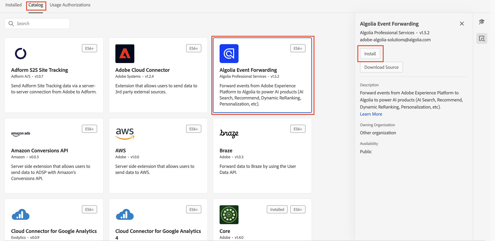
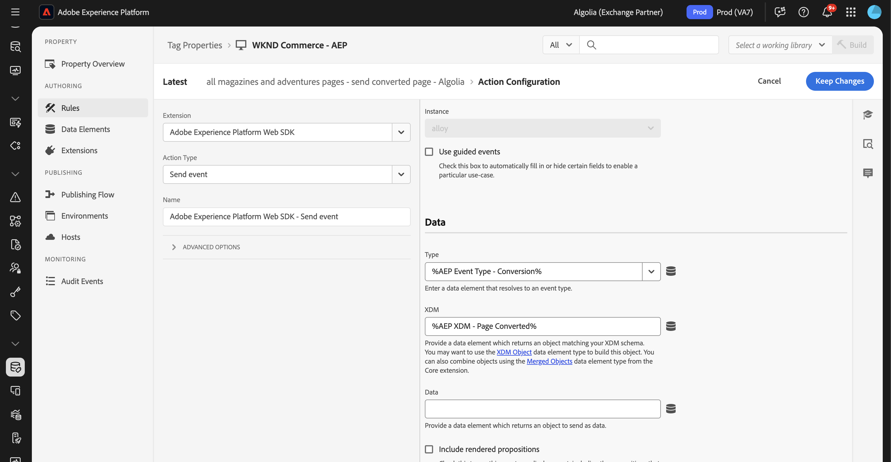
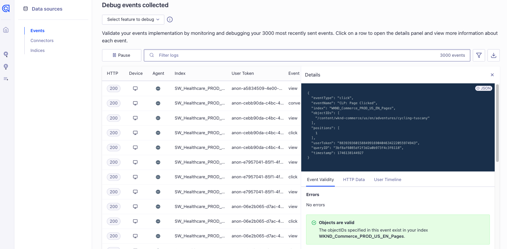

# [!DNL Algolia] イベント転送拡張機能の概要 {#overview}

[!DNL Algolia]を使用して、関連性の高い、パーソナライズされた検索エクスペリエンスをすばやく提供します。 AIを活用した最適化により、検索結果やレコメンデーションを強化し、利用者が必要な商品、コンテンツ、情報をすばやく見つけられるようにすることができます。

[!DNL Algolia] イベント転送拡張機能を使用して、ユーザー行動イベントを[!DNL Algolia]経由で[!DNL Insights API]に送信します。 この行動データにより、AIを活用したレコメンデーション、パーソナライズされたエクスペリエンス、インテリジェントな検索機能が実現します。

## 前提条件 {#prerequisites}

拡張機能をインストールする前に、[!DNL Algolia]へのアクセス権を持つ[!DNL Insights API] アカウントがあることを確認してください。 アカウントをお持ちでない場合は、[&#x200B; サインアップ &#x200B;](https://dashboard.algolia.com/users/sign_up)してAPIへのアクセスを有効にしてください。

また、[!DNL Algolia] [!DNL Insights API]の使用方法を理解していることを確認してください。 イベントの送信方法の概要については、[&#x200B; インサイト APIを使用したイベントの送信](https://www.algolia.com/doc/guides/sending-events/getting-started/)を参照してください。

[!DNL Algolia] アカウント ダッシュボードから次の値を収集します。
- **[!UICONTROL Application ID]**
- **[!UICONTROL Search API Key]**
- **[!UICONTROL Index Name]**

## 拡張機能のインストール {#install}

[!DNL Algolia]拡張機能をインストールするには、次の手順に従います。

**[!UICONTROL Data Collection]**&#x200B;の[!DNL Adobe Experience Platform]に移動します。 「**[!UICONTROL Extensions]**」タブを選択します。

**[!UICONTROL Catalog]**&#x200B;を開いて&#x200B;**[!UICONTROL Algolia Event Forwarding]**&#x200B;拡張機能を見つけ、**[!UICONTROL Install]**&#x200B;を選択します。

### 拡張機能の設定 {#configure-extension}

[!DNL Algolia] イベント転送拡張機能を設定するには、**[!UICONTROL Extensions]** タブに移動し、**[!UICONTROL Algolia]**&#x200B;拡張機能を選択してから&#x200B;**[!UICONTROL Configure]**&#x200B;を選択します。

Adobe Experience PlatformのAlgolia イベント転送拡張機能の

| プロパティ | 説明 |
|----------|-------------|
| **[!UICONTROL Application ID]** | 「[!UICONTROL Application ID]API キー[」セクションの下のAlgolia ダッシュボードにある「](https://www.algolia.com/account/api-keys/all)」を入力します。 |
| **[!UICONTROL Search API Key]** | 「[!UICONTROL Search API Key]API キー[」セクションの下のAlgolia ダッシュボードにある「](https://www.algolia.com/account/api-keys/all)」を入力します。 |
| **[!UICONTROL Index Name]** | 製品またはコンテンツを含む[!UICONTROL Index Name]を入力します。 このインデックスはデフォルト値として使用されます。 |

{style="table-layout:auto"}

## [!DNL Algolia]個のイベント転送拡張機能アクションタイプ {#action-types}

[!DNL Algolia] イベント転送拡張機能は、ルールの&#x200B;**[!UICONTROL Then]** セクションで使用できる単一のアクションタイプを提供します。

### イベントを送信 {#send-event}

イベントを&#x200B;**[!UICONTROL Send event]**&#x200B;に転送するための[!DNL Algolia] アクションを設定します：

**[!UICONTROL Rules]** > **[!UICONTROL Add Rule]**&#x200B;を選択するか、既存のルールを選択します。 ルールの&#x200B;**[!UICONTROL Then]**&#x200B;部分で、アクションを追加し、**[!UICONTROL Extension]**: [!DNL Algolia] イベント転送> **[!UICONTROL Action Type]**: **[!UICONTROL Send Events]**&#x200B;を選択します。

## [!DNL Algolia] イベントフィールドグループの実装 {#algolia-field-group}

[!DNL Algolia] イベント転送拡張機能を使用する前に、[!DNL Algolia] イベントフィールドグループをスキーマに追加してください。 これは、Experience Platformで提供される標準フィールドグループの1つです。

### スキーマに[!UICONTROL Algolia Event Details] フィールドグループを追加します {#add-algolia-field-group}

[!UICONTROL Algolia Event Details] フィールドグループを追加するには：

**[!UICONTROL Schemas]**&#x200B;に移動し、**[!UICONTROL Browse]**&#x200B;を選択します。

新しいスキーマを追加するか、web イベントの送信に使用する既存のスキーマを更新して、**[!UICONTROL Add]** アイコンにカーソルを合わせます。 検索ボックスに&#x200B;*[!DNL Algolia]*&#x200B;と入力して、結果を絞り込みます。

**[!UICONTROL Algolia Event Details]** フィールドグループ > **[!UICONTROL Add field group]** ボタン > **[!UICONTROL Save]**&#x200B;を選択します。

Experience PlatformAlgolia プロファイルフィールドグループ設定

### [!UICONTROL Data Collection] タグを使用したデータのマッピングと送信

[!DNL Algolia] イベント転送拡張機能を&#x200B;**[!DNL Adobe Experience Platform Web SDK]**&#x200B;と共に使用して、Web サイトから[!DNL Algolia]にデータを送信できます。 これは、タグプロパティを作成し、[!DNL XDM] オブジェクトにデータをマッピングし、イベントを送信するルールを設定することによって行います。

#### 手順1:web SDKを使用したタグプロパティの作成

1. タグプロパティを作成します。
2. [!DNL Adobe Experience Platform Web SDK]拡張機能をインストールします。
3. この拡張機能を使用して、HTMLから&#x200B;**[!DNL Algolia]Event** フィールドグループにデータをマッピングします。

#### 手順2: [!DNL XDM] マッピング用のデータ要素の作成

1. [!UICONTROL Data Element]を使用して&#x200B;**[!DNL Adobe Experience Platform Web SDK]**&#x200B;を作成します。
2. データ要素タイプとして&#x200B;**[!UICONTROL XDM object]**&#x200B;を選択します。
3. データを適切な[!DNL XDM] フィールドにマッピングし、[!DNL Algolia]固有のフィールドが入力されるようにします。

#### 手順3：イベントを送信するルールの作成

1. タグプロパティに新しいルールを作成します。
2. ページ読み込みやクリックイベントなど、必要なイベントトリガーを追加します。
3. **[!DNL Adobe Experience Platform Web SDK]**&#x200B;を使用してアクションを追加します。
4. アクションタイプとして&#x200B;**[!UICONTROL Send event]**&#x200B;を選択します。
5. [!DNL XDM] データ要素を使用するようにアクションを設定します。

#### ステップ 4：公開とテスト

1. ルールと拡張機能の変更をターゲット環境に公開します。
2. データがAdobe Experience Platformに送信され、[!DNL Adobe Experience Platform Debugger]に転送されていることを確認するには、[!DNL Algolia]を使用します。

### [!DNL Algolia]のイベントを確認

[!DNL Algolia] イベント転送拡張機能を設定した後、次の手順に従って、イベントが正しく送受信されていることを確認できます。

[!DNL Algolia] ダッシュボードに移動し、**[!UICONTROL Data Sources > Events > Debugger]**&#x200B;に移動します。

[!DNL Algolia]のイベント転送拡張機能から送信されたイベントと一致するイベントを選択し、期待されるデータがイベントに存在することを確認します。

## 一般的な実装シナリオ

[!DNL Algolia] イベント転送拡張機能を使用して、様々なユースケースのユーザーインタラクションデータを取得および送信し、検索の関連性とパーソナライゼーションを向上させます。

### 製品またはコンテンツの閲覧履歴の追跡

この拡張機能を使用すると、ユーザーが製品ページまたはコンテンツページを表示するタイミングを追跡でき、[!DNL Algolia]がユーザーの興味を把握するのに役立ちます。

### コンバージョンイベントの追跡

カートへの追加イベント、購入、その他のコンバージョンイベントを追跡して、[!DNL Algolia]のAIを活用したレコメンデーションを最適化します。

## トラブルシューティング

[!DNL Algolia] イベント転送拡張機能の実装中に問題が発生した場合は、次のトラブルシューティング手順を検討してください。

### イベントが[!DNL Algolia]に表示されません

[!DNL Algolia]にイベントが表示されない場合は、次の点を確認してください。

- **API資格情報を確認**: **[!UICONTROL Application ID]**&#x200B;と&#x200B;**[!UICONTROL API Key]**&#x200B;が[!DNL Algolia] ダッシュボードの値と一致していることを確認します。
- **イベントデバッガーを確認**: [!DNL Algolia] イベントデバッガーを使用して、イベントが受信されているかどうかを確認します。 そうでない場合は、イベント転送ルール設定を確認します。
- **XDM マッピングの調査**: [!DNL Algolia] スキーマのすべての必須フィールドが[!DNL XDM] オブジェクトで正しくマッピングされていることを確認します。

### 不正確なイベントデータ

- すべての必須フィールドを含め、[!DNL XDM] オブジェクトデータ要素が[!DNL Algolia] スキーマに正確にマッピングされていることを確認します。
- イベントパラメーターが、[!DNL Algolia]のInsights API ドキュメントで概説されている想定される形式と構造に一致することを確認します。

## 次の手順

このガイドでは、[!DNL Algolia]を使用して[!DNL Algolia Event Forwarding Extension]にデータを送信する方法について説明しました。 [!DNL Adobe Experience Platform]のイベント転送機能について詳しくは、[&#x200B; イベント転送の概要](../../../ui/event-forwarding/overview.md)を参照してください。

Experience Platform Debugger and Event Forwarding Monitoring Toolを使用して実装をデバッグする方法について詳しくは、[Adobe Experience Platform Debuggerの概要](../../../../debugger/home.md)および[&#x200B; イベント転送におけるアクティビティの監視](../../../ui/event-forwarding/monitoring.md)を参照してください。

## その他のリソース

- [[!DNL Algolia] Insights API ドキュメント &#x200B;](https://www.algolia.com/doc/rest-api/insights/)
- [[!DNL Algolia]  イベントドキュメント &#x200B;](https://www.algolia.com/doc/guides/sending-events/getting-started/)
- [[!DNL Adobe Experience Platform]  イベント転送ドキュメント &#x200B;](https://experienceleague.adobe.com/docs/experience-platform/tags/event-forwarding/overview.html?lang=ja)
- [[!DNL Algolia] AI機能の概要](https://www.algolia.com/products/ai-search/)
