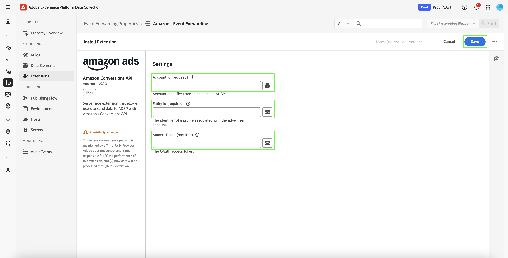

# [!DNL Amazon] web イベント API 拡張機能の概要

[!DNL Amazon] Conversions API 拡張機能は、広告主のサーバーと [!DNL Amazon] のマーケティングデータの間に直接接続を作成します。 これにより、広告主はコンバージョンの場所に関係なくキャンペーンの有効性を評価し、それに応じてキャンペーンを最適化できます。 この拡張機能により、より完全なアトリビューション、改善されたデータ信頼性、およびより最適化された配信が提供されます。

## [!DNL Amazon] 前提条件 {#prerequisites}

[!DNL Amazon] Conversions API 拡張機能をインストールおよび設定する前に、適切な認証およびデータアクセスを確保するためにいくつかの前提条件の手順を完了する必要があります。

### 秘密鍵およびデータ要素の作成 {#secret}

[!DNL Amazon] での認証には、適切に保存され、参照される必要があるセキュアなトークンが必要です。

1. 認証用に一意の名前を持つ新しい [!DNL Amazon] イベント転送シークレットを作成します。
2. **秘密鍵** データ要素タイプを持つ **Core** 拡張機能を使用してデータ要素を作成し、[!DNL Amazon] 秘密鍵を参照します。

このプロセスにより、認証資格情報は保護されたままになり、必要に応じて拡張機能からアクセスできるようになります。

## [!DNL Amazon] 拡張機能のインストールと設定

拡張機能をインストールするには、Experience Platformのイベント転送プロパティにアクセスする必要があります。

- イベント転送プロパティを作成または編集します。
- 左側のナビゲーションで **拡張機能** を選択し、「カタログ」タブで拡張機能 [!DNL Amazon] 選択します。
- **インストール** を選択します。

拡張機能 ![[!DNL Amazon] カタログで選択され、「インストール」ボタンも表示されます。](../../../images/extensions/server/amazon/amazon-extension.png)

- 次を使用してを設定します。

- **アクセストークン**:OAuth 2 トークンを含むデータ要素秘密鍵

- **エンティティ ID**：エンティティ ID （「entity」プレフィックスを付けた Campaign Manager ポータル URL で見つかりました）

- 「**保存**」を選択します。

これらの設定値は、Platform と [!DNL Amazon] アカウントの間の接続を確立します。

### [!DNL Amazon] OAuth 2 {#oauth}

[!DNL Amazon] OAuth2 シークレットを作成するには：

- **タイプ** ドロップダウ [!DNL Amazon] から「OAuth 2」を選択し、「**シークレットの作成** を選択します。

- ポップオーバーで **Amazonで秘密鍵を作成して認証** を選択し、秘密鍵を手動で認証して続行します。

- 表示されるダイアログに [!DNL Amazon] 資格情報を入力します。 画面の指示に従い、イベント転送にデータへのアクセスを許可します。

完了後、**秘密鍵** タブに、ステータスと有効期限を含む秘密鍵が表示されます。

## イベント転送ルールの設定 {#config-rule}

すべてのデータ要素を設定したら、イベントをAmazonに送信するタイミングと方法を決定するイベント転送ルールを作成できます。

- **ルール** に移動し、新しいイベント転送ルールを作成します。
- 「**アクション**」で、「**Amazon Conversions API 拡張機能**」を選択します。
- **アクションタイプ** を **コンバージョンイベントをインポート** に設定します。

- 次に示すように、イベントのプロパティを設定します。

| 入力 | 説明 |
| --- | --- |
| **イベント名** | コンバージョンイベントの名前。 |
| **イベントタイプ** | 追跡されるイベントのタイプ（購入、買い物かごへの追加など）を定義します。 |
| **タイムスタンプ** | ISO 形式のイベント時間。 |
| **クライアント重複除外 ID** | 重複排除用の一意の ID。 |
| **一致キー** | アトリビューションのユーザー識別子とデバイス識別子。 |
| **値** | イベントの金銭的価値。 |
| **通貨コード** | ISO-4217 形式の通貨。 |
| **販売数量** | 購入した品目の数量。 |
| **国コード** | イベントが発生した国。 |
| **データ処理オプション** | 制限付きデータ使用のフラグ。 |
| **同意** | 広告データの使用に対するユーザーの同意を示します。 |

- 「**変更を保持**」を選択して、ルールを保存します。

## イベントの重複排除 {#deduplication}

同じイベント [!DNL Amazon] 対してAdvertising タグ（AAT）と [!DNL Amazon] Conversions API 拡張機能の両方を使用する場合は、重複排除の設定が必要です。 適切な重複排除を確実に行うために、すべての共有イベントに `clientDedupeId` を含めます。
クライアントイベントとサーバーイベントが重複していない場合は、重複排除は必要ありません。

適切な重複排除により、コンバージョン数の水増しを防ぎ、最適化データを正確に保つことができます。

詳しくは、[Amazon イベントの重複排除ガイド ](https://advertising.amazon.com/) を参照してください。

## 次の手順

このガイドでは、[!DNL Amazon] Conversions API 拡張機能を使用してコンバージョンイベントを設定および [!DNL Amazon] に送信する方法について説明しました。 [!DNL Adobe Experience Platform] のイベント転送機能について詳しくは、[ イベント転送の概要 ](../../../ui/event-forwarding/overview.md) を参照してください

Experience Platform Debugger とイベント転送の監視ツールを使用して実装をデバッグする方法について詳しくは、イベント転送の [Adobe Experience Platform Debuggerの概要 ](https://experienceleague.adobe.com/en/docs/experience-platform/debugger/home) および [ アクティビティの監視 ](https://experienceleague.adobe.com/en/docs/experience-platform/tags/event-forwarding/monitoring) を参照してください。