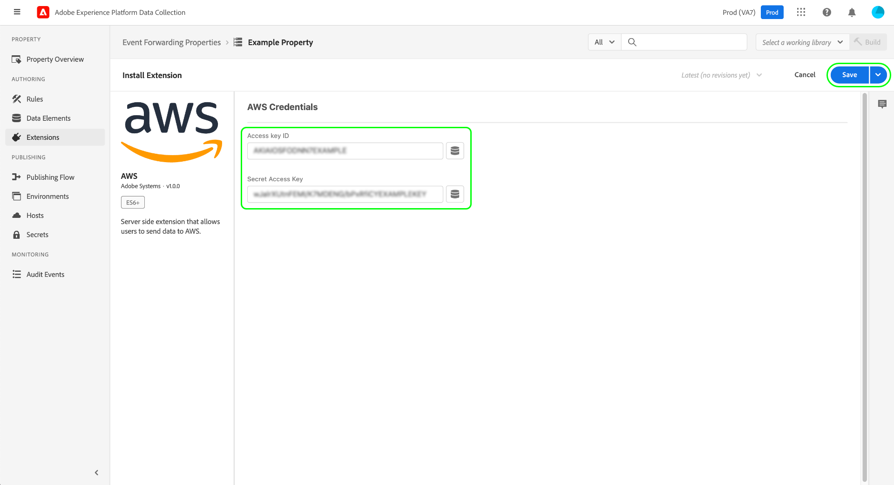

# [!DNL AWS] 拡張機能の概要

>[!NOTE]
>
>Adobe Experience Platform Launch は、Adobe Experience Platform のデータ収集テクノロジースイートとしてリブランドされています。 その結果、製品ドキュメント全体でいくつかの用語が変更されました。用語の変更点の一覧については、次の[ドキュメント](../../../term-updates.md)を参照してください。

[[!DNL Amazon Web Services] ([!DNL AWS])](https://aws.amazon.com/) は、顧客関係管理 (CRM) およびエンタープライズリソース計画 (ERP) 向けの、分散コンピューティング、データベースストレージ、コンテンツ配信、SaaS(Software-as-a-S) 統合サービスなど、幅広いサービスを提供するクラウドコンピューティングプラットフォームです。

この [!DNL AWS] [イベント転送](../../../ui/event-forwarding/overview.md) 拡張機能の活用 [[!DNL Amazon Kinesis Data Streams]](https://docs.aws.amazon.com/streams/latest/dev/introduction.html) を追加して、Adobe Experience Platform Edge Network からにイベントを送信します。 [!DNL AWS] を参照してください。 このガイドでは、イベント転送ルールでの拡張機能のインストール方法とその機能の使用方法について説明します。

## 前提条件

次が必要です： [!DNL AWS] 既存の [!DNL Kinesis] この拡張機能を使用するためのデータストリーム。 既存のデータストリームがない場合は、 [!DNL AWS] ドキュメント [を使用した新しいデータストリームの作成 [!DNL AWS] 管理コンソール](https://docs.aws.amazon.com/streams/latest/dev/how-do-i-create-a-stream.html).

## 拡張機能のインストール {#install}

をインストールするには、以下を実行します。 [!DNL AWS] 拡張機能に移動し、データ収集 UI またはExperience PlatformUI に移動して、「 」を選択します。 **[!UICONTROL イベント転送]** をクリックします。 ここから、拡張機能を追加するプロパティを選択するか、代わりに新しいプロパティを作成します。

目的のプロパティを選択または作成したら、「 」を選択します。 **[!UICONTROL 拡張機能]** 左側のナビゲーションで、 **[!UICONTROL カタログ]** タブをクリックします。 を検索します。 [!UICONTROL AWS] カードを選択し、 **[!UICONTROL インストール]**.

![この [!UICONTROL インストール] ボタンを選択しています [!UICONTROL AWS] 拡張機能を使用して、データ収集 UI に追加できます。](../../../images/extensions/server/aws/install.png)

次の画面で、 [!DNL AWS] アカウント 特に、 [!DNL AWS] アクセスキー ID および秘密アクセスキー。 これらの値が不明な場合は、 [!DNL AWS] ドキュメント [アクセスキー ID と秘密アクセスキーの取得方法](https://docs.aws.amazon.com/powershell/latest/userguide/pstools-appendix-sign-up.html).

>[!IMPORTANT]
>
>アクセスポリシーを [!DNL AWS] アクセス資格情報の生成に使用するアカウント。 このポリシーは、にデータを送信するためのアクセス権を付与するように構成する必要があります [!DNL Kinesis] データストリーム。 参照： **例 2** 内 [!DNL AWS] 文書 [ポリシーの例 [!DNL Kinesis Data Streams]](https://docs.aws.amazon.com/streams/latest/dev/controlling-access.html#kinesis-using-iam-examples) ポリシーの定義方法を確認します。

終了したら、「 」を選択します。 **[!UICONTROL 保存]** 拡張機能がインストールされている。

## イベント転送ルールの設定 {#rule}

拡張機能をインストールしたら、新しいイベント転送を作成します [ルール](../../../ui/managing-resources/rules.md) 必要に応じて、条件を設定します。 ルールのアクションを設定する際に、 **[!UICONTROL AWS]** 拡張機能、「 **[!UICONTROL Kinesis Data Stream へのデータ送信]** （アクションタイプ）。

![この [!UICONTROL Kinesis Data Stream へのデータ送信] データ収集 UI のルールに対して選択されているアクションタイプ。](../../../images/extensions/server/aws/select-action-type.png)

右側のパネルが更新され、データの送信方法に関する設定オプションが表示されます。 特に、 [データ要素](../../../ui/managing-resources/data-elements.md) を [!DNL Event Hub] 設定。

![の設定オプション [!UICONTROL Kinesis Data Stream へのデータ送信] UI に表示されるアクションタイプ。](../../../images/extensions/server/aws/data-stream-details.png)

**[!UICONTROL Kinesis Data Stream の詳細]**

| 必要情報 | 説明 |
| --- | --- |
| [!UICONTROL ストリーム名] | このイベント転送ルールがデータレコードを送信するストリームの名前。 |
| [!UICONTROL AWS リージョン] | この [!DNL AWS] 地域 [!DNL Kinesis] データストリームが作成されます。 |
| [!UICONTROL パーティションキー] | この [パーティションキー](https://docs.aws.amazon.com/streams/latest/dev/key-concepts.html#partition-key) 拡張機能がデータストリームにデータを送信する際に使用する  [!DNL Kinesis Data Streams] 1 つのストリームに属するデータレコードを複数のシャードに分離します。 各データレコードと共に送信されるパーティションキーを使用して、特定のデータレコードが属するシャードを判断します。  顧客を配布するための適切なパーティションキーは、顧客ごとに異なるので、顧客番号である場合があります。 パーティションキーの値が低いと、すべてのキーが近くの同じ領域に存在する可能性があるので、郵便番号が表示される場合があります。 通常は、様々な潜在的な値の範囲が最も大きいパーティションキーを選択する必要があります。 詳しくは、 [!DNL AWS] 記事 [スケール [!DNL Kinesis] データストリーム](https://aws.amazon.com/blogs/big-data/under-the-hood-scaling-your-kinesis-data-streams/) パーティションキーの管理に関するベストプラクティスを参照してください。 |

{style="table-layout:auto"}

**[!UICONTROL データ]**

| 必要情報 | 説明 |
| --- | --- |
| [!UICONTROL ペイロード] | このフィールドには、 [!DNL Kinesis] データストリーム（JSON 形式）。  以下 **[!UICONTROL 生]** 」オプションを使用する場合は、指定したテキストフィールドに JSON オブジェクトを直接貼り付けるか、データ要素アイコン () をクリックして、ペイロードを表す既存のデータ要素のリストから選択します。  また、 **[!UICONTROL JSON キーと値のペアエディター]** UI エディターを使用して各キーと値のペアを手動で追加するオプションが追加されました。 各値は、生の入力で表すことも、代わりにデータ要素を選択することもできます。 |

{style="table-layout:auto"}

終了したら、「 」を選択します。 **[!UICONTROL 変更を保持]** をクリックして、ルール設定にアクションを追加します。 ルールに問題がない場合は、「 」を選択します。 **[!UICONTROL ライブラリに保存]**.

最後に、新しいイベント転送を公開します [ビルド](../../../ui/publishing/builds.md) ライブラリへの変更を有効にします。

## 次の手順

このガイドでは、にデータを送信する方法について説明しました [!DNL Kinesis Data Streams] の使用 [!DNL AWS] イベント転送拡張機能。 Experience Platformのイベント転送機能について詳しくは、 [イベント転送の概要](../../../ui/event-forwarding/overview.md).
