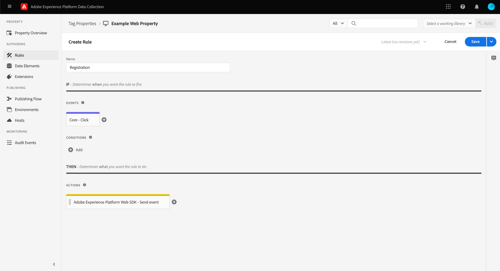

# [!DNL Braze Track Events API] イベント転送拡張機能

[[!DNL Braze]](https://www.braze.com) は、消費者とブランド間の顧客中心のインタラクションをリアルタイムで強化する顧客エンゲージメントプラットフォームです。 使用 [!DNL Braze]を使用すると、次の操作を実行できます。

* 言語の好みや場所の好みなどに基づいてターゲットユーザーにデータ（マーケティングメッセージなど）を配信し、コンバージョン率を高め、主要なビジネス目標をサポートします。
* 電子メール、プッシュ通知、アプリ内メッセージなど、複数のチャネルをまたいで、お客様向けにパーソナライズされたメッセージを、ちょうど適切なタイミングで、お客様の希望の言語で送信できます。
* マーケティングキャンペーンやプロモーションキャンペーンの特定のユーザーをターゲットにして、リピート顧客数を増やします。
* ユーザーの行動とパターンを調べ、カスタマイズされたメッセージを使用して特定のオーディエンスをターゲット設定し、売上高の増加に役立てます。

この [!DNL Braze Track Events API] [イベント転送](../../../ui/event-forwarding/overview.md) 拡張機能を使用すると、 Adobe Experience Platform Edge Network で取得したデータを活用し、に送信できます。 [!DNL Braze] を使用して、サーバー側のイベントの形式で [[!DNL Braze User Identify]](https://www.braze.com/docs/api/endpoints/user_data/post_user_identify) および [[!DNL Braze User Track]](https://www.braze.com/docs/api/endpoints/user_data/post_user_track) API

このドキュメントでは、拡張機能の使用例、イベント転送ライブラリでのインストール方法、イベント転送での拡張機能の使用方法について説明します [ルール](../../../ui/managing-resources/rules.md).

## ユースケース

この拡張機能は、 [!DNL Braze] を使用して、顧客分析およびターゲティング機能を活用します。

例えば、マルチチャネルの存在（Web サイトとモバイル）があり、Web サイトやモバイルプラットフォームからイベントデータとしてトランザクション入力や会話入力を取り込む小売組織について考えてみましょう。 様々な [タグ](../../../home.md) ルールを使用する場合、このデータはリアルタイムで Edge ネットワークに送信されます。 ここから、 [!DNL Braze] イベント転送拡張機能は、関連イベントを [!DNL Braze] をサーバー側から削除します。

データを送信したら、組織の分析チームは [!DNL Braze's] データセットを処理し、ビジネスインサイトを導き出してグラフ、ダッシュボード、その他のビジュアライゼーションを生成し、ビジネス関係者に通知する機能です。 詳しくは、 [[!DNL Braze] 顧客](https://www.braze.com/customers) ページを参照してください。

## [!DNL Braze] 前提条件とガードレール {#prerequisites}

次をお持ちの場合は、 [!DNL Braze] その技術を使用するためのアカウント。 アカウントがない場合は、 [はじめにページ](https://www.braze.com/get-started/) オン [!DNL Braze] 接続する [!DNL Braze Sales] アカウント作成プロセスを開始します。

### API ガードレール

拡張機能では、次の 2 つを使用します。 [!DNL Braze]の API とその制限について、以下で概要を説明します。

| API | レート制限 |
| --- | --- |
| [!DNL User Track] | 1 分あたり 50,000 件のリクエスト。  詳しくは、 [[!DNL User Track] API ドキュメント](https://www.braze.com/docs/api/endpoints/user_data/post_user_track#rate-limit) 」を参照してください。 |
| [!DNL User Identify] | 1 分あたり 20,000 件のリクエスト。  詳しくは、 [[!DNL User Identify] API ドキュメント](https://www.braze.com/docs/api/endpoints/user_data/post_user_identify#rate-limit) 」を参照してください。 |

>[!NOTE]
>
>に関するガイドを参照してください。 [[!DNL Braze] API の制限](https://www.braze.com/docs/api/api_limits/) 制限の詳細については、

### ユーザープロファイルのライフサイクルについて

[!DNL Braze] は、一意の識別子を使用して匿名ユーザープロファイルを作成します。 `deviceId`，設定者 [!DNL Braze]. ユーザー ID を指定してユーザーを識別すると、識別されたユーザープロファイルが作成されます。

割り当ての最初のインスタンスで、 `external_id` 不明なユーザープロファイルに対しては、既存のすべてのユーザープロファイルデータと匿名イベントが新しいユーザープロファイルに移行されます。 匿名ユーザープロファイルが同じを共有している `deviceId` また、は、識別されたユーザープロファイルにエイリアスされます。

[!DNL Braze] は、エイリアスのみのプロファイルに関連付けられているすべてのデータを結合して保持します。 ただし、以降の匿名ユーザーデータは孤立します。 詳しくは、 [!DNL Braze] のドキュメントページ [特定のユーザープロファイル](https://www.braze.com/docs/user_guide/data_and_analytics/user_data_collection/user_profile_lifecycle/#identified-user-profiles) および [データ収集のベストプラクティス](https://www.braze.com/docs/user_guide/data_and_analytics/user_data_collection/best_practices/#overview) を参照してください。

### 課金対象のデータポイント

追加のカスタム属性の送信先 [!DNL Braze] を増やすかもしれません [!DNL Braze] データポイントの使用。 詳しくは、 [!DNL Braze] 追加のカスタム属性を送信する前に、アカウントマネージャーに問い合わせてください。 詳しくは、 [!DNL Braze] ドキュメント [課金対象のデータポイント](https://www.braze.com/docs/user_guide/onboarding_with_braze/data_points/#billable-data-points) を参照してください。

### 必要な設定の詳細の収集 {#configuration-details}

Edge ネットワークをに接続するには [!DNL Braze]の場合、次の入力が必要です。

| キータイプ | 説明 | 例 |
| --- | --- | --- |
| [!DNL Braze] インスタンス | に関連付けられた REST エンドポイント [!DNL Braze] アカウント 詳しくは、 [!DNL Braze] ドキュメント [インスタンス](https://www.braze.com/docs/user_guide/administrative/access_braze/braze_instances) 指導のために | `rest.iad-03.braze.com` |
| API キー | この [!DNL Braze] に関連付けられた API キー [!DNL Braze] アカウント  詳しくは、 [!DNL Braze] に関するドキュメント [REST API キー](https://www.braze.com/docs/api/basics/#rest-api-key) 指導のために | `YOUR-BRAZE-REST-API-KEY` |

## Experience Cloudの前提条件

この節では、すべての実装のExperience Cloudの前提条件の手順を説明します。 個々の実装のニーズに応じて、拡張機能を設定する前に、次の構成を設定すると便利です。

1. A [スキーマ](../../../../xdm/schema/composition.md) Experience Cloudに取り込むデータの構造を記述する
1. A [datastream](https://experienceleague.adobe.com/docs/platform-learn/data-collection/event-forwarding/set-up-a-datastream.html) 受信データを適切なAdobe Experience Cloudアプリケーションにルーティングする
1. A [データセット](https://experienceleague.adobe.com/docs/platform-learn/tutorials/data-ingestion/create-datasets-and-ingest-data.html?lang=ja) 収集したデータを保存するには

すべての実装で、Experience Cloud側で次が必要です。

1. [秘密鍵の作成](#create-a-secret)
1. [タグプロパティの設定](#set-up-tag-properties)
1. [タグプロパティ内にデータ要素を追加する](#add-data-elements-within-tag-properties)
1. [タグプロパティ内にルールを追加する](#add-rules-within-tag-properties)

### 秘密鍵の作成

新しい [イベント転送秘密鍵](../../../ui/event-forwarding/secrets.md) の値を [[!DNL Braze] API キー](#configuration-details). これは、値のセキュリティを維持しながら、アカウントへの接続を認証するために使用されます。

### タグプロパティの設定

[タグプロパティの作成](https://experienceleague.adobe.com/docs/platform-learn/implement-in-websites/configure-tags/create-a-property.html?lang=en) または、代わりに編集する既存のプロパティを選択します。 このプロパティは、 [!DNL Braze] イベント転送を使用して送信される前に Edge ネットワークに取り込まれるためです。

### タグプロパティ内にデータ要素を追加する

Web サイトが [!DNL Braze] SDK の場合は、 [データ要素の作成](../../../ui/managing-resources/data-elements.md) は **[!UICONTROL Cookie]** タイプ ( [[!UICONTROL コア] タグ拡張](../../client/core/overview.md)) [!DNL Braze] `deviceId` は Cookie から読み取ることができます。

この **[!UICONTROL Cookie 名]** 値は [!DNL Braze] web サイトの cookie 名。 名前は、次のような形式にする必要があります `ab.storage.deviceId.{BRAZE_PROJECT_TOKEN_FOR_WEBSITE}`. 完了したら、「**[!UICONTROL 保存]**」をクリックします。

2 番目のデータ要素の場合、タイプをに設定します。 **[!UICONTROL XDM オブジェクト]** ( [Adobe Experience Platform Web SDK 拡張機能](../../client/sdk/overview.md)) にマッピングし、前に作成したスキーマにマッピングします。 データをマッピングする際は、必ず `deviceId` データ要素 ( [!DNL Braze] `deviceId` の値がスキーマフィールドの 1 つ内の値として参照される )。

>[!NOTE]
>
>Web サイトが [!DNL Braze] SDK、Adobe Experience Cloud ID(ECID) はフォールバックとして使用されます `deviceId` に送信されるイベントで渡される値 [!DNL Braze].

シナリオに応じて、スキーマ内のイベント名にマッピングするために使用できる別のデータ要素を作成する必要が生じる場合があります。 これは、 **[!UICONTROL 定数]** 提供されるタイプ [!UICONTROL コア] 拡張子。

### タグプロパティ内にルールを追加する

をインストールする前の最後の手順 [!DNL Braze] 拡張機能は、タグを作成することです [ルール](../../../ui/managing-resources/rules.md) （または複数のタグルール）を使用して、追跡中のユーザー ID イベント（ログイン、新規登録、登録など）に対してトリガーされます。

を設定する際に **[!UICONTROL イベント]** ルールの場合、ルールを適用する適切なイベントタイプをトリガーします。 ユーザーのクリック時にログインルールをトリガーにするイベントの例を次に示します。

最後に、 **[!UICONTROL アクション]** ルールの場合、 **[!UICONTROL イベントを送信]** Web SDK 拡張機能によって提供されるアクションタイプ。 の下 **[!UICONTROL XDM データ]**&#x200B;を選択し、 [!UICONTROL XDM オブジェクト] 作成したデータタイプ [以前](#add-data-elements-within-tag-properties).

## のインストールと設定 [!DNL Braze] 拡張 {#install}

拡張機能をインストールするには、以下を実行します。 [イベント転送プロパティの作成](../../../ui/event-forwarding/overview.md#properties) または、代わりに編集する既存のプロパティを選択します。

左側のナビゲーションの「**[!UICONTROL 拡張機能]**」をクリックします。内 **[!UICONTROL カタログ]** タブ、選択 **[!UICONTROL インストール]** ～のためのカードで [!DNL Braze] 拡張子。

![[!DNL Braze]拡張機能のインストール.](../../../images/extensions/server/braze/install-extension.png)

次の画面で、次の情報を入力します。 [設定値](#configuration-details) 以前に集めた [!DNL Braze]:

* **[!UICONTROL Rest エンドポイント URL をブレーズ]**:この [!DNL Braze] rest エンドポイント URL を指定された入力内のプレーンテキストとして指定します。
* **[!UICONTROL API キー]**:を選択します。 [シークレットデータ要素](#create-a-secret) 先ほど作成したが、 [!DNL Braze] API キー。

完了したら、「**[!UICONTROL 保存]**」をクリックします。

![この [!DNL Braze] 拡張機能の設定ページ。](../../../images/extensions/server/braze/configure-extension.png)

## イベント転送データ要素の設定

拡張機能のインストールと設定の後、次の手順では、に送信される必要なデータ構成を取り込むイベント転送データ要素を作成します。 [!DNL Braze].

### の作成 `deviceId` データ要素

サイトが [!DNL Braze] SDK を定義した場合、 [シークレットデータ要素](#add-data-elements-within-tag-properties) を含む [!DNL Braze] `deviceId` をタグプロパティに追加します。 次に、XDM 形式で送信される際にこの値を指す別のデータ要素をイベント転送で設定する必要があります。

データ要素を作成する際に、「 **[!UICONTROL コア]** 拡張機能に対して、「 」を選択します。 **[!UICONTROL パス]** （データ要素タイプ用） 値には、 `deviceId` フィールドに含まれます。 完了したら、「**[!UICONTROL 保存]**」をクリックします。

### の作成 `EventName` データ要素

イベント転送プロパティで、 **[!UICONTROL パス]** 次から入力： **[!UICONTROL コア]** 拡張子。 値には、スキーマに存在するイベント名のドット表記のパスを入力します。

### イベントと購入のデータ要素の作成

この [[!DNL Braze User Track] API](https://www.braze.com/docs/api/endpoints/user_data/post_user_track) は、2 つの異なるアクションをサポートしています。カスタム [イベント](https://www.braze.com/docs/api/objects_filters/event_object/#what-is-the-event-object) および [purchases](https://www.braze.com/docs/api/objects_filters/purchase_object/#what-is-a-purchase-object). API は、 [属性](https://www.braze.com/docs/api/objects_filters/user_attributes_object/) これは [!DNL Braze] データポイント。

のデータ要素 `deviceId` および `EventName` は、カスタムイベントと購入の両方に必要ですが、どちらのイベントタイプにも含めることができる追加のデータ要素があります。 次に示します。

>[!NOTE]
>
>以下に示すすべてのデータ要素で、 **[!UICONTROL パス]** タイプを入力し、 **スキーマパス** 列。

#### カスタムイベント

| [!DNL Braze] キー | スキーマパス | 説明 | 必須 |
| --- | --- | --- | --- |
| [!DNL Braze] デバイス ID | `arc.event.xdm._extconndev.brazeDeviceId` | `deviceId` イベントを実行したユーザーを識別します。 `deviceId` は、次のために非常に重要なので、すべてのイベントで指定する必要があります。 [!DNL Braze] 解析を実行する。 | ○ |
| イベントタイプ | `arc.event.xdm._extconndev.event_Type` | イベントの名前。 | ○ |
| ユーザー識別子 | `arc.event.xdm._extconndev.userId` | ユーザーの電子メールまたはログイン ID（ある場合）。 |  |
| アプリ ID | `arc.event.xdm._extconndev.appId` | イベントがトリガーされた場所を示す文字列。 |  |
| イベントフィールド | `arc.event.xdm._extconndev.event_Properties` | イベントに関するすべての属性を表す JSON オブジェクト。 |  |

{style="table-layout:auto"}

#### 購入

| [!DNL Braze] キー | スキーマパス | 説明 | 必須 |
| --- | --- | --- | --- |
| [!DNL Braze] デバイス ID | `arc.event.xdm._extconndev.brazeDeviceId` | `deviceId` イベントを実行したユーザーを識別します。 `deviceId` は、次のために非常に重要なので、すべてのイベントで指定する必要があります。 [!DNL Braze] 解析を実行する。 | ○ |
| イベントタイプ | `arc.event.xdm._extconndev.event_Type` | イベントの名前。 | ○ |
| ユーザー識別子 | `arc.event.xdm._extconndev.userId` | ユーザーの電子メールまたはログイン ID（ある場合）。 |  |
| アプリ ID | `arc.event.xdm._extconndev.appId` | イベントがトリガーされた場所を示す文字列。 |  |
| 製品 ID | `arc.event.xdm._extconndev.product_Id` | 購入の識別子（UPC、ISBN、製品カテゴリ、製品名など）。 | ○ |
| 通貨 | `arc.event.xdm._extconndev.currency` | 購入に使用した通貨（単位： ） [ISO 4217 コード形式](https://www.iso.org/iso-4217-currency-codes.html). | ○ |
| 価格 | `arc.event.xdm._extconndev.price` | 購入の数値（数値）。 | ○ |
| 数量 | `arc.event.xdm._extconndev.quantity` | 購入した製品の数量。 | ○ |
| 追加のフィールド | `arc.event.xdm._extconndev.event_Properties` | イベントに関する追加の属性を表す JSON オブジェクト。 詳しくは、 [[!DNL Braze] ドキュメント](https://www.braze.com/docs/user_guide/onboarding_with_braze/data_points/#billable-data-points) を参照してください。 |  |

{style="table-layout:auto"}

## イベント転送ルールの設定

すべてのデータ要素を設定したら、カスタムイベントと購入をにいつ、どのように送信するかを決定するイベント転送ルールの作成を開始できます。 [!DNL Braze].

以降 [!DNL Braze User Track] API は、2 つの異なるアクションとしてカスタムイベントと購入をサポートします。 [!DNL Braze's] analytics for each を適切に活用できます。

その結果、 [!DNL Braze] 拡張機能では、次のアクションタイプをルールに追加できます。

* **[!UICONTROL Braze イベント]**
* **[!UICONTROL 購入イベントをブレーズ]**

>[!IMPORTANT]
>
>アクションタイプがのルールが少なくとも 1 つ必要です **[!UICONTROL Braze イベント]**. このルールがない場合、Edge ネットワークはにイベントを送信しません。 [!DNL Braze].

### の作成 [!DNL Track Event] ルール {#tracking-rule}

イベント転送プロパティで新しいルールの作成を開始します。 の下 **[!UICONTROL 条件]**、 **[!UICONTROL 値の比較]** 条件のタイプ ( [!UICONTROL コア] ) を確認してください。 `EventName` 等しくない `Purchase`. これにより、イベントが正しいオブジェクトペイロードでに確実に送信されます。 [!DNL Braze] API

の下 **[!UICONTROL アクション]**、新しいアクションを追加し、拡張機能をに設定します。 **[!UICONTROL ブレーズ]**. 次に、アクションタイプをに設定します。 **[!UICONTROL Braze イベント]** Adobe Experience Edge ネットワークイベントの送信先 [!DNL Braze].

ここから、 **[!UICONTROL イベント名]** 受信イベント名プロパティのフィールド、および **[!UICONTROL イベント時刻]**. その他のオプションフィールドは次のとおりです。 [!UICONTROL 外部ユーザー ID], [!UICONTROL ユーザー ID をブレーズ], [!UICONTROL エイリアスラベル], [!UICONTROL エイリアス名]、および [!UICONTROL アプリ識別子].

>[!NOTE]
>
>この **[!UICONTROL Braze イベント]** アクションに必要なのは **[!UICONTROL イベント名]** および **[!UICONTROL イベント時刻]** を指定する必要がありますが、残りのフィールドにはできる限り多くの情報を含める必要があります。 詳しくは、 [!DNL Braze] イベントオブジェクト ( [公式ドキュメント](https://www.braze.com/docs/api/objects_filters/event_object/).

一度 [!UICONTROL Braze イベント] アクションがルールに追加されたら、 **[!UICONTROL 購入をブレーズ]** トラッキング中のイベントが購入イベントである場合のアクション。 購入アクションの設定例を次に示します。

>[!NOTE]
>
>詳しくは、 [!DNL Braze] purchase オブジェクト ( [公式ドキュメント](https://www.braze.com/docs/api/objects_filters/purchase_object/).

この [!DNL Track Event] ルールが完了し、次の画像のようになります。 選択 **[!UICONTROL 保存]** をクリックして、ルールをライブラリに追加します。

>[!IMPORTANT]
>
>Web サイトが [!DNL Braze] SDK を使用する場合は、次の手順 ( [内のデータの検証 [!DNL Braze]](#validate). を使用しない場合、 [!DNL Braze] SDK の場合は、 [個別の id トラッキングルールの作成](#create-an-identity-tracking-rule) 適切なイベントと `deviceId` の値が [!DNL Braze] ユーザー識別イベントが発生したとき。

### ID トラッキングルールの作成

を使用しない場合、 [!DNL Braze SDK]次の手順では、 **[!UICONTROL Braze イベント]** および **[!UICONTROL エイリアスをブレーズ]** アクションタイプ。 このルールにより、Web サイトでユーザー ID イベント（ログイン、サインアップ、登録など）が発生した場合に常に、適切なイベントと `deviceId` の値が [!DNL Braze].

ID イベントを追跡するための新しいルールの定義を開始します。 この例では、特に登録イベント用にルールが定義されています。

次に類似 [!DNL Track Event] ルール、下 **[!UICONTROL 条件]**、 **[!UICONTROL 値の比較]** を確認する条件タイプ `EventName` 次と等しい `Registration`. これにより、このイベントは登録イベントでのみ発生します。

![のアクション設定 [!DNL Braze] アクションタイプ Alias および Identify。](../../../images/extensions/server/braze/ef-registration-condition.png)

必ず [!DNL Braze] では、ユーザー ID を自動的に結合できます。次のアクションタイプをルールに追加する必要があります。これらのアクションタイプは、どちらも [!DNL Braze] 拡張子：

* **[!UICONTROL Braze イベント]**
* **[!UICONTROL エイリアスイベントをブレーズ]**

の設定 **[!UICONTROL Braze イベント]** と同じように行動する [イベントトラッキングルール](#tracking-rule)（指定されたフィールドにできるだけ多くの情報を含む）

![の設定 [!DNL Braze] イベントアクション](../../../images/extensions/server/braze/registration-braze-event.png)

この  **[!UICONTROL エイリアスイベントをブレーズ]** アクションにはが必要です [ユーザー ID](https://www.braze.com/docs/api/objects_filters/aliases_to_identify)また、オプションで [アプリケーション識別子](https://www.braze.com/docs/api/identifier_types/) 必要に応じて。

![の設定 [!DNL Braze] エイリアスアクション](../../../images/extensions/server/braze/registration-braze-alias.png)

両方のアクションをルールに追加したら、「 **[!UICONTROL 保存]** をクリックして、作業ライブラリにルールを追加します。 ここから、ライブラリを環境の 1 つに構築し、期待どおりに動作しているかどうかを検証できます。

![両方 [!DNL Braze] アクションがルールに追加されます](../../../images/extensions/server/braze/registration-rule-complete.png)

## 内のデータの検証 [!DNL Braze] {#validate}

イベント収集および [!DNL Adobe Experience Platform] 統合に成功した場合は、 [!DNL Braze] コンソールの場合 [ユーザープロファイルの表示](https://www.braze.com/docs/user_guide/engagement_tools/segments/user_profiles/). 特に、に送信される新しいイベントデータ [!DNL Braze] が [!DNL Purchases] 特定のユーザーの [「概要」タブ](https://www.braze.com/docs/user_guide/engagement_tools/segments/user_profiles/#overview-tab).

## 次の手順

このガイドでは、コンバージョンイベントをに送信する方法について説明しました。 [!DNL Braze] イベント転送を使用しています。 に送信されたイベントデータのダウンストリームアプリケーションの詳細 [!DNL Braze]（を参照） [公式ドキュメント](https://www.braze.com/docs).

Experience Platformのイベント転送機能について詳しくは、 [イベント転送の概要](../../../ui/event-forwarding/overview.md).