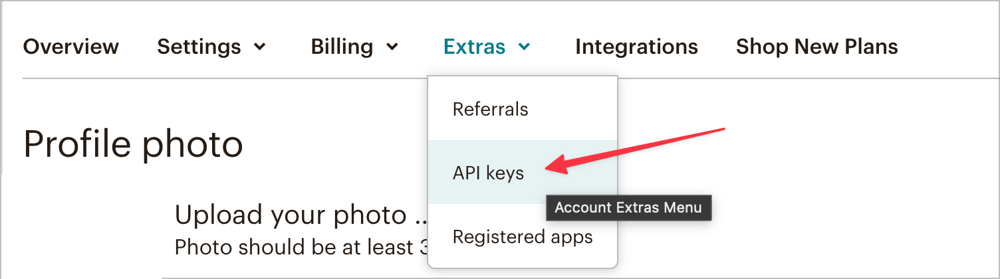

# Mailchimp イベント転送拡張機能の概要

>[!NOTE]
>  
>Adobe Experience Platform Launch は、Adobe Experience Platform のデータ収集テクノロジースイートとしてリブランドされています。 その結果、製品ドキュメント全体でいくつかの用語の変更がロールアウトされました。 用語の変更点の一覧については、次の[ドキュメント](https://experienceleague.adobe.com/docs/experience-platform/tags/term-updates.html)を参照してください。

Mailchimp [イベント転送](../../../ui/event-forwarding/overview.md) 拡張機能は、Mailchimp マーケティングキャンペーン、ジャーニー、トランザクション用のメールをトリガー化できるイベントを Mailchimp マーケティング API に送信します。

このドキュメントでは、「Add Event」アクションを使用した拡張機能の設定方法とルールの設定方法について説明します。

## 前提条件

このドキュメントは、拡張機能で活用される関連する Mailchimp 製品に精通していることを前提としています。 詳しくは、Mailchimp のヘルプドキュメントを参照してください。 [campaigns](https://mailchimp.com/help/getting-started-with-campaigns/), [ジャーニー](https://mailchimp.com/help/about-customer-journeys/)、および [取引](https://mailchimp.com/help/transactional/).

この拡張機能を使用するには、Mailchimp アカウントが必要です。 アカウントに新規登録できます [ここ](https://login.mailchimp.com/signup/). Mailchimp アカウントダッシュボードで、このガイドで使用する次の値をメモしておきます。

- Mailchimp ドメインプレフィックス
- API キー
- オーディエンス ID
- デフォルトの「差出人」メールアドレス

Mailchimp アカウントプランによっては、Mailchimp 顧客ジャーニーツールへのアクセスが制限されている場合があります。

>[!TIP]
>  
>トランザクション E メールや顧客ジャーニーなどの Mailchimp 自動を使用している場合、手順と画面は、ここに示す手順と画面とは少し異なる場合があります。 ただし、この拡張機能を使用するには、前述と同じ情報が必要です。 詳しくは、 [Mailchimp ヘルプセンター](https://mailchimp.com/help/) を参照してください。

### ドメインプレフィックス

Mailchimp にログインし、ダッシュボードビューにランディングした後、ブラウザーのアドレスバーに次のような URL が表示されます。 `https://us11.admin.mailchimp.com` または `us11.admin.mailchimp.com`. この例では、 `us11` はプレースホルダーに過ぎず、値が異なります。 後の手順で使用するために、URL にプレフィックスを記録します。

### API キー

アカウントの API キーを見つけるには、Mailchimp UI で自分のプロファイルアイコンを選択し、 **プロファイル**. 次のような URL が表示されます。 `https://us11.admin.mailchimp.com/account/profile/` しかし **あなたの** の代わりにプレフィックス `us11`.

選択 **追加**&#x200B;を、 **API キー**:

の下 **API キー**、既存のキーを選択するか、 **キーを作成** 新しいものを作成するには この拡張機能で特に使用する新しいキーを作成できます。 API キーをコピーして、後の手順で保存します。 詳しくは、Mailchimp のドキュメントで [API キーを生成する](https://mailchimp.com/developer/marketing/guides/quick-start/#generate-your-api-key).

### オーディエンス ID および送信元アドレス

選択 **対象ユーザ** 左のナビゲーションで、 **オーディエンスダッシュボード**. 次に、この拡張機能で使用するオーディエンスを選択します。 詳しくは、 [オーディエンスの作成](https://mailchimp.com/help/create-audience/).

オーディエンスを作成し、選択した状態で、 **オーディエンス管理** ドロップダウンと選択 **設定**. この画面には、オーディエンスの様々な設定が表示されます。

設定画面の下部に、次の内容が表示されます。 `Unique id for audience [audience name]` 場所 `[audience name]` は、実際のオーディエンスの名前です。 オーディエンス ID をコピーして保存し、後の手順で使用できます。

選択 **オーディエンス名とデフォルト** そして確認する **デフォルトの送信元メールアドレス** には、キャンペーンに適した値があります。 オーディエンス ID はこのページの上部にも表示され、前の手順でコピーした値と同じです。

## Mailchimp 自動化

Mailchimp プランと、トランザクションメール、顧客ジャーニー、その他の Mailchimp 自動を使用するかどうかに応じて、特定のジャーニー設定が異なる場合があります。

>[!IMPORTANT]
>  
>Mailchimp で自動化またはジャーニーのトリガーに選択したイベント名は、この拡張機能で送信する必要のあるイベント名と同じです。 Mailchimp 自動化でイベント名をメモし、後の手順で保存します。

## インストールと設定

この節では、拡張機能のインストールと設定の手順を示します。 Mailchimp API キーを安全に保存するには、イベント転送を使用する必要があります [秘密](../../../ui/event-forwarding/secrets.md).

### シークレットとデータ要素の作成

イベント転送プロパティで、 [を作成する [!UICONTROL トークン] 秘密鍵](../../../ui/event-forwarding/secrets.md#token) 呼び出し `Mailchimp API Key`.

次に、 [データ要素の作成](../../../ui/managing-resources/data-elements.md#create-a-data-element) の使用 [!UICONTROL コア] 拡張機能と [!UICONTROL 秘密鍵] を参照するデータ要素タイプ `Mailchimp API Key` 作成した秘密鍵。 入力 `Mailchimp Token` をデータ要素名として使用します。

### 拡張機能のインストールと設定

同じイベント転送プロパティで、 **[!UICONTROL 拡張機能],** その後 **[!UICONTROL カタログ]** をクリックして、インストールに使用できる拡張機能を表示します。 ここから、Mailchimp 拡張機能を検索し、を選択します。 **[!UICONTROL インストール]**.

設定画面が表示されます。 の下 **[!UICONTROL Mailchimp サーバープレフィックスドメイン名]**&#x200B;に設定し、一意のドメインプレフィックスを含め、Mailchimp アカウントから以前にコピーしたドメインを入力します。

>[!IMPORTANT]
>
>次を含めない `http://` または `https://` を選択します。

の下 **[!UICONTROL Mailchimp トークン]**、データ要素アイコンを選択し、 `Mailchimp Token` 作成済みのデータ要素。 選択 **[!UICONTROL 保存]** 変更を保存します。

これで、拡張機能がインストールされ、プロパティで使用するように設定されました。

## データ収集

この拡張機能を [ルール](../../../ui/managing-resources/rules.md)の場合、各イベントと共に拡張機能が Mailchimp に送信するデータ値は複数あります。 一般的な実装の場合、 [Adobe Experience Platform Web SDK 拡張機能](../../client/sdk/overview.md) そのデータをに送信する [!DNL Platform Edge Network] 拡張機能でイベント転送プロパティに使用するためのもの。

この拡張機能で必要なデータは、XDM データまたは非 XDM データとして Web SDK から送信できます。 詳しくは、ドキュメントを参照してください。 [XDM データの送信](../../../../edge/fundamentals/tracking-events.md#sending-non-xdm-data).

例えば、顧客がサイト上でイベントを購入したり登録したりした場合、Mailchimp 経由でこの拡張機能を持つ確認メールを送信できます。 Web SDK から Edge ネットワークに必要な情報を送信すると、拡張機能は Mailchimp で E メールをトリガーします。

### データ要素

前の節のスクリーンショットは、この拡張機能から Mailchimp に各イベントで送信できるデータを示しています。 Web SDK でこのデータを Edge Network に送信するように設定したら、イベント転送プロパティでデータ要素を作成して、拡張機能がこれらの値にアクセスできるようにします。

次の表に、それぞれの値の詳細を示します。

| 名前 | パスの例 | タイプ | 説明 | 必須 | 制限 |
|:---|:---:|:---:|:---|:---:|:---|
| `email` | `arc.event.xdm._tenant.emailId`  または  `arc.event.data._tenant.emailId` | 文字列 | 電子メールを受信するアドレス | **○** | Mailchimp オーディエンスに存在する必要があります |
| `listId` | `arc.event.xdm._tenant.listId`  または  `arc.event.data._tenant.listid` | 文字列 | オーディエンス ID | **○** | 既存のオーディエンス ID と一致する必要があります |
| `name` | `arc.event.xdm._tenant.name`  または  `arc.event.data._tenant.name` | 文字列 | イベント名 | **○** | 2～30 文字 |
| `properties` | `arc.event.xdm._tenant.properties`  または  `arc.event.data._tenant.properties` | オブジェクト | JSON 形式のプロパティのオプションのリストとイベントの詳細 | いいえ |  |
| `isSyncing` | `arc.event.xdm._tenant.isSyncing`  または  `arc.event.data._tenant.isSyncing` | ブール値 | で作成されたイベント `is_syncing` に設定 `true` **次の条件を満たさない** トリガー自動化 | いいえ |  |
| `occurredAt` | `arc.event.xdm._tenant.occuredAt`  または `arc.event.data._tenant.occuredAt` | 文字列 | イベントが発生した時点の ISO 8601 タイムスタンプ。 | いいえ |  |

{style=&quot;table-layout:auto&quot;}

>[!IMPORTANT]
>  
>この **パスの例** 上記の値は例です。 フィールド名と [パス](../../../ui/event-forwarding/overview.md#data-element-path) 上記の手順で Web SDK に名前を付けて設定した方法によっては、これらのデータ要素で参照されるデータがプロパティで異なる場合があります。

イベント転送プロパティで、上記の各フィールドのデータ要素を作成できます。 作成したデータ要素は、 [!UICONTROL イベントを追加] この拡張機能のアクション。

これで、この拡張機能と「イベントを追加」アクションを使用して、オーディエンス用の Mailchimp 電子メールをトリガー化できます。

## データの検証

イベント転送拡張機能を操作する場合、 [Adobe Experience Platform Debugger](https://chrome.google.com/webstore/detail/adobe-experience-platform/bfnnokhpnncpkdmbokanobigaccjkpob) は非常に便利です。 「ログ」セクションの「Edge ログ」では、イベント転送ルールでトリガーされた後におこなわれたリクエストを確認できます。 以下のスクリーンショットは、拡張機能によって Mailchimp API に対して行われるリクエストを示しています。

Mailchimp ダッシュボードのオーディエンスまたはオーディエンスメンバーのアクティビティフィード表示に、そのオーディエンスまたはオーディエンスメンバーのイベントのリストが表示されます。 これは、拡張機能から送信されたイベントと一致し、送信されたオプションのデータと、受信した E メールまたはキャンペーンを表示する必要があります。 詳しくは、 [Mailchimp Automation ヘルプガイド](https://mailchimp.com/help/automation/) を参照してください。
