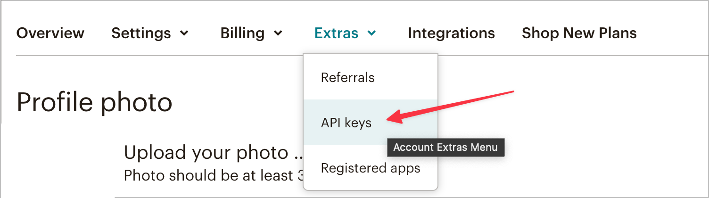
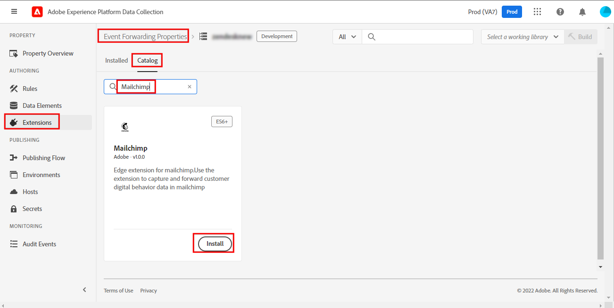
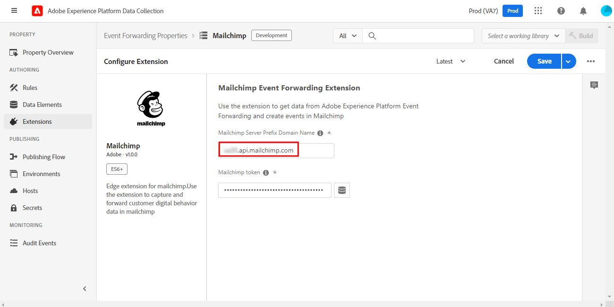
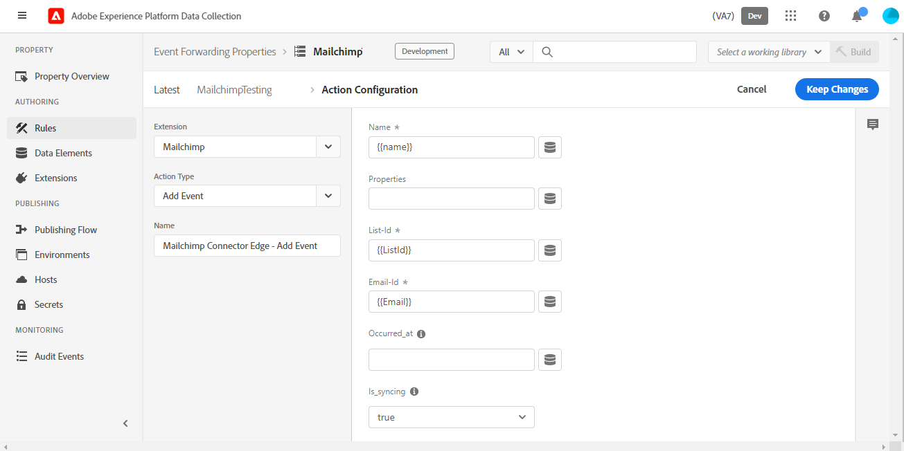
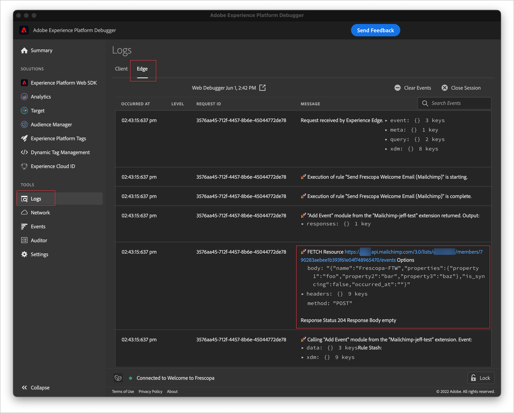

# Mailchimp イベント転送拡張機能の概要

Mailchimp [&#x200B; イベント転送](../../../ui/event-forwarding/overview.md)拡張機能は、Mailchimp マーケティング APIにイベントを送信し、Mailchimp マーケティング キャンペーン、ジャーニー、トランザクションのメールをトリガーできます。

このドキュメントでは、イベントを追加アクションを使用して拡張機能を設定し、ルールを設定する方法について説明します。

## 前提条件

このドキュメントでは、拡張機能で活用される関連するMailchimp製品について理解していることを前提としています。 詳しくは、[&#x200B; キャンペーン &#x200B;](https://mailchimp.com/help/getting-started-with-campaigns/)、[&#x200B; ジャーニー](https://mailchimp.com/help/about-customer-journeys/)、[&#x200B; トランザクション &#x200B;](https://mailchimp.com/help/transactional/)のMailchimp ヘルプドキュメントを参照してください。

この拡張機能を使用するにはMailchimp アカウントが必要です。 アカウント [ここ](https://login.mailchimp.com/signup/)に登録できます。 Mailchimp アカウントダッシュボードでは、このガイドで使用する次の値に注意してください。

- Mailchimp ドメインのプレフィックス
- あなたのAPI キー
- オーディエンス ID
- デフォルトの「差出人」電子メールアドレス

Mailchimp アカウントプランによっては、Mailchimp カスタマージャーニーツールへのアクセスが制限されている場合があります。

>[!TIP]
>  
>トランザクションメールやお客様からのジャーニーなど、Mailchimpの自動処理を使用している場合、ここに記載されている手順と画面が少し異なる場合があります。 ただし、上記のように、この拡張機能を使用する場合と同じ情報が必要です。 特定のアカウントとプランのこれらの各値について詳しくは、[Mailchimp ヘルプセンター](https://mailchimp.com/help/)を参照してください。

### ドメイン接頭辞

Mailchimpにログインしてダッシュボードビューに移動すると、ブラウザーのアドレスバーに`https://us11.admin.mailchimp.com`や`us11.admin.mailchimp.com`などのURLが表示されます。 この例では、接頭辞`us11`はプレースホルダーに過ぎず、値が異なります。 後の手順でURLを接頭辞と共に記録します。

### API キー

アカウントのAPI キーを見つけるには、Mailchimp UIでプロファイルアイコンを選択し、**プロファイル**&#x200B;を選択します。 `https://us11.admin.mailchimp.com/account/profile/`のようなURLが表示されますが、**ではなく**&#x200B;あなたの`us11`接頭辞が付いています。

**Extras**&#x200B;を選択してから、**API キー**&#x200B;を選択します。

**お使いのAPI キー**&#x200B;で、既存のキーを選択するか、**キーを作成**&#x200B;を選択して新しいキーを作成できます。 この拡張機能で特に使用する新しいキーを作成できます。 API キーをコピーし、後の手順のために保存します。 詳しくは、[API キーを生成する方法](https://mailchimp.com/developer/marketing/guides/quick-start/#generate-your-api-key)に関するMailchimpのドキュメントを参照してください。

### オーディエンス IDと差出人アドレス

左側のナビゲーションで「**オーディエンス**」、「**オーディエンスダッシュボード**」を選択します。 次に、この拡張機能で使用するオーディエンスを選択します。 詳しくは、[&#x200B; オーディエンスの作成](https://mailchimp.com/help/create-audience/)に関するMailchimp ドキュメントを参照してください。

オーディエンスを作成して選択した状態で、**オーディエンスを管理** ドロップダウンを選択し、**設定**&#x200B;を選択します。 この画面には、オーディエンスのさまざまな設定が表示されます。

設定画面の下部に`Unique id for audience [audience name]`が表示されます。`[audience name]`は実際のオーディエンスの名前です。 オーディエンス IDをコピーし、後の手順のために保存します。

**オーディエンス名とデフォルト**&#x200B;を選択し、**デフォルトの送信元メールアドレス**&#x200B;がキャンペーンに適した値であることを確認します。 オーディエンス IDも、このページの上部に表示され、最後の手順でコピーした値と同じであることに注意してください。

## Mailchimpの自動化

Mailchimp プラン、トランザクションメール、カスタマージャーニー、その他のMailchimp自動処理のいずれを使用しているかによって、特定のジャーニー設定は異なる場合があります。

>[!IMPORTANT]
>  
>Mailchimpでオートメーションまたはジャーニーをトリガーするために選択したイベント名は、この拡張機能で送信する必要があるイベント名と同じです。 Mailchimp オートメーションにイベント名をメモし、後のステップのために保存します。

## インストールと設定

この節では、拡張機能をインストールして設定する手順を示します。 Mailchimp API キーを安全に保存するには、イベント転送[secrets](../../../ui/event-forwarding/secrets.md)を使用する必要があります。

### 秘密鍵とデータ要素の作成

イベント転送プロパティで、[は[!UICONTROL Token]という](../../../ui/event-forwarding/secrets.md#token) シークレット `Mailchimp API Key`を作成します。

次に、[作成した](../../../ui/managing-resources/data-elements.md#create-a-data-element)秘密鍵を参照するために、[!UICONTROL Core]拡張機能と[!UICONTROL Secret] データ要素タイプを使用して、`Mailchimp API Key` データ要素を作成します。 データ要素名として`Mailchimp Token`を入力します。

### 拡張機能のインストールと設定

同じイベント転送プロパティで、**[!UICONTROL Extensions]、**、**[!UICONTROL Catalog]**&#x200B;を選択して、インストールに使用できる拡張機能を表示します。 ここから、Mailchimp拡張機能を検索し、**[!UICONTROL Install]**&#x200B;を選択します。

設定画面が表示されます。 **[!UICONTROL Mailchimp Server Prefix Domain Name]**&#x200B;で、Mailchimp アカウントから先ほどコピーしたドメイン（一意のドメイン プレフィックスを含む）を入力します。

>[!IMPORTANT]
>
>このフィールドには`http://`または`https://`を含めないでください。

**[!UICONTROL Mailchimp token]**&#x200B;で、データ要素アイコンを選択し、前に作成した`Mailchimp Token` データ要素を選択します。 **[!UICONTROL Save]**&#x200B;を選択して変更を保存します。

拡張機能がインストールされ、プロパティで使用できるように設定されました。

## データ収集

この拡張機能を[&#x200B; ルール &#x200B;](../../../ui/managing-resources/rules.md)で使用する場合、拡張機能が各イベントでMailchimpに送信するデータ値がいくつかあります。 一般的な実装では、[Adobe Experience Platform Web SDK拡張機能](../../client/web-sdk/overview.md)を設定して、そのデータを[!DNL Experience Platform Edge Network]に送信し、イベント転送プロパティで拡張機能で使用するように設定できます。

この拡張機能で必要なデータは、Web SDKからXDM データ（[`xdm`](/help/collection/js/commands/sendevent/xdm.md) オブジェクトを使用）または非XDM データ（[`data`](/help/collection/js/commands/sendevent/data.md) オブジェクトを使用）として送信できます。

たとえば、顧客がサイトでのイベントを購入したり登録したりした場合、この拡張機能を使ってMailchimpを通じて確認メールを送ることができます。 Web SDKからEdge Networkに必要な情報を送信すると、拡張機能はMailchimpでメールをトリガーします。

### データ要素

前のセクションのスクリーンショットは、この拡張機能からMailchimpに各イベントで送信できるデータを示しています。 このデータをEdge Networkに送信するようにWeb SDKを設定したら、イベント転送プロパティにデータ要素を作成して、拡張機能がこれらの値にアクセスできるようにします。

次の表に、可能な各値の詳細を示します。

| 名前 | パスの例 | タイプ | 説明 | 必須 | 制限 |
|:---|:---:|:---:|:---|:---:|:---|
| `email` | `arc.event.xdm._tenant.emailId` または  `arc.event.data._tenant.emailId` | 文字列 | メールを受信するアドレス | **○** | Mailchimp オーディエンスに存在する必要があります |
| `listId` | `arc.event.xdm._tenant.listId` または  `arc.event.data._tenant.listid` | 文字列 | オーディエンス ID | **○** | 既存のオーディエンス IDと一致する必要があります |
| `name` | `arc.event.xdm._tenant.name` または  `arc.event.data._tenant.name` | 文字列 | イベント名 | **○** | 長さ2 ～ 30文字 |
| `properties` | `arc.event.xdm._tenant.properties` または  `arc.event.data._tenant.properties` | オブジェクト | イベントに関する詳細を含む、JSON形式のプロパティのオプションのリスト | × |  |
| `isSyncing` | `arc.event.xdm._tenant.isSyncing` または  `arc.event.data._tenant.isSyncing` | ブール値 | `is_syncing`を`true`に設定して作成されたイベントは、**件のトリガーオートメーションを実行できません** | × |  |
| `occurredAt` | `arc.event.xdm._tenant.occuredAt`  または `arc.event.data._tenant.occuredAt` | 文字列 | イベント発生時のISO 8601 タイムスタンプ | × |  |

{style="table-layout:auto"}

>[!IMPORTANT]
>  
>上記の&#x200B;**パスの例**&#x200B;の値は例にすぎません。 これらのデータ要素で参照されるフィールド名と[&#x200B; パス &#x200B;](../../../ui/event-forwarding/overview.md#data-element-path)は、上記の手順でWeb SDKに名前を付けて設定した方法に応じて、プロパティで異なる場合があります。

イベント転送プロパティでは、上記の各フィールドのデータ要素を作成できます。 作成したら、この拡張機能の[!UICONTROL Add Event] アクションでデータ要素を参照できます。

この拡張機能と「イベントを追加」アクションを使用して、オーディエンスのMailchimp メールをトリガーできるようになりました。

## データ検証

イベント転送拡張機能を使用する場合、[Adobe Experience Platform Debugger](https://chrome.google.com/webstore/detail/adobe-experience-platform/bfnnokhpnncpkdmbokanobigaccjkpob)は非常に便利です。 「ログ」セクションの「Edge ログ」で、イベント転送ルールがトリガーされた後に行われたリクエストを確認できます。 次のスクリーンショットは、拡張機能によってMailchimp APIに対して行われるリクエストを示しています。

Mailchimp ダッシュボードのオーディエンスまたはオーディエンスメンバーのアクティビティフィードのビューに、そのオーディエンスまたはオーディエンスメンバーのイベントのリストが表示されます。 これは、拡張機能によって送信されたイベントと一致し、送信されたオプションのデータと、受信したメールまたはキャンペーンを表示する必要があります。 詳しくは、[Mailchimp Automation ヘルプガイド &#x200B;](https://mailchimp.com/help/automation/)を参照してください。
