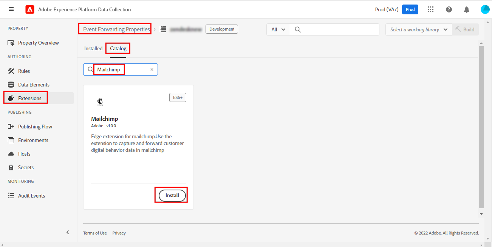

# Mailchimp イベント転送拡張機能の概要

>[!NOTE]
>  
>Adobe Experience Platform Launch は、Adobe Experience Platform のデータ収集テクノロジースイートとしてリブランドされています。 その結果、製品ドキュメント全体でいくつかの用語が変更されました。用語の変更点の一覧については、次の[ドキュメント](https://experienceleague.adobe.com/docs/experience-platform/tags/term-updates.html)を参照してください。

Mailchimp [ イベント転送 ](../../../ui/event-forwarding/overview.md) 拡張機能は、Mailchimp マーケティングキャンペーン、ジャーニーまたはトランザクション用のメールをトリガーにできるイベントを Mailchimp Marketing API に送信します。

このドキュメントでは、拡張機能のセットアップ方法と、イベントの追加アクションを使用したルールの設定方法について説明します。

## 前提条件

このドキュメントは、拡張機能で利用される関連する Mailchimp 製品に精通していることを前提としています。 詳しくは、[ キャンペーン ](https://mailchimp.com/help/getting-started-with-campaigns/)、[ ジャーニー ](https://mailchimp.com/help/about-customer-journeys/)、[ トランザクション ](https://mailchimp.com/help/transactional/) の Mailchimp のヘルプドキュメントを参照してください。

この拡張機能を使用するには、Mailchimp アカウントが必要です。 アカウントに新規登録できます [ こちら ](https://login.mailchimp.com/signup/)。 Mailchimp アカウントダッシュボードで、このガイドで使用する次の値をメモします。

- Mailchimp ドメインのプレフィックス
- API キー
- オーディエンス ID
- デフォルトの「送信元」 E メールアドレス

Mailchimp アカウントのプランによっては、Mailchimp カスタマージャーニーツールへのアクセスが制限される場合があります。

>[!TIP]
>  
>トランザクションメールや顧客ジャーニーなどの Mailchimp 自動化を使用している場合、手順や画面は、ここに示すものとは少し異なる場合があります。 ただし、この拡張機能を使用するには、上記と同じ情報が必要です。 特定のアカウントとプランのこれらの各値について詳しくは、[Mailchimp ヘルプセンター ](https://mailchimp.com/help/) を参照してください。

### ドメイン接頭辞

Mailchimp にログインし、ダッシュボードビューにランディングした後、ブラウザーのアドレスバーに `https://us11.admin.mailchimp.com` や `us11.admin.mailchimp.com` などの URL が表示されます。 この例では、プレフィックス `us11` は単なるプレースホルダーであり、値は異なります。 後の手順のために、プレフィックスを含んだ URL を記録します。

### API キー

アカウントの API キーを見つけるには、Mailchimp UI でプロファイルアイコンを選択し、「**プロファイル**」を選択します。 `https://us11.admin.mailchimp.com/account/profile/` のような URL が表示されますが、`us11` ではなく **your** というプレフィックスが付きます。

**エクストラ**、**API キー** の順に選択します。

「**API キー**」で、既存のキーを選択するか、**キーを作成** を選択して新しいキーを作成できます。 この拡張機能で特別に使用する新しいキーを作成できます。 API キーをコピーして、後の手順のために保存します。 詳しくは、[API キーの生成 ](https://mailchimp.com/developer/marketing/guides/quick-start/#generate-your-api-key) 方法に関する Mailchimp のドキュメントを参照してください。

### オーディエンス ID と送信者アドレス

左側のナビゲーションで **オーディエンス** を選択し、次に **オーディエンスダッシュボード** を選択します。 次に、この拡張機能で使用するオーディエンスを選択します。 詳しくは、[ オーディエンスの作成 ](https://mailchimp.com/help/create-audience/) に関する Mailchimp のドキュメントを参照してください。

オーディエンスを作成し選択した状態で、「**オーディエンスを管理**」ドロップダウンを選択し、「**設定**」を選択します。 この画面には、オーディエンスの様々な設定が表示されます。

設定画面の下部に、が実際のオーディエンスの名前である `Unique id for audience [audience name]` が表示さ `[audience name]` ます。 オーディエンス ID をコピーし、後の手順のために保存します。

**オーディエンス名とデフォルト** を選択し、**送信者のメールアドレスのデフォルト** がキャンペーンに適した値になっていることを確認します。 オーディエンス ID もこのページの上部に表示され、前の手順でコピーした値と同じであることに注意してください。

## Mailchimp の自動化

Mailchimp のプランや、トランザクションメール、カスタマージャーニー、その他の Mailchimp の自動メールのいずれを使用しているかに応じて、ジャーニーの設定は異なる場合があります。

>[!IMPORTANT]
>  
>Mailchimp で自動処理またはジャーニーをトリガーするために選択したイベント名は、この拡張子で送信する必要があるイベント名と同じです。 Mailchimp 自動化にイベント名をメモして、後の手順のために保存します。

## インストールと設定

この節では、拡張機能のインストールと設定の手順を示します。 Mailchimp API キーを安全に保存するには、イベント転送 [ シークレット ](../../../ui/event-forwarding/secrets.md) を使用する必要があります。

### 秘密鍵およびデータ要素の作成

イベント転送プロパティで、`Mailchimp API Key` と呼ばれる [ トークン [!UICONTROL  秘密鍵 ] を作成 ](../../../ui/event-forwarding/secrets.md#token) します。

次に、[Core] 拡張機能と [!UICONTROL Secret] データ要素タイプを使用して ](../../../ui/managing-resources/data-elements.md#create-a-data-element) データ要素を作成 [!UICONTROL  し、作成した `Mailchimp API Key` シークレットを参照します。 データ要素名として `Mailchimp Token` を入力します。

### 拡張機能のインストールと設定

同じイベント転送プロパティで、「**[!UICONTROL 拡張機能 ]」を選択してから****[!UICONTROL カタログ]** を選択して、インストールできる拡張機能を表示します。 ここから、Mailchimp 拡張機能を検索し、「**[!UICONTROL インストール]**」を選択します。

設定画面が表示されます。 **[!UICONTROL Mailchimp Server Prefix Domain Name]** の下に、Mailchimp アカウントからコピーしたドメインを、一意のドメインプレフィックスを含めて入力します。

>[!IMPORTANT]
>
>このフィールドに `http://` や `https://` を含めないでください。

**[!UICONTROL Mailchimp トークン]** の下のデータ要素アイコンを選択し、前に作成した `Mailchimp Token` データ要素を選択します。 「**[!UICONTROL 保存]**」を選択して、変更を保存します。

これで、拡張機能がインストールされ、プロパティで使用するように設定されました。

## データ収集

この拡張機能を [rule](../../../ui/managing-resources/rules.md) で使用する場合、イベントごとに拡張機能から Mailchimp に送信されるデータ値はいくつかあります。 一般的な実装の場合、[Adobe Experience Platform Web SDK 拡張機能 ](../../client/web-sdk/overview.md) を設定して、そのデータを [!DNL Platform Edge Network] に送信し、イベント転送プロパティの拡張機能で使用できます。

この拡張機能で必要なデータは、Web SDK から XDM データ（[`xdm`](/help/web-sdk/commands/sendevent/xdm.md) オブジェクトを使用）または非 XDM データ（[`data`](/help/web-sdk/commands/sendevent/data.md) オブジェクトを使用）として送信できます。

例えば、顧客がサイトで購入やイベントへの登録を行った場合、この拡張機能を使用して Mailchimp から確認メールを送信できます。 Web SDK から拡張機能に必要な情報を送信すると、Edge Networkは Mailchimp でメールをトリガーします。

### データ要素

前のセクションのスクリーンショットは、この拡張機能から Mailchimp に各イベントで送信できるデータを示しています。 このデータを拡張機能に送信するように Web SDK を設定したら、Edge Networkがそれらの値にアクセスできるように、イベント転送プロパティにデータ要素を作成できます。

次の表に、指定可能な各値の詳細を示します。

| 名前 | サンプル パス | タイプ | 説明 | 必須 | 制限 |
|:---|:---:|:---:|:---|:---:|:---|
| `email` | `arc.event.xdm._tenant.emailId`  または   `arc.event.data._tenant.emailId` | 文字列 | 電子メールを受信するアドレス | **はい** | Mailchimp オーディエンスに存在する必要があります |
| `listId` | `arc.event.xdm._tenant.listId`  または   `arc.event.data._tenant.listid` | 文字列 | オーディエンス ID | **はい** | 既存のオーディエンス ID と一致する必要があります |
| `name` | `arc.event.xdm._tenant.name`  または   `arc.event.data._tenant.name` | 文字列 | イベント名 | **はい** | 長さが 2～30 文字 |
| `properties` | `arc.event.xdm._tenant.properties`  または   `arc.event.data._tenant.properties` | オブジェクト | イベントに関する詳細を含む、JSON 形式のプロパティのオプションのリスト | × |  |
| `isSyncing` | `arc.event.xdm._tenant.isSyncing`  または   `arc.event.data._tenant.isSyncing` | ブール値 | `is_syncing` を `true` に設定して作成されたイベントは **トリガーを自動化しません** | × |  |
| `occurredAt` | `arc.event.xdm._tenant.occuredAt`  または `arc.event.data._tenant.occuredAt` | 文字列 | イベントが発生した時点の ISO 8601 タイムスタンプ | × |  |

{style="table-layout:auto"}

>[!IMPORTANT]
>  
>上記の **パスの例** 値は一例です。 これらのデータ要素で参照されるフィールド名と [ パス ](../../../ui/event-forwarding/overview.md#data-element-path) は、上記の手順で Web SDK に名前を付けて設定した方法に応じて、プロパティで異なる場合があります。

イベント転送プロパティで、上記の各フィールドに対してデータ要素を作成できます。 作成したら、この拡張機能の [!UICONTROL  イベントを追加 ] アクションでデータ要素を参照できます。

この拡張機能とイベントを追加アクションを使用して、オーディエンスに Mailchimp メールをトリガーできるようになりました。

## データの検証

イベント転送拡張機能を使用する場合、[Adobe Experience Platform Debugger](https://chrome.google.com/webstore/detail/adobe-experience-platform/bfnnokhpnncpkdmbokanobigaccjkpob) は非常に便利です。 「ログ」セクションのEdge ログで、イベント転送ルールがトリガーされた後に行われたリクエストを確認できます。 次のスクリーンショットは、拡張機能によって Mailchimp API に対して行われているリクエストを示しています。

Mailchimp ダッシュボードのオーディエンスまたはオーディエンスメンバーのアクティビティフィード ビューに、そのオーディエンスまたはオーディエンスメンバーのイベントのリストが表示されます。 この値は、拡張機能から送信されたイベントと一致し、送信されたオプションデータと、受信したメールまたはキャンペーンが表示されます。 詳しくは、[Mailchimp 自動化のヘルプガイド ](https://mailchimp.com/help/automation/) を参照してください。
