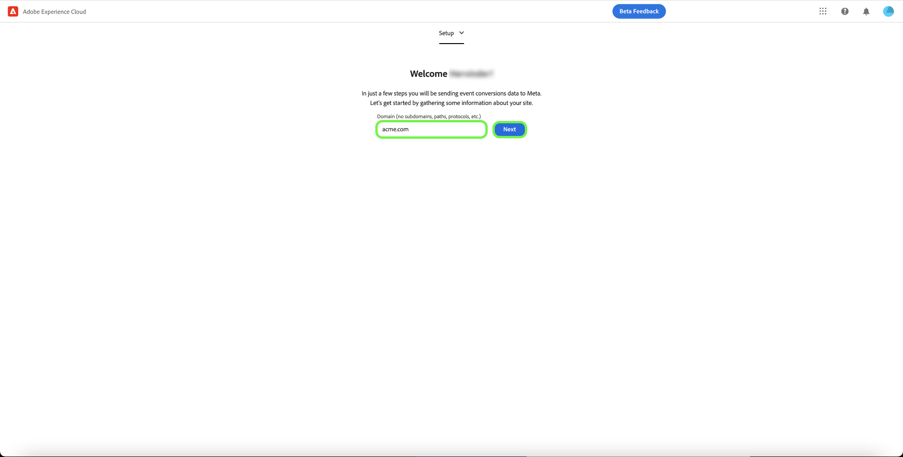
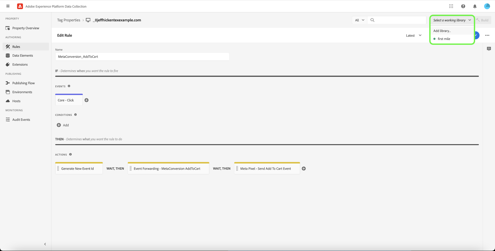

# [!DNL Meta Conversions API] 拡張機能の概要

The [[!DNL Meta Conversions API]](https://developers.facebook.com/docs/marketing-api/conversions-api/) では、サーバーサイドのマーケティングデータを [!DNL Meta] テクノロジーを使用して広告のターゲティングを最適化し、アクションあたりのコストを削減し、結果を測定します。 イベントは [[!DNL Meta Pixel]](https://developers.facebook.com/docs/meta-pixel/) ID とは、クライアント側のイベントと同様の方法で処理されます。

の使用 [!DNL Meta Conversions API] 拡張機能の場合は、 [イベント転送](../../../ui/event-forwarding/overview.md) にデータを送信するルール [!DNL Meta] をAdobe Experience Platform Edge Network から取得します。 このドキュメントでは、拡張機能のインストール方法と、イベント転送での拡張機能の使用方法について説明します [ルール](../../../ui/managing-resources/rules.md).

## 前提条件

次を使用することを強くお勧めします。 [!DNL Meta Pixel] そして [!DNL Conversions API] は、クライアント側とサーバー側からそれぞれ同じイベントを共有し、送信します。これは、が取得しなかったイベントを回復するのに役立つ場合があるからです。 [!DNL Meta Pixel]. をインストールする前に [!DNL Conversions API] 拡張機能については、 [[!DNL Meta Pixel] 拡張](../../client/meta/overview.md) を参照してください。

>[!NOTE]
>
>に関する節 [イベントの重複排除](#deduplication) このドキュメントの後半では、同じイベントがブラウザーとサーバーの両方から受け取る場合があるので、同じイベントが 2 回使用されないようにする手順について説明します。

を使用するには、 [!DNL Conversions API] 拡張機能を使用するには、イベント転送にアクセスでき、有効な [!DNL Meta] ～を利用できる口座 [!DNL Ad Manager] および [!DNL Event Manager]. 特に、既存の [[!DNL Meta Pixel]](https://www.facebook.com/business/help/952192354843755?id=1205376682832142) ( または [新しい [!DNL Pixel]](https://www.facebook.com/business/help/952192354843755) 代わりに )、拡張機能をアカウントに設定できます。

>[!INFO]
>
>この拡張機能をモバイルアプリデータで使用する場合、または [!DNL Meta] キャンペーンの場合は、既存のアプリからデータセットを作成し、 **ピクセル ID から作成** プロンプトが表示されたら、 この記事を参照してください。 [ビジネスに最適なデータセット作成オプションを決定する](https://www.facebook.com/business/help/5270377362999582?id=490360542427371) 」を参照してください。 詳しくは、 [アプリイベントのコンバージョン API](https://developers.facebook.com/docs/marketing-api/conversions-api/app-events) ドキュメントを参照してください。

## 拡張機能のインストール

をインストールするには、以下を実行します。 [!DNL Meta Conversions API] 拡張機能に移動し、データ収集 UI またはExperience PlatformUI に移動して、「 」を選択します。 **[!UICONTROL イベント転送]** をクリックします。 ここから、拡張機能を追加するプロパティを選択するか、代わりに新しいプロパティを作成します。

目的のプロパティを選択または作成したら、「 」を選択します。 **[!UICONTROL 拡張機能]** 左側のナビゲーションで、 **[!UICONTROL カタログ]** タブをクリックします。 を検索します。 [!UICONTROL メタ変換 API] カードを選択し、「 **[!UICONTROL インストール]**.

![The [!UICONTROL インストール] ボタンが選択されています [!UICONTROL メタ変換 API] 拡張機能を使用して、データ収集 UI に追加できます。](../../../images/extensions/server/meta/install.png)

表示される設定ビューで、 [!DNL Pixel] 拡張機能をアカウントにリンクするために以前にコピーした ID。 ID を直接入力に貼り付けることも、代わりにデータ要素を使用することもできます。

また、 [!DNL Conversions API] 特に。 詳しくは、 [!DNL Conversions API] に関するドキュメント [アクセストークンの生成](https://developers.facebook.com/docs/marketing-api/conversions-api/get-started#access-token) を参照してください。

終了したら、「 」を選択します。 **[!UICONTROL 保存]**

![The [!DNL Pixel] 拡張機能の設定表示でデータ要素として指定された ID。](../../../images/extensions/server/meta/configure.png)

拡張機能がインストールされ、イベント転送ルールでその機能を使用できるようになりました。

## イベント転送ルールの設定 {#rule}

この節では、 [!DNL Conversions API] 汎用のイベント転送ルールの拡張。 実際には、すべての許可済みを送信するために、複数のルールを設定する必要があります [標準イベント](https://developers.facebook.com/docs/meta-pixel/reference) 経由 [!DNL Meta Pixel] および [!DNL Conversions API]. モバイルアプリデータについては、必須フィールド、アプリデータフィールド、顧客情報パラメーターおよびカスタムデータの詳細を参照してください。 [ここ](https://developers.facebook.com/docs/marketing-api/conversions-api/app-events).

>[!NOTE]
>
>イベントは、 [リアルタイムで送信](https://www.facebook.com/business/help/379226453470947?id=818859032317965) 広告キャンペーンを最適化するために、可能な限りリアルタイムに近い場所に配置することもできます。

新しいイベント転送ルールの作成を開始し、必要に応じて条件を設定します。 ルールのアクションを選択する場合は、「 **[!UICONTROL メタコンバージョン API 拡張機能]** 拡張機能に対して、「 」を選択します。 **[!UICONTROL コンバージョン API イベントの送信]** （アクションタイプ用）。

![The [!UICONTROL ページビューを送信] データ収集 UI のルールに対して選択されているアクションタイプ。](../../../images/extensions/server/meta/select-action.png)

送信先のイベントデータを設定できるコントロールが表示されます。 [!DNL Meta] 経由 [!DNL Conversions API]. これらのオプションは、指定された入力に直接入力することも、代わりに既存のデータ要素を選択して値を表すこともできます。 設定オプションは、以下に示すように、4 つの主なセクションに分かれています。

| Config セクション | 説明 |
| --- | --- |
| [!UICONTROL サーバーイベントパラメーター] | イベントの発生時刻やイベントをトリガーしたソースアクションを含む、イベントに関する一般情報。 詳しくは、 [!DNL Meta] 開発者向けドキュメントを参照してください。 [標準イベントパラメーター](https://developers.facebook.com/docs/marketing-api/conversions-api/parameters/server-event) 許可済み [!DNL Conversions API].  両方を使用する場合 [!DNL Meta Pixel] そして [!DNL Conversions API] イベントを送信するには、必ず **[!UICONTROL イベント名]** (`event_name`) および **[!UICONTROL イベント ID]** (`event_id`) をすべてのイベントで使用する必要があります。これらの値は、 [イベントの重複排除](#deduplication).  また、次のオプションもあります。 **[!UICONTROL 限定的なデータ使用を有効にする]** 顧客のオプトアウトに準拠するため。 詳しくは、 [!DNL Conversions API] に関するドキュメント [データ処理オプション](https://developers.facebook.com/docs/marketing-apis/data-processing-options/) を参照してください。 |
| [!UICONTROL 顧客情報パラメーター] | イベントを顧客に関連付けるために使用されるユーザー ID データ。 これらの値の一部は、API に送信する前にハッシュ化する必要があります。  良好な共通の API 接続と高いイベント一致品質 (EMQ) を確保するために、すべての [受け入れられた顧客情報パラメーター](https://developers.facebook.com/docs/marketing-api/conversions-api/parameters/customer-information-parameters) をサーバーイベントと共に使用します。 また、これらのパラメーターは [EMQ に対する重要性と影響に基づいて優先順位付けされる](https://www.facebook.com/business/help/765081237991954?id=818859032317965). |
| [!UICONTROL カスタムデータ] | 広告配信の最適化に使用する追加データ。JSON オブジェクトの形式で提供されます。 詳しくは、 [[!DNL Conversions API] ドキュメント](https://developers.facebook.com/docs/marketing-api/conversions-api/parameters/custom-data) を参照して、このオブジェクトで受け入れられるプロパティの詳細を確認してください。  購入イベントを送信する場合は、このセクションを使用して必要な属性を指定する必要があります `currency` および `value`. |
| [!UICONTROL テストイベント] | このオプションは、設定がサーバーイベントの受信を引き起こしているかどうかを検証するために使用します。 [!DNL Meta] 期待どおり。 この機能を使用するには、 **[!UICONTROL テストイベントとして送信]** 」チェックボックスに移動し、以下の入力で任意のテストイベントコードを指定します。 イベント転送ルールをデプロイすると、拡張機能とアクションを正しく設定した場合は、内にアクティビティが表示されます。 **[!DNL Test Events]** 表示 [!DNL Meta Events Manager]. |

{style="table-layout:auto"}

終了したら、「 」を選択します。 **[!UICONTROL 変更を保持]** をクリックして、ルール設定にアクションを追加します。

![[!UICONTROL 変更を保持] を選択してアクションの設定に使用します。](../../../images/extensions/server/meta/keep-changes.png)

ルールに問題がない場合は、「 」を選択します。 **[!UICONTROL ライブラリに保存]**. 最後に、新しいイベント転送を公開します [ビルド](../../../ui/publishing/builds.md) ライブラリに対する変更を有効にします。

## イベントの重複排除 {#deduplication}

詳しくは、 [前提条件の節](#prerequisites)を使用する場合は、 [!DNL Meta Pixel] タグ拡張と [!DNL Conversions API] 冗長な設定でクライアントおよびサーバーから同じイベントを送信するイベント転送拡張機能。 これは、1 つの拡張機能で取得されなかったイベントや、他の拡張機能で取得されなかったイベントを回復するのに役立ちます。

2 つの間の重複のないクライアントおよびサーバーから異なるイベントタイプを送信する場合は、重複排除は必要ありません。 ただし、いずれかのイベントが両方の [!DNL Meta Pixel] そして [!DNL Conversions API]を使用する場合、レポートに悪影響を及ぼさないように、これらの冗長なイベントの重複を排除する必要があります。

共有イベントを送信する場合は、クライアントとサーバーの両方から送信するすべてのイベントに、イベント ID と名前が含まれていることを確認してください。 同じ ID と名前を持つ複数のイベントを受け取った場合、 [!DNL Meta] は、複製を排除し、最も関連性の高いデータを保持するために、いくつかの戦略を自動的に採用しています。 詳しくは、 [!DNL Meta] に関するドキュメント [の重複排除 [!DNL Meta Pixel] および [!DNL Conversions API] イベント](https://www.facebook.com/business/help/823677331451951?id=1205376682832142) を参照してください。

## クイックスタートワークフロー：メタコンバージョン API 拡張機能（ベータ版） {#quick-start}

>[!IMPORTANT]
>
>* クイックスタート機能は、Real-Time CDP Prime および Ultimate パッケージを購入したお客様が利用できます。 詳しくは、アドビ担当者にお問い合わせください。
>* この機能は新しい実装向けであり、既存のタグとイベント転送プロパティへの拡張機能と設定の自動インストールは現在サポートされていません。

このクイックスタート機能を使用すると、メタコンバージョン API とメタピクセル拡張機能を使用して、簡単かつ効率的にセットアップできます。 このツールは、Adobeタグやイベント転送で実行される複数の手順を自動化し、設定時間を大幅に短縮します。

この機能では、新しく自動生成されたタグとイベント転送プロパティに、必要なルールとデータ要素を使用して、メタコンバージョン API とメタピクセル拡張機能の両方を自動的にインストールおよび設定します。 また、Experience PlatformWeb SDK と Datastream も自動インストールおよび設定します。 最後に、クイックスタート機能は、開発環境で指定された URL にライブラリを自動公開します。これにより、イベント転送とExperience Platformエッジネットワークを介して、クライアント側のデータ収集とサーバー側のイベント転送をリアルタイムで実行できます。

次のビデオでは、クイックスタート機能の概要を説明します。

>[!VIDEO](https://video.tv.adobe.com/v/3416939?quality=12&learn=on)

### クイックスタート機能をインストールする

>[!NOTE]
>
>この機能は、イベント転送の実装を開始するのに役立つように設計されています。 すべての使用例に対応する完全に機能したエンドツーエンドの実装は提供されません。

このセットアップでは、メタコンバージョン API とメタピクセル拡張機能の両方が自動的にインストールされます。 イベントコンバージョンサーバー側を収集して転送するには、Meta でこのハイブリッド実装をお勧めします。
クイックセットアップ機能は、顧客がイベント転送の実装を開始するのを支援するように設計されており、すべての使用例に対応する完全に機能するエンドツーエンドの実装を提供することを目的としていません。

この機能をインストールするには、「 **[!UICONTROL はじめに]** 対象： **[!DNL Send Conversions Data to Meta]** (Adobe Experience Platform Data Collection) **[!UICONTROL ホーム]** ページに貼り付けます。

を入力します。 **[!UICONTROL ドメイン]**&#x200B;を選択し、「 **[!UICONTROL 次へ]**. このドメインは、自動生成されたタグおよびイベント転送のプロパティ、ルール、データ要素、データストリームなどの命名規則として使用されます。

Adobe Analytics の **[!UICONTROL 初期設定]** ダイアログに **[!UICONTROL メタピクセル ID]**, **[!UICONTROL メタコンバージョン API アクセストークン]**、および **[!UICONTROL データレイヤーのパス]**&#x200B;を選択し、「 **[!UICONTROL 次へ]**.

初期設定プロセスが完了するまで数分待ってから、「 」を選択します。 **[!UICONTROL 次へ]**.

次から： **[!UICONTROL サイトにコードを追加する]** ダイアログコピーを使用して提供されたコードをコピー  関数を使用して、 `<head>` を参照してください。 実装が完了したら、「 」を選択します。 **[!UICONTROL 検証を開始]**

The [!UICONTROL 検証結果] ダイアログには、Meta 拡張機能の実装結果が表示されます。 「**[!UICONTROL 次へ]**」を選択します。また、 **[!UICONTROL アシュランス]** リンク。

The **[!UICONTROL 次の手順]** 画面表示で、設定の完了を確認します。 ここから、新しいイベントを追加して実装を最適化するオプションがあります（次の節で示します）。

イベントを追加しない場合は、 **[!UICONTROL 閉じる]**.

#### イベントの追加

新しいイベントを追加するには、「 **[!UICONTROL タグ Web プロパティを編集]**.

編集するメタイベントに対応するルールを選択します。 例： **MetaConversion_AddToCart**.

>[!NOTE]
>
>イベントがない場合、このルールは実行されません。 これは、すべてのルールに当てはまり、 **MetaConversion_PageView** ルールが例外である。

イベントを追加するには、「 」を選択します。 **[!UICONTROL 追加]** の下に [!UICONTROL イベント] 見出し。

を選択します。 [!UICONTROL イベントタイプ]. この例では、 [!UICONTROL クリック] イベントを作成し、次の時点でトリガーに設定 **.add-to-cart-button** が選択されている。 「**[!UICONTROL 変更を保持]**」を選択します。

新しいイベントが保存されました。 選択 **[!UICONTROL 作業ライブラリを選択]** をクリックし、ビルド先のライブラリを選択します。

次に、の横のドロップダウンを選択します。 **[!UICONTROL ライブラリに保存]** を選択し、 **[!UICONTROL ライブラリに保存してビルドする]**. これにより、ライブラリに変更が公開されます。

設定する他のメタコンバージョンイベントに対して、これらの手順を繰り返します。

#### データレイヤーの設定 {#configuration}

>[!IMPORTANT]
>
>このグローバルデータレイヤーを更新する方法は、Web サイトのアーキテクチャによって異なります。 単一ページアプリケーションは、サーバーサイドレンダリングアプリとは異なります。 また、Tags 製品内でこのデータの作成と更新を完全に担当する可能性もあります。 どのインスタンスでも、データレイヤーは、 `MetaConversion_* rules`. ルール間でデータを更新しない場合、最後の `MetaConversion_* rule` 現在の `MetaConversion_* rule`.

設定時に、データレイヤーの場所に関する質問が表示されました。 デフォルトでは、次のようになります。 `window.dataLayer.meta`、および `meta` オブジェクトの場合、データは次のように想定されます。

これは、 `MetaConversion_*` ルールでは、このデータ構造を使用して、関連するデータを [!DNL Meta Pixel] 拡張機能と [!DNL Meta Conversions API]. に関するドキュメントを参照してください。 [標準イベント](https://developers.facebook.com/docs/meta-pixel/reference#standard-events) 様々なメタイベントで必要となるデータの詳細については、を参照してください。

例えば、 `MetaConversion_Subscribe` ルールを更新する必要があります `window.dataLayer.meta.currency`, `window.dataLayer.meta.predicted_ltv`、および `window.dataLayer.meta.value` に関するドキュメントで説明されているオブジェクトプロパティに従って [標準イベント](https://developers.facebook.com/docs/meta-pixel/reference#standard-events).

ルールを実行する前に Web サイトで実行してデータレイヤーを更新する必要がある操作の例を以下に示します。

デフォルトでは、 `<datalayerpath>.conversionData.eventId` は、 `MetaConversion_* rules`.

データレイヤーの外観のローカルリファレンスについては、 `MetaConversion_DataLayer` データ要素をプロパティ上に配置する必要があります。

## 次の手順

このガイドでは、サーバー側のイベントデータをに送信する方法について説明しました。 [!DNL Meta] の使用 [!DNL Meta Conversions API] 拡張子。 ここから、さらにを接続して統合を拡張することをお勧めします [!DNL Pixels] 該当する場合は、追加のイベントを共有します。 次のいずれかの操作を行うと、広告のパフォーマンスをさらに向上させることができます。

* 他の接続 [!DNL Pixels] まだ [!DNL Conversions API] 統合とも呼ばれます。
* を通じてのみ特定のイベントを送信する場合 [!DNL Meta Pixel] クライアント側で、次の同じイベントを [!DNL Conversions API] サーバー側からも同様です。

詳しくは、 [!DNL Meta] に関するドキュメント [のベストプラクティス [!DNL Conversions API]](https://www.facebook.com/business/help/308855623839366?id=818859032317965) 統合を効果的に実装する方法に関する詳細なガイダンスを参照してください。 Adobe Experience Cloudでのタグとイベントの転送に関する一般的な情報については、 [タグの概要](../../../home.md).
