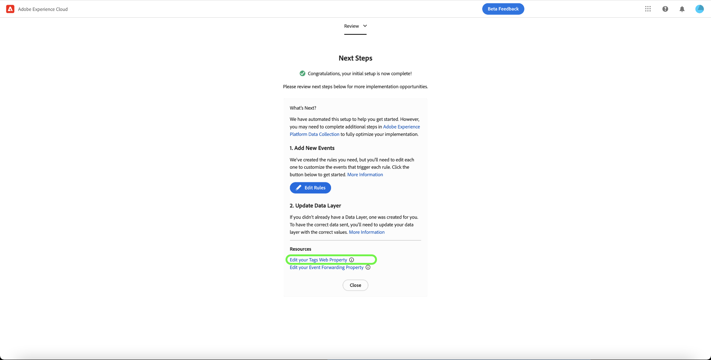
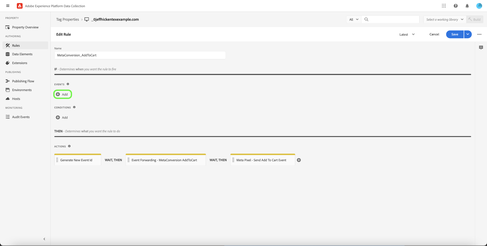

# [!DNL Meta Conversions API]拡張機能の概要

[[!DNL Meta Conversions API]](https://developers.facebook.com/docs/marketing-api/conversions-api/)では、広告のターゲティングを最適化し、アクション単価を削減し、結果を測定するために、サーバーサイドのマーケティングデータを[!DNL Meta] テクノロジーに接続できます。 イベントは[[!DNL Meta Pixel]](https://developers.facebook.com/docs/meta-pixel/) IDにリンクされ、クライアントサイドのイベントと同様の方法で処理されます。

[!DNL Meta Conversions API]拡張機能を使用すると、[ イベント転送](../../../ui/event-forwarding/overview.md) ルールのAPI機能を活用して、Adobe Experience Platform Edge Networkから[!DNL Meta]にデータを送信できます。 このドキュメントでは、拡張機能をインストールし、イベント転送[ ルール ](../../../ui/managing-resources/rules.md)でその機能を使用する方法について説明します。

## デモ

次のビデオは、[!DNL Meta Conversions API]に関する理解を深めることを目的としています。

>[!VIDEO](https://unlockmarketingdata.com/video-meta-conversions-api)

## 前提条件

[!DNL Meta Pixel]と[!DNL Conversions API]を使用して、それぞれクライアントサイドとサーバーサイドで同じイベントを共有および送信することを強くお勧めします。これは、[!DNL Meta Pixel]によってピックアップされなかったイベントを回復するのに役立つ可能性があります。 [!DNL Conversions API]拡張機能をインストールする前に、[[!DNL Meta Pixel] 拡張機能](../../client/meta/overview.md)のガイドで、クライアントサイドのタグ実装に統合する手順を確認してください。

>[!NOTE]
>
>このドキュメントの後半の[ イベント重複排除](#deduplication)に関する節では、同じイベントがブラウザーとサーバーの両方から受信される可能性があるため、同じイベントが2回使用されないようにするための手順について説明します。

[!DNL Conversions API]拡張機能を使用するには、イベント転送へのアクセス権があり、[!DNL Meta]および[!DNL Ad Manager]へのアクセス権を持つ有効な[!DNL Event Manager] アカウントが必要です。 具体的には、拡張機能をアカウントに設定できるように、既存の[[!DNL Meta Pixel]](https://www.facebook.com/business/help/952192354843755?id=1205376682832142)のIDをコピー（または[新しい [!DNL Pixel]](https://www.facebook.com/business/help/952192354843755)を作成）する必要があります。

>[!INFO]
>
>この拡張機能をモバイルアプリデータで使用する場合、または[!DNL Meta] キャンペーンでオフラインイベントデータも使用する場合は、既存のアプリを使用してデータセットを作成し、プロンプトが表示されたら「**ピクセル IDから作成**」を選択する必要があります。 詳しくは、[ ビジネスに適したデータセット作成オプションを決定](https://www.facebook.com/business/help/5270377362999582?id=490360542427371)の記事を参照してください。 すべての必須およびオプションのアプリトラッキングパラメーターについては、[Conversions API for App Events](https://developers.facebook.com/docs/marketing-api/conversions-api/app-events) ドキュメントを参照してください。

## 拡張機能のインストール

[!DNL Meta Conversions API]拡張機能をインストールするには、Data Collection UIまたはExperience Platform UIに移動し、左側のナビゲーションから&#x200B;**[!UICONTROL Event Forwarding]**&#x200B;を選択します。 ここで、拡張機能を追加するプロパティを選択するか、代わりに新しいプロパティを作成します。

目的のプロパティを選択または作成したら、左側のナビゲーションで「**[!UICONTROL Extensions]**」を選択し、「**[!UICONTROL Catalog]**」タブを選択します。 [!UICONTROL Meta Conversions API] カードを検索し、**[!UICONTROL Install]**&#x200B;を選択します。

![ データ収集UIの[!UICONTROL Install]拡張機能に[!UICONTROL Meta Conversions API] オプションが選択されています。](../../../images/extensions/server/meta/install.png)

表示される設定ビューで、拡張機能をアカウントにリンクするには、先ほどコピーした[!DNL Pixel] IDを指定する必要があります。 IDを入力に直接貼り付けることも、代わりにデータ要素を使用することもできます。

また、[!DNL Conversions API]を具体的に使用するには、アクセストークンを指定する必要があります。 この値を取得する手順については、[!DNL Conversions API] アクセストークンの生成[に関する](https://developers.facebook.com/docs/marketing-api/conversions-api/get-started#access-token) ドキュメントを参照してください。

完了したら、**[!UICONTROL Save]**&#x200B;を選択します

![拡張機能の設定ビューでデータ要素として指定された[!DNL Pixel] ID。](../../../images/extensions/server/meta/configure.png)

拡張機能がインストールされ、イベント転送ルールでその機能を使用できるようになりました。

## FacebookおよびInstagram拡張機能との統合 {#facebook}

FacebookとInstagramの拡張機能を使用した統合により、Meta法人用アカウントにすばやく認証できます。 これにより、[!UICONTROL Pixel ID]とMeta Conversions API [!UICONTROL Access Token]が自動入力され、Meta Conversions APIのインストールと設定が簡単になります。

[!UICONTROL Meta Conversions API]拡張機能のインストール時に、FacebookおよびInstagramで認証を行うためのダイアログプロンプトが表示されます。

![[!UICONTROL Meta Conversions API Extension]を強調表示する[!UICONTROL Connect to Meta] インストールページ。](../../../images/extensions/server/meta/mbe-extension-install.png)

FacebookおよびInstagramで認証するためのダイアログプロンプトが、イベント転送内のクイックスタートワークフローUIにも表示されます。

![[!UICONTROL Connect to Meta]を強調表示するクイックスタートワークフローUI。](../../../images/extensions/server/meta/mbe-extension-quick-start.png)

## イベント品質マッチスコア（EMQ）との統合 {#emq}

イベント品質マッチスコア（EMQ）との統合により、EMQ スコアを表示することで、実装の有効性を簡単に確認できます。 この統合により、コンテキストの切り替えが最小限に抑えられ、Meta Conversions APIの実装を成功に導くことができます。 これらのイベントスコアは、[!UICONTROL Meta Conversions API extension]設定画面に表示されます。

![[!UICONTROL Meta Conversions API Extension]を強調表示する[!UICONTROL View EMQ Score]設定ページ。](../../../images/extensions/server/meta/emq-score.png)

## LiveRamp （Alpha）との連携 {#alpha}

サイトに[!DNL LiveRamp]の認証トラフィック ソリューション （ATS）をデプロイしている[!DNL LiveRamp]人のお客様は、顧客情報パラメーターとしてRampIDを共有することを選択できます。 [!DNL Meta] アカウント チームと協力して、この機能のAlpha プログラムに参加してください。

![Meta イベント転送[!UICONTROL Rule]の設定ページ（[!UICONTROL Partner Name (alpha)]と[!UICONTROL Partner ID (alpha)]を強調表示）。](../../../images/extensions/server/meta/live-ramp.png)

## イベント転送ルールの設定 {#rule}

この節では、汎用イベント転送ルールで[!DNL Conversions API]拡張機能を使用する方法について説明します。 実際には、受け入れられたすべての[標準イベント ](https://developers.facebook.com/docs/meta-pixel/reference)を[!DNL Meta Pixel]および[!DNL Conversions API]経由で送信するために、いくつかのルールを設定する必要があります。 モバイルアプリのデータについては、必須フィールド、アプリのデータフィールド、顧客情報パラメーター、カスタムデータの詳細[ここ](https://developers.facebook.com/docs/marketing-api/conversions-api/app-events)を参照してください。

>[!NOTE]
>
>イベントは、[ リアルタイムで](https://www.facebook.com/business/help/379226453470947?id=818859032317965)送信するか、広告キャンペーンの最適化を向上させるために、できるだけリアルタイムに近い状態にする必要があります。

新しいイベント転送ルールの作成を開始し、必要に応じて条件を設定します。 ルールのアクションを選択する際に、拡張機能に「**[!UICONTROL Meta Conversions API Extension]**」を選択し、アクションタイプに「**[!UICONTROL Send Conversions API Event]**」を選択します。

![ データ収集UIでルールに対して選択されている[!UICONTROL Send Page View] アクションタイプ。](../../../images/extensions/server/meta/select-action.png)

[!DNL Meta]を介して[!DNL Conversions API]に送信されるイベントデータを設定できるコントロールが表示されます。 これらのオプションは、指定された入力に直接入力することも、既存のデータ要素を選択して値を表すこともできます。 設定オプションは、次の4つの主なセクションに分かれています。

| 設定セクション | 説明 |
| --- | --- |
| [!UICONTROL Server Event Parameters] | イベントの発生時間と、イベントをトリガーしたソースアクションを含む、イベントに関する一般的な情報。 [!DNL Meta]が受け入れた[標準イベントパラメーター](https://developers.facebook.com/docs/marketing-api/conversions-api/parameters/server-event)について詳しくは、[!DNL Conversions API]開発者ドキュメントを参照してください。   イベントの送信に[!DNL Meta Pixel]と[!DNL Conversions API]の両方を使用している場合は、これらの値が&#x200B;**[!UICONTROL Event Name]** イベントの重複排除`event_name`に使用されるので、必ず&#x200B;**[!UICONTROL Event ID]** （`event_id`）と[ （](#deduplication)）の両方をイベントごとに含めてください。  お客様のオプトアウトに対応するために&#x200B;**[!UICONTROL Enable Limited Data Use]**&#x200B;のオプションも利用できます。 この機能について詳しくは、[!DNL Conversions API] データ処理オプション [に関する](https://developers.facebook.com/docs/marketing-apis/data-processing-options/)のドキュメントを参照してください。 |
| [!UICONTROL Customer Information Parameters] | イベントを顧客に関連付けるために使用されるユーザーID データ。 これらの値の一部は、APIに送信する前にハッシュ化する必要があります。  共通API接続と高いイベントマッチ品質（EMQ）を確保するために、すべての[許可された顧客情報パラメーター](https://developers.facebook.com/docs/marketing-api/conversions-api/parameters/customer-information-parameters)をサーバーイベントと一緒に送信することをお勧めします。 これらのパラメーターも、その重要性とEMQ[への影響に基づいて](https://www.facebook.com/business/help/765081237991954?id=818859032317965)優先順位付けする必要があります。 |
| [!UICONTROL Custom Data] | 広告配信の最適化に使用する追加データ。JSON オブジェクトの形式で提供されます。 このオブジェクトに使用できるプロパティについて詳しくは、[[!DNL Conversions API]  ドキュメント ](https://developers.facebook.com/docs/marketing-api/conversions-api/parameters/custom-data)を参照してください。  購入イベントを送信する場合は、このセクションを使用して、必要な属性`currency`と`value`を指定する必要があります。 |
| [!UICONTROL Test Event] | このオプションは、設定によってサーバーイベントが期待どおりに[!DNL Meta]に受信されているかどうかを確認するために使用されます。 この機能を使用するには、**[!UICONTROL Send as Test Event]** チェックボックスを選択し、以下の入力で任意のテストイベントコードを指定します。 イベント転送ルールがデプロイされたら、拡張機能とアクションを正しく設定すると、**[!DNL Test Events]**&#x200B;の[!DNL Meta Events Manager] ビュー内にアクティビティが表示されます。 |

{style="table-layout:auto"}

完了したら、**[!UICONTROL Keep Changes]**&#x200B;を選択して、アクションをルール設定に追加します。

アクション設定に![[!UICONTROL Keep Changes]が選択されています。](../../../images/extensions/server/meta/keep-changes.png)

ルールに問題がなければ、**[!UICONTROL Save to Library]**&#x200B;を選択します。 最後に、新しいイベント転送[ ビルド ](../../../ui/publishing/builds.md)を公開して、ライブラリに加えられた変更を有効にします。

## イベントの重複の除外 {#deduplication}

[前提条件セクション ](#prerequisites)で説明したように、[!DNL Meta Pixel] タグ拡張機能と[!DNL Conversions API] イベント転送拡張機能の両方を使用して、クライアントとサーバーから同じイベントを冗長な設定で送信することをお勧めします。 これは、どちらかの拡張機能によって取得されなかったイベントを回復するのに役立ちます。

クライアントとサーバーから異なるイベントタイプを送信する際に、2つのイベントタイプ間に重複がない場合は、重複を排除する必要はありません。 ただし、1つのイベントが[!DNL Meta Pixel]と[!DNL Conversions API]の両方で共有されている場合は、レポートに悪影響が及ばないように、これらの冗長なイベントが重複しないように注意する必要があります。

共有イベントを送信する場合は、クライアントとサーバーの両方から送信するすべてのイベントにイベント IDと名前が含まれていることを確認してください。 同じIDと名前を持つ複数のイベントを受信すると、[!DNL Meta]は自動的に複数の戦略を採用して、重複を排除し、最も関連性の高いデータを保持します。 このプロセスについて詳しくは、[!DNL Meta]および[ イベント  [!DNL Meta Pixel] の [!DNL Conversions API] 重複排除に関する](https://www.facebook.com/business/help/823677331451951?id=1205376682832142)のドキュメントを参照してください。

## クイックスタートワークフロー：Meta Conversions API拡張機能（Beta） {#quick-start}

>[!IMPORTANT]
>
>* クイックスタート機能は、Real-Time CDP PrimeとUltimate パッケージを購入したお客様が利用できます。 詳しくは、アドビ担当者にお問い合わせください。
>* この機能は新しい実装を対象としており、現在、既存のタグおよびイベント転送プロパティに対する拡張機能と設定の自動インストールはサポートしていません。

>[!NOTE]
>
>既存のクライアントは、クイックスタートワークフローを使用して、次の場合に使用できる参照実装を作成できます。
>
>* 全く新しい実装の始まりとして使用してください。
>* 参照実装として利用して、どのように設定されているかを確認し、現在の実稼動実装で複製することができます。

クイックスタート機能では、Meta Conversions APIとMeta Pixel拡張機能を使用して、容易かつ効率的に設定できます。 このツールは、Adobeのタグとイベント転送で実行される複数のステップを自動化し、セットアップ時間を大幅に短縮します。

この機能は、新しく自動生成されたタグとイベント転送プロパティに、必要なルールとデータ要素を含むMeta Conversions APIとMeta Pixel拡張機能の両方を自動的にインストールして設定します。 さらに、Experience Platform Web SDKとデータストリームも自動インストールおよび設定されます。 さらに、クイックスタート機能により、ライブラリが開発環境で指定されたURLに自動公開され、クライアントサイドのデータ収集とサーバーサイドのイベント転送が、イベント転送とExperience Platform Edge Networkを通じてリアルタイムで可能になります。

次のビデオでは、クイックスタート機能の概要を説明します。

>[!VIDEO](https://video.tv.adobe.com/v/3416939?quality=12&learn=on)

### クイックスタート機能のインストール

>[!NOTE]
>
>ガイド付き設定機能を使用すると、簡単かつ効率的に設定できます。 このツールは、Adobe タグとイベント転送で実行される複数の手順を自動化します。 あらゆるユースケースに対応できる、エンドツーエンドの機能的な導入を実現することはできません。

ガイド付き設定を開始するには、[ イベント転送ガイド付き設定](../../../ui/event-forwarding/guided-setup.md)の手順に従います。

#### 追加イベントの追加

新しいイベントを追加するには、**[!UICONTROL Edit Your Tags Web Property]**&#x200B;を選択します。

編集するメタイベントに対応するルールを選択します。 例：**MetaConversion_AddToCart**。

>[!NOTE]
>
>イベントがない場合、このルールは実行されません。 これは、すべてのルールに当てはまり、**MetaConversion_PageView** ルールは例外です。

イベントを追加するには、**[!UICONTROL Add]**&#x200B;見出しの下の[!UICONTROL Events]を選択します。

イベントを表示しない

「[!UICONTROL Event Type]」を選択します。この例では、[!UICONTROL Click] イベントを選択し、**.add-to-cart-button**&#x200B;が選択されたときにトリガーするように設定しました。 **[!UICONTROL Keep Changes]** を選択します。

クリックイベントを表示する

新しいイベントが保存されました。 **[!UICONTROL Select a working library]**&#x200B;を選択し、ビルドするライブラリを選択します。

次に、**[!UICONTROL Save to Library]**&#x200B;の横にあるドロップダウンを選択し、**[!UICONTROL Save to Library and Build]**&#x200B;を選択します。 これにより、ライブラリの変更が公開されます。

設定する他のメタコンバージョンイベントに対して、これらの手順を繰り返します。

#### データレイヤー設定 {#configuration}

>[!IMPORTANT]
>
>このグローバルデータレイヤーの更新方法は、web サイトのアーキテクチャによって異なります。 単一ページアプリケーションは、サーバーサイドレンダリングアプリケーションとは異なります。 また、タグ製品内でこのデータの作成と更新を完全に担当する可能性もあります。 いずれの場合も、各`MetaConversion_* rules`を実行する間にデータレイヤーを更新する必要があります。 ルール間でデータを更新しない場合は、現在の`MetaConversion_* rule`の最後の`MetaConversion_* rule`から古いデータを送信しているケースが発生する可能性もあります。

設定中に、データレイヤーの保存場所を尋ねられました。 デフォルトでは、これは`window.dataLayer.meta`であり、`meta` オブジェクト内では、次に示すようにデータが想定されます。

これは、すべての`MetaConversion_*` ルールがこのデータ構造を使用して、関連するデータを[!DNL Meta Pixel]拡張機能と[!DNL Meta Conversions API]に渡すため、理解しておくことが重要です。 異なるメタイベントに必要なデータについて詳しくは、[標準イベント ](https://developers.facebook.com/docs/meta-pixel/reference#standard-events)に関するドキュメントを参照してください。

例えば、`MetaConversion_Subscribe` ルールを使用する場合、`window.dataLayer.meta.currency`標準イベント `window.dataLayer.meta.predicted_ltv`に関するドキュメントに記載されているオブジェクトプロパティに従って、`window.dataLayer.meta.value`、[、および](https://developers.facebook.com/docs/meta-pixel/reference#standard-events)を更新する必要があります。

ルールを実行する前にデータレイヤーを更新するために、web サイトで実行する必要がある処理の例を以下に示します。

デフォルトでは、`<datalayerpath>.conversionData.eventId`は、いずれかの`MetaConversion_* rules`で「新しいイベント IDを生成」アクションによってランダムに生成されます。

データ層の外観をローカルで参照するには、プロパティの`MetaConversion_DataLayer` データ要素でカスタムコードエディターを開きます。

## 次の手順

このガイドでは、[!DNL Meta]拡張機能を使用してサーバーサイドのイベントデータを[!DNL Meta Conversions API]に送信する方法について説明しました。 ここから、さらに[!DNL Pixels]を接続し、該当する場合はイベントを共有して、統合を拡張することをお勧めします。 次のいずれかを行うと、広告のパフォーマンスをさらに向上させることができます。

* [!DNL Pixels]統合にまだ接続されていない他の[!DNL Conversions API]を接続します。
* クライアントサイドの[!DNL Meta Pixel]経由でのみ特定のイベントを送信する場合は、サーバーサイドからも[!DNL Conversions API]に同じイベントを送信します。

統合を効果的に実装する方法について詳しくは、[!DNL Meta][の [!DNL Conversions API] ベストプラクティスに関する](https://www.facebook.com/business/help/308855623839366?id=818859032317965)のドキュメントを参照してください。 Adobe Experience Cloudでのタグおよびイベント転送に関する一般的な情報については、[ タグの概要](../../../home.md)を参照してください。
