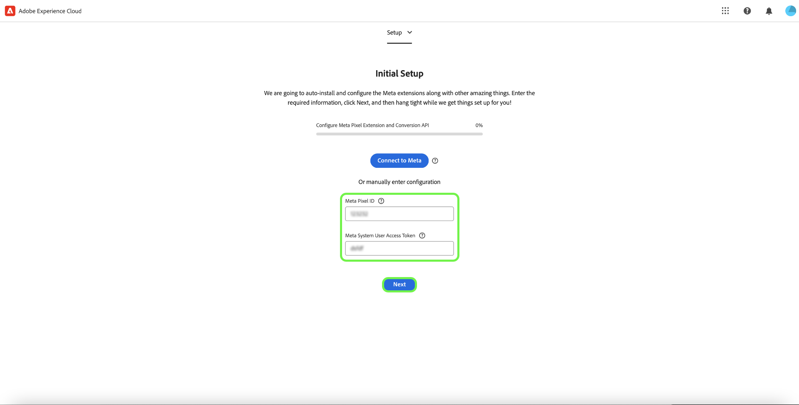

# [!DNL Meta Conversions API] 拡張機能の概要

この [[!DNL Meta Conversions API]](https://developers.facebook.com/docs/marketing-api/conversions-api/) では、サーバーサイドのマーケティングデータをに接続できます [!DNL Meta] 広告のターゲティングを最適化し、アクションあたりのコストを削減し、結果を測定するためのテクノロジーです。 イベントはにリンクされています [[!DNL Meta Pixel]](https://developers.facebook.com/docs/meta-pixel/) ID およびは、クライアントサイドイベントと同様の方法で処理されます。

使用， [!DNL Meta Conversions API] 拡張機能を使用すると、で API の機能を利用できます [イベント転送](../../../ui/event-forwarding/overview.md) にデータを送信するためのルール [!DNL Meta] Adobe Experience Platform Edge Networkから変更します。 このドキュメントでは、拡張機能をインストールし、イベント転送でその機能を使用する方法について説明します [ルール](../../../ui/managing-resources/rules.md).

## デモ

次のビデオは、に関する理解を深めるためのものです [!DNL Meta Conversions API].

>[!VIDEO](https://unlockmarketingdata.com/video-meta-conversions-api)

## 前提条件

を使用することを強くお勧めします。 [!DNL Meta Pixel] および [!DNL Conversions API] で取得されなかったイベントの回復に役立つ可能性があるので、クライアントサイドとサーバーサイドでそれぞれ同じイベントを共有および送信します [!DNL Meta Pixel]. のインストール前に [!DNL Conversions API] 拡張機能については、のガイドを参照してください [[!DNL Meta Pixel] 拡張子](../../client/meta/overview.md) を参照して、クライアントサイドのタグ実装に統合する手順を確認してください。

>[!NOTE]
>
>の節 [イベントの重複排除](#deduplication) このドキュメントの後半では、ブラウザーとサーバーの両方から受信する可能性があるので、同じイベントが 2 回使用されないようにする手順について説明します。

を使用するには [!DNL Conversions API] 拡張機能を使用するには、イベント転送にアクセスでき、有効なが [!DNL Meta] ～へのアクセス権を持つアカウント [!DNL Ad Manager] および [!DNL Event Manager]. 特に、既存のの ID をコピーする必要があります [[!DNL Meta Pixel]](https://www.facebook.com/business/help/952192354843755?id=1205376682832142) （または [新しいを作成 [!DNL Pixel]](https://www.facebook.com/business/help/952192354843755) 代わりに）を使用して、アカウントに拡張機能を設定できます。

>[!INFO]
>
>この拡張機能をモバイルアプリデータで使用する場合や、 [!DNL Meta] キャンペーンの場合は、既存のアプリを使用してデータセットを作成し、以下を選択する必要があります。 **ピクセル ID から作成** プロンプトが表示されたら、 記事を参照してください [ビジネスに最適なデータセット作成オプションの決定](https://www.facebook.com/business/help/5270377362999582?id=490360542427371) を参照してください。 を参照してください。 [アプリイベント用 Conversions API](https://developers.facebook.com/docs/marketing-api/conversions-api/app-events) すべての必須およびオプションのアプリトラッキングパラメーターに関するドキュメント。

## 拡張機能のインストール

をインストールするには [!DNL Meta Conversions API] 拡張機能でデータ収集 UI またはExperience PlatformUI に移動し、以下を選択します。 **[!UICONTROL イベントの転送]** 左側のナビゲーションから。 ここから、拡張機能を追加するプロパティを選択するか、代わりに新しいプロパティを作成します。

目的のプロパティを選択または作成したら、 **[!UICONTROL 拡張機能]** 左側のナビゲーションで、 **[!UICONTROL カタログ]** タブ。 を検索 [!UICONTROL Meta Conversions API] カードを選択してから、を選択します **[!UICONTROL インストール]**.

![この [!UICONTROL インストール] に対して選択されているオプション [!UICONTROL Meta Conversions API] データ収集 UI の拡張機能。](../../../images/extensions/server/meta/install.png)

表示される設定ビューで、を指定する必要があります [!DNL Pixel] 拡張機能をアカウントにリンクするために以前にコピーした ID。 ID を入力に直接貼り付けることも、代わりにデータ要素を使用することもできます。

また、を使用するには、アクセストークンを指定する必要があります [!DNL Conversions API] 具体的には。 を参照してください。 [!DNL Conversions API] のドキュメント [アクセストークンの生成](https://developers.facebook.com/docs/marketing-api/conversions-api/get-started#access-token) この値を取得する手順を説明します。

終了したら、 **[!UICONTROL 保存]**

![この [!DNL Pixel] 拡張機能の設定ビューでデータ要素として提供された ID。](../../../images/extensions/server/meta/configure.png)

拡張機能がインストールされ、イベント転送ルールでその機能を使用できるようになりました。

## facebookおよびInstagram拡張機能との統合 {#facebook}

facebookとInstagramの拡張機能を使用した統合により、Meta ビジネスアカウントにすばやく認証できます。 これで、 [!UICONTROL ピクセル ID] および Meta Conversions API [!UICONTROL アクセストークン]を使用すると、Meta Conversions API のインストールと設定が容易になります。

のインストール時に、FacebookとInstagramでの認証を求めるダイアログプロンプトが表示されます [!UICONTROL Meta Conversions API] 拡張機能。

![この [!UICONTROL Meta Conversions API 拡張機能] インストールページのハイライト表示 [!UICONTROL Meta に接続].](../../../images/extensions/server/meta/mbe-extension-install.png)

facebookとInstagramでの認証を求めるダイアログプロンプトは、イベント転送内のクイックスタートワークフロー UI にも表示されます。

![強調表示されたクイックスタートワークフロー UI [!UICONTROL Meta に接続].](../../../images/extensions/server/meta/mbe-extension-quick-start.png)

## イベント品質一致スコア （EMQ）との統合 {#emq}

イベント品質一致スコア（EMQ）との統合により、EMQ スコアを表示して実装の有効性を簡単に確認できます。 この統合により、コンテキストの切り替えが最小限に抑えられ、Meta Conversions API 実装の成功を向上させることができます。 これらのイベントスコアは [!UICONTROL Meta Conversions API 拡張機能] 設定画面。

![この [!UICONTROL Meta Conversions API 拡張機能] 設定ページのハイライト表示 [!UICONTROL EMQ スコアを表示].](../../../images/extensions/server/meta/emq-score.png)

## LiveRamp との統合（Alpha） {#alpha}

[!DNL LiveRamp] 次の顧客： [!DNL LiveRamp]サイトにデプロイされたの認証済みトラフィックソリューション（ATS）は、顧客情報パラメーターとして RampID の共有を選択する場合があります。 ご協力ください [!DNL Meta] この機能のAlphaプログラムに参加するには、アカウントチームに連絡してください。

![メタイベント転送 [!UICONTROL ルール] 設定ページのハイライト表示 [!UICONTROL パートナー名（アルファ版）] および [!UICONTROL パートナー ID （アルファ版）].](../../../images/extensions/server/meta/live-ramp.png)

## イベント転送ルールの設定 {#rule}

この節では、の使用方法について説明します [!DNL Conversions API] 汎用イベント転送ルールの拡張機能。 実際には、許可されたすべてを送信するために、いくつかのルールを設定する必要があります [標準イベント](https://developers.facebook.com/docs/meta-pixel/reference) 経由 [!DNL Meta Pixel] および [!DNL Conversions API]. モバイルアプリデータの場合は、必須フィールド、アプリデータフィールド、顧客情報パラメーター、カスタムデータの詳細を参照してください [こちら](https://developers.facebook.com/docs/marketing-api/conversions-api/app-events).

>[!NOTE]
>
>イベントは [リアルタイムで送信](https://www.facebook.com/business/help/379226453470947?id=818859032317965) または、広告キャンペーンの最適化を向上させるために、できるだけリアルタイムに近づけます。

新しいイベント転送ルールの作成を開始し、必要に応じてその条件を設定します。 ルールのアクションを選択する場合は、 **[!UICONTROL Meta Conversions API 拡張機能]** 拡張機能の場合、を選択します **[!UICONTROL Conversions API イベントの送信]** アクションタイプの場合。

![この [!UICONTROL ページビューを送信] データ収集 UI のルールに対して選択されているアクションタイプ。](../../../images/extensions/server/meta/select-action.png)

送信先のイベントデータを設定できるコントロールが表示されます [!DNL Meta] 経由： [!DNL Conversions API]. これらのオプションは、指定された入力に直接入力することも、代わりに値を表す既存のデータ要素を選択することもできます。 設定オプションは、以下に示すように、4 つの主なセクションに分かれています。

| Config セクション | 説明 |
| --- | --- |
| [!UICONTROL サーバーイベントのパラメーター] | 発生した時刻やトリガーしたソースアクションなど、イベントに関する一般情報。 を参照してください。 [!DNL Meta] の詳細については、開発者向けドキュメントを参照してください。 [標準イベントパラメーター](https://developers.facebook.com/docs/marketing-api/conversions-api/parameters/server-event) が承諾しました [!DNL Conversions API].  両方を使用している場合 [!DNL Meta Pixel] および [!DNL Conversions API] イベントを送信するには、必ず次の両方を含めてください。 **[!UICONTROL イベント名]** （`event_name`）および **[!UICONTROL イベント ID]** （`event_id`）に設定します。これらの値はに使用されるため、 [イベントの重複排除](#deduplication).  次のオプションもあります。 **[!UICONTROL 制限付きデータ使用を有効にする]** 顧客のオプトアウトへの準拠を支援します。 を参照してください。 [!DNL Conversions API] のドキュメント [データ処理オプション](https://developers.facebook.com/docs/marketing-apis/data-processing-options/) この機能について詳しくは、を参照してください。 |
| [!UICONTROL 顧客情報パラメーター] | イベントを顧客に関連付けるために使用されるユーザー ID データ。 これらの値の一部は、API に送信する前にハッシュ化する必要があります。  良好な共通 API 接続と高いイベントマッチ品質（EMQ）を確保するために、すべてを送信することをお勧めします [承認された顧客情報パラメーター](https://developers.facebook.com/docs/marketing-api/conversions-api/parameters/customer-information-parameters) サーバーイベントと共に。 これらのパラメーターは、 [重要度と EMQ への影響に基づいて優先順位が付けられる](https://www.facebook.com/business/help/765081237991954?id=818859032317965). |
| [!UICONTROL カスタムデータ] | 広告配信の最適化に使用する追加データ（JSON オブジェクトの形式で提供）。 を参照してください。 [[!DNL Conversions API] 詳細を見る](https://developers.facebook.com/docs/marketing-api/conversions-api/parameters/custom-data) このオブジェクトで使用可能なプロパティの詳細を参照してください。  購入イベントを送信する場合、このセクションを使用して必要な属性を指定する必要があります `currency` および `value`. |
| [!UICONTROL テストイベント] | このオプションは、の設定が原因でサーバーイベントがによって受信されているかどうかを確認するために使用されます [!DNL Meta] 期待どおりだ。 この機能を使用するには、 **[!UICONTROL テストイベントとして送信]** 次に、以下の入力で任意のテストイベントコードを指定します。 イベント転送ルールがデプロイされると、拡張機能とアクションを正しく設定した場合は、内にアクティビティが表示されます **[!DNL Test Events]** で表示 [!DNL Meta Events Manager]. |

{style="table-layout:auto"}

終了したら、 **[!UICONTROL 変更を保持]** をクリックして、ルール設定にアクションを追加します。

![[!UICONTROL 変更を保持] アクション設定用に選択されています。](../../../images/extensions/server/meta/keep-changes.png)

ルールに満足したら、を選択します。 **[!UICONTROL ライブラリに保存]**. 最後に、新しいイベント転送を公開します [ビルド](../../../ui/publishing/builds.md) をクリックして、ライブラリに加えられた変更を有効にします。

## イベントの重複排除 {#deduplication}

に記載されているように [前提条件セクション](#prerequisites)の場合は、両方を使用することをお勧めします [!DNL Meta Pixel] タグ拡張機能と [!DNL Conversions API] 冗長な設定でクライアントとサーバーから同じイベントを送信するイベント転送拡張機能。 これは、いずれかの拡張機能で取得されなかったイベントを回復するのに役立ちます。

クライアントとサーバーから異なるイベントタイプを送信し、両者が重複していない場合は、重複排除は必要ありません。 ただし、単一のイベントが両方のユーザーによって共有される場合は、 [!DNL Meta Pixel] および [!DNL Conversions API]を使用している場合は、レポートに悪影響が及ばないよう、これらの冗長なイベントの重複が排除されるようにする必要があります。

共有イベントを送信する場合は、クライアントとサーバーの両方から送信するすべてのイベントに、イベント ID と名前が含まれていることを確認してください。 同じ ID と名前を持つ複数のイベントを受信した場合、 [!DNL Meta] では、重複を排除して最も関連性の高いデータを保持するために、いくつかの戦略を自動的に採用しています。 を参照してください。 [!DNL Meta] のドキュメント [の重複排除 [!DNL Meta Pixel] および [!DNL Conversions API] イベント](https://www.facebook.com/business/help/823677331451951?id=1205376682832142) このプロセスについて詳しくは、を参照してください。

## クイックスタートワークフロー：Meta Conversions API 拡張機能（ベータ版） {#quick-start}

>[!IMPORTANT]
>
>* クイックスタート機能は、Real-Time CDP Prime および Ultimate パッケージを購入したお客様が利用できます。 詳しくは、アドビ担当者にお問い合わせください。
>* この機能は、まったく新しい実装を対象としており、現在、既存のタグおよびイベント転送プロパティへの拡張機能と設定の自動インストールをサポートしていません。

>[!NOTE]
>
>既存のクライアントは、クイックスタートワークフローを使用して、次の目的で使用できる参照実装を作成できます。
>* まったく新しい実装の開始として使用します。
>* 参照実装として活用します。参照実装を調べて、どのように設定されたかを確認し、現在の実稼動実装にレプリケートできます。

クイックスタート機能を使用すると、Meta Conversions API と Meta Pixel 拡張機能を簡単かつ効率的に設定できます。 Adobeタグとイベント転送の複数の手順を自動化し、設定時間を大幅に短縮します。

この機能は、新しく自動生成されたタグおよびイベント転送プロパティに、必要なルールとデータ要素を含む Meta Conversions API と Meta Pixel 拡張機能の両方を自動的にインストールして設定します。 さらに、Experience PlatformWeb SDK とデータストリームの自動インストールおよび設定も行います。 最後に、クイックスタート機能により、Edge Network環境で指定された URL にライブラリが自動公開され、イベント転送とExperience Platform開発を介したクライアントサイドのデータ収集とサーバーサイドのイベント転送がリアルタイムで可能になります。

次のビデオでは、クイックスタート機能の概要を説明しています。

>[!VIDEO](https://video.tv.adobe.com/v/3416939?quality=12&learn=on)

### クイックスタート機能のインストール

>[!NOTE]
>
>この機能は、イベント転送の実装を開始するのに役立つように設計されています。 すべてのユースケースに対応するエンドツーエンドの完全に機能する実装は提供されません。

このセットアップでは、Meta Conversions API と Meta Pixel 拡張機能の両方が自動でインストールされます。 Meta では、このハイブリッド実装を使用して、イベントコンバージョンサーバーサイドでイベントを収集および転送することをお勧めします。
クイックセットアップ機能は、お客様がイベント転送の実装を開始するのを支援するように設計されており、すべてのユースケースに対応するエンドツーエンドの完全に機能する実装を提供するものではありません。

この機能をインストールするには、 **[!UICONTROL はじめに]** （用） **[!DNL Send Conversions Data to Meta]** Adobe Experience Platform Data Collection 上 **[!UICONTROL ホーム]** ページ。

を入力 **[!UICONTROL ドメイン]**&#x200B;を選択してから、 **[!UICONTROL 次]**. このドメインは、自動生成されるタグとイベント転送のプロパティ、ルール、データ要素、データストリームなどの命名規則として使用されます。

が含まれる **[!UICONTROL 初期設定]** ダイアログ入力する **[!UICONTROL メタピクセル ID]**, **[!UICONTROL メタ変換 API アクセストークン]**、および **[!UICONTROL データレイヤーのパス]**&#x200B;を選択してから、 **[!UICONTROL 次]**.

初期設定プロセスが完了するまで数分待ってから、を選択します。 **[!UICONTROL 次]**.

から **[!UICONTROL サイトへのコードの追加]** ダイアログコピーを使用して提供されたコードをコピーします  関数を使用して、これを `<head>` （ソース web サイトの）。 実装が完了したら、以下を選択します。 **[!UICONTROL 検証を開始]**

この [!UICONTROL 検証結果] ダイアログにメタ拡張機能の実装結果が表示されます。 を選択 **[!UICONTROL 次]**. を選択して、追加の検証結果を確認することもできます **[!UICONTROL Assurance]** リンク。

この **[!UICONTROL 次の手順]** 画面を表示して、設定が完了したことを確認します。 ここから、新しいイベントを追加して実装を最適化するオプションがあります。このイベントについては、次の節で説明します。

イベントを追加しない場合は、 **[!UICONTROL 閉じる]**.

#### 追加イベントの追加

新しいイベントを追加するには、次を選択します **[!UICONTROL タグの Web プロパティを編集]**.

編集するメタイベントに対応するルールを選択します。 例： **MetaConversion_AddToCart**.

>[!NOTE]
>
>イベントがない場合、このルールは実行されません。 これは、以下を含むすべてのルールに当てはまります **MetaConversion_PageView** ルールは例外です。

イベントを追加するには、以下を選択します **[!UICONTROL 追加]** の下 [!UICONTROL イベント] 見出し。

「」を選択します [!UICONTROL イベントタイプ]. この例では、 [!UICONTROL クリック] イベントを取得し、次の場合にトリガーするように設定 **.add-to-cart-button** が選択されました。 「**[!UICONTROL 変更を保持]**」を選択します。

新しいイベントが保存されました。 を選択 **[!UICONTROL 作業ライブラリを選択]** ビルド先のライブラリを選択します。

次に、の横にあるドロップダウンを選択します **[!UICONTROL ライブラリに保存]** を選択して、 **[!UICONTROL ライブラリに保存してビルド]**. これにより、ライブラリに変更が公開されます。

設定したい他のメタコンバージョンイベントに対して、これらの手順を繰り返します。

#### データレイヤーの設定 {#configuration}

>[!IMPORTANT]
>
>このグローバルデータレイヤーを更新する方法は、web サイトのアーキテクチャによって異なります。 単一ページアプリケーションは、サーバーサイドレンダリングアプリケーションとは異なります。 また、タグ製品内でこのデータの作成と更新を完全に担当する可能性もあります。 すべての場合、を実行してから次の実行までの間にデータレイヤーを更新する必要があります `MetaConversion_* rules`. ルール間でデータを更新しない場合は、最後のルールから古いデータを送信する場合もあります `MetaConversion_* rule` 現在の `MetaConversion_* rule`.

設定時に、データレイヤーの保存場所を尋ねられました。 デフォルトでは、のようになります `window.dataLayer.meta`内および `meta` オブジェクトの場合、データは次に示すように求められます。

これは、すべてのものとして理解することが重要です `MetaConversion_*` ルールでは、このデータ構造を使用して、関連するデータをに渡します [!DNL Meta Pixel] およびの拡張 [!DNL Meta Conversions API]. のドキュメントを参照してください。 [標準イベント](https://developers.facebook.com/docs/meta-pixel/reference#standard-events) 様々なメタイベントが必要とするデータの詳細については、こちらを参照してください。

例えば、を使用する場合 `MetaConversion_Subscribe` ルールを更新する必要があります `window.dataLayer.meta.currency`, `window.dataLayer.meta.predicted_ltv`、および `window.dataLayer.meta.value` のドキュメントに記載されているオブジェクトプロパティに従って、 [標準イベント](https://developers.facebook.com/docs/meta-pixel/reference#standard-events).

以下は、ルールを実行する前にデータレイヤーを更新するために web サイトで実行する必要がある処理の例です。

デフォルトでは、 `<datalayerpath>.conversionData.eventId` いずれかのに対する「新しいイベント ID を生成」アクションによってランダムに生成されます `MetaConversion_* rules`.

データレイヤーの外観のローカル参照については、でカスタムコードエディターを開きます。 `MetaConversion_DataLayer` プロパティのデータ要素。

## 次の手順

このガイドでは、サーバーサイドイベントデータをに送信する方法について説明しました。 [!DNL Meta] の使用 [!DNL Meta Conversions API] 拡張機能。 ここから、さらに接続して統合を拡張することをお勧めします [!DNL Pixels] 該当する場合は、さらにイベントを共有します。 次のいずれかの操作を行うと、広告パフォーマンスをさらに向上させることができます。

* その他を接続 [!DNL Pixels] まだに接続されていないもの [!DNL Conversions API] 統合。
* 特定のイベントを経由でのみ送信する場合 [!DNL Meta Pixel] クライアント側では、これらと同じイベントをに送信します。 [!DNL Conversions API] サーバー側からも同様です。

を参照してください。 [!DNL Meta] のドキュメント [のベストプラクティス [!DNL Conversions API]](https://www.facebook.com/business/help/308855623839366?id=818859032317965) 統合を効果的に実装する方法に関するガイダンスが必要です。 Adobe Experience Cloudのタグとイベント転送の一般的な情報については、を参照してください。 [タグの概要](../../../home.md).
