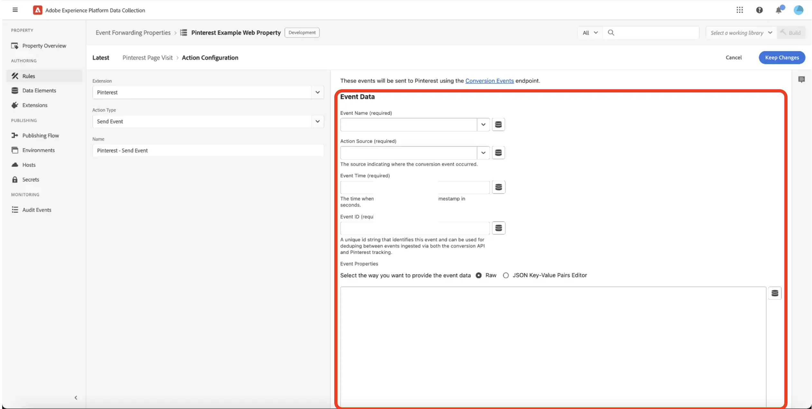

# [!DNL Reddit] Conversions API 拡張機能の概要

Reddit は、多様なユーザーベースを持つソーシャルメディアプラットフォームであり、特定のオーディエンスをターゲットにした広告主に最適です。

[[!DNL Reddit] Conversions API 拡張機能 ](https://ads-api.reddit.com/docs/v2/#tag/Conversions-API) を使用して、Adobe Experience Platform Edge Networkでキャプチャされたユーザーインタラクションイベントを [!DNL Reddit Ads] に送信します。 この拡張機能を使用すると、ブランドが毎週 3 億 7900 万人以上のアクティブユーザーのオーディエンスにリーチし、ユーザーの行動をより深く理解し、ターゲット広告を実行できるようになります。

イベント転送 [ ルール ](https://experienceleague.adobe.com/en/docs/experience-platform/tags/ui/rules) で [!DNL Reddit] Conversions API 拡張機能をインストール、設定、使用する方法については、このガイドを参照してください。

## 主なメリット {#benefits}

Reddit Conversions API 拡張機能を使用して、次の操作を行います。

- **オーディエンスにリーチ**:[!DNL Reddit] で毎週 3 億 7,900 万人を超えるアクティブユーザーと関わります。
- **ユーザーの行動の分析**：ユーザーインタラクションデータを活用して行動を把握し、キャンペーンを最適化します。
- **ターゲット広告の配信**:Adobe Experience Platformでキャプチャされたユーザーインタラクションに基づいてパーソナライズされた広告を実行します。

## 前提条件 {#prerequisites}

この拡張機能を使用するには、有効な Reddit Ads アカウントが必要です。 アカウントをまだお持ちでない場合は、[[!DNL Reddit Ads]  登録ページ ](https://business.reddithelp.com/s/article/Create-and-manage-your-Reddit-Ads-account) に移動し、アカウントを登録して作成してください。 アカウントを設定したら、[ 広告 API へのアクセスをリクエスト ](https://www.redditforbusiness.com/api-partnership) します。

### 必要な設定の詳細の収集 {#configuration-details}

Experience Platformを [!DNL Reddit] に接続するには、次の入力が必要です。

| 資格情報 | 説明 | 例 |
| --- | --- | --- |
| ピクセル ID | ピクセル ID は、[!DNL Reddit Ads] アカウントに関連付けられた一意の ID です。 Web サイトやアプリでユーザーのインタラクションやコンバージョンイベントを追跡するために使用されます。 ピクセル ID は [!DNL Reddit Ads] [ アカウント ](https://ads.reddit.com/accounts) で確認できます。 | 123456789012 |
| コンバージョンアクセストークン | [!DNL Reddit] コンバージョンアクセストークン。 詳しくは、[[!DNL Reddit] Conversions API](https://business.reddithelp.com/s/article/conversion-access-token) ドキュメントを参照してください。  **このトークンは期限切れにならないので、このプロセスを実行する必要があるのは 1 回だけです。** | {YOUR_REDDIT_BEARER_TOKEN} |

## [!DNL Reddit] 拡張機能のインストールと設定 {#install-configure}

次の手順に従って、[!DNL Reddit] Conversions API 拡張機能をインストールして設定します。

1. Experience Platform Data Collection UI で、左側のナビゲーションから [!UICONTROL Extensions] を選択し、[!UICONTROL Extensions] カタログにアクセスします。 次に [ 新しいイベント転送プロパティを作成 ](https://experienceleague.adobe.com/en/docs/experience-platform/tags/event-forwarding/overview#properties) するか、既存のプロパティを選択します。
2. 左側のナビゲーションパネルで **[!UICONTROL 拡張機能]** に移動します。 **[!UICONTROL カタログ]** を選択してから、**[!DNL Reddit]** 拡張機能を選択します。
   
3. 次の設定の詳細を入力します。
   - **ピクセル ID**:[!DNL Reddit Ads] ピクセル ID を入力します。
   - **コンバージョンアクセストークン**:[!DNL Reddit Ads] アカウントで生成されたトークンを入力し、完了したら **[!UICONTROL 保存]** を選択します。
     

## イベント転送ルールの設定 {#config-rule}

データ要素を設定したら、イベント転送ルールを作成して、イベントを [!DNL Reddit Ads] に送信するタイミングと方法を決定します。

1. イベント転送プロパティの **ルール** に移動し、新しい [ ルール ](https://experienceleague.adobe.com/en/docs/experience-platform/tags/ui/rules) を作成します。
2. **アクション** の下に新しいアクションを追加し、拡張機能を **[!DNL Reddit CAPI]** に設定します。
3. **アクションタイプ** を **イベントを送信** に設定します。
   
4. 次の表に示すように、イベントに対して追加のコントロールを設定します。

   | フィールド名 | 説明 | 例 |
   | --- | --- | --- |
   | `Event Name` | コンバージョンイベントの名前を指定します。 | `Purchase` |
   | `Event Type` | [ サポートされている Reddit コンバージョンイベント）またはカスタムイベント ](https://business.reddithelp.com/s/article/supported-conversion-events#supported-conversion-events) できるイベントのタイプを定義します。 | `SignUp`、`MyCustomEvent` |
   | `Timestamp` | イベント時間を ISO 形式またはエポック時間で指定します。 | `2025-04-15T16:01:00.000Z`、`1744742460000` |
   | `Client Dedupe ID` | 重複排除の一意の ID を追加します。 | `abc123` |
   | `Match Keys` | アトリビューションにユーザー識別子とデバイス識別子を含めます。 | `{"email":"hashed_email@example.com", "phone":"hashed_phone"}` |
   | `Value` | イベントの金額を指定します。 | `99.99` |
   | `Currency Code` | 通貨には ISO-4217 形式を使用します。 | `USD` |
   | `Units Sold` | 購入した品目の数量を入力します。 | `3` |
   | `Country Code` | イベントが発生した国を指定します。 | `US` |
   | `Data Processing Options` | LDU （データ使用制限）などのプライバシーフラグを追加します。 | `{"modes":["LDU"],"country":"US","region":"US-NY"}` |
   | `Consent` | 広告データの使用に対するユーザーの同意を示します。 | `true` |

5. 「**変更を保持**」を選択して、ルールを保存します。

## イベントメタデータ {#event-metadata}

イベントのメタデータおよびユーザーデータフィールドの詳細な分類については、この節を参照してください。これにより、イベントの設定に必要なパラメーターとオプションのパラメーターを把握できます。 表示されるフィールドは、選択したイベントタイプによって異なる場合があります。

>[!NOTE]
>
>コンバージョンイベントから最良の結果を得るには、[ 動的製品広告 ](https://business.reddithelp.com/s/article/dynamic-product-ads) を設定する際に、必ずすべてのフィールドに入力してください。

### イベントメタデータフィールド

| フィールド名 | 説明 | 例 |
| --- | --- | --- |
| `Conversion ID` （必須） | 重複排除に使用される、コンバージョンイベントの一意の ID。 | `abc123` |
| `Item Count` | コンバージョンイベントの項目の合計数。 | `6` |
| `Currency` | 値の通貨は、[ISO-4217](https://www.iso.org/iso-4217-currency-codes.html) 形式で指定されます。 | `USD` |
| `Value` | 小数を含むコンバージョンイベントの合計金額。 | `1.23` |
| `Products` | イベントに関連付けられた製品に関する詳細を含むオブジェクトの JSON 配列。 各オブジェクトには、少なくとも `id` を含める必要があります。 | `[{"id":"SKU123","name":"ProductName","category":"CategoryName"},{"id":"SKU456","name":"ProductName","category":"CategoryName"}]` |

### ユーザーデータフィールド

次のパラメーターはオプションですが、推奨されます。

| フィールド名 | 説明 | 例 |
| --- | --- | --- |
| `Email` （強く推奨） | ハッシュ化またはハッシュ化されていないユーザーメール。 | `example@email.com` |
| `External ID` | ハッシュ化またはハッシュ化されていない広告主が割り当てたユーザー ID。 | `customer12345` |
| `UUID` （強く推奨） | Web サイト上の Reddit ピクセルで生成された ID。 | `1677712978045.b8f7eb7d-b357-437b-8bd3-e1c8166c7132` |
| `IP Address` （強く推奨） | ユーザーのデバイス IP アドレス。 | `192.168.0.1` |
| `User Agent` （強く推奨） | ユーザーが使用するブラウザーまたはアプリ。 | `Chrome/98.0.4758.102` |
| `IDFA` | ハッシュ化またはハッシュ化されていない広告主用のApple ID。 | `8A2E4F6D-0852-4B2A-B9D5-79334DE14B16` |
| `AAID` | ハッシュ化またはハッシュ化されていないAndroid Advertising ID。 | `38400000-8cf0-11bd-b23e-10b96e40000d` |
| `Screen Width` | ユーザーのディスプレイの幅です。 | `1920` |
| `Screen Height` | ユーザーのディスプレイの高さ。 | `1080` |
| `Data Processing Options` （JSON 形式） | ユーザープライバシー設定。 LDU （データ使用の制限）のみをサポートします。 | `{"modes":["LDU"],"country":"US","region":"US-NY"}` |

### 重要な考慮事項

データを [!DNL Reddit Ads] に送信する前に、拡張機能は `Email`、`External ID`、`IDFA` および `AAID` フィールドの値をハッシュ化して正規化します。 これらの値が既に [!DNL SHA-256] でハッシュ化されている場合、拡張機能は、これらの値を再ハッシュ化しません。

## 検証とデプロイ {#validate-deploy}

拡張機能とルールを設定したら、[[!DNL Reddit Ads]  イベントマネージャー ](https://business.reddithelp.com/s/article/Events-Manager) でイベントデータを確認して統合を検証します。 [Match Quality Score （MQS） ](https://business.reddithelp.com/s/article/match-quality-score) を使用して、信号統合の精度と信頼性を評価します。

[!DNL Reddit Ads] について詳しくは、[Reddit Ads ドキュメント ](https://ads.reddit.com/) を参照してください。

## 次の手順 {#next-steps}

このドキュメントでは、[!DNL Reddit] Conversions API 拡張機能の設定方法と使用方法を確認しました。 Adobe Experience Platformのイベント転送機能について詳しくは、[ イベント転送の概要 ](../../../ui/event-forwarding/overview.md) または次のリソースを参照してください。

- [ 一致キーの共有 ](https://business.reddithelp.com/s/article/about-attribution-matching-signals) および [ イベントメタデータ ](https://business.reddithelp.com/s/article/about-event-metadata)：一致キーとイベントメタデータを効果的に共有する方法を説明します。
- [ イベントの重複排除 ](https://business.reddithelp.com/s/article/event-deduplication)：イベントの重複を排除して、正確なイベントトラッキングを確保します。
- [ コンバージョンアクセストークンを作成 ](https://business.reddithelp.com/helpcenter/s/article/conversion-access-token)：次の手順に従って、セキュア API 認証用のコンバージョンアクセストークンを作成します。
