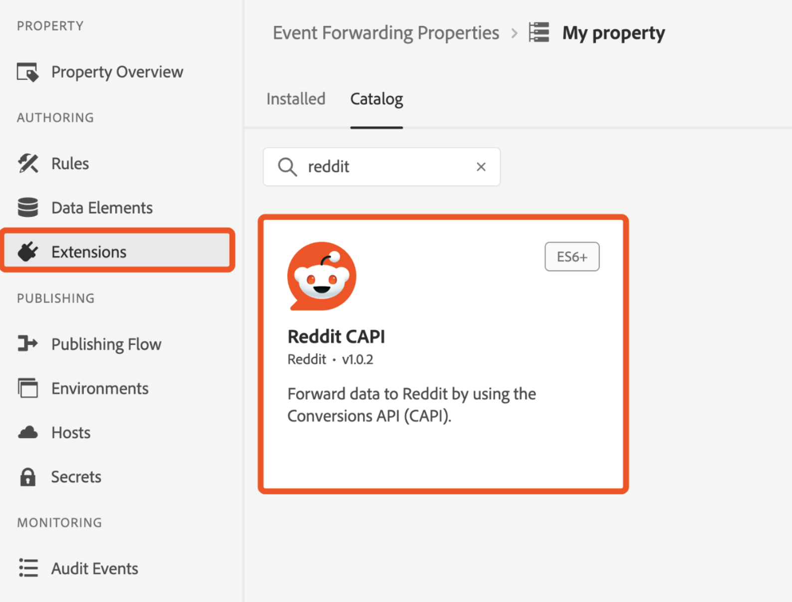
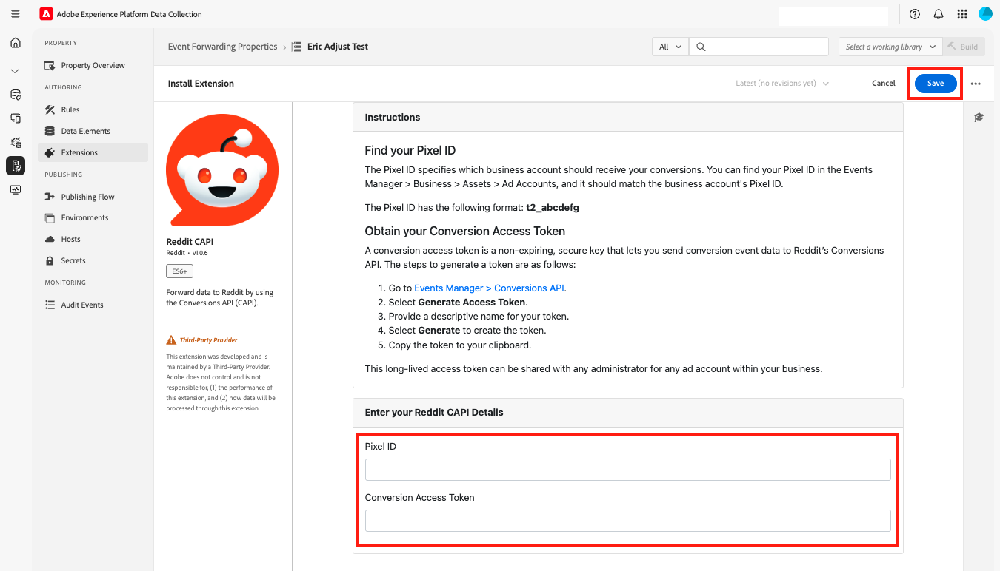
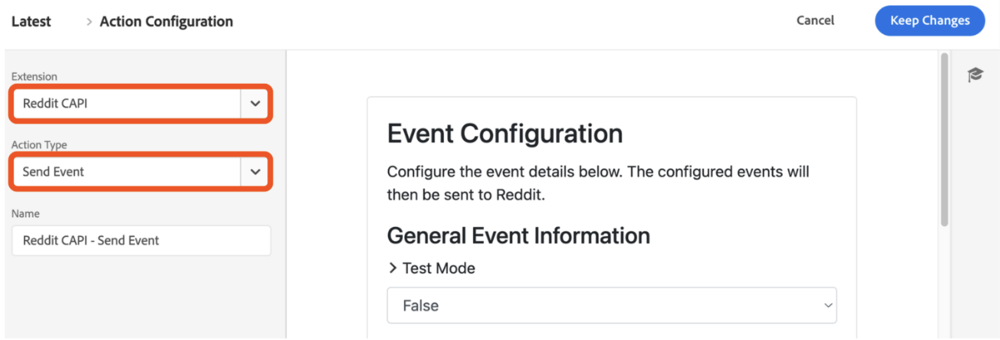
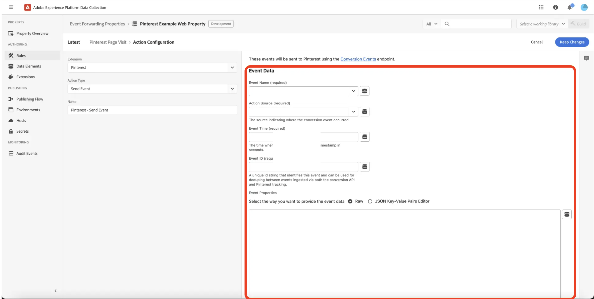

# [!DNL Reddit] コンバージョン API拡張機能の概要

Redditは多様なユーザー基盤を持つソーシャルメディアプラットフォームであり、特定のオーディエンスをターゲットとする広告主に最適です。

[[!DNL Reddit]  コンバージョン API拡張機能](https://ads-api.reddit.com/docs/v2/#tag/Conversions-API)を使用して、Adobe Experience Platform Edge Networkでキャプチャされたユーザーインタラクションイベントを[!DNL Reddit Ads]に送信します。 この拡張機能は、毎週3億7900万人を超えるアクティブユーザーにリーチし、ユーザー行動をより深く理解して、ターゲットを絞った広告を配信するのに役立ちます。

このガイドでは、イベント転送[!DNL Reddit] ルール [で](https://experienceleague.adobe.com/en/docs/experience-platform/tags/ui/rules) コンバージョン API拡張機能をインストール、設定、使用する方法について説明します。

## 主なメリット {#benefits}

Reddit Conversions API拡張機能を使用して、以下を行います。

- **オーディエンスにリーチ**：週に3億7,900万人を超えるアクティブユーザーと[!DNL Reddit]でエンゲージします。
- **ユーザーの行動を分析**: ユーザーのインタラクションデータを活用して、行動を把握し、キャンペーンを最適化します。
- **ターゲット広告を配信**: Adobe Experience Platformでキャプチャしたユーザーインタラクションに基づいて、パーソナライズされた広告を実行します。

## 前提条件 {#prerequisites}

この拡張機能を使用するには有効なReddit Ads アカウントが必要です。 [[!DNL Reddit Ads] 登録ページ &#x200B;](https://business.reddithelp.com/s/article/Create-and-manage-your-Reddit-Ads-account)に移動して、アカウントを登録し、まだアカウントをお持ちでない場合はアカウントを作成します。 アカウントを設定したら、[広告APIへのアクセスをリクエスト &#x200B;](https://www.redditforbusiness.com/api-partnership)します。

### 必要な設定の詳細を収集する {#configuration-details}

Experience Platformを[!DNL Reddit]に接続するには、次の入力が必要です。

| 資格情報 | 説明 | 例 |
| --- | --- | --- |
| ピクセル ID | ピクセル IDは、[!DNL Reddit Ads] アカウントに関連付けられた一意のIDです。 web サイトやアプリでのユーザーのインタラクションやコンバージョンイベントを追跡するために使用されます。 お使いのPixel IDは、[!DNL Reddit Ads] [&#x200B; アカウント &#x200B;](https://ads.reddit.com/accounts)で確認できます。 | 123456789012 |
| コンバージョンアクセストークン | [!DNL Reddit] コンバージョンアクセストークン。 ガイダンスについては、[[!DNL Reddit]  コンバージョン API](https://business.reddithelp.com/s/article/conversion-access-token) ドキュメントを参照してください。  **このトークンは期限切れではないため、このプロセスは1回だけ実行する必要があります。** | {YOUR_REDDIT_BEARER_TOKEN} |

## [!DNL Reddit]拡張機能のインストールと設定 {#install-configure}

次の手順に従って、[!DNL Reddit] Conversions API拡張機能をインストールして設定します。

1. Experience Platform Data Collection UIで、左側のナビゲーションから「[!UICONTROL Extensions]」を選択して、[!UICONTROL Extensions] カタログにアクセスします。 次に、[新しいイベント転送プロパティ &#x200B;](https://experienceleague.adobe.com/en/docs/experience-platform/tags/event-forwarding/overview#properties)を作成するか、既存のプロパティを選択します。
2. 左側のナビゲーションパネルで&#x200B;**[!UICONTROL Extensions]**&#x200B;に移動します。 **[!UICONTROL Catalog]**&#x200B;を選択し、**[!DNL Reddit]**&#x200B;拡張機能を選択します。
   
3. 次の設定の詳細を入力します。
   - **ピクセル ID**: [!DNL Reddit Ads] ピクセル IDを入力します。
   - **コンバージョンアクセストークン**: [!DNL Reddit Ads] アカウントで生成されたトークンを入力し、完了したら「**[!UICONTROL Save]**」を選択します。
     

## イベント転送ルールの設定 {#config-rule}

データ要素を設定したら、イベント転送ルールを作成して、イベントがいつ、どのように[!DNL Reddit Ads]に送信されるかを決定します。

1. イベント転送プロパティの&#x200B;**ルール**&#x200B;に移動し、新しい[&#x200B; ルール &#x200B;](https://experienceleague.adobe.com/en/docs/experience-platform/tags/ui/rules)を作成します。
2. **アクション**&#x200B;で、新しいアクションを追加し、拡張機能を&#x200B;**[!DNL Reddit CAPI]**&#x200B;に設定します。
3. 「**アクションタイプ**」を「**イベントを送信**」に設定します。
   
4. 次の表に示すように、イベントの追加コントロールを設定します。

   | フィールド名 | 説明 | 例 |
   | --- | --- | --- |
   | `Event Name` | コンバージョンイベントの名前を指定します。 | `Purchase` |
   | `Event Type` | [&#x200B; サポートされているReddit コンバージョンイベント &#x200B;](https://business.reddithelp.com/s/article/supported-conversion-events#supported-conversion-events)またはカスタムイベントにできるイベントのタイプを定義します。 | `SignUp`, `MyCustomEvent` |
   | `Timestamp` | イベント時間をISO形式またはエポック時間で指定します。 | `2025-04-15T16:01:00.000Z`, `1744742460000` |
   | `Client Dedupe ID` | 重複排除に一意のIDを追加します。 | `abc123` |
   | `Match Keys` | アトリビューションにユーザー識別子とデバイス識別子を含めます。 | `{"email":"hashed_email@example.com", "phone":"hashed_phone"}` |
   | `Value` | イベントの金銭的価値を指定します。 | `99.99` |
   | `Currency Code` | 通貨にはISO-4217形式を使用します。 | `USD` |
   | `Units Sold` | 購入した品目の数量を入力します。 | `3` |
   | `Country Code` | イベントが発生した国を指定します。 | `US` |
   | `Data Processing Options` | LDU （Limited Data Usage）などのプライバシーフラグを追加します。 | `{"modes":["LDU"],"country":"US","region":"US-NY"}` |
   | `Consent` | 広告データの利用に対するユーザーの同意を示します。 | `true` |

5. ルールを保存するには、**変更を保持**&#x200B;を選択します。

## イベントメタデータ {#event-metadata}

この節では、イベントメタデータとユーザーデータフィールドについて詳しく説明し、イベントの設定に必要なパラメーターとオプションのパラメーターを確実に理解する方法について説明します。 表示されるフィールドは、選択したイベントタイプによって異なる場合があります。

>[!NOTE]
>
>コンバージョンイベントから最高の結果を得るには、[動的な製品広告](https://business.reddithelp.com/s/article/dynamic-product-ads)を設定する際に、すべてのフィールドに必ず入力してください。

### イベントメタデータフィールド

| フィールド名 | 説明 | 例 |
| --- | --- | --- |
| `Conversion ID` （必須） | 重複排除に使用されるコンバージョンイベントの一意のID。 | `abc123` |
| `Item Count` | コンバージョンイベントのアイテムの合計数。 | `6` |
| `Currency` | 値の通貨は、[ISO-4217](https://www.iso.org/iso-4217-currency-codes.html)形式で指定されます。 | `USD` |
| `Value` | コンバージョンイベントの合計金銭的価値（小数を含む）。 | `1.23` |
| `Products` | イベントに関連付けられた製品に関する詳細を含むオブジェクトのJSON配列。 各オブジェクトには、少なくとも`id`が含まれている必要があります。 | `[{"id":"SKU123","name":"ProductName","category":"CategoryName"},{"id":"SKU456","name":"ProductName","category":"CategoryName"}]` |

### ユーザーデータフィールド

次のパラメーターはオプションですが、推奨されます。

| フィールド名 | 説明 | 例 |
| --- | --- | --- |
| `Email` （強くお勧めします） | ハッシュ化またはハッシュ化されていないユーザーメール。 | `example@email.com` |
| `External ID` | 広告主が割り当てたユーザーIDがハッシュ化またはハッシュ化されていない。 | `customer12345` |
| `UUID` （強くお勧めします） | Web サイトのReddit ピクセルで生成されるID。 | `1677712978045.b8f7eb7d-b357-437b-8bd3-e1c8166c7132` |
| `IP Address` （強くお勧めします） | ユーザーのデバイス IP アドレス。 | `192.168.0.1` |
| `User Agent` （強くお勧めします） | ユーザーが使用するブラウザーまたはアプリ。 | `Chrome/98.0.4758.102` |
| `IDFA` | 広告主向けのハッシュ化またはハッシュ化されていないApple識別子。 | `8A2E4F6D-0852-4B2A-B9D5-79334DE14B16` |
| `AAID` | Android Advertising IDのハッシュ化またはハッシュ化。 | `38400000-8cf0-11bd-b23e-10b96e40000d` |
| `Screen Width` | ユーザーの表示の幅。 | `1920` |
| `Screen Height` | ユーザーの表示の高さ。 | `1080` |
| `Data Processing Options` （JSON形式） | ユーザーのプライバシー設定。 LDU （制限付きデータ使用）のみをサポートします。 | `{"modes":["LDU"],"country":"US","region":"US-NY"}` |

### 重要な検討事項

データを[!DNL Reddit Ads]に送信する前に、拡張機能がハッシュ化し、次のフィールドの値を正規化します：`Email`、`External ID`、`IDFA`、および`AAID`。 拡張機能は、既に[!DNL SHA-256]でハッシュ化されている場合、これらの値を再ハッシュしません。

## 検証とデプロイ {#validate-deploy}

拡張機能とルールを設定したら、[[!DNL Reddit Ads] Events Manager](https://business.reddithelp.com/s/article/Events-Manager)でイベントデータを確認して統合を検証します。 [Match Quality Score （MQS） &#x200B;](https://business.reddithelp.com/s/article/match-quality-score)を使用して、シグナル統合の精度と信頼性を評価します。

[!DNL Reddit Ads]の詳細については、[Reddit広告ドキュメント &#x200B;](https://ads.reddit.com/)を参照してください。

## 次の手順 {#next-steps}

このドキュメントでは、[!DNL Reddit] Conversions API拡張機能の設定方法と使用方法について説明します。 Adobe Experience Platformのイベント転送機能について詳しくは、[&#x200B; イベント転送の概要](../../../ui/event-forwarding/overview.md)または次の資料を参照してください。

- [一致キーを共有](https://business.reddithelp.com/s/article/about-attribution-matching-signals)および[&#x200B; イベントメタデータ &#x200B;](https://business.reddithelp.com/s/article/about-event-metadata)：一致キーとイベントメタデータを効果的に共有する方法について説明します。
- [&#x200B; イベントの重複排除](https://business.reddithelp.com/s/article/event-deduplication): イベントの重複排除により、正確なイベント追跡を実現します。
- [&#x200B; コンバージョンアクセストークンを作成](https://business.reddithelp.com/helpcenter/s/article/conversion-access-token)：手順に従って、セキュアなAPI認証用のコンバージョンアクセストークンを作成します。
